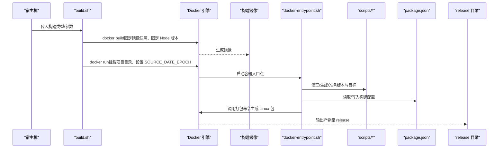
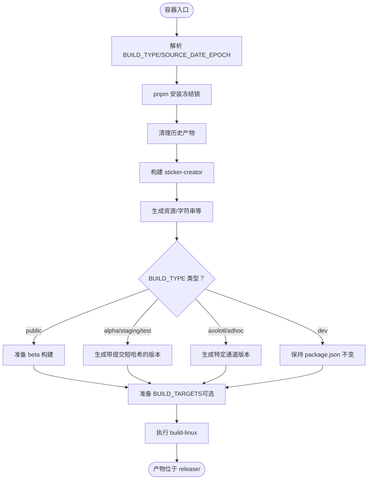
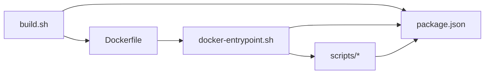

# 可重复构建

<cite>
**本文引用的文件**
- [reproducible-builds/Dockerfile](file://reproducible-builds/Dockerfile)
- [reproducible-builds/build.sh](file://reproducible-builds/build.sh)
- [reproducible-builds/docker-entrypoint.sh](file://reproducible-builds/docker-entrypoint.sh)
- [reproducible-builds/README.md](file://reproducible-builds/README.md)
- [reproducible-builds/docker/apt.conf](file://reproducible-builds/docker/apt.conf)
- [reproducible-builds/docker/sources.list](file://reproducible-builds/docker/sources.list)
- [package.json](file://package.json)
- [scripts/prepare_linux_build.js](file://scripts/prepare_linux_build.js)
- [scripts/prepare_alpha_build.js](file://scripts/prepare_alpha_build.js)
- [scripts/prepare_tagged_version.js](file://scripts/prepare_tagged_version.js)
- [scripts/clean-transpile.js](file://scripts/clean-transpile.js)
- [scripts/generate-acknowledgments.js](file://scripts/generate-acknowledgments.js)
</cite>

## 目录
1. [简介](#简介)
2. [项目结构](#项目结构)
3. [核心组件](#核心组件)
4. [架构总览](#架构总览)
5. [详细组件分析](#详细组件分析)
6. [依赖关系分析](#依赖关系分析)
7. [性能与可重复性考量](#性能与可重复性考量)
8. [故障排查指南](#故障排查指南)
9. [结论](#结论)
10. [附录](#附录)

## 简介
本文件系统性阐述 Signal-Desktop 的可重复构建体系，重点覆盖：
- Docker 容器化构建环境：基础镜像选择、依赖安装、构建工具链与环境变量配置
- 构建脚本执行流程：从源码获取到最终产物生成的完整过程
- 关键 Dockerfile 指令说明：环境变量、工作目录、多阶段思路与入口点
- 安全与可重复性：最小权限、依赖锁定、时间戳确定性、产物完整性校验
- 跨平台与跨环境一致性：通过固定镜像快照、锁文件、确定性时间戳实现

## 项目结构
可重复构建相关的核心位置集中在 reproducible-builds 目录，配合根目录的 package.json 和 scripts 子目录完成端到端构建。

```mermaid
graph TB
subgraph "reproducible-builds"
DF["Dockerfile"]
BS["build.sh"]
EP["docker-entrypoint.sh"]
APTCONF["docker/apt.conf"]
SRCLIST["docker/sources.list"]
RMD["README.md"]
end
subgraph "根目录"
PJ["package.json"]
SCR["scripts/*"]
end
DF --> EP
BS --> DF
BS --> PJ
EP --> PJ
DF --> APTCONF
DF --> SRCLIST
RMD -. 使用 . -> BS
SCR -. 配置构建目标/版本 .-> PJ
```

图表来源
- [reproducible-builds/Dockerfile](file://reproducible-builds/Dockerfile#L1-L71)
- [reproducible-builds/build.sh](file://reproducible-builds/build.sh#L1-L58)
- [reproducible-builds/docker-entrypoint.sh](file://reproducible-builds/docker-entrypoint.sh#L1-L74)
- [reproducible-builds/docker/apt.conf](file://reproducible-builds/docker/apt.conf#L1-L6)
- [reproducible-builds/docker/sources.list](file://reproducible-builds/docker/sources.list#L1-L3)
- [package.json](file://package.json#L1-L714)

章节来源
- [reproducible-builds/README.md](file://reproducible-builds/README.md#L1-L115)
- [reproducible-builds/Dockerfile](file://reproducible-builds/Dockerfile#L1-L71)
- [package.json](file://package.json#L1-L714)

## 核心组件
- Dockerfile：定义确定性的构建环境，包含固定的基础镜像快照、APT 源与配置、Node/NPM/pnpm 安装、nvm 版本固定、缓存目录权限处理等。
- build.sh：顶层入口脚本，负责构建容器镜像（支持跳过以利用缓存）、计算构建时间戳（SOURCE_DATE_EPOCH）、挂载项目目录运行容器并传递构建类型与目标。
- docker-entrypoint.sh：容器内实际执行构建逻辑，按 BUILD_TYPE 执行版本与目标准备脚本，再调用打包脚本生成 Linux 包。
- scripts/*：用于在构建前调整 package.json 中的 Linux 目标、通道名、应用 ID 等，以及清理与生成许可信息等辅助任务。
- package.json：集中声明包管理器、Electron Builder 配置、Linux 目标、产物过滤规则、依赖补丁与仅构建依赖等，是构建一致性的重要依据。

章节来源
- [reproducible-builds/Dockerfile](file://reproducible-builds/Dockerfile#L1-L71)
- [reproducible-builds/build.sh](file://reproducible-builds/build.sh#L1-L58)
- [reproducible-builds/docker-entrypoint.sh](file://reproducible-builds/docker-entrypoint.sh#L1-L74)
- [scripts/prepare_linux_build.js](file://scripts/prepare_linux_build.js#L1-L31)
- [scripts/prepare_alpha_build.js](file://scripts/prepare_alpha_build.js#L1-L82)
- [scripts/prepare_tagged_version.js](file://scripts/prepare_tagged_version.js#L1-L38)
- [scripts/clean-transpile.js](file://scripts/clean-transpile.js#L1-L38)
- [scripts/generate-acknowledgments.js](file://scripts/generate-acknowledgments.js#L1-L211)
- [package.json](file://package.json#L1-L714)

## 架构总览
下图展示了从宿主机到容器再到最终产物的端到端流程。



图表来源
- [reproducible-builds/build.sh](file://reproducible-builds/build.sh#L1-L58)
- [reproducible-builds/Dockerfile](file://reproducible-builds/Dockerfile#L1-L71)
- [reproducible-builds/docker-entrypoint.sh](file://reproducible-builds/docker-entrypoint.sh#L1-L74)
- [package.json](file://package.json#L1-L714)

## 详细组件分析

### Dockerfile：容器化构建环境
- 基础镜像与快照
  - 使用带固定摘要的 Ubuntu Jammy 快照镜像，确保上游软件包来源完全可复现。
  - 通过 APT 源快照与 apt.conf 限制语言、推荐包、即时配置等，减少无关变更。
- 环境变量与工具链
  - 固定 SOURCE_DATE_EPOCH，使打包工具的时间戳可复现。
  - 通过 ARG 接收 NODE_VERSION，结合 nvm 安装指定 Node 版本，避免宿主差异。
  - 固定 pnpm 版本，保证依赖解析与安装一致。
- 依赖安装
  - 显式安装构建所需工具链（编译器、make、tar/xz 等）。
  - 临时关闭证书签名验证以安装 ca-certificates，随后恢复验证，降低风险。
- 缓存与权限
  - 创建并开放 /.cache 权限，避免因用户/组映射导致的权限问题破坏可复现性。
- 入口点与默认行为
  - 设置 ENTRYPOINT 为 docker-entrypoint.sh，CMD 默认 dev，便于本地调试。

章节来源
- [reproducible-builds/Dockerfile](file://reproducible-builds/Dockerfile#L1-L71)
- [reproducible-builds/docker/apt.conf](file://reproducible-builds/docker/apt.conf#L1-L6)
- [reproducible-builds/docker/sources.list](file://reproducible-builds/docker/sources.list#L1-L3)

### build.sh：构建入口与参数控制
- 容器构建
  - 支持 SKIP_DOCKER_BUILD 环境变量跳过镜像构建以利用缓存。
  - 通过 build-arg 注入固定 SOURCE_DATE_EPOCH 与 NODE_VERSION，确保镜像层可复现。
- 时间戳策略
  - 优先使用外部传入的 SOURCE_DATE_EPOCH；否则回退到最近一次 Git 提交时间戳。
- 运行容器
  - 将项目目录挂载到 /project，设置工作目录为 /project。
  - 传递用户 UID/GID，避免生成宿主特定的用户映射。
  - 设置 NPM/缓存目录到 /tmp，规避权限问题。
  - 将 SOURCE_DATE_EPOCH 与 BUILD_TARGETS 传递给容器内脚本。

章节来源
- [reproducible-builds/build.sh](file://reproducible-builds/build.sh#L1-L58)

### docker-entrypoint.sh：容器内构建流程
- 参数与日志
  - 接收 BUILD_TYPE（dev/public/alpha/staging/test/axolotl/adhoc），打印当前构建类型与 SOURCE_DATE_EPOCH。
- 依赖与预处理
  - 使用 --frozen-lockfile 安装依赖，确保锁文件一致。
  - 清理历史产物与中间文件，避免残留影响。
  - 构建 sticker-creator 子项目，确保资源生成一致。
- 版本与目标准备
  - 根据 BUILD_TYPE 调用相应 prepare_* 脚本，修改 package.json 中的 Linux 目标、应用名、产品名、应用 ID、桌面文件名、可执行名等。
  - 若 BUILD_TARGETS 非空，则调用 prepare_linux_build 覆盖默认目标（如 deb/appimage）。
- 打包与产物
  - 最终调用 build-linux，生成 Linux 包并输出到 release 目录。



图表来源
- [reproducible-builds/docker-entrypoint.sh](file://reproducible-builds/docker-entrypoint.sh#L1-L74)
- [scripts/prepare_linux_build.js](file://scripts/prepare_linux_build.js#L1-L31)
- [scripts/prepare_alpha_build.js](file://scripts/prepare_alpha_build.js#L1-L82)
- [scripts/prepare_tagged_version.js](file://scripts/prepare_tagged_version.js#L1-L38)

章节来源
- [reproducible-builds/docker-entrypoint.sh](file://reproducible-builds/docker-entrypoint.sh#L1-L74)

### scripts/*：构建前置与后置处理
- prepare_linux_build.js
  - 校验并设置 Linux 目标（deb/appimage），通过修改 package.json 的 build.linux.target 实现。
- prepare_alpha_build.js
  - 在版本为 alpha 时，将应用名、产品名、应用 ID、桌面文件名、可执行名等改为 alpha 专用值，避免与生产版冲突。
- prepare_tagged_version.js
  - 为 alpha/axolotl/adhoc 通道生成带短提交哈希的版本号，确保可追溯且唯一。
- clean-transpile.js
  - 清理 app/ts/bundles 等历史产物与缓存，确保构建干净。
- generate-acknowledgments.js
  - 生成第三方许可汇总文件，特殊处理可选依赖与信号自有库，保证可复现性与一致性。

章节来源
- [scripts/prepare_linux_build.js](file://scripts/prepare_linux_build.js#L1-L31)
- [scripts/prepare_alpha_build.js](file://scripts/prepare_alpha_build.js#L1-L82)
- [scripts/prepare_tagged_version.js](file://scripts/prepare_tagged_version.js#L1-L38)
- [scripts/clean-transpile.js](file://scripts/clean-transpile.js#L1-L38)
- [scripts/generate-acknowledgments.js](file://scripts/generate-acknowledgments.js#L1-L211)

### package.json：构建配置与产物过滤
- 包管理器与引擎
  - 固定 pnpm 版本与 Node 引擎版本，确保工具链一致。
- Electron Builder 配置
  - 定义 Linux 目标（deb）、产物命名模板、依赖列表、asar 配置、产物过滤规则等。
- 产物过滤与仅构建依赖
  - 通过 files 字段严格筛选打包内容，排除测试、示例、缓存、构建脚本等，减少噪声。
  - pnpm.onlyBuiltDependencies 与 ignoredBuiltDependencies 控制原生模块与依赖的构建范围，提升可复现性。
- 补丁与签名
  - patchedDependencies 列表用于修复第三方依赖的已知问题，确保一致行为。
  - macOS/Windows 签名与发布配置，保障产物完整性与可信度。

章节来源
- [package.json](file://package.json#L1-L714)

## 依赖关系分析
- 外部依赖
  - Docker 引擎、Git、Ubuntu Jammy 快照镜像、固定 Node/pnpm 版本。
- 内部依赖
  - build.sh 依赖 Dockerfile 与 package.json；docker-entrypoint.sh 依赖 scripts/* 与 package.json。
  - scripts/* 依赖 package.json 中的 build 配置与 pnpm 锁文件。



图表来源
- [reproducible-builds/build.sh](file://reproducible-builds/build.sh#L1-L58)
- [reproducible-builds/Dockerfile](file://reproducible-builds/Dockerfile#L1-L71)
- [reproducible-builds/docker-entrypoint.sh](file://reproducible-builds/docker-entrypoint.sh#L1-L74)
- [package.json](file://package.json#L1-L714)

章节来源
- [reproducible-builds/build.sh](file://reproducible-builds/build.sh#L1-L58)
- [reproducible-builds/Dockerfile](file://reproducible-builds/Dockerfile#L1-L71)
- [reproducible-builds/docker-entrypoint.sh](file://reproducible-builds/docker-entrypoint.sh#L1-L74)
- [package.json](file://package.json#L1-L714)

## 性能与可重复性考量
- 可复现性
  - 固定基础镜像快照、固定 Node/pnpm 版本、固定 SOURCE_DATE_EPOCH、冻结锁文件安装。
  - APT 源快照与 apt.conf 限制无关变更，减少构建漂移。
- 性能
  - build.sh 支持 SKIP_DOCKER_BUILD 以复用镜像缓存，加速迭代。
  - 容器内缓存目录权限开放，避免宿主用户映射带来的权限问题与重试成本。
- 产物一致性
  - 通过 prepare_* 脚本统一修改 package.json 中的 Linux 目标与命名，避免手工差异。
  - 严格的 files 过滤与 onlyBuiltDependencies 控制，确保产物稳定可比。

[本节为通用指导，不直接分析具体文件]

## 故障排查指南
- 构建失败或产物不一致
  - 确认是否使用了正确的版本标签与 SOURCE_DATE_EPOCH。
  - 检查是否启用了 SKIP_DOCKER_BUILD 导致镜像未更新。
- 权限问题
  - 确保宿主机用户组包含在 Docker 组中，或使用 sudo 运行。
  - 容器内已将缓存目录权限开放，避免宿主用户映射导致的权限错误。
- 依赖安装异常
  - 确认网络可达与 APT 源快照可用；必要时检查代理与证书。
  - 使用 --frozen-lockfile 保证依赖树一致。
- 产物校验
  - 使用 sha256sum 对比官方与自建产物，确保完全一致。
  - 如不匹配，核对版本、提交哈希、构建参数与环境变量。

章节来源
- [reproducible-builds/README.md](file://reproducible-builds/README.md#L72-L115)
- [reproducible-builds/build.sh](file://reproducible-builds/build.sh#L1-L58)
- [reproducible-builds/Dockerfile](file://reproducible-builds/Dockerfile#L1-L71)

## 结论
Signal-Desktop 的可重复构建体系通过“固定镜像快照 + 锁定工具链 + 确定性时间戳 + 严格产物过滤”的组合，实现了跨平台、跨环境的一致性构建。配合脚本化的版本与目标准备，以及明确的产物校验流程，显著提升了可审计性与安全性。

[本节为总结，不直接分析具体文件]

## 附录

### 关键 Dockerfile 指令说明
- FROM：使用带固定摘要的 Ubuntu Jammy 快照镜像，确保上游软件包来源可复现。
- ENV：设置 SOURCE_DATE_EPOCH、SIGNAL_ENV、CI 等，保证打包时间戳与环境一致。
- ARG：接收 NODE_VERSION，结合 nvm 安装指定 Node 版本，消除宿主差异。
- COPY：复制 APT 配置与源快照，确保依赖来源可控。
- RUN：安装工具链与 pnpm，临时关闭证书验证以安装 ca-certificates，随后恢复验证。
- ENTRYPOINT/CMD：设置容器入口点与默认构建类型，便于本地调试与自动化。

章节来源
- [reproducible-builds/Dockerfile](file://reproducible-builds/Dockerfile#L1-L71)
- [reproducible-builds/docker/apt.conf](file://reproducible-builds/docker/apt.conf#L1-L6)
- [reproducible-builds/docker/sources.list](file://reproducible-builds/docker/sources.list#L1-L3)

### 跨平台与跨环境一致性实践
- 固定基础镜像快照与 APT 源快照，避免上游变更引入的不确定性。
- 使用 pnpm --frozen-lockfile 与 package.json 中的 onlyBuiltDependencies/ignoredBuiltDependencies 控制依赖与原生模块构建范围。
- 通过 prepare_* 脚本集中修改 package.json 中的 Linux 目标与命名，避免手工差异。
- 使用 SOURCE_DATE_EPOCH 与 build.sh 的时间戳策略，确保打包时间戳可复现。
- 产物过滤与签名配置，确保最终产物稳定可比。

章节来源
- [package.json](file://package.json#L1-L714)
- [scripts/prepare_linux_build.js](file://scripts/prepare_linux_build.js#L1-L31)
- [scripts/prepare_alpha_build.js](file://scripts/prepare_alpha_build.js#L1-L82)
- [scripts/prepare_tagged_version.js](file://scripts/prepare_tagged_version.js#L1-L38)
- [reproducible-builds/build.sh](file://reproducible-builds/build.sh#L1-L58)