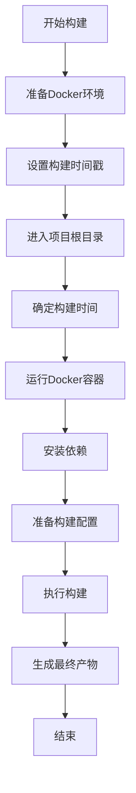
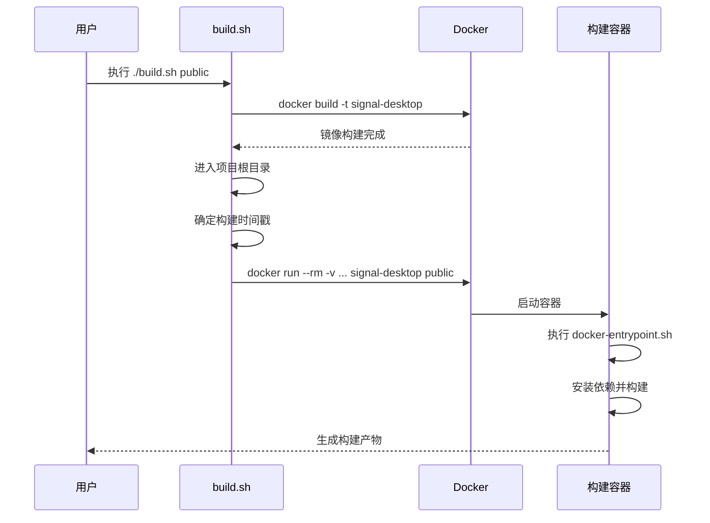
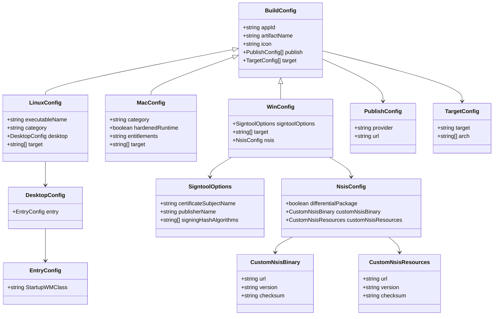
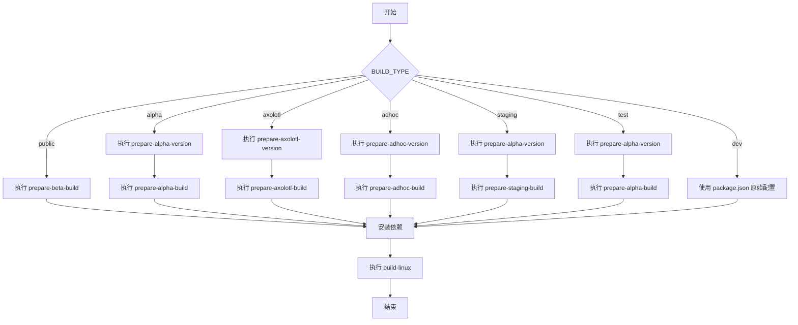

# 构建流程

<cite>
**本文档中引用的文件**  
- [build.sh](file://reproducible-builds/build.sh)
- [Dockerfile](file://reproducible-builds/Dockerfile)
- [docker-entrypoint.sh](file://reproducible-builds/docker-entrypoint.sh)
- [README.md](file://reproducible-builds/README.md)
- [package.json](file://package.json)
- [prepare_linux_build.js](file://scripts/prepare_linux_build.js)
- [prepare_beta_build.js](file://scripts/prepare_beta_build.js)
- [prepare_alpha_build.js](file://scripts/prepare_alpha_build.js)
- [prepare_staging_build.js](file://scripts/prepare_staging_build.js)
- [prepare_tagged_version.js](file://scripts/prepare_tagged_version.js)
- [prepare_adhoc_build.js](file://scripts/prepare_adhoc_build.js)
- [prepare_axolotl_build.js](file://scripts/prepare_axolotl_build.js)
- [version.std.ts](file://ts/util/version.std.ts)
- [packageJson.js](file://scripts/packageJson.js)
</cite>

## 目录
1. [引言](#引言)
2. [构建流程概述](#构建流程概述)
3. [环境准备](#环境准备)
4. [核心构建脚本分析](#核心构建脚本分析)
5. [构建类型与配置](#构建类型与配置)
6. [构建流程中的关键控制逻辑](#构建流程中的关键控制逻辑)
7. [可重复构建的设计原则](#可重复构建的设计原则)
8. [问题排查指南](#问题排查指南)
9. [实际执行示例](#实际执行示例)
10. [结论](#结论)

## 引言

Signal-Desktop的可重复构建流程旨在确保任何人都能从开源代码构建出与官方发布版本完全一致的应用程序。这一流程通过使用Docker容器和确定性构建技术，消除了构建环境差异带来的不确定性，从而增强了软件的安全性和可信度。本文档将深入分析`build.sh`脚本的执行步骤，从环境准备、依赖安装、代码编译到最终产物打包的完整过程。

**Section sources**
- [README.md](file://reproducible-builds/README.md#L1-L115)

## 构建流程概述

Signal-Desktop的可重复构建流程主要通过`reproducible-builds`目录下的脚本和配置文件实现。该流程利用Docker容器来创建一个隔离且一致的构建环境，确保构建结果的可重复性。构建过程包括环境准备、依赖安装、代码编译和最终产物打包等关键步骤。



**Diagram sources**
- [build.sh](file://reproducible-builds/build.sh#L1-L58)
- [Dockerfile](file://reproducible-builds/Dockerfile#L1-L71)

**Section sources**
- [build.sh](file://reproducible-builds/build.sh#L1-L58)
- [Dockerfile](file://reproducible-builds/Dockerfile#L1-L71)

## 环境准备

可重复构建的环境准备阶段主要涉及Docker引擎的安装和配置。根据`reproducible-builds/README.md`文件的说明，构建前需要确保Docker Engine已安装并运行在计算机上。此外，还需要安装`git`工具来获取源代码。该流程假设在Unix系统上运行，但理论上可以在任何支持Docker Engine的平台上工作。

构建环境的确定性是通过Docker镜像和构建参数来保证的。`Dockerfile`中指定了基础镜像`ubuntu:jammy-20250714`，并使用SHA256哈希值确保镜像的精确版本。同时，通过设置`SOURCE_DATE_EPOCH`环境变量来确保系统构建时间戳的确定性。

**Section sources**
- [README.md](file://reproducible-builds/README.md#L24-L28)
- [Dockerfile](file://reproducible-builds/Dockerfile#L1-L8)

## 核心构建脚本分析

`build.sh`脚本是Signal-Desktop可重复构建的核心，它负责协调整个构建过程。该脚本首先检查是否需要跳过Docker镜像构建（通过`SKIP_DOCKER_BUILD`环境变量控制），然后构建Docker镜像。镜像构建过程中会传入`SOURCE_DATE_EPOCH`和`NODE_VERSION`等构建参数。



**Diagram sources**
- [build.sh](file://reproducible-builds/build.sh#L1-L58)
- [docker-entrypoint.sh](file://reproducible-builds/docker-entrypoint.sh#L1-L74)

**Section sources**
- [build.sh](file://reproducible-builds/build.sh#L1-L58)

## 构建类型与配置

Signal-Desktop支持多种构建类型，包括`dev`（默认）、`public`（生产环境和测试版本）、`alpha`、`test`、`staging`等。不同的构建类型会影响最终产物的名称和版本。例如，`public`构建会根据`package.json`中的版本生成相应的`signal-desktop`或`signal-desktop-beta`包。

构建配置主要通过`package.json`文件中的`build`字段进行定义。该字段包含了针对不同平台（macOS、Windows、Linux）的构建配置，如应用ID、图标路径、发布配置等。对于Linux构建，`build.linux`字段定义了可执行文件名、分类、桌面文件配置和目标格式（如deb包）。



**Diagram sources**
- [package.json](file://package.json#L429-L578)

**Section sources**
- [package.json](file://package.json#L429-L578)
- [build.sh](file://reproducible-builds/build.sh#L6-L7)

## 构建流程中的关键控制逻辑

构建流程中的关键控制逻辑主要体现在错误处理、日志记录和进度跟踪等方面。`build.sh`脚本使用`set -e`命令确保在任何命令失败时立即退出，从而防止构建过程在错误状态下继续执行。同时，通过`set -x`命令启用命令执行的详细输出，便于调试和监控构建过程。

`docker-entrypoint.sh`脚本作为Docker容器的入口点，负责执行具体的构建任务。该脚本首先设置`BUILD_TYPE`变量，然后根据构建类型执行相应的准备脚本。例如，对于`public`构建，会执行`prepare-beta-build`脚本；对于`alpha`构建，则会执行`prepare-alpha-version`和`prepare-alpha-build`脚本。



**Diagram sources**
- [docker-entrypoint.sh](file://reproducible-builds/docker-entrypoint.sh#L1-L74)
- [prepare_beta_build.js](file://scripts/prepare_beta_build.js#L1-L81)
- [prepare_alpha_build.js](file://scripts/prepare_alpha_build.js#L1-L82)

**Section sources**
- [docker-entrypoint.sh](file://reproducible-builds/docker-entrypoint.sh#L1-L74)
- [prepare_beta_build.js](file://scripts/prepare_beta_build.js#L1-L81)
- [prepare_alpha_build.js](file://scripts/prepare_alpha_build.js#L1-L82)

## 可重复构建的设计原则

Signal-Desktop的可重复构建设计遵循了多项关键原则，以确保构建结果的一致性和安全性。首先，通过使用Docker容器创建隔离的构建环境，消除了宿主机环境差异对构建结果的影响。其次，通过设置`SOURCE_DATE_EPOCH`环境变量，确保了构建时间戳的确定性，避免了时间相关因素导致的构建差异。

此外，构建流程还通过冻结依赖版本来确保依赖的一致性。`pnpm install --frozen-lockfile`命令确保了所有依赖都严格按照`pnpm-lock.yaml`文件中的版本进行安装，防止了依赖版本漂移。同时，通过在`Dockerfile`中明确指定基础镜像的SHA256哈希值，确保了基础环境的精确一致性。

**Section sources**
- [Dockerfile](file://reproducible-builds/Dockerfile#L1-L8)
- [docker-entrypoint.sh](file://reproducible-builds/docker-entrypoint.sh#L37-L43)
- [package.json](file://package.json#L3-L4)

## 问题排查指南

在执行可重复构建时，可能会遇到各种问题。以下是一些常见问题及其解决方案：

1. **校验和不匹配**：如果构建产物的SHA256校验和与官方版本不匹配，首先应检查是否使用了正确的代码版本。可以通过`git checkout tags/v7.45.0`切换到指定版本。其次，检查是否有残留的生成文件，可以尝试删除`bundles`目录后重新构建。

2. **Docker权限问题**：如果用户不在Docker的`docker`组中，可能需要使用`sudo`来运行构建脚本。建议将用户添加到`docker`组以避免频繁使用`sudo`。

3. **依赖安装失败**：由于网络问题可能导致依赖安装失败。可以尝试使用国内镜像源或配置代理来解决网络问题。

4. **构建时间戳问题**：如果构建时间戳设置不正确，可能导致构建结果不一致。确保`SOURCE_DATE_EPOCH`环境变量正确设置，或让脚本自动从最新git提交中获取时间戳。

**Section sources**
- [README.md](file://reproducible-builds/README.md#L110-L114)
- [build.sh](file://reproducible-builds/build.sh#L29-L43)

## 实际执行示例

以下是在Linux系统上复现Signal-Desktop构建的实际执行示例：

```bash
# 1. 克隆源代码
git clone https://github.com/signalapp/Signal-Desktop.git
cd Signal-Desktop/

# 2. 切换到指定版本
git checkout tags/v7.45.0

# 3. 进入可重复构建目录
cd reproducible-builds/

# 4. 执行构建（需要Docker权限）
chmod +x ./build.sh
./build.sh public
```

构建完成后，生成的deb包将位于`Signal-Desktop/release`目录中。可以通过以下命令验证构建结果：

```bash
# 下载官方版本进行比较
apt download signal-desktop

# 计算SHA256校验和
sha256sum ../release/signal-desktop_7.45.0_amd64.deb signal-desktop_7.45.0_amd64.deb
```

如果两个文件的校验和完全相同，则说明成功复现了官方构建。

**Section sources**
- [README.md](file://reproducible-builds/README.md#L32-L107)

## 结论

Signal-Desktop的可重复构建流程通过Docker容器化、确定性时间戳和冻结依赖版本等技术手段，实现了构建结果的高度一致性。这一流程不仅增强了软件的安全性和可信度，也为社区验证官方构建提供了可靠的方法。通过深入分析`build.sh`脚本和相关配置文件，我们可以全面理解这一复杂而精密的构建系统的工作原理。