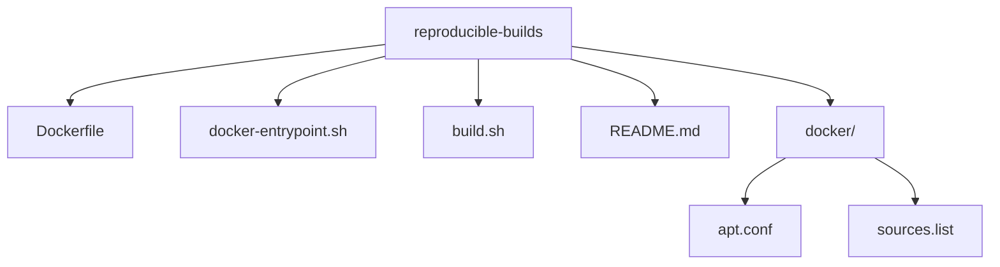
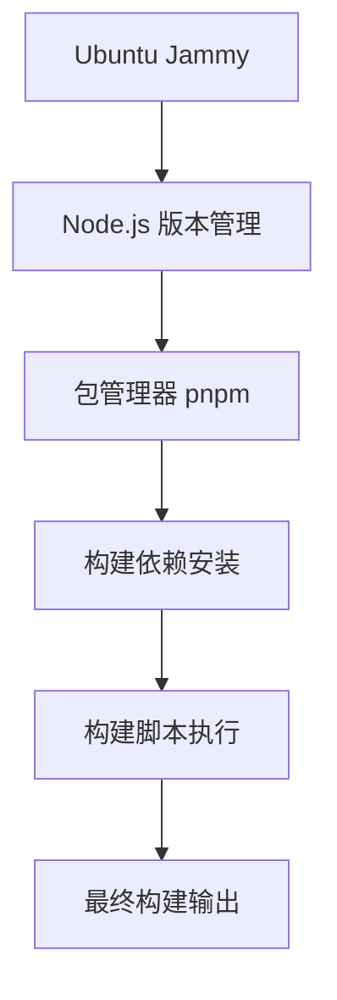
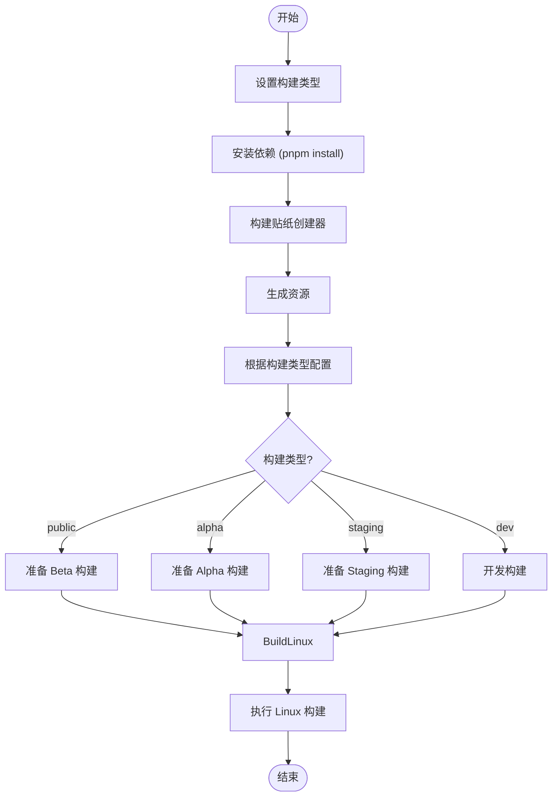
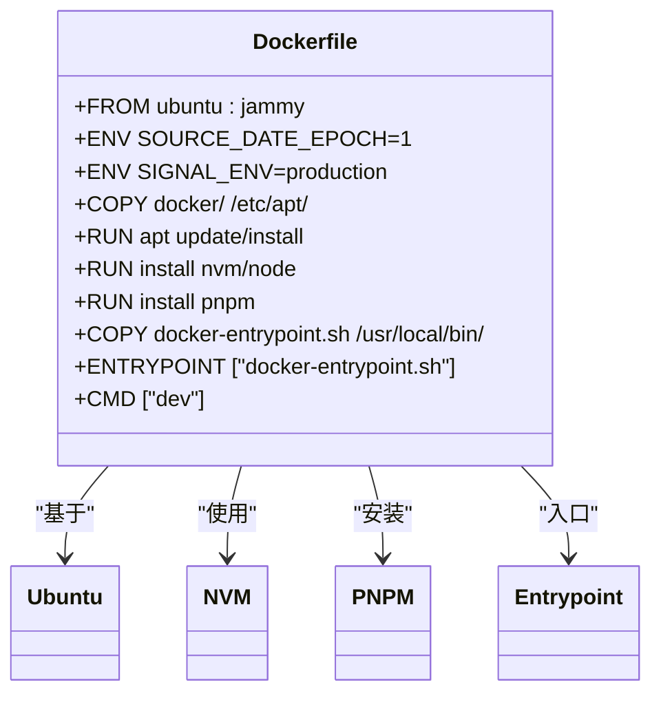
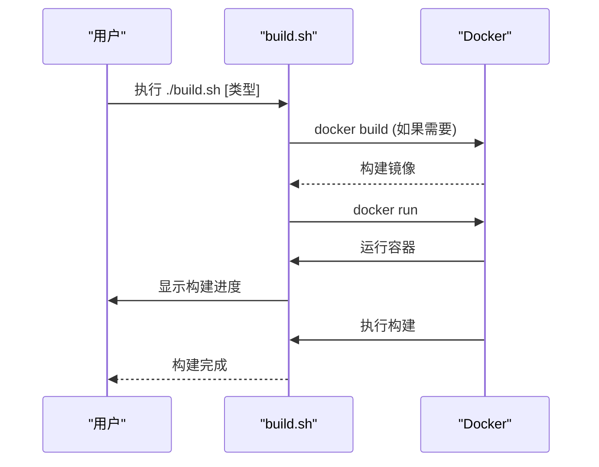
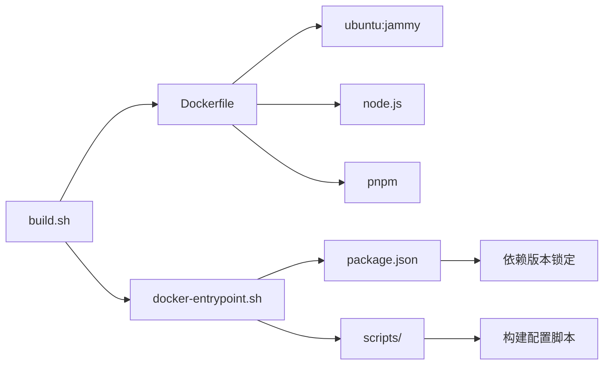

# 环境管理

<cite>
**本文档中引用的文件**  
- [docker-entrypoint.sh](file://reproducible-builds/docker-entrypoint.sh)
- [Dockerfile](file://reproducible-builds/Dockerfile)
- [build.sh](file://reproducible-builds/build.sh)
- [README.md](file://reproducible-builds/README.md)
- [apt.conf](file://reproducible-builds/docker/apt.conf)
- [sources.list](file://reproducible-builds/docker/sources.list)
- [prepare_alpha_build.js](file://scripts/prepare_alpha_build.js)
- [prepare_beta_build.js](file://scripts/prepare_beta_build.js)
- [prepare_staging_build.js](file://scripts/prepare_staging_build.js)
- [prepare_linux_build.js](file://scripts/prepare_linux_build.js)
- [package.json](file://package.json)
- [config/default.json](file://config/default.json)
- [config/production.json](file://config/production.json)
</cite>

## 目录
1. [引言](#引言)
2. [项目结构](#项目结构)
3. [核心组件](#核心组件)
4. [架构概述](#架构概述)
5. [详细组件分析](#详细组件分析)
6. [依赖分析](#依赖分析)
7. [性能考虑](#性能考虑)
8. [故障排除指南](#故障排除指南)
9. [结论](#结论)

## 引言
Signal-Desktop 的可重复构建系统通过容器化技术确保构建环境的一致性，避免“在我机器上能运行”的问题。该系统使用 Docker 容器封装所有构建依赖，确保在任何环境中都能生成完全相同的构建输出。环境管理机制包括环境变量设置、路径配置和权限管理，通过 `docker-entrypoint.sh` 脚本进行初始化。系统还实现了依赖版本锁定、工具链统一和操作系统配置标准化，确保构建过程的安全性和可重复性。

## 项目结构
Signal-Desktop 项目的可重复构建功能主要集中在 `reproducible-builds` 目录下，该目录包含 Docker 配置文件、入口脚本和构建脚本。项目使用容器化技术隔离构建环境，确保构建过程不受宿主系统影响。

**图示来源**  
- [Dockerfile](file://reproducible-builds/Dockerfile)
- [docker-entrypoint.sh](file://reproducible-builds/docker-entrypoint.sh)
- [build.sh](file://reproducible-builds/build.sh)
- [apt.conf](file://reproducible-builds/docker/apt.conf)
- [sources.list](file://reproducible-builds/docker/sources.list)

**本节来源**  
- [reproducible-builds](file://reproducible-builds)

## 核心组件
可重复构建系统的核心组件包括 `docker-entrypoint.sh`、`Dockerfile` 和 `build.sh` 脚本。这些组件协同工作，确保构建环境的初始化和配置正确无误。`docker-entrypoint.sh` 脚本负责设置构建类型、安装依赖并执行构建命令。`Dockerfile` 定义了构建容器的基础镜像和环境变量。`build.sh` 脚本则负责构建 Docker 镜像并运行构建容器。

**本节来源**  
- [docker-entrypoint.sh](file://reproducible-builds/docker-entrypoint.sh)
- [Dockerfile](file://reproducible-builds/Dockerfile)
- [build.sh](file://reproducible-builds/build.sh)

## 架构概述
Signal-Desktop 的可重复构建系统采用分层架构，从基础操作系统到应用构建，每一层都经过精心设计以确保可重复性。

**图示来源**  
- [Dockerfile](file://reproducible-builds/Dockerfile)
- [docker-entrypoint.sh](file://reproducible-builds/docker-entrypoint.sh)

## 详细组件分析

### docker-entrypoint.sh 分析
`docker-entrypoint.sh` 脚本是构建容器的入口点，负责初始化构建环境并执行构建流程。

**图示来源**  
- [docker-entrypoint.sh](file://reproducible-builds/docker-entrypoint.sh#L27-L73)

**本节来源**  
- [docker-entrypoint.sh](file://reproducible-builds/docker-entrypoint.sh)

### Dockerfile 分析
`Dockerfile` 定义了构建容器的基础配置，包括操作系统、环境变量和依赖安装。

**图示来源**  
- [Dockerfile](file://reproducible-builds/Dockerfile)

**本节来源**  
- [Dockerfile](file://reproducible-builds/Dockerfile)

### build.sh 分析
`build.sh` 脚本负责构建 Docker 镜像并运行构建容器，是用户与可重复构建系统交互的主要接口。

**图示来源**  
- [build.sh](file://reproducible-builds/build.sh)

**本节来源**  
- [build.sh](file://reproducible-builds/build.sh)

## 依赖分析
可重复构建系统的依赖关系清晰明确，确保了构建过程的可预测性和可重复性。

**图示来源**  
- [build.sh](file://reproducible-builds/build.sh)
- [Dockerfile](file://reproducible-builds/Dockerfile)
- [docker-entrypoint.sh](file://reproducible-builds/docker-entrypoint.sh)
- [package.json](file://package.json)

**本节来源**  
- [package.json](file://package.json)

## 性能考虑
可重复构建系统在设计时考虑了性能优化，通过 Docker 缓存机制减少重复构建时间。`build.sh` 脚本支持 `SKIP_DOCKER_BUILD` 环境变量，允许跳过 Docker 镜像构建步骤，直接使用现有镜像。此外，系统使用 `SOURCE_DATE_EPOCH` 环境变量确保构建时间戳的确定性，避免因时间变化导致的缓存失效。

## 故障排除指南
当可重复构建出现问题时，可以参考以下常见问题的解决方案：

**本节来源**  
- [README.md](file://reproducible-builds/README.md)

## 结论
Signal-Desktop 的可重复构建系统通过容器化技术实现了构建环境的完全隔离和标准化。系统使用 Docker 容器封装所有构建依赖，确保在任何环境中都能生成完全相同的构建输出。环境管理机制包括环境变量设置、路径配置和权限管理，通过 `docker-entrypoint.sh` 脚本进行初始化。系统还实现了依赖版本锁定、工具链统一和操作系统配置标准化，确保构建过程的安全性和可重复性。这种设计有效避免了“在我机器上能运行”的问题，为用户提供了一个可靠、安全的构建系统。