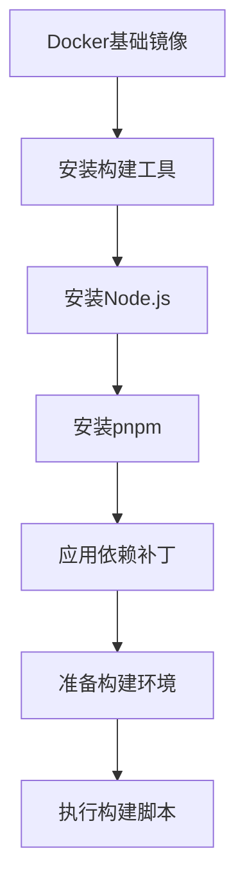
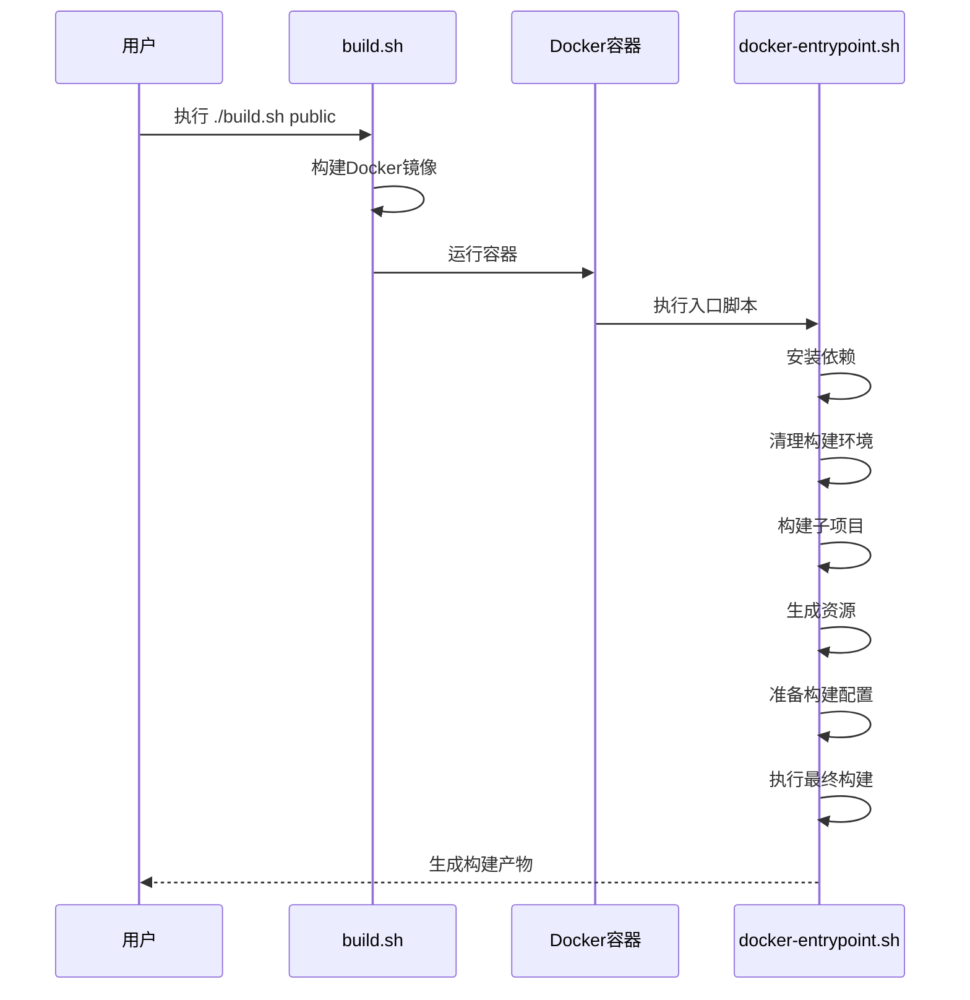
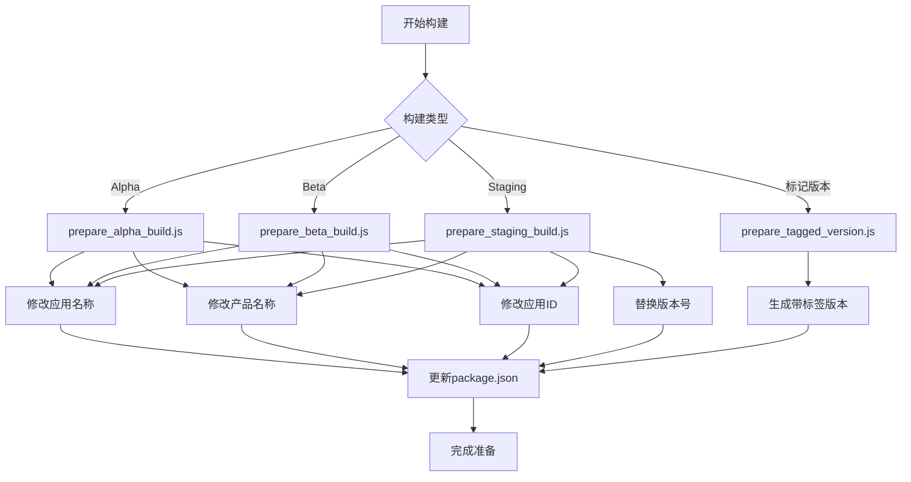
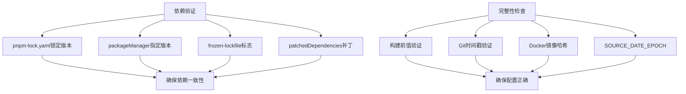
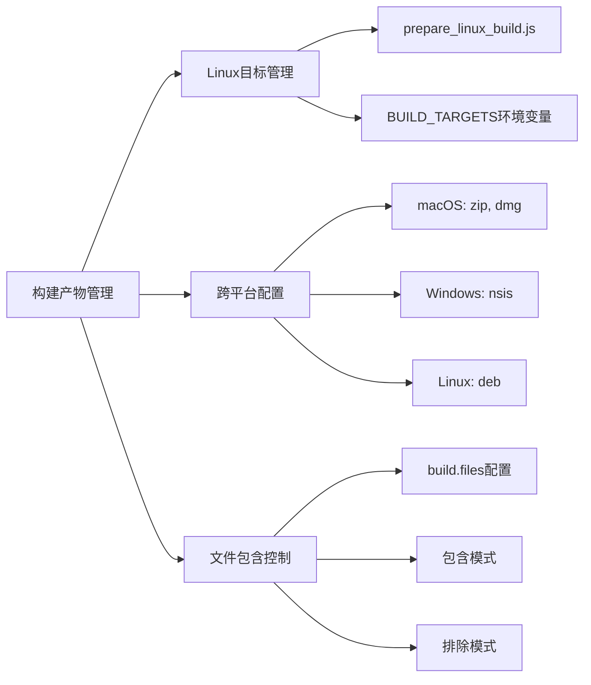
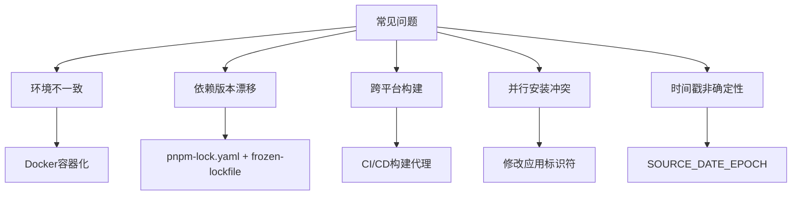

# 打包配置

<cite>
**本文档中引用的文件**  
- [Dockerfile](file://reproducible-builds/Dockerfile)
- [build.sh](file://reproducible-builds/build.sh)
- [docker-entrypoint.sh](file://reproducible-builds/docker-entrypoint.sh)
- [prepare_tagged_version.js](file://scripts/prepare_tagged_version.js)
- [prepare_alpha_build.js](file://scripts/prepare_alpha_build.js)
- [prepare_beta_build.js](file://scripts/prepare_beta_build.js)
- [prepare_staging_build.js](file://scripts/prepare_staging_build.js)
- [prepare_linux_build.js](file://scripts/prepare_linux_build.js)
- [package.json](file://package.json)
- [pnpm-lock.yaml](file://pnpm-lock.yaml)
</cite>

## 目录
1. [简介](#简介)
2. [可重复构建的Docker配置](#可重复构建的docker配置)
3. [构建脚本与环境设置](#构建脚本与环境设置)
4. [标记版本的构建准备](#标记版本的构建准备)
5. [完整性检查与依赖验证](#完整性检查与依赖验证)
6. [构建产物管理](#构建产物管理)
7. [常见打包问题及解决方案](#常见打包问题及解决方案)
8. [总结](#总结)

## 简介
Signal-Desktop项目采用高度可重复的打包流程，确保在不同环境中生成一致的构建产物。该流程基于Docker容器化环境，结合pnpm包管理器和Electron-Builder打包工具，实现了跨平台的一致性构建。打包系统支持多种构建类型，包括开发、生产、测试、Alpha、Beta和Staging版本，并通过严格的依赖锁定和版本管理机制保证构建的可重复性。

**Section sources**
- [package.json](file://package.json#L1-L714)

## 可重复构建的Docker配置
Signal-Desktop使用Docker容器来创建可重复的构建环境，确保所有构建都在相同的、隔离的环境中进行。Docker配置位于`reproducible-builds/`目录下，核心文件为`Dockerfile`。

Docker镜像基于Ubuntu Jammy版本构建，通过固定基础镜像的SHA256哈希值来确保可重复性。构建过程中设置了`SOURCE_DATE_EPOCH`环境变量为1，以确保所有构建时间戳是确定性的，避免因时间差异导致的构建产物不一致。

容器内安装了Node.js版本管理工具nvm，并根据项目根目录下的`.nvmrc`文件指定的版本安装Node.js。同时安装了pnpm包管理器（版本10.18.1），并在`package.json`中明确指定了包管理器版本，确保依赖解析的一致性。

为了确保依赖的完整性，Docker配置中使用了`--frozen-lockfile`选项，强制使用`pnpm-lock.yaml`中的锁定版本，防止意外的依赖升级。此外，项目使用了pnpm的`patchedDependencies`功能，在`package.json`中明确指定了需要打补丁的依赖包及其补丁文件路径，确保所有开发环境应用相同的补丁。



**Diagram sources**
- [Dockerfile](file://reproducible-builds/Dockerfile#L1-L71)

**Section sources**
- [Dockerfile](file://reproducible-builds/Dockerfile#L1-L71)
- [package.json](file://package.json#L3-L4)

## 构建脚本与环境设置
Signal-Desktop的构建流程由一系列Shell和JavaScript脚本协同完成，核心构建脚本位于`reproducible-builds/`目录下。

主构建脚本`build.sh`负责协调整个构建过程。它首先构建Docker镜像，然后运行容器执行`docker-entrypoint.sh`。该脚本接受构建类型参数（如dev、public、alpha等），并设置相应的环境变量。构建时间戳通过Git提交时间确定，确保构建的可重复性。

`docker-entrypoint.sh`是容器内的入口脚本，执行以下关键步骤：
1. 安装依赖：使用`pnpm install --frozen-lockfile`确保依赖版本锁定
2. 清理临时文件：执行`clean-transpile`清理之前的构建产物
3. 构建子项目：进入`sticker-creator`目录并构建该组件
4. 生成资源：执行`generate`脚本生成国际化字符串、样式表等资源
5. 准备构建：根据构建类型调用相应的准备脚本
6. 执行构建：运行`build-linux`完成最终打包

构建过程中使用了多个环境变量来控制行为：
- `SOURCE_DATE_EPOCH`：确定性构建时间戳
- `BUILD_TARGETS`：覆盖默认的构建目标
- `SIGNAL_ENV`：指定运行环境（production、staging等）



**Diagram sources**
- [build.sh](file://reproducible-builds/build.sh#L1-L58)
- [docker-entrypoint.sh](file://reproducible-builds/docker-entrypoint.sh#L1-L74)

**Section sources**
- [build.sh](file://reproducible-builds/build.sh#L1-L58)
- [docker-entrypoint.sh](file://reproducible-builds/docker-entrypoint.sh#L1-L74)

## 标记版本的构建准备
Signal-Desktop提供了专门的脚本来准备不同类型的标记版本构建，确保版本号、应用名称和其他元数据正确设置。

### 版本号管理
版本号管理通过`scripts/prepare_tagged_version.js`脚本实现。该脚本根据指定的发布线（alpha、axolotl、adhoc）生成带标签的版本号。它读取当前`package.json`中的版本，结合Git提交的短哈希生成新的版本号。例如，从`7.86.0`生成`7.86.0-alpha.1+abc123456`。

```javascript
// 示例：生成标记版本
const newVersion = generateTaggedVersion({ 
  release: 'alpha', 
  currentVersion, 
  shortSha 
});
```

### 构建类型准备
不同构建类型需要不同的配置调整：

**Alpha构建**：`prepare_alpha_build.js`脚本将应用名称从`signal-desktop`改为`signal-desktop-alpha`，产品名称从`Signal`改为`Signal Alpha`，并更新应用ID、可执行文件名等，确保Alpha版本可以与生产版本并行安装。

**Beta构建**：`prepare_beta_build.js`脚本类似，将应用名称改为`signal-desktop-beta`，产品名称改为`Signal Beta`，实现Beta版本的独立安装。

**Staging构建**：`prepare_staging_build.js`脚本不仅修改应用标识，还将版本号中的`alpha`替换为`staging`，并更新`config/production.json`文件以启用CI模式。

这些脚本在执行前都会验证当前版本是否符合预期（如Alpha构建要求版本包含`alpha`），并在修改`package.json`后重新写入文件系统。



**Diagram sources**
- [prepare_tagged_version.js](file://scripts/prepare_tagged_version.js#L1-L38)
- [prepare_alpha_build.js](file://scripts/prepare_alpha_build.js#L1-L82)
- [prepare_beta_build.js](file://scripts/prepare_beta_build.js#L1-L81)
- [prepare_staging_build.js](file://scripts/prepare_staging_build.js#L1-L95)

**Section sources**
- [prepare_tagged_version.js](file://scripts/prepare_tagged_version.js#L1-L38)
- [prepare_alpha_build.js](file://scripts/prepare_alpha_build.js#L1-L82)
- [prepare_beta_build.js](file://scripts/prepare_beta_build.js#L1-L81)
- [prepare_staging_build.js](file://scripts/prepare_staging_build.js#L1-L95)

## 完整性检查与依赖验证
Signal-Desktop通过多层次的机制确保构建的完整性和依赖的正确性。

### 依赖锁定
项目使用pnpm作为包管理器，并通过`pnpm-lock.yaml`文件锁定所有依赖的精确版本。`package.json`中明确指定了`packageManager`字段为`pnpm@10.18.1`，确保所有开发环境使用相同版本的包管理器。

在Docker构建过程中，使用`--frozen-lockfile`标志强制pnpm使用锁定文件中的版本，防止任何意外的依赖更新。`pnpm-workspace.yaml`文件定义了工作区包，确保本地包（如`@signalapp/mute-state-change`）被正确链接。

### 依赖补丁管理
项目使用pnpm的`patchedDependencies`功能来管理依赖包的补丁。在`package.json`的`pnpm.patchedDependencies`字段中，明确列出了需要打补丁的包及其补丁文件路径。这些补丁文件存储在`patches/`目录下，确保所有构建环境应用相同的修复。

### 构建完整性检查
构建脚本中包含多个完整性检查：
- `prepare_alpha_build.js`等脚本在修改`package.json`前会验证当前值是否符合预期
- `build.sh`脚本会验证Git提交时间戳的可用性
- Docker构建使用固定的基础镜像哈希值确保环境一致性
- `SOURCE_DATE_EPOCH`环境变量确保构建时间戳的确定性



**Diagram sources**
- [package.json](file://package.json#L373-L402)
- [pnpm-lock.yaml](file://pnpm-lock.yaml#L1-L200)
- [prepare_alpha_build.js](file://scripts/prepare_alpha_build.js#L54-L59)

**Section sources**
- [package.json](file://package.json#L373-L402)
- [pnpm-lock.yaml](file://pnpm-lock.yaml#L1-L200)
- [prepare_alpha_build.js](file://scripts/prepare_alpha_build.js#L54-L59)

## 构建产物管理
Signal-Desktop的构建产物管理通过Electron-Builder配置和自定义脚本实现，确保生成的安装包符合各平台的要求。

### Linux构建目标管理
`prepare_linux_build.js`脚本允许通过命令行参数指定Linux构建目标。默认情况下生成`.deb`包，但可以通过`BUILD_TARGETS`环境变量或脚本参数指定其他目标如`appimage`。该脚本直接修改`package.json`中的`build.linux.target`字段，然后由Electron-Builder执行相应的打包流程。

### 构建产物配置
`package.json`中的`build`字段详细配置了各平台的打包选项：
- **macOS**：生成zip和dmg格式，支持x64和arm64架构
- **Windows**：使用nsis生成安装程序，支持代码签名
- **Linux**：生成deb包，包含必要的依赖声明

构建产物的文件名通过`artifactName`模板控制，确保版本号和架构信息正确包含在文件名中。构建完成后，产物存放在`release/`目录下。

### 资源文件管理
`build.files`配置精确控制了哪些文件包含在最终构建产物中，通过排除模式（以`!`开头）排除开发相关的文件和目录，确保发布包的精简和安全。



**Diagram sources**
- [prepare_linux_build.js](file://scripts/prepare_linux_build.js#L1-L31)
- [package.json](file://package.json#L429-L578)

**Section sources**
- [prepare_linux_build.js](file://scripts/prepare_linux_build.js#L1-L31)
- [package.json](file://package.json#L429-L578)

## 常见打包问题及解决方案
在Signal-Desktop的打包过程中，可能会遇到一些常见问题，项目通过特定的设计和配置来解决这些问题。

### 构建环境一致性问题
**问题**：不同开发者的本地环境差异导致构建产物不一致。
**解决方案**：使用Docker容器化构建环境，确保所有构建在相同的Ubuntu基础镜像中进行。通过固定Node.js版本、pnpm版本和基础镜像哈希值，消除环境差异。

### 依赖版本锁定问题
**问题**：依赖包的自动更新可能导致构建不一致或引入不兼容的变更。
**解决方案**：使用`pnpm-lock.yaml`锁定所有依赖版本，并在Docker构建中使用`--frozen-lockfile`标志。`package.json`中明确指定包管理器版本，防止pnpm自身版本差异。

### 跨平台打包问题
**问题**：在非目标平台上构建特定平台的安装包。
**解决方案**：Docker配置中安装了所有必要的跨平台构建工具。对于需要特定平台工具的构建（如Windows代码签名），在CI/CD环境中配置相应的构建代理。

### 并行安装问题
**问题**：Alpha/Beta版本与生产版本冲突，无法并行安装。
**解决方案**：通过`prepare_alpha_build.js`等脚本修改应用ID、可执行文件名和.desktop文件名，确保不同版本使用不同的标识符，实现并行安装。

### 时间戳非确定性问题
**问题**：构建时间戳的差异导致二进制文件不一致。
**解决方案**：设置`SOURCE_DATE_EPOCH`环境变量为固定的值或Git提交时间戳，确保所有构建使用相同的时间参考点。



**Diagram sources**
- [Dockerfile](file://reproducible-builds/Dockerfile#L8-L9)
- [build.sh](file://reproducible-builds/build.sh#L28-L43)
- [prepare_alpha_build.js](file://scripts/prepare_alpha_build.js#L25-L50)

**Section sources**
- [Dockerfile](file://reproducible-builds/Dockerfile#L8-L9)
- [build.sh](file://reproducible-builds/build.sh#L28-L43)
- [prepare_alpha_build.js](file://scripts/prepare_alpha_build.js#L25-L50)

## 总结
Signal-Desktop的打包配置是一个高度工程化的系统，通过Docker容器化、依赖锁定、版本管理和自动化脚本的组合，实现了可靠且可重复的构建流程。该系统支持多种构建类型，确保了开发、测试和生产环境的一致性。通过详细的配置和验证机制，解决了常见的打包问题，为高质量的软件发布提供了坚实的基础。