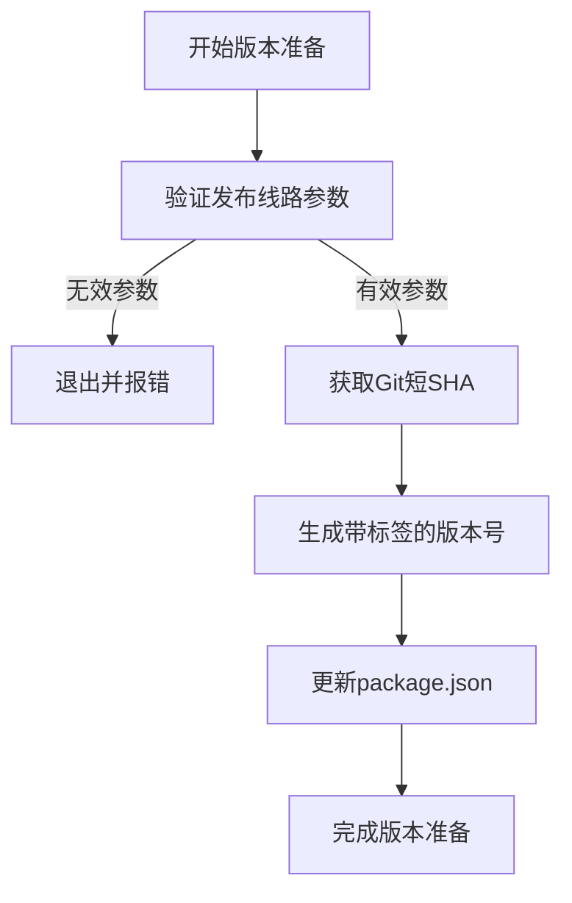
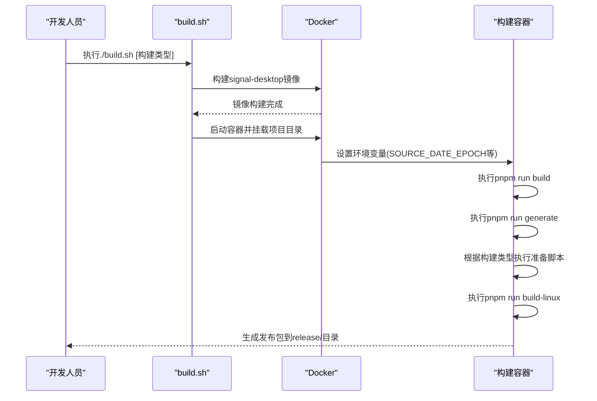
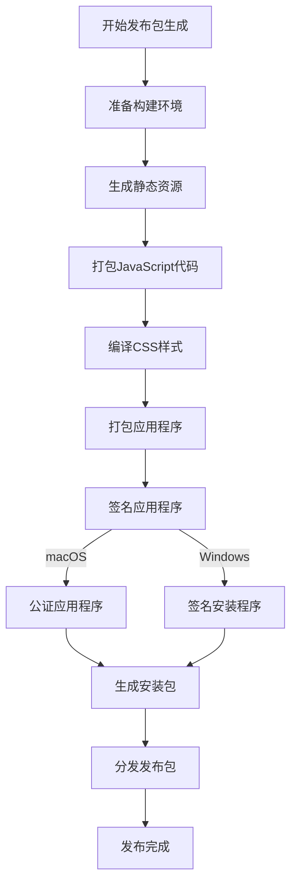
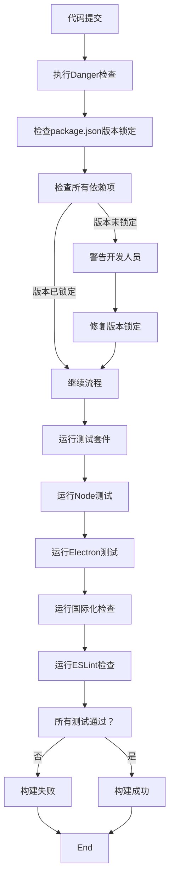

# 发布策略

<cite>
**本文档引用的文件**   
- [package.json](file://package.json)
- [prepare_staging_build.js](file://scripts/prepare_staging_build.js)
- [prepare_alpha_build.js](file://scripts/prepare_alpha_build.js)
- [prepare_beta_build.js](file://scripts/prepare_beta_build.js)
- [prepare_adhoc_build.js](file://scripts/prepare_adhoc_build.js)
- [prepare_tagged_version.js](file://scripts/prepare_tagged_version.js)
- [staging.json](file://config/staging.json)
- [production.json](file://config/production.json)
- [packageJsonVersionsShouldBePinned.ts](file://danger/rules/packageJsonVersionsShouldBePinned.ts)
- [build.sh](file://reproducible-builds/build.sh)
- [docker-entrypoint.sh](file://reproducible-builds/docker-entrypoint.sh)
</cite>

## 目录
1. [发布流程概述](#发布流程概述)
2. [版本管理与package.json配置](#版本管理与packagejson配置)
3. [构建环境配置](#构建环境配置)
4. [发布包生成与签名机制](#发布包生成与签名机制)
5. [质量保证与验证流程](#质量保证与验证流程)
6. [回滚与紧急修复机制](#回滚与紧急修复机制)
7. [版本兼容性管理](#版本兼容性管理)
8. [发布日志与用户通知](#发布日志与用户通知)
9. [发布后监控方案](#发布后监控方案)

## 发布流程概述

Signal-Desktop的发布流程采用多阶段、多渠道的策略，确保从开发到正式发布的每个环节都经过严格验证。整个流程包括开发、测试、预发布和正式发布四个主要阶段，通过不同的构建脚本和配置文件来区分各个发布渠道。

发布流程的核心是通过一系列脚本自动化处理版本号、应用标识、可执行文件名等关键配置，确保不同版本可以并行安装和运行。这种设计允许开发人员同时测试生产版本、测试版本和实验性版本，而不会产生冲突。

发布流程的入口点是`reproducible-builds/build.sh`脚本，该脚本根据传入的参数决定构建类型（如public、alpha、beta等），并在Docker容器中执行构建过程，确保构建环境的一致性和可重现性。

**Section sources**
- [build.sh](file://reproducible-builds/build.sh#L1-L57)
- [docker-entrypoint.sh](file://reproducible-builds/docker-entrypoint.sh#L41-L73)

## 版本管理与package.json配置

Signal-Desktop的版本管理通过`package.json`文件中的`version`字段实现，采用语义化版本控制（Semantic Versioning）策略。版本号格式为`主版本号.次版本号.修订号-预发布标识符`，其中预发布标识符用于区分不同的发布渠道。

在`package.json`中，版本号的管理与多个构建脚本紧密相关。`prepare_tagged_version.js`脚本负责生成带标签的版本号，根据传入的发布线路参数（alpha、axolotl或adhoc）生成相应的版本标识。该脚本会从Git仓库获取短SHA值，并将其整合到版本号中，确保每个构建都是唯一的。

**Diagram sources**
- [prepare_tagged_version.js](file://scripts/prepare_tagged_version.js#L1-L38)

对于不同发布渠道，Signal-Desktop使用专门的准备脚本来修改`package.json`中的关键字段。这些字段包括：
- `name`: 包名，用于npm包管理
- `productName`: 产品显示名称
- `build.appId`: 应用程序标识符
- `build.linux.executableName`: Linux可执行文件名
- `desktopName`: 桌面文件名称

这些修改确保了不同版本的应用程序在系统中具有唯一的标识，可以并行安装和运行。

**Section sources**
- [package.json](file://package.json#L1-L714)
- [prepare_tagged_version.js](file://scripts/prepare_tagged_version.js#L1-L38)

## 构建环境配置

Signal-Desktop采用可重现的构建环境来确保每次构建的一致性和可靠性。构建过程在Docker容器中执行，容器中预装了所有必要的依赖项和工具，确保构建环境的隔离性和可重现性。

构建环境的配置通过`reproducible-builds`目录下的文件实现。`Dockerfile`定义了基础镜像和安装的依赖项，`build.sh`脚本负责构建Docker镜像并启动构建过程，`docker-entrypoint.sh`脚本则在容器内执行实际的构建命令。

**Diagram sources**
- [build.sh](file://reproducible-builds/build.sh#L1-L57)
- [docker-entrypoint.sh](file://reproducible-builds/docker-entrypoint.sh#L41-L73)

对于不同的构建类型，系统使用不同的配置文件来控制应用行为。例如，`staging.json`配置文件启用了开发工具和调试功能，而`production.json`则配置了生产环境的服务器URL和安全参数。这种配置分离确保了不同环境下的应用行为符合预期。

**Section sources**
- [build.sh](file://reproducible-builds/build.sh#L1-L57)
- [docker-entrypoint.sh](file://reproducible-builds/docker-entrypoint.sh#L41-L73)
- [staging.json](file://config/staging.json#L1-L5)
- [production.json](file://config/production.json#L1-L24)

## 发布包生成与签名机制

Signal-Desktop的发布包生成过程由Electron-Builder工具驱动，通过`package.json`中的`build`配置项定义构建参数。构建过程包括代码打包、资源优化、平台特定文件生成等步骤，最终生成适用于不同操作系统的安装包。

对于macOS平台，构建过程包括代码签名和公证（notarization）步骤。`build.mac.sign`配置项指定了macOS签名脚本`sign-macos.node.js`，该脚本使用Apple开发者证书对应用程序进行签名。虽然`package.json`中的`notarize`脚本显示"不再需要"，但实际的公证过程可能已集成到CI/CD流程中。

**Diagram sources**
- [package.json](file://package.json#L429-L578)

对于Windows平台，构建过程使用NSIS（Nullsoft Scriptable Install System）生成安装程序。`build.win.signtoolOptions`配置项指定了Windows签名工具的参数，包括证书主题名称、SHA1指纹和发布者名称。签名过程确保了安装程序的完整性和来源可信。

发布包的分发通过配置的发布服务器进行。`build.mac.publish`和`build.win.publish`配置项指定了更新服务器的URL为`https://updates.signal.org/desktop`，客户端会定期检查此URL获取更新信息。

**Section sources**
- [package.json](file://package.json#L429-L578)

## 质量保证与验证流程

Signal-Desktop的质量保证流程通过多层次的自动化测试和代码检查来确保代码质量和发布稳定性。质量保证流程在CI/CD管道中自动执行，涵盖代码风格检查、单元测试、集成测试等多个方面。

在代码提交阶段，Danger工具会执行一系列规则检查，确保代码质量。`packageJsonVersionsShouldBePinned.ts`规则检查`package.json`中的依赖版本是否被锁定到特定版本，防止因依赖版本不一致导致的问题。该规则会检查所有依赖类型（dependencies、devDependencies等）中的版本规范，确保它们是精确版本而非版本范围。

**Diagram sources**
- [packageJsonVersionsShouldBePinned.ts](file://danger/rules/packageJsonVersionsShouldBePinned.ts#L1-L84)

测试套件包括多个层次的测试：
- `test-node`: 运行Node.js环境下的单元测试
- `test-electron`: 运行Electron环境下的集成测试
- `test-lint-intl`: 检查国际化字符串的正确性
- `test-eslint`: 运行ESLint代码风格检查

这些测试在`package.json`的`scripts`中通过`test`脚本组合执行，确保每次提交都经过全面的验证。

**Section sources**
- [packageJsonVersionsShouldBePinned.ts](file://danger/rules/packageJsonVersionsShouldBePinned.ts#L1-L84)
- [package.json](file://package.json#L49-L57)

## 回滚与紧急修复机制

Signal-Desktop的回滚机制基于版本控制和发布通道的分离设计。当发现严重问题时，可以通过以下方式快速回滚：

1. **版本回滚**: 通过Git版本控制，可以快速回退到之前的稳定版本。由于每个版本都有唯一的Git SHA标识，可以精确地定位到特定的代码状态。

2. **发布通道切换**: Signal-Desktop支持多个发布通道（production、beta、alpha等），可以在不同通道之间切换。当生产版本出现问题时，可以引导用户暂时使用beta或alpha版本作为临时解决方案。

3. **紧急修复发布**: 对于需要立即修复的严重问题，可以创建紧急修复分支（hotfix branch），在该分支上进行修复并快速发布。紧急修复发布遵循简化的发布流程，跳过部分非关键的验证步骤，以加快发布速度。

紧急修复流程如下：
1. 创建紧急修复分支，基于最新的稳定版本
2. 实施必要的修复
3. 运行关键测试用例，确保修复不会引入新的问题
4. 使用`prepare_tagged_version.js`脚本生成紧急修复版本号
5. 执行构建和签名过程
6. 发布到更新服务器
7. 通知用户更新

这种机制确保了在出现严重问题时能够快速响应，同时保持系统的稳定性和安全性。

**Section sources**
- [prepare_tagged_version.js](file://scripts/prepare_tagged_version.js#L1-L38)

## 版本兼容性管理

Signal-Desktop的版本兼容性管理通过多个机制实现，确保不同版本的客户端能够正常通信和协作。兼容性管理主要关注以下几个方面：

1. **协议兼容性**: Signal-Desktop使用Signal协议进行端到端加密通信。协议的设计确保了向后兼容性，新版本的客户端能够与旧版本的客户端正常通信。

2. **数据格式兼容性**: 应用程序的数据存储格式设计为向后兼容。新版本可以读取旧版本创建的数据，但旧版本可能无法正确处理新版本添加的字段。

3. **API兼容性**: 客户端与服务器之间的API设计遵循语义化版本控制原则，确保非破坏性变更不会影响现有功能。

4. **跨平台兼容性**: Signal-Desktop需要与移动客户端（iOS和Android）保持兼容。这要求桌面客户端的协议实现与移动客户端保持一致。

版本兼容性通过持续集成测试来验证。测试套件包括跨版本通信测试，确保新版本的客户端能够与指定范围内的旧版本客户端正常通信。此外，自动化测试还验证数据迁移的正确性，确保用户升级后数据不会丢失或损坏。

**Section sources**
- [package.json](file://package.json#L426-L428)

## 发布日志与用户通知

Signal-Desktop的发布日志生成遵循标准化的流程，确保每次发布都有详细的变更记录。发布日志通常包括以下内容：

1. **版本号和发布日期**: 明确标识发布的版本和时间
2. **新增功能**: 列出本次发布新增的主要功能
3. **问题修复**: 列出修复的已知问题和bug
4. **性能改进**: 描述性能优化和改进
5. **已知问题**: 列出当前版本中存在的已知问题
6. **安全更新**: 如果包含安全修复，会特别说明

用户通知机制通过多种渠道实现：
1. **应用内通知**: 当新版本可用时，客户端会在界面中显示更新提示
2. **更新服务器**: 客户端定期检查更新服务器，获取最新的版本信息
3. **邮件通知**: 对于重要更新，可能会通过邮件通知注册用户
4. **社交媒体**: 通过官方社交媒体账号发布更新信息

发布日志的生成通常与CI/CD流程集成，自动化工具会从Git提交历史中提取相关信息，生成初步的发布日志，然后由开发团队进行审核和补充。

**Section sources**
- [package.json](file://package.json#L440-L445)

## 发布后监控方案

Signal-Desktop的发布后监控方案包括多个层面的监控和反馈机制，确保能够及时发现和响应发布后的问题。

1. **性能监控**: 通过DataDog等监控工具收集安装包大小、启动时间、内存使用等性能指标。`dd-installer-size.node.ts`脚本负责将安装包大小指标发送到DataDog，用于跟踪构建输出的变化趋势。

2. **错误监控**: 客户端集成了错误报告机制，当发生未处理的异常时，会收集错误信息并发送到服务器。这些信息用于分析和修复问题。

3. **使用情况分析**: 收集匿名的使用数据，了解功能使用情况和用户行为模式，为后续开发提供依据。

4. **用户反馈**: 提供用户反馈渠道，收集用户对新版本的意见和建议。

5. **服务器监控**: 监控服务器端的性能和稳定性，确保更新服务器能够处理大量的客户端请求。

监控数据的分析结果会定期反馈给开发团队，用于改进发布流程和产品质量。对于发现的问题，会根据严重程度启动相应的响应流程，包括紧急修复、版本回滚等。

**Section sources**
- [dd-installer-size.node.ts](file://ts/scripts/dd-installer-size.node.ts#L46-L100)