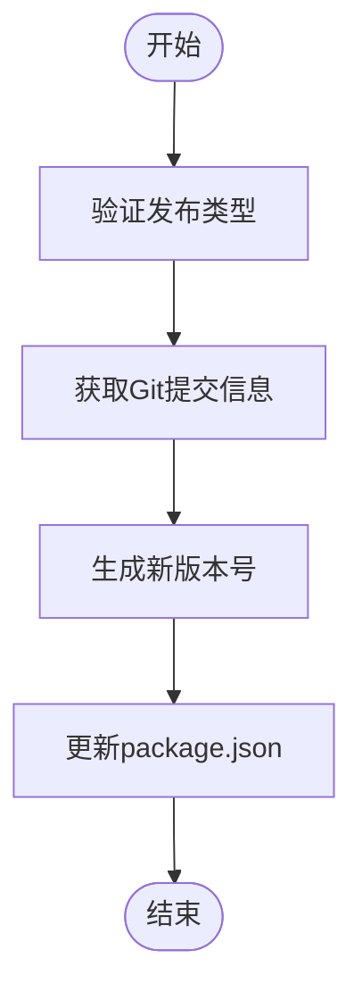
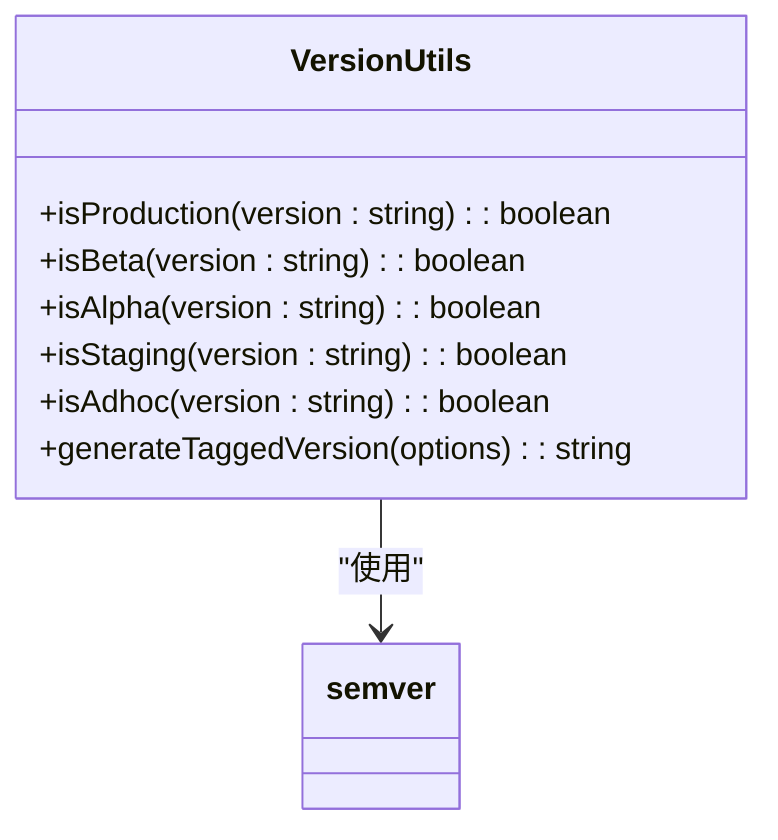
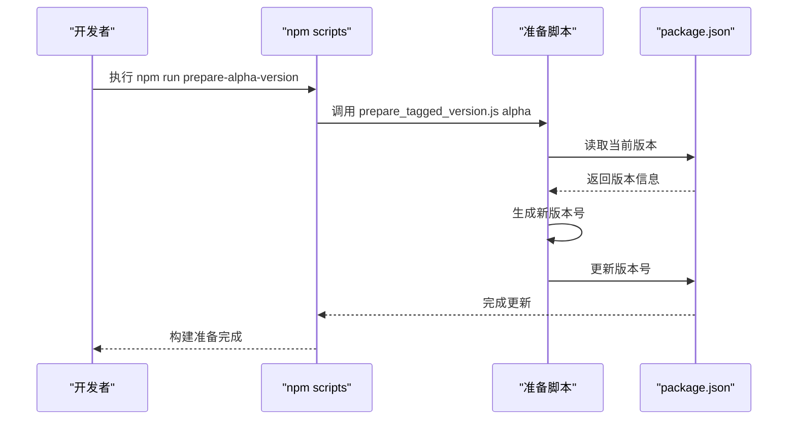

# 版本管理

<cite>
**本文档中引用的文件**  
- [prepare_tagged_version.js](file://scripts/prepare_tagged_version.js)
- [prepare_alpha_build.js](file://scripts/prepare_alpha_build.js)
- [prepare_beta_build.js](file://scripts/prepare_beta_build.js)
- [prepare_staging_build.js](file://scripts/prepare_staging_build.js)
- [prepare_adhoc_build.js](file://scripts/prepare_adhoc_build.js)
- [packageJson.js](file://scripts/packageJson.js)
- [package.json](file://package.json)
- [version.std.ts](file://ts/util/version.std.ts)
- [version_test.std.ts](file://ts/test-node/util/version_test.std.ts)
- [staging.json](file://config/staging.json)
- [production.json](file://config/production.json)
</cite>

## 目录
1. [引言](#引言)
2. [版本类型与发布流程](#版本类型与发布流程)
3. [版本管理脚本分析](#版本管理脚本分析)
4. [语义化版本控制实现](#语义化版本控制实现)
5. [自动化发布流程](#自动化发布流程)
6. [常见问题与解决方案](#常见问题与解决方案)
7. [结论](#结论)

## 引言
Signal-Desktop 采用严格的版本管理策略来确保不同环境下的稳定性和可追溯性。该策略通过一系列自动化脚本实现，支持 alpha、beta、staging 和正式版等多种发布类型。本文档详细说明了这些版本类型的准备脚本和处理流程，分析了版本号更新、标签创建和发布准备的自动化机制。

## 版本类型与发布流程
Signal-Desktop 定义了多种版本类型以满足不同的开发和测试需求：

- **Alpha 版本**：用于内部测试，支持与生产版本并行安装。
- **Beta 版本**：公开测试版本，用于收集用户反馈。
- **Staging 版本**：预发布版本，用于最终验证。
- **正式版**：生产环境发布的稳定版本。
- **Adhoc 版本**：临时构建版本，用于特定测试场景。

每种版本类型都有对应的准备脚本，这些脚本在构建过程中修改 package.json 文件中的关键字段，确保不同版本可以独立安装和运行。

**Section sources**
- [package.json](file://package.json#L40-L48)

## 版本管理脚本分析
### prepare_tagged_version.js 脚本
该脚本负责处理标记版本的准备工作，主要功能包括：

- 验证输入的发布类型（alpha、axolotl、adhoc）
- 获取当前 Git 提交的短哈希值
- 使用 generateTaggedVersion 函数生成新的版本号
- 更新 package.json 文件中的版本信息

脚本通过命令行参数接收发布类型，并使用 Node.js 的 child_process 模块执行 Git 命令获取提交信息。

**Diagram sources**
- [prepare_tagged_version.js](file://scripts/prepare_tagged_version.js#L13-L37)

**Section sources**
- [prepare_tagged_version.js](file://scripts/prepare_tagged_version.js#L1-L38)

### prepare_alpha_build.js 脚本
此脚本专门用于准备 Alpha 构建，其主要功能是修改 package.json 中的应用标识信息，以支持与生产版本并行安装：

- 验证当前版本是否为 Alpha 版本
- 检查生产环境的配置值
- 更新应用名称、产品名称、应用ID等字段
- 修改 Linux 桌面环境的相关配置

脚本通过 lodash 库的 get 和 set 方法安全地读取和修改 JSON 对象。

**Section sources**
- [prepare_alpha_build.js](file://scripts/prepare_alpha_build.js#L1-L82)

### prepare_beta_build.js 脚本
Beta 构建准备脚本与 Alpha 脚本类似，但针对 Beta 版本进行配置：

- 验证当前版本是否为 Beta 版本
- 检查并更新应用标识信息
- 确保 Beta 版本具有独立的应用ID和可执行文件名

该脚本允许 Beta 用户在不卸载生产版本的情况下安装测试版本。

**Section sources**
- [prepare_beta_build.js](file://scripts/prepare_beta_build.js#L1-L81)

### prepare_staging_build.js 脚本
Staging 构建准备脚本除了更新 package.json 外，还负责配置 staging 环境：

- 验证当前版本是否为 Alpha 版本
- 将版本号中的 "alpha" 替换为 "staging"
- 更新所有相关的应用标识字段
- 生成并写入 staging 环境的配置文件

脚本还会创建特定的 production.json 配置文件，用于定义更新启用状态和 CI 模式。

**Section sources**
- [prepare_staging_build.js](file://scripts/prepare_staging_build.js#L1-L95)
- [production.json](file://config/production.json#L1-L24)

### prepare_adhoc_build.js 脚本
Adhoc 构建准备脚本为临时测试版本提供支持：

- 验证当前版本是否为 Adhoc 版本
- 获取当前日期和 Git 提交哈希
- 生成包含日期和哈希的唯一版本标识
- 更新所有应用标识字段以确保唯一性

该脚本生成的版本具有时间戳和提交哈希，便于追踪和管理临时构建。

**Section sources**
- [prepare_adhoc_build.js](file://scripts/prepare_adhoc_build.js#L1-L104)

## 语义化版本控制实现
### 版本检测工具函数
Signal-Desktop 在 ts/util/version.std.ts 中实现了完整的语义化版本控制工具集：

- **isProduction**：检查版本是否为生产版本（无预发布标识）
- **isBeta**：检查版本是否为 Beta 版本
- **isAlpha**：检查版本是否为 Alpha 版本
- **isStaging**：检查版本是否为 Staging 版本
- **isAdhoc**：检查版本是否为 Adhoc 版本

这些函数基于 semver 库解析版本字符串，并检查预发布标识符。

**Diagram sources**
- [version.std.ts](file://ts/util/version.std.ts#L6-L35)

**Section sources**
- [version.std.ts](file://ts/util/version.std.ts#L1-L67)
- [version_test.std.ts](file://ts/test-node/util/version_test.std.ts#L1-L202)

### 版本号生成逻辑
generateTaggedVersion 函数实现了复杂的版本号生成逻辑：

- 解析当前版本号，提取主版本、次版本和修订版本
- 获取当前日期和时间（GMT 时区）
- 结合发布类型、日期时间和 Git 提交哈希生成新版本号
- 确保新版本号符合语义化版本规范

生成的版本号格式为：`{主版本}.{次版本}.{修订版本}-{发布类型}.{日期}.{小时}-{提交哈希}`

**Section sources**
- [version.std.ts](file://ts/util/version.std.ts#L36-L67)
- [prepare_tagged_version.js](file://scripts/prepare_tagged_version.js#L19-L25)

## 自动化发布流程
### 脚本调用流程
Signal-Desktop 的发布流程通过 package.json 中的脚本命令组织：

- **prepare-alpha-version**：调用 prepare_tagged_version.js 生成 Alpha 版本
- **prepare-beta-build**：调用 prepare_beta_build.js 准备 Beta 构建
- **prepare-staging-build**：调用 prepare_staging_build.js 准备 Staging 构建
- **prepare-adhoc-version**：调用 prepare_tagged_version.js 生成 Adhoc 版本

这些脚本通过 npm run 命令链式调用，形成完整的自动化发布流水线。

**Diagram sources**
- [package.json](file://package.json#L42-L47)

**Section sources**
- [package.json](file://package.json#L17-L114)

### 配置文件管理
不同版本类型使用不同的配置文件：

- **production.json**：生产环境配置，启用更新功能
- **staging.json**：Staging 环境配置，开启开发者工具
- **development.json**：开发环境配置，开启开发者工具

prepare_staging_build.js 脚本会特别处理 production.json 文件，确保 Staging 版本具有正确的更新设置。

**Section sources**
- [staging.json](file://config/staging.json#L1-L5)
- [development.json](file://config/development.json#L1-L5)
- [production.json](file://config/production.json#L1-L24)

## 常见问题与解决方案
### 版本冲突
当多个开发者同时创建新版本时可能出现版本冲突。解决方案包括：

- 使用 Git 提交哈希确保版本唯一性
- 在生成版本号时包含时间戳
- 实施代码审查流程确保版本更新的协调

### 发布流程中断
发布流程可能因以下原因中断：

- 脚本执行权限问题
- Git 信息获取失败
- package.json 文件写入权限问题

建议的解决方案是添加详细的错误日志和重试机制。

### 版本回滚
版本回滚需要谨慎处理：

- 备份原始 package.json 文件
- 记录版本变更历史
- 提供反向脚本恢复先前状态

Signal-Desktop 的脚本设计考虑了可逆性，通过验证函数确保配置值的正确性。

**Section sources**
- [prepare_alpha_build.js](file://scripts/prepare_alpha_build.js#L54-L58)
- [prepare_beta_build.js](file://scripts/prepare_beta_build.js#L53-L57)

## 结论
Signal-Desktop 的版本管理策略通过一系列精心设计的脚本实现了高度自动化的发布流程。该策略支持多种版本类型，确保了不同环境下的隔离性和可追溯性。语义化版本控制的实现使得版本号具有明确的含义和排序规则，而自动化脚本则大大减少了人为错误的可能性。这种系统化的版本管理方法为大型软件项目的持续交付提供了可靠的基础。