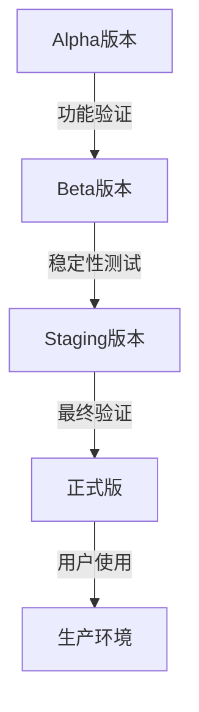
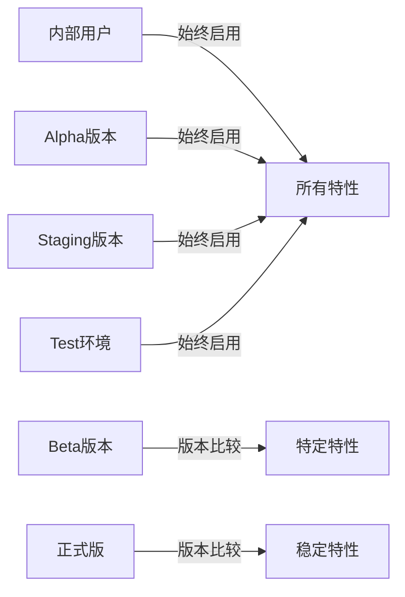

# 版本类型管理

<cite>
**本文档中引用的文件**  
- [prepare_alpha_build.js](file://scripts/prepare_alpha_build.js)
- [prepare_beta_build.js](file://scripts/prepare_beta_build.js)
- [prepare_staging_build.js](file://scripts/prepare_staging_build.js)
- [prepare_tagged_version.js](file://scripts/prepare_tagged_version.js)
- [version.std.ts](file://ts/util/version.std.ts)
- [package.json](file://package.json)
- [production.json](file://config/production.json)
- [staging.json](file://config/staging.json)
</cite>

## 目录
1. [版本类型概述](#版本类型概述)
2. [Alpha版本管理](#alpha版本管理)
3. [Beta版本管理](#beta版本管理)
4. [Staging版本管理](#staging版本管理)
5. [正式版发布流程](#正式版发布流程)
6. [预发布版本特性管理](#预发布版本特性管理)
7. [构建脚本分析](#构建脚本分析)
8. [版本选择指导原则](#版本选择指导原则)

## 版本类型概述

Signal-Desktop采用多层级的版本管理策略，通过不同的版本类型来支持开发、测试和生产环境的隔离。系统定义了alpha、beta、staging和正式版四种主要版本类型，每种类型都有其特定的用途和生命周期。版本类型通过语义化版本号中的预发布标识符来区分，如`-alpha`、`-beta`、`-staging`等。这种策略允许不同版本的Signal桌面客户端在同一台机器上并行安装和运行，便于开发人员和测试人员同时使用不同版本进行测试和验证。

**Section sources**
- [version.std.ts](file://ts/util/version.std.ts#L6-L35)
- [package.json](file://package.json#L9)

## Alpha版本管理

Alpha版本是开发过程中的早期测试版本，主要用于内部开发团队的功能验证和初步测试。根据`prepare_alpha_build.js`脚本的实现，Alpha版本在构建时会修改多个包级配置，包括将应用名称更改为"Signal Alpha"，应用ID更改为`org.whispersystems.signal-desktop-alpha`，以及可执行文件名称更改为`signal-desktop-alpha`。这些修改确保了Alpha版本可以与生产版本并行安装而不会产生冲突。

Alpha版本的识别通过`isAlpha()`函数实现，该函数检查版本号的预发布标识符是否为"alpha"。Alpha版本通常包含最新的功能开发，但稳定性较低，主要用于功能验证和早期问题发现。根据构建脚本的验证逻辑，只有当版本号明确标记为alpha时，才能成功执行Alpha构建流程。

**Section sources**
- [prepare_alpha_build.js](file://scripts/prepare_alpha_build.js#L1-L82)
- [version.std.ts](file://ts/util/version.std.ts#L22-L24)

## Beta版本管理

Beta版本是面向更广泛测试群体的测试版本，通常在Alpha测试完成并修复主要问题后发布。`prepare_beta_build.js`脚本负责Beta版本的构建配置，与Alpha版本类似，它会修改应用名称为"Signal Beta"，应用ID为`org.whispersystems.signal-desktop-beta`，以及相应的可执行文件名称。这些配置变更确保了Beta版本的独立性和可识别性。

Beta版本通过`isBeta()`函数进行识别，该函数检查版本号的预发布标识符是否为"beta"。与Alpha版本相比，Beta版本具有更高的稳定性要求，通常只包含经过Alpha测试验证的功能。Beta版本的测试范围更广，包括功能完整性、用户体验和性能测试。根据测试代码中的验证逻辑，Beta版本的特性启用通常基于版本号的比较，确保只有达到或超过指定Beta版本的客户端才能访问特定功能。

**Section sources**
- [prepare_beta_build.js](file://scripts/prepare_beta_build.js#L1-L81)
- [version.std.ts](file://ts/util/version.std.ts#L16-L18)

## Staging版本管理

Staging版本是用于预生产环境测试的特殊版本，其配置和行为与生产环境高度相似，但允许进行更深入的调试和监控。`prepare_staging_build.js`脚本不仅修改了应用的基本标识信息（如名称、ID等），还将版本号中的"alpha"替换为"staging"，并更新了`production.json`配置文件，设置`ciMode`为"benchmark"。

Staging环境的配置文件`staging.json`启用了开发工具（`openDevTools: true`）并指定了存储配置文件为"staging"。这种配置使得Staging版本既能模拟生产环境的行为，又能提供开发和调试所需的工具支持。Staging版本通过`isStaging()`函数识别，该函数检查版本号的预发布标识符是否为"staging"。Staging版本通常用于最后阶段的集成测试和性能基准测试，确保新版本在部署到生产环境前达到质量要求。

**Diagram sources**
- [prepare_staging_build.js](file://scripts/prepare_staging_build.js#L1-L95)
- [staging.json](file://config/staging.json#L1-L5)

**Section sources**
- [prepare_staging_build.js](file://scripts/prepare_staging_build.js#L1-L95)
- [staging.json](file://config/staging.json#L1-L5)

## 正式版发布流程

正式版发布遵循严格的质量保证流程，确保稳定性和兼容性。正式版通过`isProduction()`函数识别，该函数检查版本号是否为标准的语义化版本（即不包含预发布标识符或构建元数据）。生产环境的配置文件`production.json`定义了正式版的服务器端点、CDN配置和更新策略，其中`updatesEnabled`设置为`true`，允许客户端自动检查和下载更新。

正式版的发布需要经过完整的测试周期，包括单元测试、集成测试、端到端测试和安全审查。构建系统通过`prepare_tagged_version.js`脚本生成带有时间戳和Git提交哈希的版本号，确保每个发布版本的唯一性和可追溯性。正式版的兼容性要求包括向后兼容的API接口、数据格式兼容性以及跨平台一致性。只有通过所有质量检查的版本才能被标记为正式版并推送给用户。

**Section sources**
- [version.std.ts](file://ts/util/version.std.ts#L6-L14)
- [production.json](file://config/production.json#L1-L24)
- [prepare_tagged_version.js](file://scripts/prepare_tagged_version.js#L1-L38)

## 预发布版本特性管理

预发布版本的特性管理通过条件判断和特性开关机制实现。根据`isFeatureEnabled`函数的实现，内部用户、Alpha版本、Staging版本和测试环境的用户默认可以访问所有特性。对于Beta版本，特性启用基于版本号比较，只有当当前版本号大于或等于特性要求的Beta版本号时才能启用。

这种分层的特性管理策略允许开发团队逐步向不同用户群体开放新功能。例如，一个新功能可能首先在Alpha版本中对所有内部用户开放，然后在特定Beta版本中对测试用户开放，最后在正式版中对所有用户开放。特性开关的配置通过远程配置系统管理，可以在不发布新版本的情况下动态调整特性可用性。测试代码验证了这种机制的正确性，确保不同版本类型和用户类型的特性访问权限符合预期。

**Diagram sources**
- [isFeatureEnabled.dom.ts](file://ts/util/isFeatureEnabled.dom.ts#L52-L98)
- [isFeatureEnabled_test.dom.ts](file://ts/test-electron/util/isFeatureEnabled_test.dom.ts#L45-L187)

**Section sources**
- [isFeatureEnabled.dom.ts](file://ts/util/isFeatureEnabled.dom.ts#L52-L98)
- [isFeatureEnabled_test.dom.ts](file://ts/test-electron/util/isFeatureEnabled_test.dom.ts#L45-L187)

## 构建脚本分析

Signal-Desktop的构建系统通过一系列专用脚本管理不同版本类型的构建流程。每个版本类型都有对应的准备脚本，如`prepare_alpha_build.js`、`prepare_beta_build.js`等，这些脚本负责修改`package.json`中的关键配置项，确保生成的安装包具有正确的标识和行为。

所有构建脚本都遵循相似的模式：首先验证当前版本号是否符合预期类型，然后检查生产版本的默认配置是否正确，最后更新为对应版本类型的配置。这种设计确保了构建过程的一致性和可靠性。`prepare_tagged_version.js`脚本还集成了Git信息，将提交哈希和时间戳嵌入版本号中，增强了版本的可追溯性。构建脚本的模块化设计使得添加新的版本类型变得简单，只需复制现有脚本并调整相应的配置值即可。

**Section sources**
- [prepare_alpha_build.js](file://scripts/prepare_alpha_build.js#L1-L82)
- [prepare_beta_build.js](file://scripts/prepare_beta_build.js#L1-L81)
- [prepare_staging_build.js](file://scripts/prepare_staging_build.js#L1-L95)
- [prepare_tagged_version.js](file://scripts/prepare_tagged_version.js#L1-L38)

## 版本选择指导原则

开发者在选择版本类型时应遵循以下指导原则：使用Alpha版本进行新功能的早期开发和验证；使用Beta版本进行更广泛的测试和用户反馈收集；使用Staging版本进行预生产环境的最终验证；只有经过充分测试且达到质量标准的版本才能发布为正式版。

对于特性开发，建议首先在Alpha版本中实现并测试基本功能，然后在Beta版本中完善用户体验和性能优化，最后在正式版中确保稳定性和兼容性。测试团队应根据版本类型制定相应的测试策略，Alpha测试侧重功能正确性，Beta测试侧重稳定性和用户体验，Staging测试侧重性能和安全性。通过这种分阶段的版本管理策略，可以有效控制风险，确保高质量的软件交付。

**Section sources**
- [version.std.ts](file://ts/util/version.std.ts#L6-L35)
- [prepare_alpha_build.js](file://scripts/prepare_alpha_build.js#L1-L82)
- [prepare_beta_build.js](file://scripts/prepare_beta_build.js#L1-L81)