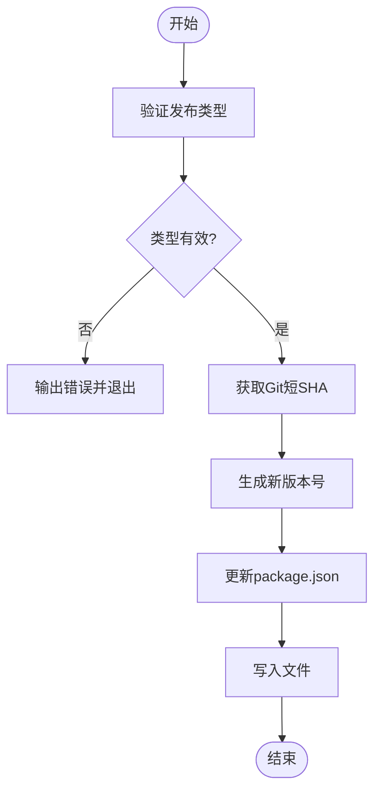
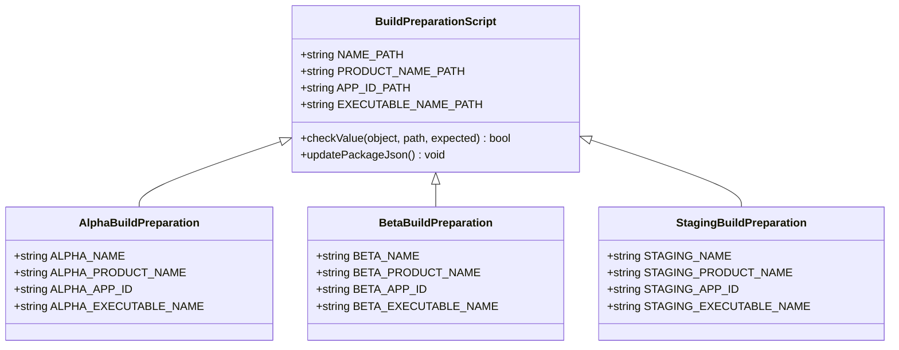
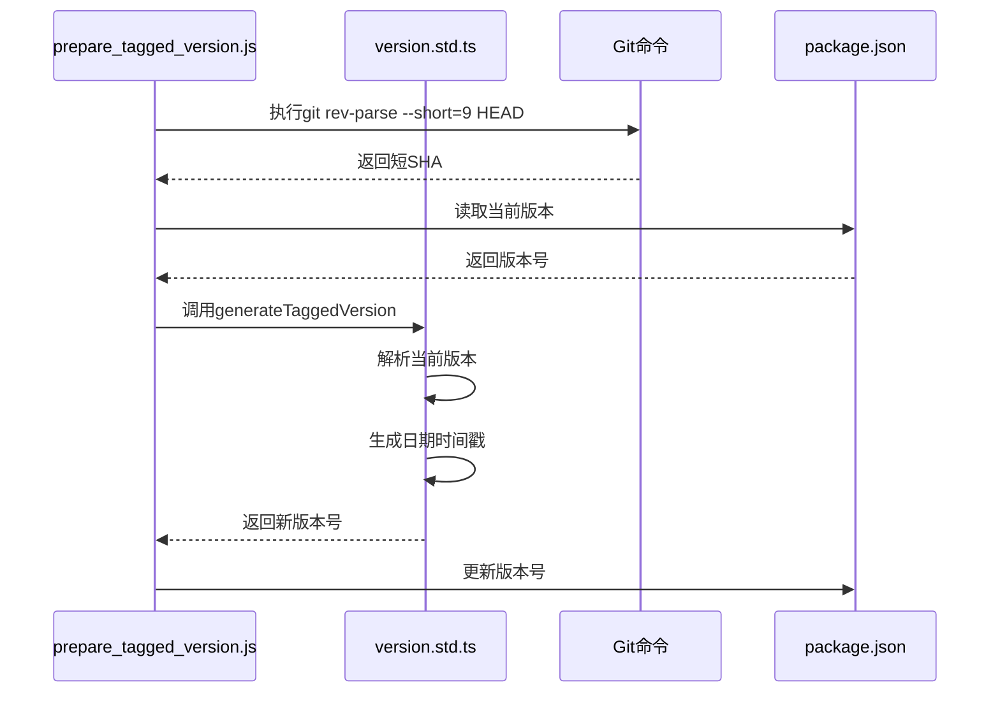
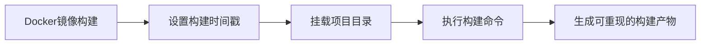

# 自动化流程

<cite>
**本文档中引用的文件**  
- [prepare_tagged_version.js](file://scripts/prepare_tagged_version.js)
- [prepare_alpha_build.js](file://scripts/prepare_alpha_build.js)
- [prepare_beta_build.js](file://scripts/prepare_beta_build.js)
- [prepare_staging_build.js](file://scripts/prepare_staging_build.js)
- [prepare_adhoc_build.js](file://scripts/prepare_adhoc_build.js)
- [prepare_axolotl_build.js](file://scripts/prepare_axolotl_build.js)
- [prepare_linux_build.js](file://scripts/prepare_linux_build.js)
- [version.std.ts](file://ts/util/version.std.ts)
- [packageJson.js](file://scripts/packageJson.js)
- [package.json](file://package.json)
- [build.sh](file://reproducible-builds/build.sh)
</cite>

## 目录
1. [简介](#简介)
2. [版本自动化流程概述](#版本自动化流程概述)
3. [核心版本管理脚本分析](#核心版本管理脚本分析)
4. [语义化版本控制实现](#语义化版本控制实现)
5. [错误处理与环境验证](#错误处理与环境验证)
6. [CI/CD系统集成](#cicd系统集成)
7. [构建一致性保障](#构建一致性保障)

## 简介
Signal-Desktop项目采用了一套完善的自动化流程来管理版本发布和构建过程。该系统通过一系列JavaScript脚本实现了版本号的自动递增、语义化版本控制的应用、Git标签的自动创建以及构建环境的配置。这些自动化脚本确保了不同版本（如alpha、beta、staging等）能够并行安装和管理，同时保持了构建过程的一致性和可重复性。

## 版本自动化流程概述
Signal-Desktop的版本管理自动化流程主要由位于`scripts/`目录下的多个JavaScript脚本组成。这些脚本协同工作，实现了从版本号生成到构建配置的完整自动化过程。系统通过`package.json`中的脚本定义（如`prepare-alpha-version`、`prepare-beta-build`等）来触发相应的自动化任务。

该流程的核心目标是支持多种发布渠道（alpha、beta、axolotl、adhoc、staging）的并行开发和测试，同时确保每个版本都有唯一的标识符和配置，避免安装冲突。自动化流程还集成了错误处理机制和环境验证，确保构建过程的可靠性和稳定性。

**本节来源**
- [package.json](file://package.json#L40-L48)

## 核心版本管理脚本分析

### prepare_tagged_version.js 脚本
`prepare_tagged_version.js`脚本是版本自动化流程的核心组件，负责生成符合语义化版本规范的新版本号。该脚本接受发布类型参数（alpha、axolotl或adhoc），获取当前Git提交的短SHA值，并调用`generateTaggedVersion`函数生成新的版本号。

脚本首先验证输入的发布类型是否有效，然后从`package.json`中读取当前版本号，结合发布类型、日期时间戳和Git SHA生成新的版本号。最后，脚本将更新后的版本号写回`package.json`文件。

**图表来源**
- [prepare_tagged_version.js](file://scripts/prepare_tagged_version.js#L13-L38)

**本节来源**
- [prepare_tagged_version.js](file://scripts/prepare_tagged_version.js#L1-L38)

### 准备构建脚本系列
Signal-Desktop提供了一系列准备构建脚本，包括`prepare_alpha_build.js`、`prepare_beta_build.js`、`prepare_staging_build.js`和`prepare_adhoc_build.js`。这些脚本的主要功能是修改`package.json`中的应用标识符，以支持不同版本的并行安装。

每个脚本都会验证当前版本是否符合预期的预发布类型，然后修改应用名称、产品名称、应用ID、可执行文件名等关键字段。这种设计使得alpha、beta等测试版本可以与生产版本共存于同一系统中，而不会发生冲突。

**图表来源**
- [prepare_alpha_build.js](file://scripts/prepare_alpha_build.js#L25-L50)
- [prepare_beta_build.js](file://scripts/prepare_beta_build.js#L24-L49)
- [prepare_staging_build.js](file://scripts/prepare_staging_build.js#L28-L53)

**本节来源**
- [prepare_alpha_build.js](file://scripts/prepare_alpha_build.js#L1-L82)
- [prepare_beta_build.js](file://scripts/prepare_beta_build.js#L1-L81)
- [prepare_staging_build.js](file://scripts/prepare_staging_build.js#L1-L95)
- [prepare_adhoc_build.js](file://scripts/prepare_adhoc_build.js#L1-L104)
- [prepare_axolotl_build.js](file://scripts/prepare_axolotl_build.js#L1-L82)

### Linux构建准备脚本
`prepare_linux_build.js`脚本专门用于配置Linux平台的构建目标。该脚本接受命令行参数指定构建目标（如appimage、deb），验证输入的有效性，并更新`package.json`中的Linux构建配置。

脚本使用`Set`数据结构存储有效的构建目标，确保输入参数的合法性。通过修改`build.linux.target`配置项，脚本能够灵活地支持不同的Linux打包格式，满足多样化的分发需求。

**本节来源**
- [prepare_linux_build.js](file://scripts/prepare_linux_build.js#L1-L31)

## 语义化版本控制实现

### 版本生成逻辑
Signal-Desktop的语义化版本控制实现在`ts/util/version.std.ts`文件中。`generateTaggedVersion`函数是版本生成的核心，它遵循语义化版本2.0.0规范，结合发布类型、日期时间戳和Git提交SHA来生成唯一的版本标识符。

版本格式为`{主版本}.{次版本}.{修订版本}-{发布类型}.{日期时间}-{短SHA}`，例如`7.86.0-alpha.20240115.14-abc123def`。这种格式既保持了语义化版本的基本结构，又包含了足够的信息来唯一标识每次构建。

**图表来源**
- [version.std.ts](file://ts/util/version.std.ts#L36-L67)
- [prepare_tagged_version.js](file://scripts/prepare_tagged_version.js#L19-L25)

### 版本类型检测
`version.std.ts`文件还定义了一系列版本类型检测函数，如`isAlpha`、`isBeta`、`isStaging`等。这些函数使用`semver`库解析版本号，并检查预发布标识符来确定版本类型。

这些检测函数在各个准备构建脚本中被广泛使用，用于验证当前版本是否符合预期的发布类型。例如，`prepare_alpha_build.js`在执行前会调用`isAlpha`函数验证版本号，确保只有alpha版本才能进行alpha构建配置。

**本节来源**
- [version.std.ts](file://ts/util/version.std.ts#L6-L35)

## 错误处理与环境验证

### 输入验证机制
Signal-Desktop的自动化脚本实现了严格的输入验证机制。`prepare_tagged_version.js`脚本首先验证发布类型参数是否为有效的值（alpha、axolotl或adhoc），如果无效则输出错误信息并退出进程。

类似的，`prepare_linux_build.js`脚本使用`Set`数据结构存储有效的构建目标，并验证输入参数是否全部属于有效目标。这种验证机制防止了因错误输入导致的构建失败或意外行为。

### 配置完整性检查
准备构建脚本系列实现了配置完整性检查功能。通过`checkValue`辅助函数，脚本在修改配置前会验证关键字段的当前值是否符合预期。这种双重验证机制确保了脚本运行的环境状态正确，避免了因配置不一致导致的问题。

例如，`prepare_alpha_build.js`在修改应用名称前会检查当前名称是否为生产环境的`signal-desktop`，确保脚本不会在已经修改过的配置上重复执行。

**本节来源**
- [prepare_tagged_version.js](file://scripts/prepare_tagged_version.js#L13-L17)
- [prepare_linux_build.js](file://scripts/prepare_linux_build.js#L10-L18)
- [prepare_alpha_build.js](file://scripts/prepare_alpha_build.js#L54-L59)

## CI/CD系统集成

### 构建脚本集成
Signal-Desktop通过`package.json`中的脚本定义将各个准备脚本集成到构建流程中。例如，`prepare-alpha-version`脚本对应`node scripts/prepare_tagged_version.js alpha`命令，可以在CI/CD管道中直接调用。

这种集成方式使得版本准备过程可以作为CI/CD流程的一部分自动执行，无需手动干预。通过npm脚本的标准化接口，不同的CI/CD系统都可以以相同的方式调用这些自动化功能。

### 可重现构建系统
`reproducible-builds/`目录下的`build.sh`脚本实现了可重现构建系统。该脚本使用Docker容器化构建环境，通过设置`SOURCE_DATE_EPOCH`环境变量确保构建时间戳的确定性。

构建脚本首先构建包含所有依赖项的Docker镜像，然后在容器中执行实际的构建过程。通过挂载项目目录和传递构建参数，该系统确保了在不同环境和时间下构建结果的一致性。

**图表来源**
- [build.sh](file://reproducible-builds/build.sh#L19-L57)

**本节来源**
- [package.json](file://package.json#L40-L48)
- [build.sh](file://reproducible-builds/build.sh#L1-L58)

## 构建一致性保障

### 环境隔离
Signal-Desktop通过Docker容器化构建环境实现了环境隔离。`reproducible-builds/Dockerfile`定义了包含所有构建依赖项的确定性环境，确保每次构建都在相同的软件栈上执行。

这种环境隔离消除了"在我机器上能运行"的问题，保证了开发环境、CI环境和生产环境的一致性。通过固定依赖项版本和系统配置，构建过程不再受宿主系统差异的影响。

### 配置集中管理
项目通过`package.json`集中管理构建配置，所有构建相关的设置都存储在这个文件中。准备脚本通过修改`package.json`来配置构建环境，而不是分散在多个配置文件中。

这种集中管理方式简化了配置变更的追踪和版本控制，使得构建配置的变更历史清晰可查。同时，通过`package.schema.json`文件定义了配置的结构和约束，确保了配置的正确性。

**本节来源**
- [package.json](file://package.json#L429-L708)
- [package.schema.json](file://package.schema.json)