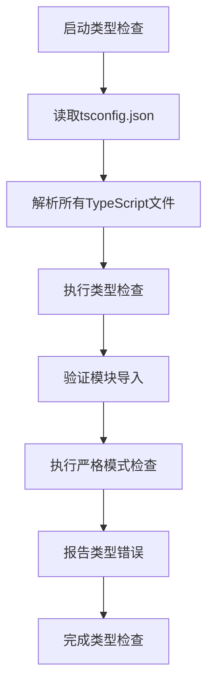
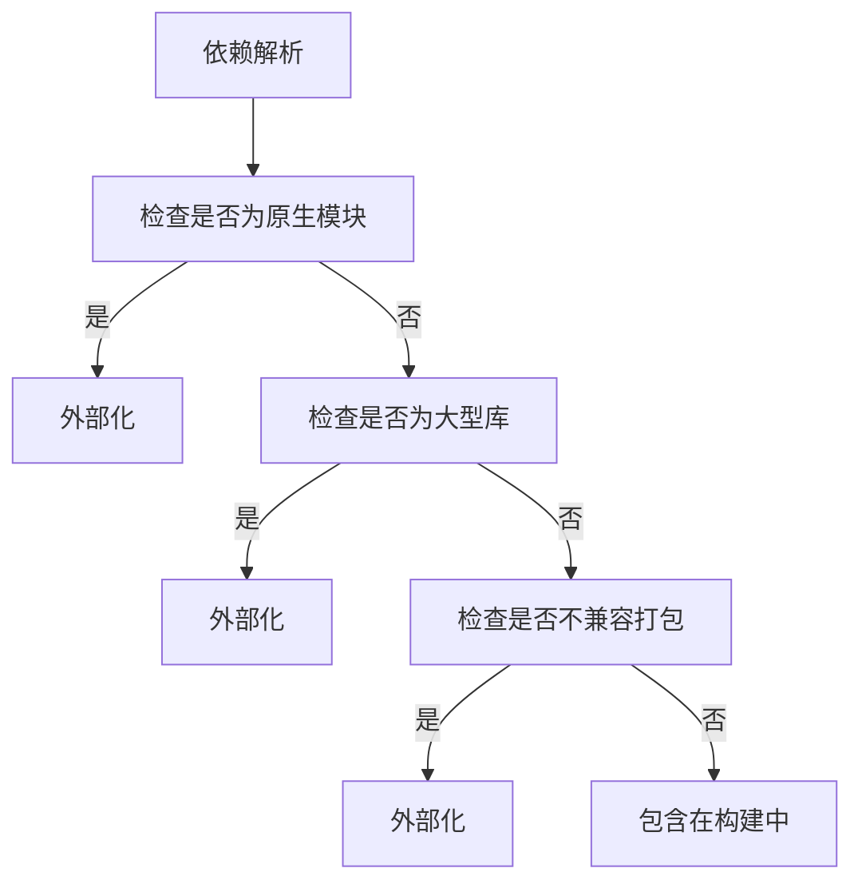
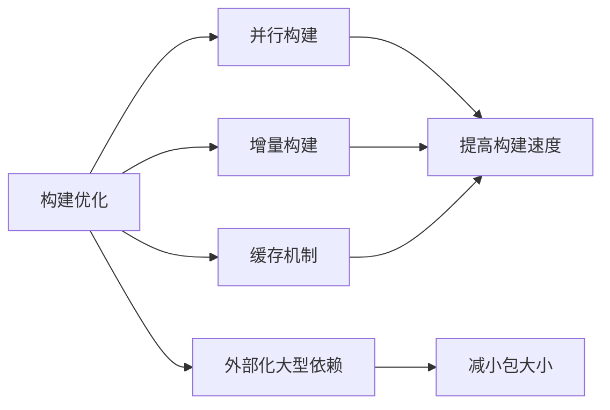
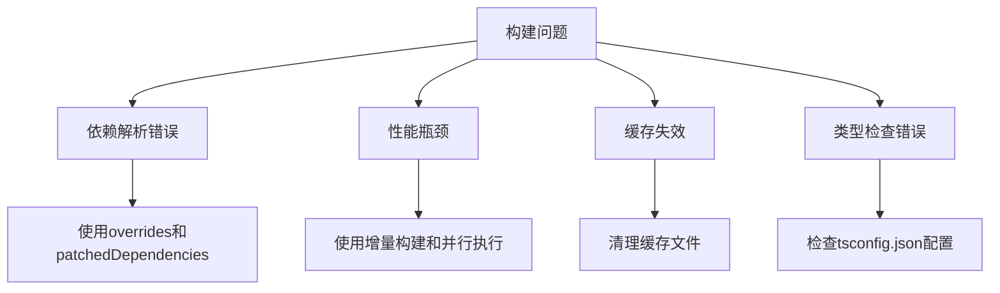

# 基础构建

<cite>
**本文档中引用的文件**  
- [package.json](file://package.json)
- [scripts/esbuild.js](file://scripts/esbuild.js)
- [pnpm-workspace.yaml](file://pnpm-workspace.yaml)
- [tsconfig.json](file://tsconfig.json)
- [scripts/clean-transpile.js](file://scripts/clean-transpile.js)
- [sticker-creator/vite.config.ts](file://sticker-creator/vite.config.ts)
</cite>

## 目录
1. [项目结构](#项目结构)
2. [构建脚本与执行流程](#构建脚本与执行流程)
3. [esbuild配置详解](#esbuild配置详解)
4. [TypeScript编译与类型检查](#typescript编译与类型检查)
5. [pnpm工作区与依赖管理](#pnpm工作区与依赖管理)
6. [代码压缩与资源打包](#代码压缩与资源打包)
7. [构建优化策略](#构建优化策略)
8. [常见构建问题与解决方案](#常见构建问题与解决方案)

## 项目结构

Signal-Desktop项目采用模块化结构，主要包含以下核心目录：

- **app/**: 主应用程序逻辑，包含Electron主进程代码
- **ts/**: TypeScript源代码，包含前端组件、服务和工具
- **scripts/**: 构建和开发脚本，包括esbuild配置
- **config/**: 不同环境的配置文件
- **stylesheets/**: 样式表文件，使用Sass和Tailwind CSS
- **sticker-creator/**: 贴纸创建器子项目，使用Vite构建
- **packages/**: 可复用的npm包

项目根目录的package.json定义了主要的构建脚本和依赖关系，而pnpm-workspace.yaml配置了pnpm工作区，允许在多个包之间共享依赖。

**Section sources**
- [package.json](file://package.json)
- [pnpm-workspace.yaml](file://pnpm-workspace.yaml)

## 构建脚本与执行流程

Signal-Desktop使用npm脚本和pnpm进行构建流程管理。主要的构建脚本定义在package.json中，通过run-s和run-p等工具实现串行和并行执行。

构建流程分为多个阶段：
1. **generate**: 生成必要的构建资源，包括protobuf编译、ICU类型生成、样式编译等
2. **build:esbuild**: 使用esbuild进行TypeScript编译和打包
3. **build:release**: 使用electron-builder创建最终的可执行文件

开发环境使用`dev`脚本，生产环境使用`build`脚本。`build:dev`用于开发构建，`build:esbuild:prod`用于生产环境的esbuild构建。

**Section sources**
- [package.json](file://package.json#L21-L25)

## esbuild配置详解

esbuild配置位于scripts/esbuild.js文件中，定义了多种构建模式和配置选项。

### 核心配置选项

esbuild配置包含三个主要的默认配置对象：
- **nodeDefaults**: Node.js环境的基础配置
- **bundleDefaults**: 捆绑构建的默认配置
- **sandboxedPreloadDefaults**: 沙箱预加载脚本的默认配置

```mermaid
classDiagram
class nodeDefaults {
platform : 'node'
target : 'es2023'
sourcemap : false
keepNames : true
}
class bundleDefaults {
define : {'process.env.NODE_ENV' : '"production"'}
bundle : true
minify : isProd
external : string[]
}
class sandboxedPreloadDefaults {
external : ['electron']
bundle : true
minify : isProd
}
bundleDefaults --> nodeDefaults : "扩展"
sandboxedPreloadDefaults --> nodeDefaults : "扩展"
```

**Diagram sources**
- [scripts/esbuild.js](file://scripts/esbuild.js#L18-L100)

### 入口文件设置

esbuild配置定义了多个入口点：
- 主应用入口：preload.wrapper.ts和app、ts目录下的所有TypeScript文件
- 预加载脚本入口：ts/windows/main/preload.preload.ts
- 沙箱环境入口：各种窗口的DOM和预加载脚本

### 输出格式配置

构建配置支持多种输出格式：
- CJS (CommonJS) 用于Node.js环境
- ESM (ECMAScript模块) 用于浏览器环境
- 分块输出用于沙箱环境

### 源码映射生成

尽管在开发环境中sourcemap被禁用（因为调试器存在问题），但配置中保留了sourcemap选项。生产构建中sourcemap通常被禁用以减小包大小。

**Section sources**
- [scripts/esbuild.js](file://scripts/esbuild.js#L146-L227)

## TypeScript编译与类型检查

TypeScript编译和类型检查通过tsconfig.json和构建脚本协同完成。

### tsconfig.json配置

tsconfig.json文件配置了TypeScript编译器选项，主要包括：
- **target**: ES2023，指定生成的JavaScript版本
- **module**: ES2022，指定模块系统
- **strict**: true，启用所有严格类型检查选项
- **noEmit**: true，不生成输出文件，仅用于类型检查
- **resolveJsonModule**: true，允许导入JSON文件

### 类型检查流程

类型检查通过`check:types`脚本执行，使用`tsc --noEmit`命令。这个命令只进行类型检查而不生成输出文件，确保代码类型安全。



**Diagram sources**
- [tsconfig.json](file://tsconfig.json#L3-L228)
- [package.json](file://package.json#L68-L69)

### 代码转换规则

esbuild配置中的resolve-ts插件实现了特殊的代码转换规则：
- 自动解析.ts和.tsx文件替代.js文件
- 支持从JavaScript文件导入TypeScript文件
- 保持函数和类名不变（keepNames: true）

**Section sources**
- [tsconfig.json](file://tsconfig.json)
- [scripts/esbuild.js](file://scripts/esbuild.js#L27-L52)

## pnpm工作区与依赖管理

Signal-Desktop使用pnpm作为包管理器，并通过pnpm-workspace.yaml配置工作区。

### 依赖管理机制

pnpm配置在package.json的pnpm字段中，包含以下关键设置：
- **overrides**: 覆盖依赖包的版本或行为
- **patchedDependencies**: 指定打补丁的依赖包
- **onlyBuiltDependencies**: 仅构建指定的原生依赖
- **ignoredBuiltDependencies**: 忽略构建的依赖

### 工作区配置

pnpm-workspace.yaml文件定义了工作区包的路径模式：
```yaml
packages:
  - 'packages/*'
```

这允许在packages目录下的所有包作为工作区的一部分，实现依赖共享和版本统一。

### 依赖解析策略

项目使用了多种策略来优化依赖解析：
- 外部化大型库（如emoji-datasource、fabric、moment等）
- 外部化原生模块（如electron、@signalapp/libsignal-client等）
- 外部化不兼容打包的库（如got、node-fetch、pino等）



**Diagram sources**
- [package.json](file://package.json#L374-L424)
- [pnpm-workspace.yaml](file://pnpm-workspace.yaml)

**Section sources**
- [package.json](file://package.json#L374-L424)
- [pnpm-workspace.yaml](file://pnpm-workspace.yaml)

## 代码压缩与资源打包

构建过程中的代码压缩和资源打包通过esbuild和electron-builder协同完成。

### 代码压缩策略

esbuild在生产模式下启用代码压缩（minify: isProd），通过以下方式优化代码：
- 移除死代码
- 压缩变量名
- 优化控制流
- 移除注释和空白

### 资源打包配置

electron-builder配置在package.json的build字段中，定义了：
- **asar**: 启用ASAR归档格式打包应用文件
- **asarUnpack**: 指定需要解包的文件（如原生模块）
- **files**: 定义需要包含在构建中的文件和目录

### 构建产物管理

构建脚本通过build:esbuild:prod命令生成生产环境的构建产物，包括：
- 编译后的JavaScript文件
- 捆绑的预加载脚本（preload.bundle.js）
- 分块的沙箱环境代码

**Section sources**
- [package.json](file://package.json#L429-L708)
- [scripts/esbuild.js](file://scripts/esbuild.js#L95)

## 构建优化策略

Signal-Desktop采用了多种构建优化策略来提高构建效率和运行性能。

### 并行构建

使用run-p工具并行执行多个构建任务，如：
- 并行构建样式（build:styles）
- 并行执行类型检查和linting
- 并行生成不同资源

### 增量构建

esbuild的watch模式支持增量构建，只重新编译修改的文件，大大提高了开发效率。

### 缓存机制

构建系统使用多种缓存机制：
- esbuild的内部缓存
- TypeScript的增量编译缓存（tsBuildInfoFile）
- npm脚本的缓存

### 外部化大型依赖

通过external配置将大型库外部化，避免重复打包，减小构建产物体积。



**Diagram sources**
- [package.json](file://package.json#L22-L24)
- [scripts/esbuild.js](file://scripts/esbuild.js#L63-L96)

**Section sources**
- [package.json](file://package.json#L22-L24)
- [scripts/esbuild.js](file://scripts/esbuild.js#L63-L96)

## 常见构建问题与解决方案

### 依赖解析错误

**问题**: 某些依赖包无法正确解析或版本冲突
**解决方案**: 
- 使用pnpm的overrides配置覆盖依赖版本
- 使用patchedDependencies应用补丁
- 检查pnpm-lock.yaml确保依赖一致性

### 构建性能瓶颈

**问题**: 构建过程缓慢，特别是全量构建
**解决方案**:
- 使用增量构建和watch模式进行开发
- 优化external配置，减少打包文件数量
- 并行执行独立的构建任务

### 缓存失效问题

**问题**: 构建缓存失效导致重复编译
**解决方案**:
- 使用clean-transpile.js脚本清理构建缓存
- 确保tsconfig.json配置正确
- 检查文件系统权限

### 类型检查错误

**问题**: TypeScript类型检查失败
**解决方案**:
- 确保tsconfig.json配置正确
- 检查模块导入路径
- 更新类型定义文件



**Diagram sources**
- [scripts/clean-transpile.js](file://scripts/clean-transpile.js)
- [tsconfig.json](file://tsconfig.json)

**Section sources**
- [scripts/clean-transpile.js](file://scripts/clean-transpile.js)
- [tsconfig.json](file://tsconfig.json)