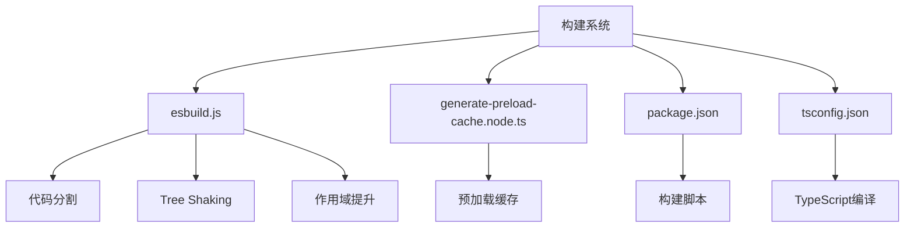
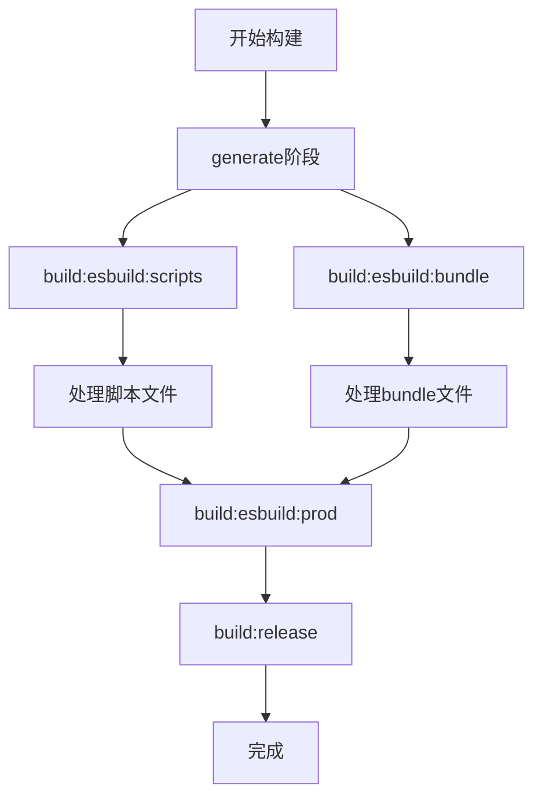
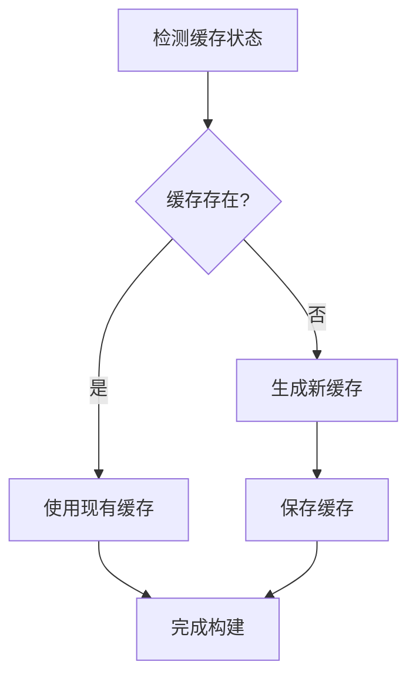

# 构建优化

<cite>
**本文档中引用的文件**  
- [esbuild.js](file://scripts/esbuild.js)
- [generate-preload-cache.node.ts](file://ts/scripts/generate-preload-cache.node.ts)
- [package.json](file://package.json)
- [tsconfig.json](file://tsconfig.json)
- [ci.js](file://ci.js)
</cite>

## 目录
1. [项目结构](#项目结构)
2. [核心构建优化技术](#核心构建优化技术)
3. [预加载缓存生成](#预加载缓存生成)
4. [资源优化措施](#资源优化措施)
5. [构建过程分析](#构建过程分析)
6. [性能问题解决方案](#性能问题解决方案)

## 项目结构

Signal-Desktop项目的构建系统主要由esbuild.js脚本驱动，该脚本位于scripts目录下。项目采用TypeScript作为主要开发语言，通过esbuild进行高效的构建和打包。构建系统包含多个关键组件：

- **scripts/esbuild.js**: 核心构建脚本，使用esbuild进行代码转换和打包
- **ts/scripts/generate-preload-cache.node.ts**: 预加载缓存生成脚本
- **package.json**: 包含各种构建相关的npm脚本命令
- **tsconfig.json**: TypeScript编译配置



**图表来源**
- [esbuild.js](file://scripts/esbuild.js)
- [generate-preload-cache.node.ts](file://ts/scripts/generate-preload-cache.node.ts)
- [package.json](file://package.json)
- [tsconfig.json](file://tsconfig.json)

**章节来源**
- [esbuild.js](file://scripts/esbuild.js)
- [package.json](file://package.json)

## 核心构建优化技术

Signal-Desktop的构建系统在esbuild.js中实现了多种性能优化技术，包括代码分割、懒加载、Tree Shaking和作用域提升。

### 代码分割与懒加载

esbuild.js通过配置实现了代码分割和懒加载功能。在沙箱化环境配置中，通过设置`splitting: true`和`format: 'esm'`来启用代码分割：

```javascript
const sandboxedBrowserDefaults = {
  ...sandboxedPreloadDefaults,
  chunkNames: 'chunks/[name]-[hash]',
  format: 'esm',
  outdir: path.join(ROOT_DIR, BUNDLES_DIR),
  platform: 'browser',
  splitting: true,
};
```

这种配置允许将代码分割成多个chunk，实现按需加载，减少初始加载时间。

### Tree Shaking

Tree Shaking通过在bundleDefaults配置中设置external依赖来实现，将不常变动或大型库标记为外部依赖：

```javascript
const bundleDefaults = {
  ...nodeDefaults,
  define: {
    'process.env.NODE_ENV': isProd ? '"production"' : '"development"',
  },
  bundle: true,
  minify: isProd,
  external: [
    // Native libraries
    '@signalapp/libsignal-client',
    '@signalapp/libsignal-client/zkgroup',
    '@signalapp/ringrtc',
    '@signalapp/sqlcipher',
    '@signalapp/mute-state-change',
    '@indutny/mac-screen-share',
    'electron',
    'fs-xattr',
    'fsevents',
    'mac-screen-capture-permissions',
    'sass',
    'bufferutil',
    'utf-8-validate',

    // Things that don't bundle well
    'got',
    'node-fetch',
    'pino',
    'proxy-agent',
    'websocket',

    // Large libraries (3.7mb total)
    'emoji-datasource',
    'fabric',
    'google-libphonenumber',
    'moment',
    'quill',

    // Imported, but not used in production builds
    'mocha',

    // Uses fast-glob and dynamic requires
    './preload_test.preload.js',
  ],
};
```

这种方法避免了将这些大型库打包到主bundle中，显著减小了bundle体积。

### 作用域提升

esbuild.js通过配置`keepNames: true`来保持函数和类的名称，这对于调试和性能分析非常重要：

```javascript
const nodeDefaults = {
  platform: 'node',
  target: 'es2023',
  // Disabled even in dev because the debugger is broken
  sourcemap: false,
  // Otherwise React components get renamed
  // See: https://github.com/evanw/esbuild/issues/1147
  keepNames: true,
  logLevel: 'info',
  plugins: [
    {
      name: 'resolve-ts',
      setup(b) {
        b.onResolve({ filter: /\.js$/ }, args => {
          if (!args.path.startsWith('.')) {
            return undefined;
          }

          const targetPath = path.join(args.resolveDir, args.path);
          if (targetPath.startsWith(NODE_MODULES_DIR)) {
            return undefined;
          }
          const tsPath = targetPath.replace(/\.js$/, '.ts');
          const tsxPath = targetPath.replace(/\.js$/, '.tsx');
          if (fs.existsSync(tsPath)) {
            return { path: tsPath };
          }
          if (fs.existsSync(tsxPath)) {
            return { path: tsxPath };
          }

          return undefined;
        });
      },
    },
  ],
};
```

**章节来源**
- [esbuild.js](file://scripts/esbuild.js)

## 预加载缓存生成

预加载缓存生成是Signal-Desktop构建过程中的一个重要优化步骤，通过generate-preload-cache.node.ts脚本实现。

### 缓存生成机制

`generate-preload-cache.node.ts`脚本通过启动Electron应用并运行特定的CI配置来生成预加载缓存：

```javascript
async function main(): Promise<void> {
  const storagePath = await mkdtemp(join(tmpdir(), 'signal-preload-cache-'));

  const argv = [`--js-flags=${V8_ARGS.join(' ')}`];
  if (process.platform === 'linux') {
    argv.push('--no-sandbox');
  }
  argv.push('ci.js');

  const proc = spawn(
    // When imported from Node.js - the default export of 'electron' is a path
    // to the Electron binary.
    ELECTRON_BIN as unknown as string,
    argv,
    {
      stdio: [null, 'inherit', 'inherit'],
      cwd: ROOT_DIR,
      env: {
        // Linux X11 support
        DISPLAY: process.env.DISPLAY,
        XDG_RUNTIME_DIR: process.env.XDG_RUNTIME_DIR,
        WAYLAND_DISPLAY: process.env.WAYLAND_DISPLAY,
        XAUTHORITY: process.env.XAUTHORITY,

        CI: process.env.CI ? 'on' : undefined,
        GENERATE_PRELOAD_CACHE: 'on',
        SIGNAL_CI_CONFIG: JSON.stringify({
          storagePath,
          openDevTools: false,
        }),
      },
    }
  );
```

### 缓存使用流程

预加载缓存的使用流程如下：
1. 设置`GENERATE_PRELOAD_CACHE`环境变量为'on'
2. 启动Electron应用并指定临时存储路径
3. 应用在启动过程中生成并保存缓存
4. 在后续构建中使用生成的缓存

`ci.js`文件中处理了缓存配置的合并：

```javascript
const CI_CONFIG = JSON.parse(process.env.SIGNAL_CI_CONFIG || '');

const config = require('./app/config.main.js').default;

config.util.extendDeep(config, CI_CONFIG);

require('./app/main.main.js');
```

这种方法显著加速了构建过程，特别是在CI/CD环境中。

**章节来源**
- [generate-preload-cache.node.ts](file://ts/scripts/generate-preload-cache.node.ts)
- [ci.js](file://ci.js)

## 资源优化措施

Signal-Desktop的构建过程包含多种资源优化措施，包括代码压缩、源码映射生成和资产哈希处理。

### 代码压缩

在生产构建中，通过`minify: isProd`配置启用代码压缩：

```javascript
const bundleDefaults = {
  ...nodeDefaults,
  define: {
    'process.env.NODE_ENV': isProd ? '"production"' : '"development"',
  },
  bundle: true,
  minify: isProd,
  external: [
    // ... external dependencies
  ],
};
```

当使用`--prod`或`--production`参数运行构建时，`isProd`变量为true，从而启用压缩。

### 源码映射

源码映射在开发环境中被禁用，以避免调试器问题：

```javascript
const nodeDefaults = {
  platform: 'node',
  target: 'es2023',
  // Disabled even in dev because the debugger is broken
  sourcemap: false,
  // Otherwise React components get renamed
  // See: https://github.com/evanw/esbuild/issues/1147
  keepNames: true,
  logLevel: 'info',
  // ... plugins
};
```

虽然源码映射被禁用，但通过保持名称(`keepNames: true`)来辅助调试。

### 资产哈希处理

在构建完成后，通过`artifact-build-completed.node.js`脚本更新文件的哈希值：

```javascript
console.log('Updating hash and size');
const sha512 = createHash('sha512');
await pipeline(createReadStream(file), sha512);
// eslint-disable-next-line no-param-reassign
updateInfo.sha512 = sha512.digest('base64');
const { size } = await stat(file);
// eslint-disable-next-line no-param-reassign
updateInfo.size = size;
```

这种方法确保了资产的完整性验证和缓存失效机制。

**章节来源**
- [esbuild.js](file://scripts/esbuild.js)
- [artifact-build-completed.node.js](file://ts/scripts/artifact-build-completed.node.js)

## 构建过程分析

Signal-Desktop的构建过程通过package.json中的脚本命令进行组织和管理。

### 构建脚本配置

package.json中定义了多个构建相关的脚本：

```json
"scripts": {
  "generate": "run-s generate:phase-0 generate:phase-1",
  "generate:phase-0": "run-p build:esbuild:scripts",
  "generate:phase-1": "run-p --aggregate-output --print-label generate:phase-1:bundle build:icu-types build:compact-locales build:styles get-expire-time copy-components build:policy-files",
  "generate:phase-1:bundle": "run-s build-protobuf build:esbuild:bundle",
  "build": "run-s --print-label generate build:esbuild:prod build:release",
  "build:esbuild": "node scripts/esbuild.js",
  "build:esbuild:scripts": "node scripts/esbuild.js --no-bundle",
  "build:esbuild:bundle": "node scripts/esbuild.js --no-scripts",
  "build:esbuild:prod": "node scripts/esbuild.js --prod",
  "build:preload-cache": "node ts/scripts/generate-preload-cache.node.js",
}
```

### 构建流程

构建流程分为多个阶段：
1. **generate阶段**: 执行代码生成和预处理
2. **build:esbuild阶段**: 使用esbuild进行代码转换
3. **build:esbuild:prod阶段**: 生产环境构建
4. **build:release阶段**: 发布构建

通过`--no-bundle`和`--no-scripts`参数，可以分别跳过bundle和scripts的构建，实现增量构建。



**图表来源**
- [package.json](file://package.json)
- [esbuild.js](file://scripts/esbuild.js)

**章节来源**
- [package.json](file://package.json)
- [esbuild.js](file://scripts/esbuild.js)

## 性能问题解决方案

Signal-Desktop的构建系统针对常见的性能问题提供了多种解决方案。

### 构建时间过长

通过以下措施解决构建时间过长的问题：
1. **代码分割**: 将代码分割成多个chunk，实现按需加载
2. **外部依赖**: 将大型库标记为外部依赖，避免重复打包
3. **增量构建**: 通过`--no-bundle`和`--no-scripts`参数实现部分构建

### 内存占用过高

通过以下措施控制内存占用：
1. **TypeScript编译缓存**: 利用tsconfig.json中的incremental配置
2. **分阶段构建**: 将构建过程分解为多个独立阶段
3. **临时文件清理**: 在构建完成后清理临时文件

### 缓存失效导致的重复构建

通过预加载缓存机制解决缓存失效问题：
1. **预生成缓存**: 使用`generate-preload-cache.node.ts`脚本预生成缓存
2. **环境变量控制**: 通过`GENERATE_PRELOAD_CACHE`环境变量控制缓存生成
3. **临时存储**: 使用临时目录存储缓存文件，避免污染主目录



**图表来源**
- [generate-preload-cache.node.ts](file://ts/scripts/generate-preload-cache.node.ts)

**章节来源**
- [esbuild.js](file://scripts/esbuild.js)
- [generate-preload-cache.node.ts](file://ts/scripts/generate-preload-cache.node.ts)