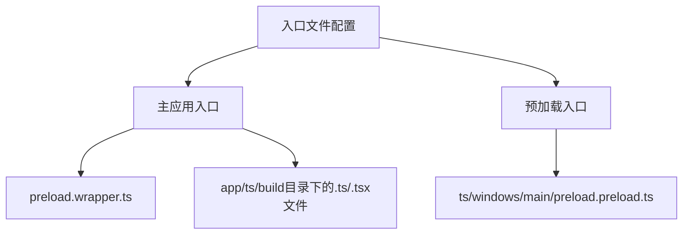
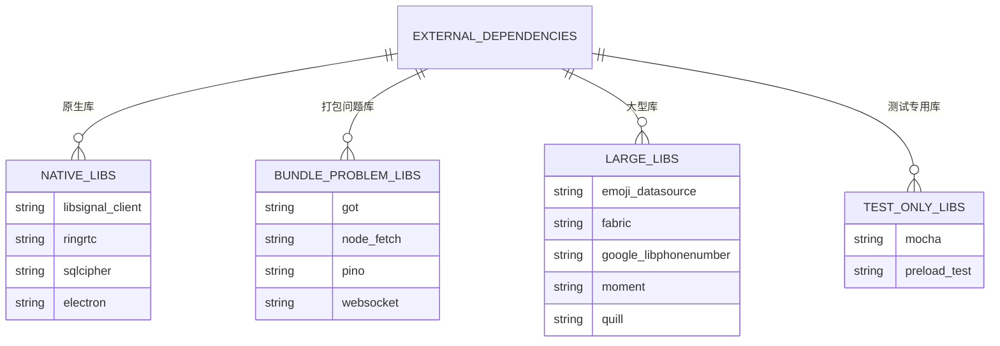
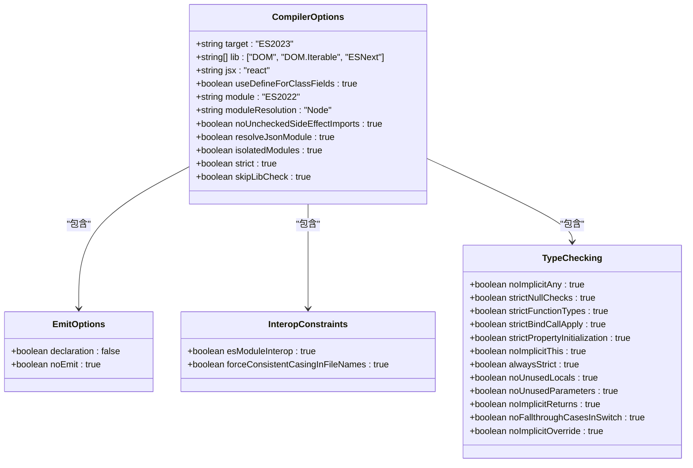
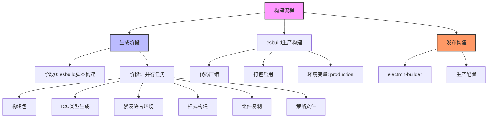
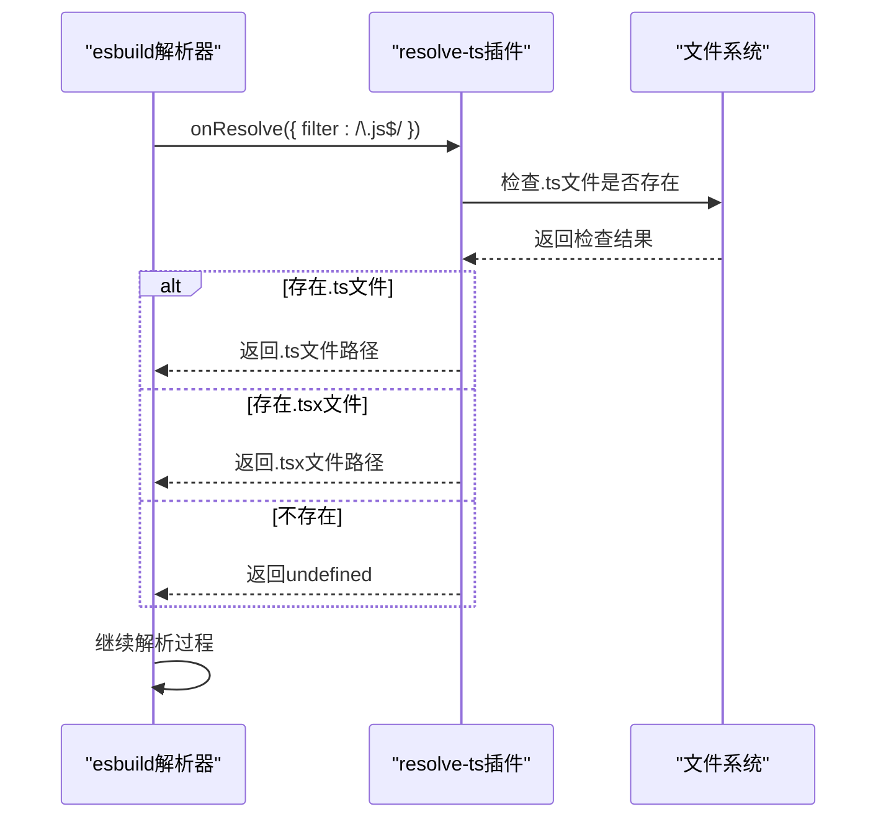

# 构建配置

<cite>
**本文档中引用的文件**  
- [esbuild.js](file://scripts/esbuild.js)
- [tsconfig.json](file://tsconfig.json)
- [package.json](file://package.json)
- [clean-transpile.js](file://scripts/clean-transpile.js)
- [prepare_alpha_build.js](file://scripts/prepare_alpha_build.js)
- [prepare_beta_build.js](file://scripts/prepare_beta_build.js)
- [config.main.ts](file://app/config.main.ts)
</cite>

## 目录
1. [构建配置概述](#构建配置概述)
2. [esbuild构建配置](#esbuild构建配置)
3. [TypeScript编译配置](#typescript编译配置)
4. [构建脚本与执行流程](#构建脚本与执行流程)
5. [构建插件与钩子](#构建插件与钩子)
6. [条件编译与环境变量](#条件编译与环境变量)
7. [常见配置问题](#常见配置问题)

## 构建配置概述

Signal-Desktop的构建配置体系基于esbuild构建工具，结合TypeScript编译器和npm脚本，形成了一个完整的构建流程。该体系支持开发模式和生产模式的构建，通过不同的配置选项来满足不同环境的需求。构建配置主要由三个核心文件组成：`esbuild.js`、`tsconfig.json`和`package.json`。

**Section sources**
- [esbuild.js](file://scripts/esbuild.js#L1-L233)
- [tsconfig.json](file://tsconfig.json#L1-L242)
- [package.json](file://package.json#L1-L714)

## esbuild构建配置

Signal-Desktop使用esbuild作为主要的构建工具，其配置文件`esbuild.js`定义了多种构建配置。核心配置包括入口文件设置、输出路径配置、平台目标指定和外部依赖排除策略。

### 入口文件设置

esbuild配置通过`entryPoints`选项定义了多个入口文件。主应用的入口文件包括`preload.wrapper.ts`以及`app`、`ts`和`build`目录下的所有TypeScript文件。预加载脚本的入口文件则位于`ts/windows/main/preload.preload.ts`。



**Diagram sources**
- [esbuild.js](file://scripts/esbuild.js#L153-L160)
- [esbuild.js](file://scripts/esbuild.js#L167-L168)

### 输出路径配置

构建输出路径通过`outdir`和`outfile`选项进行配置。主应用的输出目录为项目根目录，而预加载脚本的输出文件为`preload.bundle.js`。沙盒环境的输出目录为`bundles`。

### 平台目标指定

esbuild配置通过`platform`选项指定目标平台。主应用和预加载脚本的目标平台为`node`，而沙盒环境的目标平台为`browser`。目标JavaScript版本设置为`es2023`。

### 外部依赖排除策略

通过`external`数组配置了需要排除在构建包之外的依赖项。这些依赖项主要分为四类：原生库、难以打包的库、大型库和仅在测试中使用的库。



**Diagram sources**
- [esbuild.js](file://scripts/esbuild.js#L64-L98)

**Section sources**
- [esbuild.js](file://scripts/esbuild.js#L56-L100)

## TypeScript编译配置

`tsconfig.json`文件定义了TypeScript编译器的配置选项，这些选项与esbuild集成，共同完成代码的编译和类型检查。

### 模块解析配置

TypeScript配置使用`Node`模块解析策略，这是Node.js的标准模块解析方式。`moduleResolution`设置为`Node`，确保与Node.js的模块解析行为一致。

### 目标版本配置

编译目标版本设置为`ES2023`，这确保了生成的JavaScript代码可以利用最新的ECMAScript特性。同时，`lib`选项包含了`DOM`、`DOM.Iterable`和`ESNext`，为代码提供了必要的类型定义。

### 装饰器支持

虽然配置文件中注释掉了装饰器相关选项，但项目可能在其他地方启用了装饰器支持。`experimentalDecorators`和`emitDecoratorMetadata`选项被注释，表明装饰器支持可能在特定条件下启用。

### 路径映射配置

路径映射功能在配置文件中被注释，但`baseUrl`和`paths`选项的存在表明项目可能使用了路径映射来简化模块导入。



**Diagram sources**
- [tsconfig.json](file://tsconfig.json#L29-L228)

**Section sources**
- [tsconfig.json](file://tsconfig.json#L1-L242)

## 构建脚本与执行流程

`package.json`文件中的`scripts`部分定义了各种构建脚本，这些脚本构成了项目的构建执行流程。

### 开发模式构建

开发模式构建通过`dev`脚本启动，该脚本会并行执行类型检查、esbuild构建、样式构建等任务。`dev:esbuild`脚本使用`--watch`参数启动esbuild的监听模式。

### 生产模式构建

生产模式构建通过`build`脚本执行，该脚本按顺序执行生成、esbuild生产构建和发布构建。`build:esbuild:prod`脚本使用`--prod`参数启用生产模式构建。



**Diagram sources**
- [package.json](file://package.json#L21-L25)
- [package.json](file://package.json#L93-L97)

**Section sources**
- [package.json](file://package.json#L17-L114)

## 构建插件与钩子

esbuild配置中定义了自定义插件，用于处理特定的构建需求。

### TypeScript解析插件

`resolve-ts`插件用于在构建过程中解析TypeScript文件。当遇到`.js`扩展名的导入时，插件会检查是否存在对应的`.ts`或`.tsx`文件，并优先使用TypeScript文件。



**Diagram sources**
- [esbuild.js](file://scripts/esbuild.js#L27-L52)

### 构建钩子使用

构建过程中的钩子函数用于在特定阶段执行自定义逻辑。`build`函数中的`watch`模式和`rebuild`模式提供了不同的执行流程。

**Section sources**
- [esbuild.js](file://scripts/esbuild.js#L121-L143)

## 条件编译与环境变量

Signal-Desktop通过环境变量实现条件编译和多环境配置。

### 环境变量注入

构建过程中通过`define`选项将环境变量注入到代码中。`process.env.NODE_ENV`根据是否为生产模式构建而设置为`"production"`或`"development"`。

### 多平台构建兼容性

通过不同的准备脚本（如`prepare_alpha_build.js`和`prepare_beta_build.js`）来实现多平台构建兼容性。这些脚本会修改`package.json`中的配置，以支持alpha和beta版本的并行安装。

```mermaid
flowchart TD
Environment["环境变量处理"] --> NodeEnv["NODE_ENV"]
NodeEnv --> Development["development: 开发环境"]
NodeEnv --> Production["production: 生产环境"]
NodeEnv --> Test["test: 测试环境"]
Environment --> MockTest["MOCK_TEST"]
MockTest --> Boolean["布尔值: 是否为模拟测试环境"]
Environment --> SignalEnv["SIGNAL_ENV"]
SignalEnv --> Storybook["storybook: 故事书环境"]
SignalEnv --> ProductionEnv["production: 生产环境"]
Environment --> ReactDevtools["REACT_DEVTOOLS"]
ReactDevtools --> Enable["启用React开发工具"]
class NodeEnv,MockTest,SignalEnv,ReactDevtools style fill:#e6f3ff,stroke:#333,stroke-width:1px
```

**Diagram sources**
- [esbuild.js](file://scripts/esbuild.js#L58-L60)
- [config.main.ts](file://app/config.main.ts#L19-L46)

**Section sources**
- [esbuild.js](file://scripts/esbuild.js#L13-L16)
- [config.main.ts](file://app/config.main.ts#L1-L76)

## 常见配置问题

### 类型声明文件处理

由于`noEmit`设置为`true`，TypeScript编译器不会生成JavaScript文件，只进行类型检查。这要求esbuild负责最终的代码生成和打包。

### 环境变量注入

环境变量通过`define`选项注入，但需要注意在生产构建中正确设置`isProd`标志，以确保环境变量的正确值。

### 多平台构建兼容性

多平台构建通过准备脚本来实现，这些脚本会修改`package.json`中的关键字段，如应用名称、产品名称和应用ID，以支持不同版本的并行安装。

**Section sources**
- [clean-transpile.js](file://scripts/clean-transpile.js#L1-L38)
- [prepare_alpha_build.js](file://scripts/prepare_alpha_build.js#L1-L82)
- [prepare_beta_build.js](file://scripts/prepare_beta_build.js#L1-L81)