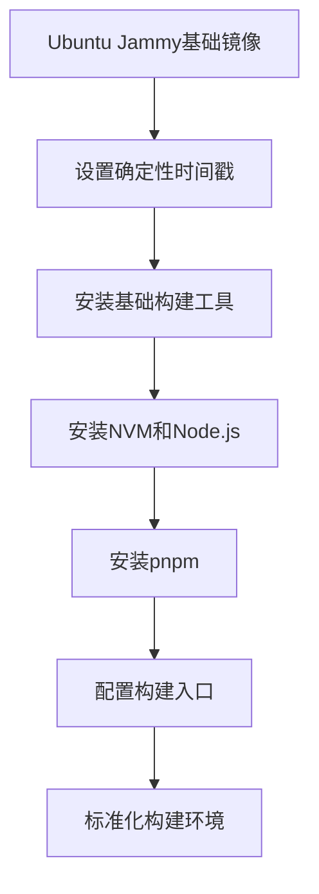
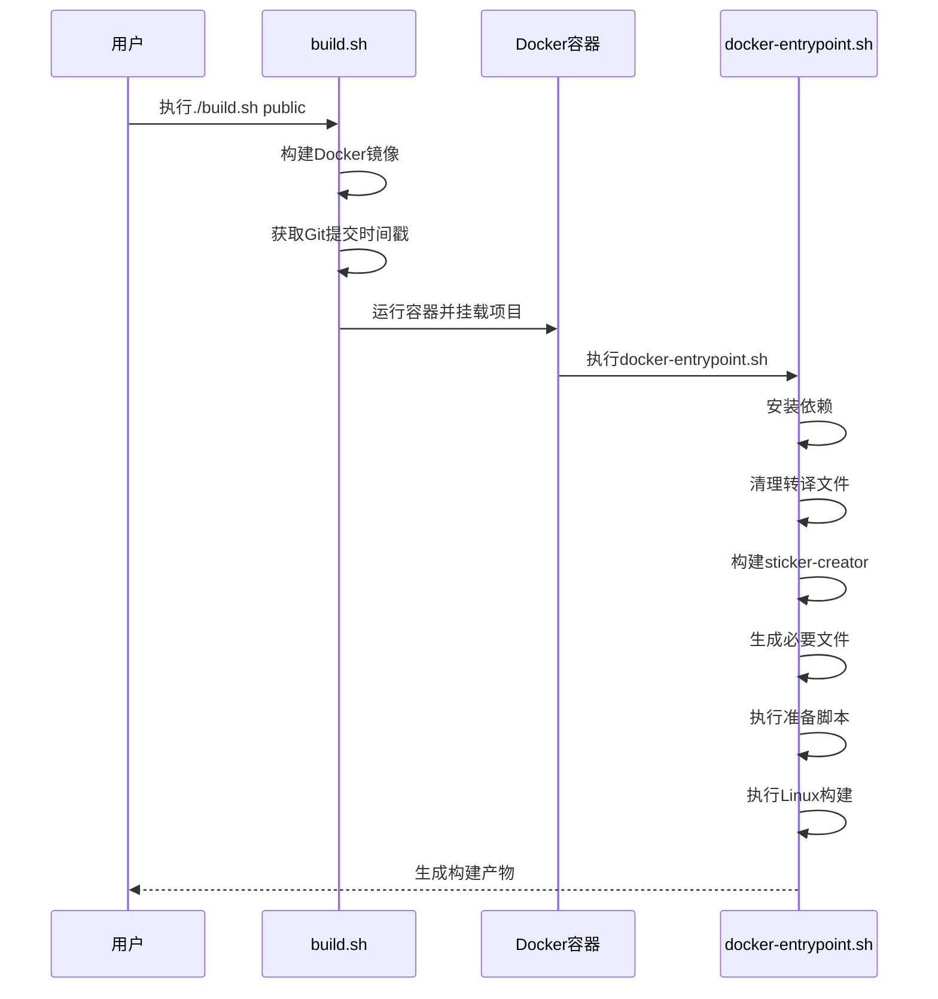
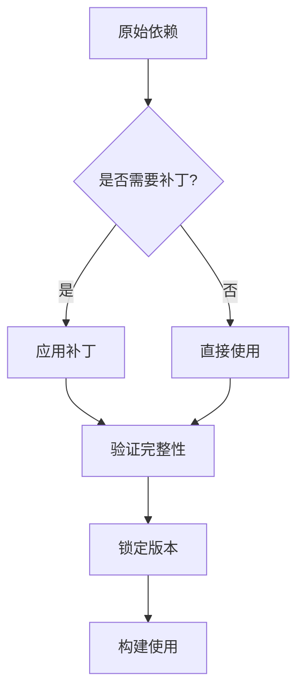
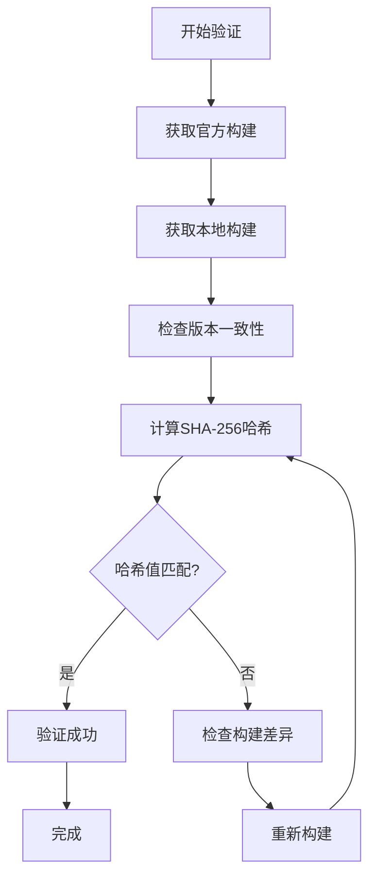

# 可重复构建

<cite>
**本文档中引用的文件**  
- [Dockerfile](file://reproducible-builds/Dockerfile)
- [docker-entrypoint.sh](file://reproducible-builds/docker-entrypoint.sh)
- [build.sh](file://reproducible-builds/build.sh)
- [README.md](file://reproducible-builds/README.md)
- [package.json](file://package.json)
- [app-builder-lib.patch](file://patches/app-builder-lib.patch)
- [prepare_alpha_build.js](file://scripts/prepare_alpha_build.js)
- [prepare_beta_build.js](file://scripts/prepare_beta_build.js)
- [prepare_linux_build.js](file://scripts/prepare_linux_build.js)
- [pnpmLockDepsShouldHaveIntegrity.ts](file://danger/rules/pnpmLockDepsShouldHaveIntegrity.ts)
- [packageJsonVersionsShouldBePinned.ts](file://danger/rules/packageJsonVersionsShouldBePinned.ts)
</cite>

## 目录
1. [引言](#引言)
2. [可重复构建概述](#可重复构建概述)
3. [Docker构建环境](#docker构建环境)
4. [构建流程编排](#构建流程编排)
5. [补丁管理系统](#补丁管理系统)
6. [构建产物验证](#构建产物验证)
7. [常见问题与解决方案](#常见问题与解决方案)
8. [结论](#结论)

## 引言
Signal-Desktop的可重复构建系统旨在确保任何开发者都能构建出与官方发布版本完全一致的应用程序。这一系统通过容器化技术、精确的依赖管理和严格的验证流程，消除了构建环境差异带来的不确定性，为应用程序的安全性和可信度提供了重要保障。

## 可重复构建概述
可重复构建是指在不同时间和环境下，使用相同的源代码和构建参数，能够产生完全相同的二进制输出。Signal-Desktop通过一系列技术手段实现了Linux平台上的可重复构建，确保了构建结果的一致性和可验证性。

**Section sources**
- [README.md](file://reproducible-builds/README.md#L4-L115)

## Docker构建环境
Signal-Desktop使用Docker容器来创建标准化的构建环境，确保所有开发者在相同的环境中进行构建。

### 基础镜像与环境变量
构建环境基于Ubuntu Jammy镜像，并设置了关键的环境变量：
- `SOURCE_DATE_EPOCH=1`：确保构建时间戳的确定性，避免因时间差异导致的构建不一致
- `SIGNAL_ENV=production`：设置生产环境变量
- `NODE_VERSION`：通过构建参数指定Node.js版本

### 依赖安装
Dockerfile中定义了详细的依赖安装流程：
1. 配置APT源和证书
2. 安装基础构建工具（git、curl、g++、gcc、make、python3等）
3. 安装NVM（Node Version Manager）并指定版本
4. 安装pnpm包管理器并指定版本

### 环境标准化
通过固定所有依赖的版本，构建环境实现了完全的可重现性。所有工具和库的版本都被精确指定，避免了因依赖版本差异导致的构建结果不同。



**Diagram sources**
- [Dockerfile](file://reproducible-builds/Dockerfile#L1-L71)

**Section sources**
- [Dockerfile](file://reproducible-builds/Dockerfile#L1-L71)

## 构建流程编排
构建流程通过`docker-entrypoint.sh`脚本进行编排，确保构建步骤的一致性和可预测性。

### 构建类型处理
脚本支持多种构建类型，每种类型对应不同的构建配置：
- `dev`：开发构建，使用package.json中的版本
- `public`：公开发布构建
- `alpha`：Alpha版本构建
- `test`：测试构建
- `staging`：预发布构建

### 构建流程
构建流程按照严格的顺序执行：
1. 安装依赖：`pnpm install --frozen-lockfile`
2. 清理转译文件：`pnpm run clean-transpile`
3. 构建sticker-creator组件
4. 生成必要文件：`pnpm run generate`
5. 根据构建类型执行相应的准备脚本
6. 执行Linux构建：`pnpm run build-linux`

### 构建脚本协调
`build.sh`脚本作为外部入口，协调Docker容器的构建和运行：
- 构建Docker镜像
- 设置构建时间戳（基于最新Git提交）
- 运行容器并挂载项目目录
- 传递必要的环境变量



**Diagram sources**
- [docker-entrypoint.sh](file://reproducible-builds/docker-entrypoint.sh#L1-L74)
- [build.sh](file://reproducible-builds/build.sh#L1-L58)

**Section sources**
- [docker-entrypoint.sh](file://reproducible-builds/docker-entrypoint.sh#L1-L74)
- [build.sh](file://reproducible-builds/build.sh#L1-L58)

## 补丁管理系统
Signal-Desktop使用补丁管理系统来确保依赖包的精确控制和完整性验证。

### 补丁机制
通过pnpm的`patchedDependencies`功能，在`package.json`中定义了多个补丁：
```json
"pnpm": {
  "patchedDependencies": {
    "casual@1.6.2": "patches/casual+1.6.2.patch",
    "protobufjs@7.3.2": "patches/protobufjs+7.3.2.patch",
    "app-builder-lib": "patches/app-builder-lib.patch"
  }
}
```

### 补丁示例
以`app-builder-lib.patch`为例，该补丁修改了asar打包的排序逻辑，将可能每构建都变化的文件（如.node文件、preload.bundle.js等）放在最后，确保主要代码部分的哈希值稳定。

### 依赖版本锁定
系统通过多种机制确保依赖版本的精确控制：
- 所有依赖版本在`package.json`中明确指定
- 使用`--frozen-lockfile`确保依赖树的一致性
- Danger规则检查确保所有版本都被精确锁定



**Diagram sources**
- [package.json](file://package.json#L383-L402)
- [app-builder-lib.patch](file://patches/app-builder-lib.patch#L1-L158)

**Section sources**
- [package.json](file://package.json#L383-L402)
- [app-builder-lib.patch](file://patches/app-builder-lib.patch#L1-L158)

## 构建产物验证
Signal-Desktop提供了完整的构建产物验证机制，确保构建结果的正确性。

### 哈希校验
通过SHA-256哈希值验证构建产物的一致性：
1. 构建自己的版本
2. 下载官方发布的版本
3. 使用`sha256sum`计算两个文件的哈希值
4. 比较哈希值是否完全相同

### 验证流程
验证流程包括以下步骤：
1. 确保构建的版本与官方版本一致
2. 使用相同的构建类型（如public）
3. 计算构建产物的哈希值
4. 与官方版本的哈希值进行比较

### 自动化验证
Danger规则提供了自动化的依赖完整性检查：
- `pnpmLockDepsShouldHaveIntegrity`：确保所有依赖都有完整性校验
- `packageJsonVersionsShouldBePinned`：确保所有版本都被精确锁定



**Diagram sources**
- [README.md](file://reproducible-builds/README.md#L92-L107)
- [pnpmLockDepsShouldHaveIntegrity.ts](file://danger/rules/pnpmLockDepsShouldHaveIntegrity.ts#L1-L64)

**Section sources**
- [README.md](file://reproducible-builds/README.md#L92-L107)
- [pnpmLockDepsShouldHaveIntegrity.ts](file://danger/rules/pnpmLockDepsShouldHaveIntegrity.ts#L1-L64)

## 常见问题与解决方案
在可重复构建过程中可能会遇到一些常见问题，以下是解决方案。

### 容器镜像更新
当基础镜像更新时，可能导致构建结果不一致。解决方案：
- 固定基础镜像的SHA256摘要
- 在Dockerfile中使用具体的镜像标签
- 定期验证构建结果的一致性

### 网络依赖不确定性
网络依赖可能导致构建过程中的不确定性。解决方案：
- 使用`--frozen-lockfile`确保依赖树固定
- 在Dockerfile中预先下载必要的依赖
- 使用本地镜像或缓存

### 时间戳差异
系统时间戳可能导致构建结果不同。解决方案：
- 设置`SOURCE_DATE_EPOCH`环境变量
- 使用Git提交时间作为构建时间戳
- 在构建脚本中统一处理时间相关逻辑

### 文件权限问题
容器内外的文件权限差异可能导致问题。解决方案：
- 在Dockerfile中设置适当的目录权限
- 使用`--user`参数指定容器用户
- 在构建脚本中处理权限相关操作

**Section sources**
- [Dockerfile](file://reproducible-builds/Dockerfile#L8-L9)
- [build.sh](file://reproducible-builds/build.sh#L28-L43)
- [docker-entrypoint.sh](file://reproducible-builds/docker-entrypoint.sh#L32-L35)

## 结论
Signal-Desktop的可重复构建系统通过容器化、精确依赖管理和严格验证流程，实现了构建结果的一致性和可验证性。这一系统不仅提高了构建过程的可靠性，也为用户提供了验证官方发布版本真实性的能力，增强了应用程序的安全性和可信度。