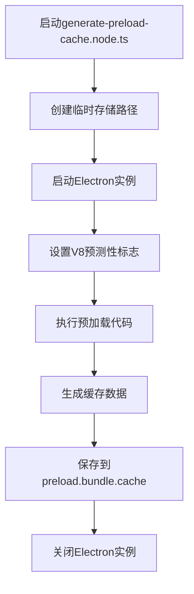
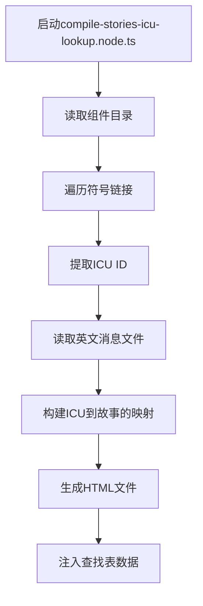
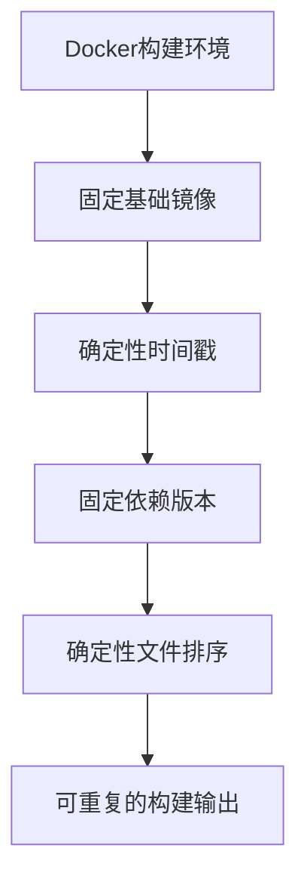
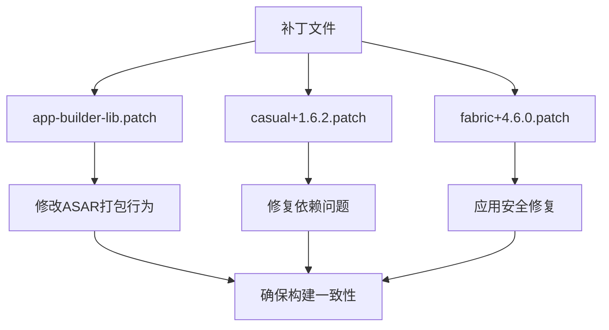
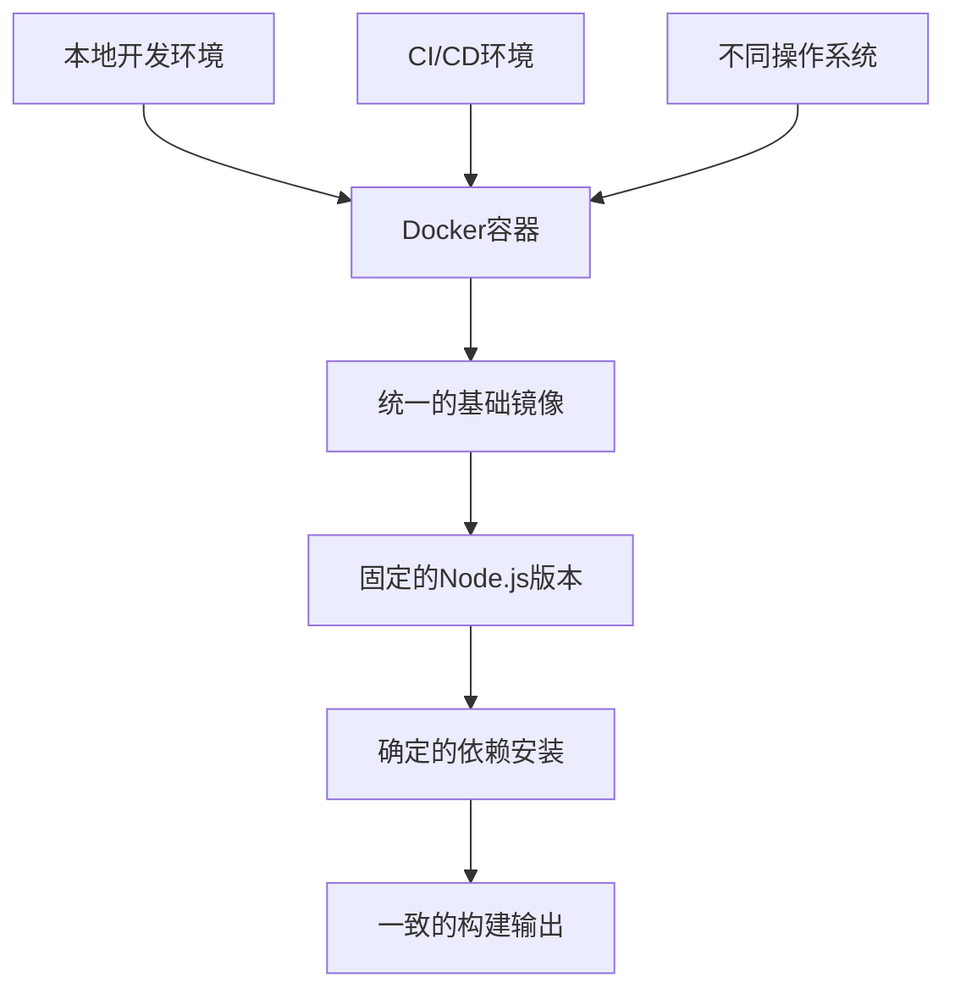
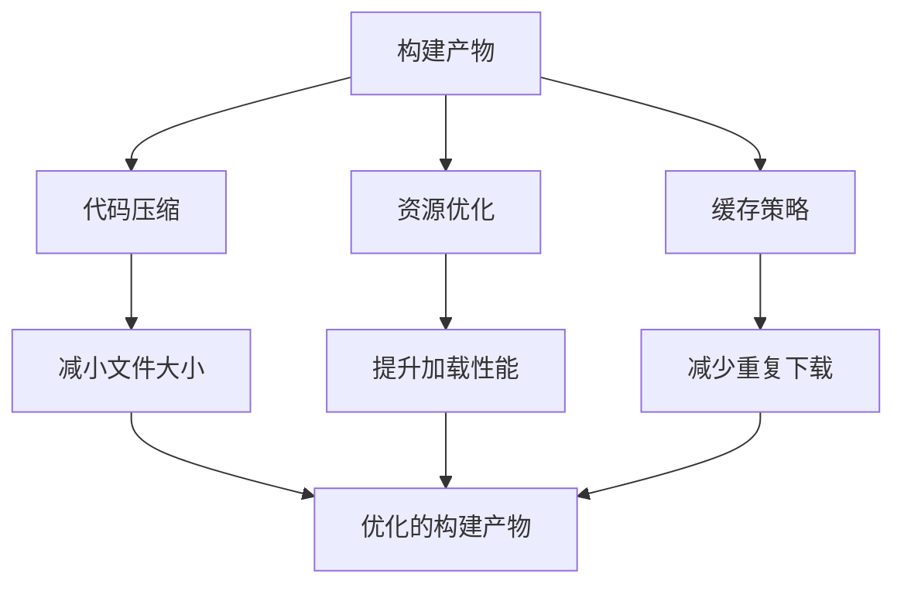

# 构建优化

<cite>
**本文档中引用的文件**  
- [generate-preload-cache.node.ts](file://ts/scripts/generate-preload-cache.node.ts)
- [compile-stories-icu-lookup.node.ts](file://ts/scripts/compile-stories-icu-lookup.node.ts)
- [Dockerfile](file://reproducible-builds/Dockerfile)
- [build.sh](file://reproducible-builds/build.sh)
- [docker-entrypoint.sh](file://reproducible-builds/docker-entrypoint.sh)
- [preload.wrapper.ts](file://preload.wrapper.ts)
- [package.json](file://package.json)
- [app-builder-lib.patch](file://patches/app-builder-lib.patch)
</cite>

## 目录
1. [简介](#简介)
2. [预加载缓存生成](#预加载缓存生成)
3. [ICU查找表编译](#icu查找表编译)
4. [可重复构建配置](#可重复构建配置)
5. [补丁管理系统](#补丁管理系统)
6. [Docker容器构建一致性](#docker容器构建一致性)
7. [构建产物优化](#构建产物优化)
8. [常见问题与解决方案](#常见问题与解决方案)

## 简介
Signal-Desktop的构建系统通过一系列优化策略来提升构建性能和一致性。本文档详细说明了如何通过预加载缓存生成、ICU查找表编译、可重复构建配置、补丁管理系统和Docker容器来实现这些目标。这些优化措施不仅提高了构建速度，还确保了跨平台构建的一致性。

## 预加载缓存生成
Signal-Desktop通过预加载缓存生成机制显著提升了应用的启动性能。该机制的核心是`generate-preload-cache.node.ts`脚本，它在CI环境中预先生成V8引擎的代码缓存。

**Diagram sources**  
- [generate-preload-cache.node.ts](file://ts/scripts/generate-preload-cache.node.ts#L1-L91)
- [preload.wrapper.ts](file://preload.wrapper.ts#L1-L82)

**Section sources**
- [generate-preload-cache.node.ts](file://ts/scripts/generate-preload-cache.node.ts#L1-L91)
- [preload.wrapper.ts](file://preload.wrapper.ts#L1-L82)

## ICU查找表编译
国际化（i18n）是Signal-Desktop的重要组成部分，通过ICU查找表编译优化了多语言资源的处理效率。`compile-stories-icu-lookup.node.ts`脚本负责生成ICU消息格式的查找表。

**Diagram sources**  
- [compile-stories-icu-lookup.node.ts](file://ts/scripts/compile-stories-icu-lookup.node.ts#L1-L71)

**Section sources**
- [compile-stories-icu-lookup.node.ts](file://ts/scripts/compile-stories-icu-lookup.node.ts#L1-L71)

## 可重复构建配置
Signal-Desktop通过严格的可重复构建配置确保每次构建的二进制文件完全一致。这主要通过`reproducible-builds`目录中的Docker配置实现。

**Diagram sources**  
- [Dockerfile](file://reproducible-builds/Dockerfile#L1-L71)
- [build.sh](file://reproducible-builds/build.sh#L1-L58)
- [docker-entrypoint.sh](file://reproducible-builds/docker-entrypoint.sh#L1-L74)

**Section sources**
- [Dockerfile](file://reproducible-builds/Dockerfile#L1-L71)
- [build.sh](file://reproducible-builds/build.sh#L1-L58)
- [docker-entrypoint.sh](file://reproducible-builds/docker-entrypoint.sh#L1-L74)

## 补丁管理系统
Signal-Desktop使用补丁管理系统来修改第三方依赖的行为，确保构建过程的稳定性和安全性。补丁文件存储在`patches`目录中，通过`pnpm`的`patchedDependencies`配置应用。

**Diagram sources**  
- [app-builder-lib.patch](file://patches/app-builder-lib.patch#L1-L158)
- [package.json](file://package.json#L383-L402)

**Section sources**
- [app-builder-lib.patch](file://patches/app-builder-lib.patch#L1-L158)
- [package.json](file://package.json#L383-L402)

## Docker容器构建一致性
通过Docker容器化构建环境，Signal-Desktop确保了跨平台构建的一致性。构建过程在隔离的容器中进行，避免了开发环境差异带来的问题。

**Diagram sources**  
- [Dockerfile](file://reproducible-builds/Dockerfile#L1-L71)
- [build.sh](file://reproducible-builds/build.sh#L1-L58)

**Section sources**
- [Dockerfile](file://reproducible-builds/Dockerfile#L1-L71)
- [build.sh](file://reproducible-builds/build.sh#L1-L58)

## 构建产物优化
Signal-Desktop通过多种方式优化构建产物的大小和性能，包括代码压缩、资源优化和缓存策略。

**Diagram sources**  
- [package.json](file://package.json#L104)
- [artifact-build-completed.node.ts](file://ts/scripts/artifact-build-completed.node.ts#L42-L67)

**Section sources**
- [package.json](file://package.json#L104)
- [artifact-build-completed.node.ts](file://ts/scripts/artifact-build-completed.node.ts#L42-L67)

## 常见问题与解决方案
在构建优化过程中可能会遇到一些常见问题，以下是这些问题的解决方案。

### 缓存失效
当预加载缓存失效时，会导致应用启动性能下降。解决方案包括：

- 确保`preload.bundle.js`文件未发生变化
- 检查V8引擎版本兼容性
- 验证缓存文件权限

### 补丁应用失败
补丁应用失败可能导致构建过程中断。解决方案包括：

- 验证补丁文件完整性
- 检查依赖版本匹配
- 确保`patch-package`工具正确安装

### 跨平台构建不一致
跨平台构建不一致问题可能由环境差异引起。解决方案包括：

- 严格使用Docker容器构建
- 固定所有依赖版本
- 确保时间戳的确定性

**Section sources**
- [check-upgradeable-deps.node.ts](file://ts/scripts/check-upgradeable-deps.node.ts#L210-L260)
- [prepare_linux_build.js](file://scripts/prepare_linux_build.js#L1-L31)