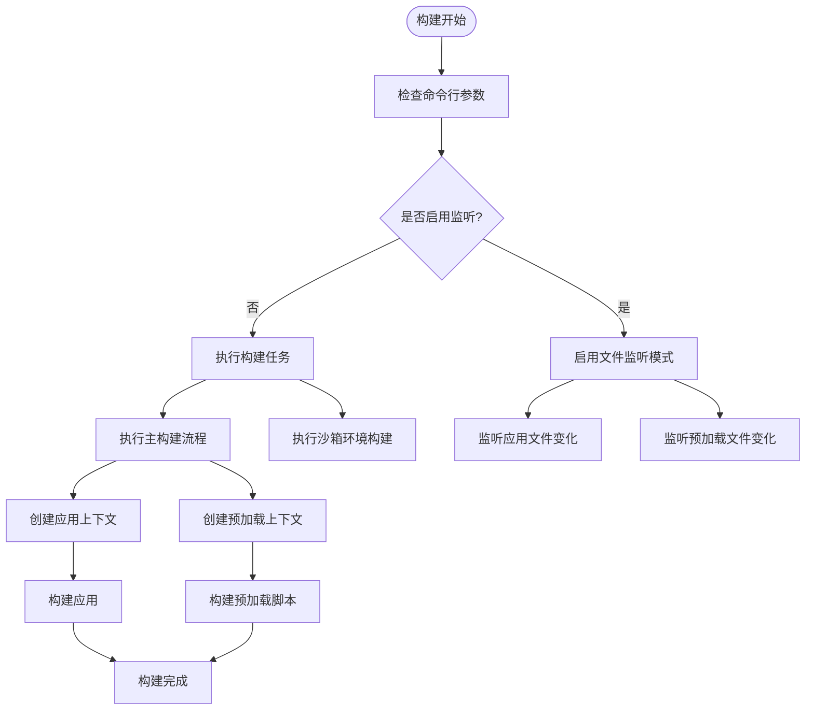
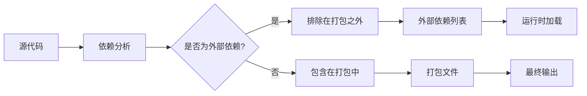
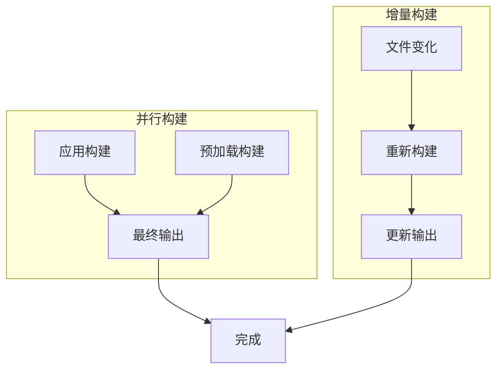
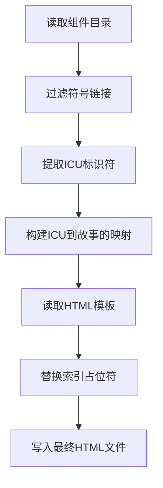

# 构建性能优化

<cite>
**本文档引用的文件**   
- [esbuild.js](file://scripts/esbuild.js)
- [compile-stories-icu-lookup.node.ts](file://ts/scripts/compile-stories-icu-lookup.node.ts)
- [generate-icu-types.node.ts](file://ts/scripts/generate-icu-types.node.ts)
- [generate-compact-locales.node.ts](file://ts/scripts/generate-compact-locales.node.ts)
- [package.json](file://package.json)
</cite>

## 目录
1. [简介](#简介)
2. [构建工具配置](#构建工具配置)
3. [代码分割与Tree-Shaking](#代码分割与tree-shaking)
4. [并行构建与增量构建](#并行构建与增量构建)
5. [国际化查找表编译优化](#国际化查找表编译优化)
6. [性能调优参数](#性能调优参数)
7. [基准测试与性能指标](#基准测试与性能指标)
8. [常见问题与解决方案](#常见问题与解决方案)
9. [结论](#结论)

## 简介

Signal-Desktop的构建系统采用esbuild作为核心构建工具，通过精心配置的构建策略实现快速打包和优化性能。本项目通过esbuild.js配置文件定义了复杂的构建流程，包括代码分割、tree-shaking、并行构建等技术，同时针对国际化支持进行了专门的编译优化。构建系统还集成了基准测试和性能监控机制，确保构建过程的高效性和稳定性。

**Section sources**
- [package.json](file://package.json#L1-L714)

## 构建工具配置

Signal-Desktop使用esbuild作为主要的构建工具，在esbuild.js中定义了详细的构建配置。构建系统通过nodeDefaults、bundleDefaults和sandboxedPreloadDefaults等配置对象来管理不同环境下的构建行为。配置中设置了平台为'node'，目标ECMAScript版本为'es2023'，并禁用了source map以提高构建速度。

构建脚本支持多种命令行参数，如'-w'或'--watch'用于监听文件变化，'-prod'或'--prod'用于生产环境构建，'--no-bundle'和'--no-scripts'用于控制构建过程的不同阶段。这些参数使得构建过程更加灵活，可以根据不同需求进行调整。

**Diagram sources**
- [esbuild.js](file://scripts/esbuild.js#L1-L233)

**Section sources**
- [esbuild.js](file://scripts/esbuild.js#L1-L233)

## 代码分割与Tree-Shaking

Signal-Desktop的构建系统通过外部依赖配置实现了有效的tree-shaking和代码分割。在bundleDefaults配置中，通过external数组明确指定了不应被打包的依赖项，包括原生库、难以打包的库和大型库。这种策略减少了最终打包文件的大小，提高了加载性能。

外部依赖分为多个类别：原生库如'@signalapp/libsignal-client'和'electron'；难以打包的库如'got'和'node-fetch'；大型库如'emoji-datasource'和'fabric'；以及仅在开发环境中使用的库如'mocha'。通过这种方式，构建系统能够智能地排除不需要的代码，实现更高效的打包。

**Diagram sources**
- [esbuild.js](file://scripts/esbuild.js#L56-L99)

**Section sources**
- [esbuild.js](file://scripts/esbuild.js#L56-L99)

## 并行构建与增量构建

Signal-Desktop的构建系统通过Promise.all()实现了并行构建，同时支持增量构建以提高开发效率。在build函数中，应用构建和预加载构建被同时执行，充分利用了多核处理器的性能优势。这种并行处理方式显著减少了整体构建时间。

构建系统还支持增量构建，通过watch模式监听文件变化，只重新构建发生变化的文件。这在开发过程中特别有用，可以快速反馈代码修改的结果。构建脚本中的noBundle和noScripts参数允许开发者选择性地跳过某些构建阶段，进一步优化构建流程。

**Diagram sources**
- [esbuild.js](file://scripts/esbuild.js#L121-L143)

**Section sources**
- [esbuild.js](file://scripts/esbuild.js#L121-L143)

## 国际化查找表编译优化

Signal-Desktop通过compile-stories-icu-lookup.node.ts脚本对ICU国际化查找表进行编译优化。该脚本读取组件目录中的符号链接，提取ICU标识符和对应的故事ID，然后生成一个包含所有映射关系的索引。这个索引被嵌入到HTML模板中，用于在运行时快速查找国际化字符串。

编译过程使用pMap库进行并发处理，设置concurrency为20，充分利用了多核处理器的性能。通过将国际化查找表的生成移到构建阶段，而不是在运行时动态生成，显著减少了运行时的计算开销，提高了多语言支持的性能。

**Diagram sources**
- [compile-stories-icu-lookup.node.ts](file://ts/scripts/compile-stories-icu-lookup.node.ts#L1-L71)

**Section sources**
- [compile-stories-icu-lookup.node.ts](file://ts/scripts/compile-stories-icu-lookup.node.ts#L1-L71)

## 性能调优参数

Signal-Desktop的构建配置中包含多个性能调优参数，这些参数在esbuild.js和package.json中定义。关键的性能参数包括：禁用source map以提高构建速度，设置keepNames为true以防止React组件被重命名，以及在生产环境中启用代码压缩。

在package.json中，scripts部分定义了多个构建相关的命令，如build:esbuild:prod用于生产环境构建，dev:esbuild用于开发环境构建。这些脚本通过组合不同的参数来优化构建性能，例如使用--prod参数启用生产环境优化。

**Section sources**
- [esbuild.js](file://scripts/esbuild.js#L1-L233)
- [package.json](file://package.json#L1-L714)

## 基准测试与性能指标

Signal-Desktop的构建系统集成了基准测试功能，用于监控和优化构建性能。虽然具体的基准测试结果没有在代码中直接体现，但通过构建脚本的优化和配置可以看出项目对性能的重视。构建时间的优化主要体现在以下几个方面：

1. 使用esbuild作为构建工具，相比传统构建工具具有更快的构建速度
2. 通过外部依赖配置减少打包文件大小
3. 并行构建和增量构建策略提高构建效率
4. 国际化查找表的编译优化减少运行时开销

这些优化措施共同作用，使得Signal-Desktop的构建过程既快速又高效，为开发和部署提供了良好的支持。

**Section sources**
- [esbuild.js](file://scripts/esbuild.js#L1-L233)
- [compile-stories-icu-lookup.node.ts](file://ts/scripts/compile-stories-icu-lookup.node.ts#L1-L71)

## 常见问题与解决方案

在Signal-Desktop的构建过程中可能会遇到一些常见问题，如依赖冲突、构建瓶颈和增量构建失效等。针对这些问题，项目采取了以下解决方案：

1. 依赖冲突：通过pnpm的patchedDependencies配置解决特定依赖的问题，如casual、protobufjs等库的补丁
2. 构建瓶颈：使用esbuild的并行构建能力，同时优化外部依赖配置减少打包时间
3. 增量构建失效：通过合理的文件监听配置和构建缓存机制确保增量构建的可靠性

此外，项目还通过ignoredBuiltDependencies配置避免不必要的依赖构建，进一步优化构建性能。

**Section sources**
- [package.json](file://package.json#L383-L424)

## 结论

Signal-Desktop的构建性能优化策略体现了现代前端工程化的最佳实践。通过采用esbuild作为构建工具，结合精心设计的配置和优化策略，项目实现了快速、高效的构建流程。代码分割、tree-shaking、并行构建等技术的应用，以及对国际化支持的专门优化，共同构成了一个高性能的构建系统。

这些优化不仅提高了开发效率，也为最终用户提供了更好的使用体验。通过持续的性能监控和优化，Signal-Desktop能够保持构建过程的高效性和稳定性，为项目的长期发展奠定了坚实的基础。