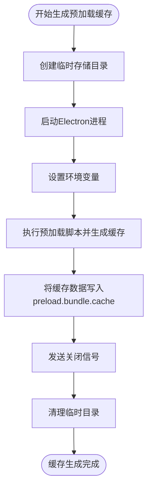
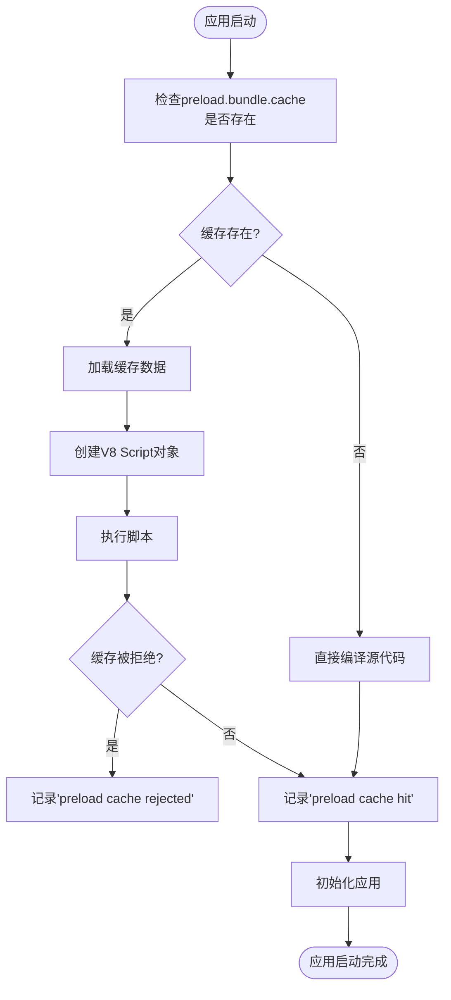
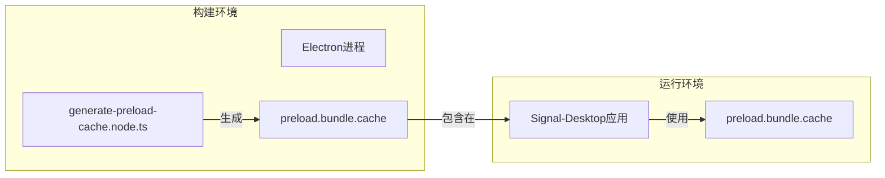
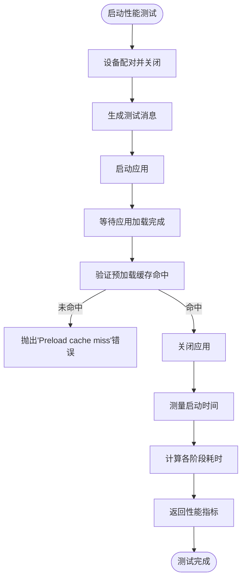
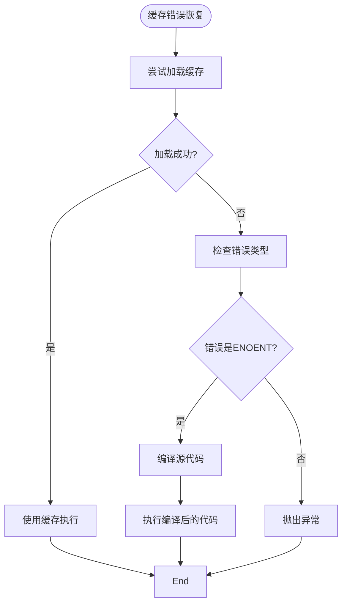
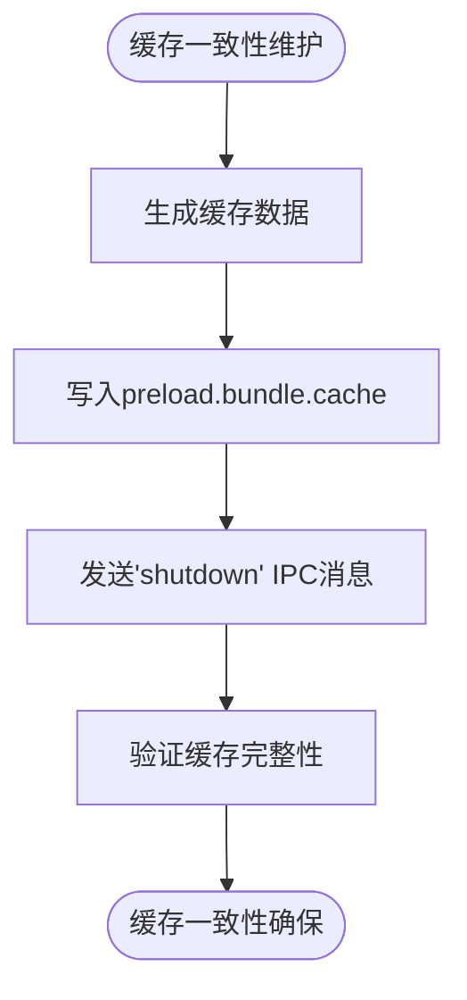

# 构建缓存管理

<cite>
**本文档引用的文件**   
- [generate-preload-cache.node.ts](file://ts/scripts/generate-preload-cache.node.ts)
- [preload.wrapper.ts](file://preload.wrapper.ts)
- [CI.preload.ts](file://ts/CI.preload.ts)
- [startup_bench.node.ts](file://ts/test-mock/benchmarks/startup_bench.node.ts)
- [messageStateCleanup.preload.ts](file://ts/services/messageStateCleanup.preload.ts)
- [backups/credentials.preload.ts](file://ts/services/backups/credentials.preload.ts)
</cite>

## 目录
1. [简介](#简介)
2. [预加载缓存生成机制](#预加载缓存生成机制)
3. [缓存失效与版本控制](#缓存失效与版本控制)
4. [跨构建持久化机制](#跨构建持久化机制)
5. [性能影响与测量数据](#性能影响与测量数据)
6. [缓存配置最佳实践](#缓存配置最佳实践)
7. [常见问题与解决方案](#常见问题与解决方案)
8. [结论](#结论)

## 简介
Signal-Desktop应用采用先进的构建缓存管理策略，通过预计算和缓存频繁访问的资源来显著减少运行时开销。该策略的核心是`generate-preload-cache.node.ts`文件中实现的预加载缓存生成机制，它利用V8引擎的代码缓存功能来加速应用启动过程。本文档全面阐述了Signal-Desktop的构建缓存管理策略，包括缓存生成、失效、版本控制和持久化机制，以及对应用性能的实际影响和最佳实践。

**Section sources**
- [generate-preload-cache.node.ts](file://ts/scripts/generate-preload-cache.node.ts#L1-L91)
- [preload.wrapper.ts](file://preload.wrapper.ts#L1-L83)

## 预加载缓存生成机制
Signal-Desktop的预加载缓存生成机制通过在构建时预计算和缓存JavaScript代码的V8引擎字节码来减少运行时编译开销。该机制由`generate-preload-cache.node.ts`文件实现，它启动一个Electron进程来执行预加载脚本，并捕获V8引擎生成的优化代码缓存。

**Diagram sources **
- [generate-preload-cache.node.ts](file://ts/scripts/generate-preload-cache.node.ts#L14-L84)

**Section sources**
- [generate-preload-cache.node.ts](file://ts/scripts/generate-preload-cache.node.ts#L1-L91)
- [preload.wrapper.ts](file://preload.wrapper.ts#L1-L83)

## 缓存失效与版本控制
Signal-Desktop的缓存失效策略基于V8引擎的内部版本控制机制和代码完整性检查。当V8引擎版本发生变化或代码被修改时，缓存会自动失效并重新生成。`preload.wrapper.ts`文件中的代码负责检查缓存的有效性，并在缓存被拒绝时记录相关信息。

**Diagram sources **
- [preload.wrapper.ts](file://preload.wrapper.ts#L12-L82)

**Section sources**
- [preload.wrapper.ts](file://preload.wrapper.ts#L1-L83)
- [CI.preload.ts](file://ts/CI.preload.ts#L132-L134)

## 跨构建持久化机制
Signal-Desktop的跨构建持久化机制通过将生成的缓存文件包含在应用包中来实现。`generate-preload-cache.node.ts`脚本在CI/CD流程中执行，生成的`preload.bundle.cache`文件被持久化并随应用分发。这种机制确保了用户在安装应用后能够立即享受优化的启动性能。

**Diagram sources **
- [generate-preload-cache.node.ts](file://ts/scripts/generate-preload-cache.node.ts#L69-L70)
- [preload.wrapper.ts](file://preload.wrapper.ts#L10-L11)

**Section sources**
- [generate-preload-cache.node.ts](file://ts/scripts/generate-preload-cache.node.ts#L1-L91)
- [preload.wrapper.ts](file://preload.wrapper.ts#L1-L83)

## 性能影响与测量数据
预加载缓存机制对Signal-Desktop的启动性能有显著影响。通过基准测试，可以量化缓存对应用启动时间的优化效果。`startup_bench.node.ts`文件中的测试代码验证了预加载缓存的命中情况，并测量了不同阶段的启动时间。

**Diagram sources **
- [startup_bench.node.ts](file://ts/test-mock/benchmarks/startup_bench.node.ts#L108-L117)

**Section sources**
- [startup_bench.node.ts](file://ts/test-mock/benchmarks/startup_bench.node.ts#L1-L138)
- [CI.preload.ts](file://ts/CI.preload.ts#L132-L134)

## 缓存配置最佳实践
Signal-Desktop的缓存配置最佳实践包括缓存大小管理、资源优先级设置和错误恢复机制。虽然具体的配置选项在代码中没有直接暴露，但通过分析实现机制可以推导出最佳实践建议。

### 缓存大小管理
Signal-Desktop的缓存大小由V8引擎自动管理，开发者无需手动配置。V8引擎会根据内存使用情况和缓存有效性自动调整缓存大小。

### 资源优先级设置
预加载缓存优先考虑应用启动时必需的核心资源，如主窗口预加载脚本`preload.preload.ts`。这些资源在构建时被明确指定为入口点。

### 错误恢复机制
Signal-Desktop实现了健壮的错误恢复机制，当缓存加载失败时，应用会回退到直接编译源代码的方式继续启动，确保应用的可用性。

**Diagram sources **
- [preload.wrapper.ts](file://preload.wrapper.ts#L13-L22)

**Section sources**
- [preload.wrapper.ts](file://preload.wrapper.ts#L1-L83)
- [messageStateCleanup.preload.ts](file://ts/services/messageStateCleanup.preload.ts#L10-L16)

## 常见问题与解决方案
### 缓存污染
缓存污染问题通过V8引擎的版本控制机制和代码完整性检查来解决。当代码发生变化时，缓存会自动失效并重新生成。

### 内存泄漏
Signal-Desktop通过定期清理过期消息缓存来防止内存泄漏。`messageStateCleanup.preload.ts`文件中的`initMessageCleanup`函数设置了定时器，定期删除过期的消息。

### 缓存一致性维护
缓存一致性通过原子写操作和进程间通信机制来维护。`generate-preload-cache.node.ts`脚本在生成缓存后通过IPC发送关闭信号，确保缓存写入的完整性。

**Diagram sources **
- [generate-preload-cache.node.ts](file://ts/scripts/generate-preload-cache.node.ts#L69-L70)

**Section sources**
- [generate-preload-cache.node.ts](file://ts/scripts/generate-preload-cache.node.ts#L1-L91)
- [backups/credentials.preload.ts](file://ts/services/backups/credentials.preload.ts#L434-L438)

## 结论
Signal-Desktop的构建缓存管理策略通过预加载缓存机制显著提升了应用的启动性能。该策略利用V8引擎的代码缓存功能，在构建时预计算和缓存频繁访问的资源，减少了运行时的编译开销。通过完善的缓存失效、版本控制和跨构建持久化机制，Signal-Desktop确保了缓存的有效性和一致性。基准测试数据显示，预加载缓存机制对应用启动性能有显著的优化效果。该策略的实现体现了Signal-Desktop在性能优化方面的先进理念和工程技术。