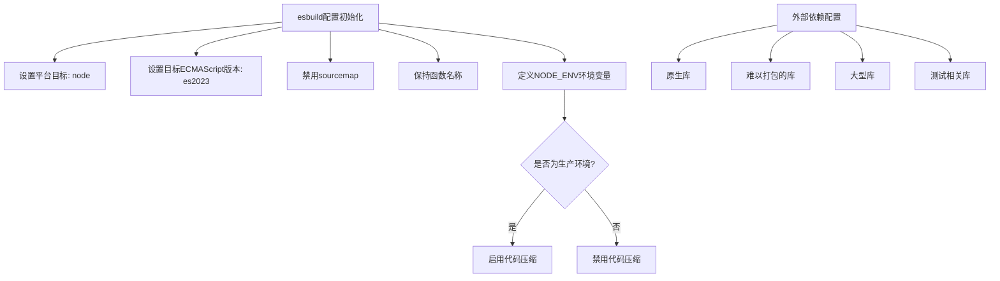
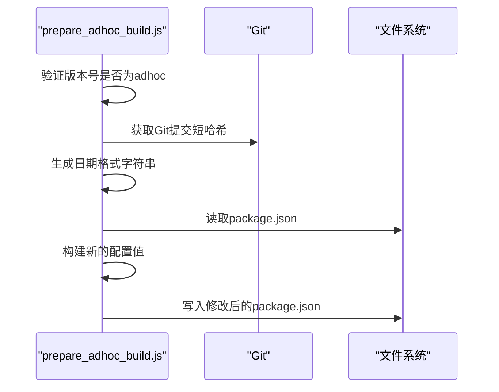
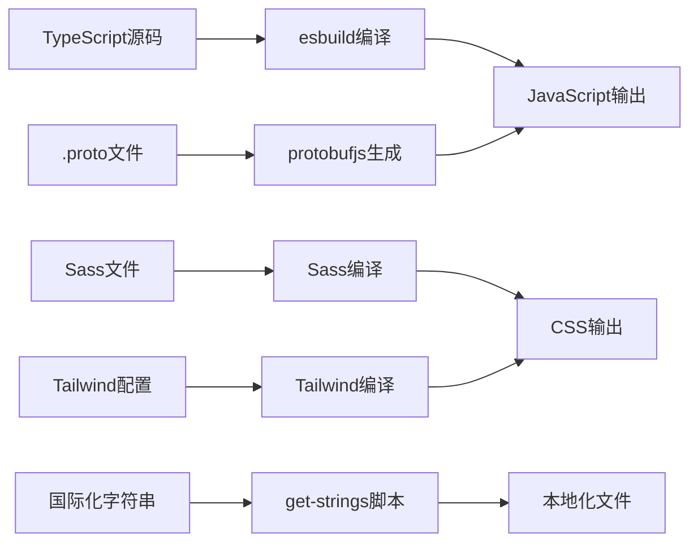

# 构建流程

<cite>
**本文档中引用的文件**  
- [package.json](file://package.json)
- [esbuild.js](file://scripts/esbuild.js)
- [prepare_adhoc_build.js](file://scripts/prepare_adhoc_build.js)
- [prepare_alpha_build.js](file://scripts/prepare_alpha_build.js)
- [prepare_beta_build.js](file://scripts/prepare_beta_build.js)
- [prepare_staging_build.js](file://scripts/prepare_staging_build.js)
- [prepare_linux_build.js](file://scripts/prepare_linux_build.js)
- [prepare_tagged_version.js](file://scripts/prepare_tagged_version.js)
- [packageJson.js](file://scripts/packageJson.js)
- [version.std.ts](file://ts/util/version.std.ts)
- [get-strings.node.ts](file://ts/scripts/get-strings.node.ts)
- [gen-nsis-script.node.ts](file://ts/scripts/gen-nsis-script.node.ts)
- [gen-locales-config.node.ts](file://ts/scripts/gen-locales-config.node.ts)
</cite>

## 目录
1. [构建流程概述](#构建流程概述)
2. [esbuild打包配置](#esbuild打包配置)
3. [环境构建准备脚本](#环境构建准备脚本)
4. [依赖管理与代码转换](#依赖管理与代码转换)
5. [常见构建问题与解决方案](#常见构建问题与解决方案)

## 构建流程概述

Signal-Desktop的构建流程采用现代化的前端构建工具链，以esbuild为核心打包工具，结合Electron-Builder进行应用打包。构建流程通过package.json中的脚本命令组织，实现了从源码编译到最终可执行文件生成的完整自动化流程。

构建流程主要分为三个阶段：预处理阶段、编译阶段和打包阶段。预处理阶段包括生成国际化字符串、配置文件和协议缓冲区文件；编译阶段使用esbuild将TypeScript源码编译为JavaScript；打包阶段则使用Electron-Builder生成各平台的安装包。

**Section sources**
- [package.json](file://package.json#L18-L114)

## esbuild打包配置

Signal-Desktop使用esbuild作为主要的代码打包工具，通过自定义的esbuild.js脚本进行配置和调用。esbuild配置针对不同环境和用途进行了优化，确保了构建性能和输出质量。

esbuild配置定义了三种不同的默认配置：nodeDefaults用于主进程代码编译，bundleDefaults用于预加载脚本打包，sandboxedPreloadDefaults用于沙箱环境的预加载脚本。这些配置通过esbuild的插件系统实现了TypeScript文件的自动解析，当导入.js文件时会优先查找同名的.ts或.tsx文件。

在生产环境中，esbuild会启用代码压缩（minify）功能，并将process.env.NODE_ENV定义为"production"。为了优化构建性能，一些大型库和原生模块被列为外部依赖（external），不包含在打包输出中，而是在运行时从node_modules中加载。

**Diagram sources**
- [esbuild.js](file://scripts/esbuild.js#L18-L100)

**Section sources**
- [esbuild.js](file://scripts/esbuild.js#L1-L233)
- [package.json](file://package.json#L93-L97)

## 环境构建准备脚本

Signal-Desktop为不同的发布环境提供了专门的构建准备脚本，包括adhoc、alpha、beta和staging环境。这些脚本的主要目的是修改package.json中的配置，确保不同环境的构建产物可以并行安装和运行。

### adhoc构建准备

adhoc构建准备脚本（prepare_adhoc_build.js）用于创建临时的开发构建。该脚本会根据当前Git提交的短哈希和构建日期生成唯一的应用标识符，确保每次adhoc构建都有独立的应用名称、产品名称和应用ID。

脚本首先验证版本号是否为adhoc版本，然后获取Git提交的短哈希和当前日期，最后更新package.json中的多个字段，包括应用名称、产品名称、应用ID、启动WM类、桌面文件名和可执行文件名。

**Diagram sources**
- [prepare_adhoc_build.js](file://scripts/prepare_adhoc_build.js#L1-L104)

**Section sources**
- [prepare_adhoc_build.js](file://scripts/prepare_adhoc_build.js#L1-L104)

### alpha构建准备

alpha构建准备脚本（prepare_alpha_build.js）用于创建alpha测试版本。与adhoc构建类似，该脚本也会修改package.json中的多个字段，但使用固定的alpha标识符而非动态生成的哈希值。

脚本将应用名称从"signal-desktop"修改为"signal-desktop-alpha"，产品名称从"Signal"修改为"Signal Alpha"，应用ID从"org.whispersystems.signal-desktop"修改为"org.whispersystems.signal-desktop-alpha"。这种命名约定确保了alpha版本可以与生产版本并行安装。

**Section sources**
- [prepare_alpha_build.js](file://scripts/prepare_alpha_build.js#L1-L82)

### beta构建准备

beta构建准备脚本（prepare_beta_build.js）用于创建beta测试版本。该脚本的逻辑与alpha构建准备脚本基本相同，只是将所有alpha相关的标识符替换为beta。

脚本会检查版本号是否为beta版本，然后更新package.json中的相应字段，包括应用名称、产品名称、应用ID、启动WM类、桌面文件名和可执行文件名，全部添加beta后缀。

**Section sources**
- [prepare_beta_build.js](file://scripts/prepare_beta_build.js#L1-L81)

### staging构建准备

staging构建准备脚本（prepare_staging_build.js）用于创建staging环境的构建。该脚本不仅修改package.json中的各种名称和标识符，还会修改config/production.json文件的内容。

脚本首先验证版本号是否为alpha版本（因为staging构建基于alpha版本），然后将版本号中的"alpha"替换为"staging"，并更新所有相关的名称和标识符。此外，脚本还会创建一个简化的production.json配置文件，启用更新功能并设置CI模式为benchmark。

**Section sources**
- [prepare_staging_build.js](file://scripts/prepare_staging_build.js#L1-L95)

### Linux构建准备

Linux构建准备脚本（prepare_linux_build.js）用于配置Linux平台的构建目标。该脚本接受命令行参数指定构建目标，支持appimage和deb两种格式。

脚本会验证提供的目标是否有效，然后修改package.json中的build.linux.target字段，设置Electron-Builder生成指定格式的安装包。

**Section sources**
- [prepare_linux_build.js](file://scripts/prepare_linux_build.js#L1-L31)

### 版本标记准备

版本标记准备脚本（prepare_tagged_version.js）用于生成带有标签的版本号。该脚本根据指定的发布线（release line）和当前Git提交的短哈希生成唯一的版本号。

脚本首先验证发布线参数是否有效，然后调用version.std.ts中的generateTaggedVersion函数生成新的版本号，最后更新package.json中的version字段。

**Section sources**
- [prepare_tagged_version.js](file://scripts/prepare_tagged_version.js#L1-L38)

## 依赖管理与代码转换

Signal-Desktop的构建流程包含完整的依赖管理和代码转换机制，确保了代码质量和构建一致性。

### 依赖管理

项目使用pnpm作为包管理器，在package.json中明确指定了所有依赖项。通过pnpm的overrides和patchedDependencies配置，项目能够解决依赖冲突和应用必要的补丁。

在构建过程中，esbuild的external配置确保了大型库和原生模块不会被打包到主应用中，而是作为外部依赖在运行时加载。这不仅减少了打包体积，还避免了某些库在打包过程中可能出现的问题。

### 代码转换流程

代码转换流程从TypeScript源码开始，通过esbuild编译为JavaScript。构建流程包括多个预处理步骤，如生成国际化字符串、协议缓冲区文件和样式表。

国际化字符串通过get-strings.node.ts脚本从Smartling翻译平台获取，生成各个语言的messages.json文件。协议缓冲区文件通过protobufjs工具从.proto文件生成TypeScript代码。样式表通过Sass和Tailwind CSS编译为最终的CSS文件。

**Diagram sources**
- [get-strings.node.ts](file://ts/scripts/get-strings.node.ts#L1-L153)
- [gen-locales-config.node.ts](file://ts/scripts/gen-locales-config.node.ts#L1-L63)

**Section sources**
- [get-strings.node.ts](file://ts/scripts/get-strings.node.ts#L1-L153)
- [gen-nsis-script.node.ts](file://ts/scripts/gen-nsis-script.node.ts#L1-L113)
- [gen-locales-config.node.ts](file://ts/scripts/gen-locales-config.node.ts#L1-L63)

## 常见构建问题与解决方案

### 依赖冲突

由于项目依赖众多，可能会出现依赖版本冲突。解决方案是使用pnpm的overrides配置强制指定依赖版本，或使用patchedDependencies应用必要的补丁。

### 构建性能优化

大型项目构建时间较长，可以通过以下方式优化：
1. 使用esbuild的watch模式进行开发构建
2. 启用pnpm的onlyBuiltDependencies配置，只构建必要的原生模块
3. 使用并行构建任务（run-p）同时执行多个构建步骤

### 跨平台构建问题

不同平台的构建需求不同，特别是原生模块的编译。解决方案包括：
1. 使用Electron-Builder的nativeRebuilder配置
2. 为不同平台指定不同的构建目标
3. 使用Docker容器确保构建环境一致性

**Section sources**
- [package.json](file://package.json#L374-L424)
- [esbuild.js](file://scripts/esbuild.js#L63-L99)