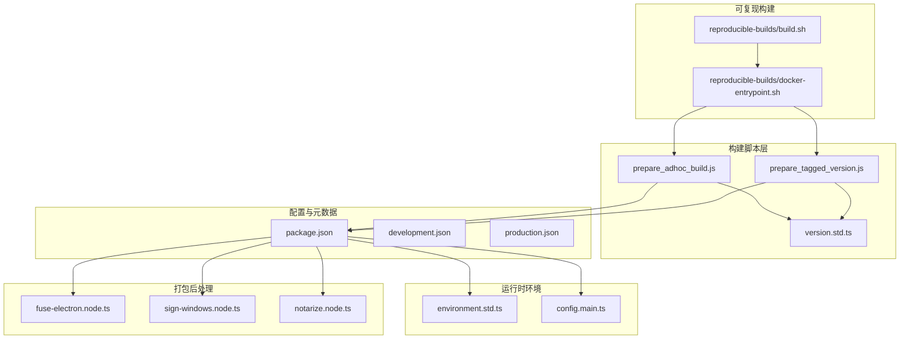
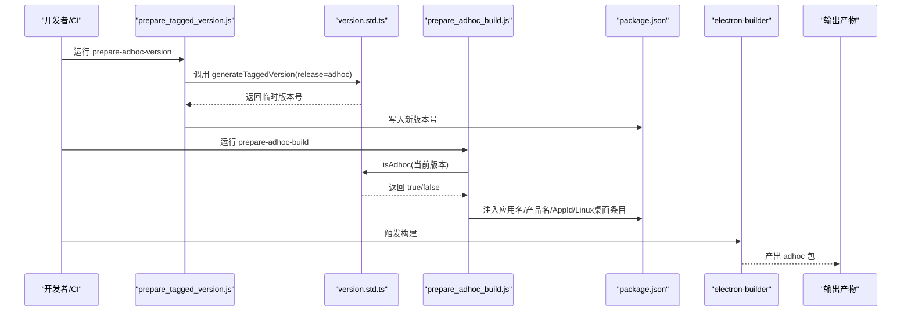
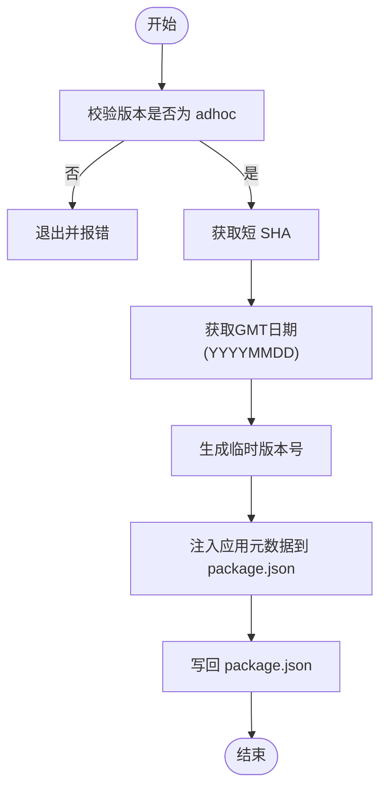
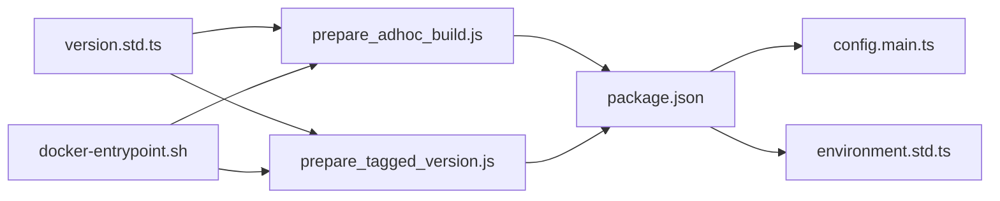

# Adhoc构建

<cite>
**本文引用的文件**
- [scripts/prepare_adhoc_build.js](file://scripts/prepare_adhoc_build.js)
- [scripts/prepare_tagged_version.js](file://scripts/prepare_tagged_version.js)
- [ts/util/version.std.ts](file://ts/util/version.std.ts)
- [package.json](file://package.json)
- [ts/environment.std.ts](file://ts/environment.std.ts)
- [app/config.main.ts](file://app/config.main.ts)
- [config/development.json](file://config/development.json)
- [config/production.json](file://config/production.json)
- [reproducible-builds/build.sh](file://reproducible-builds/build.sh)
- [reproducible-builds/docker-entrypoint.sh](file://reproducible-builds/docker-entrypoint.sh)
- [ts/scripts/fuse-electron.node.ts](file://ts/scripts/fuse-electron.node.ts)
- [ts/scripts/sign-windows.node.ts](file://ts/scripts/sign-windows.node.ts)
- [ts/scripts/notarize.node.ts](file://ts/scripts/notarize.node.ts)
</cite>

## 目录
1. [引言](#引言)
2. [项目结构](#项目结构)
3. [核心组件](#核心组件)
4. [架构总览](#架构总览)
5. [详细组件分析](#详细组件分析)
6. [依赖关系分析](#依赖关系分析)
7. [性能考量](#性能考量)
8. [故障排查指南](#故障排查指南)
9. [结论](#结论)
10. [附录](#附录)

## 引言
本文件系统性阐述 Signal-Desktop 的 adhoc 构建流程与实现细节，重点围绕 prepare_adhoc_build.js 脚本展开，覆盖以下方面：
- 版本号生成策略（基于时间戳与短 SHA 的临时版本）
- 构建标记与应用标识符的注入
- 开发环境配置与环境变量注入
- adhoc 构建的用途与特性（内部测试、临时演示、快速验证）
- 特殊处理流程（调试信息、功能开关、代码注入机制）
- 常见问题定位与解决方案（版本冲突、配置错误、产物管理）

## 项目结构
与 adhoc 构建直接相关的目录与文件：
- scripts/prepare_adhoc_build.js：adhoc 构建准备脚本
- scripts/prepare_tagged_version.js：通用版本生成脚本（含 adhoc）
- ts/util/version.std.ts：版本解析与生成工具
- package.json：构建元数据、脚本入口、electron-builder 配置
- reproducible-builds/build.sh 与 reproducible-builds/docker-entrypoint.sh：可复现构建容器化流程（包含 adhoc 流程）
- ts/environment.std.ts 与 app/config.main.ts：运行时环境与配置加载
- ts/scripts/fuse-electron.node.ts、ts/scripts/sign-windows.node.ts、ts/scripts/notarize.node.ts：打包后处理与签名/公证钩子

图表来源
- [scripts/prepare_adhoc_build.js](file://scripts/prepare_adhoc_build.js#L1-L104)
- [scripts/prepare_tagged_version.js](file://scripts/prepare_tagged_version.js#L1-L38)
- [ts/util/version.std.ts](file://ts/util/version.std.ts#L1-L68)
- [package.json](file://package.json#L1-L714)
- [reproducible-builds/build.sh](file://reproducible-builds/build.sh#L1-L57)
- [reproducible-builds/docker-entrypoint.sh](file://reproducible-builds/docker-entrypoint.sh#L41-L73)
- [ts/environment.std.ts](file://ts/environment.std.ts#L1-L61)
- [app/config.main.ts](file://app/config.main.ts#L1-L76)
- [ts/scripts/fuse-electron.node.ts](file://ts/scripts/fuse-electron.node.ts#L1-L41)
- [ts/scripts/sign-windows.node.ts](file://ts/scripts/sign-windows.node.ts#L1-L40)
- [ts/scripts/notarize.node.ts](file://ts/scripts/notarize.node.ts#L1-L68)

章节来源
- [scripts/prepare_adhoc_build.js](file://scripts/prepare_adhoc_build.js#L1-L104)
- [package.json](file://package.json#L1-L714)

## 核心组件
- 版本生成与校验
  - isAdhoc：判断版本是否为 adhoc
  - generateTaggedVersion：按格式生成带日期与短 SHA 的版本号
- adhoc 构建准备脚本
  - 校验当前版本必须是 adhoc
  - 读取短 SHA 与 GMT 日期，生成临时版本号
  - 注入 package.json 中的应用名称、产品名、appId、Linux 桌面条目等字段
- 可复现构建容器化流程
  - build.sh 设置 SOURCE_DATE_EPOCH 并调用 docker-entrypoint.sh
  - docker-entrypoint.sh 根据 BUILD_TYPE 执行 prepare-adhoc-version 与 prepare-adhoc-build，再执行 build-linux

章节来源
- [ts/util/version.std.ts](file://ts/util/version.std.ts#L1-L68)
- [scripts/prepare_adhoc_build.js](file://scripts/prepare_adhoc_build.js#L1-L104)
- [scripts/prepare_tagged_version.js](file://scripts/prepare_tagged_version.js#L1-L38)
- [reproducible-builds/build.sh](file://reproducible-builds/build.sh#L1-L57)
- [reproducible-builds/docker-entrypoint.sh](file://reproducible-builds/docker-entrypoint.sh#L41-L73)

## 架构总览
adhoc 构建从“版本生成”到“包名注入”，再到“打包与产物”的完整链路如下：

图表来源
- [scripts/prepare_tagged_version.js](file://scripts/prepare_tagged_version.js#L1-L38)
- [ts/util/version.std.ts](file://ts/util/version.std.ts#L1-L68)
- [scripts/prepare_adhoc_build.js](file://scripts/prepare_adhoc_build.js#L1-L104)
- [package.json](file://package.json#L1-L714)

## 详细组件分析

### 版本生成与校验（version.std.ts）
- isAdhoc：通过语义化版本解析 prerelease 字段判断是否为 adhoc
- generateTaggedVersion：以当前版本主次补丁为基础，拼接 release、日期时间与短 SHA，形成唯一临时版本号
- 该工具被 prepare_tagged_version.js 与 prepare_adhoc_build.js 共同使用

章节来源
- [ts/util/version.std.ts](file://ts/util/version.std.ts#L1-L68)
- [scripts/prepare_tagged_version.js](file://scripts/prepare_tagged_version.js#L1-L38)

### adhoc 构建准备脚本（prepare_adhoc_build.js）
- 输入校验
  - 使用 isAdhoc 校验当前版本是否为 adhoc，否则退出并提示
- 临时版本号生成
  - 读取 git 短 SHA
  - 使用 Intl.DateTimeFormat 生成 GMT 日期字符串（YYYYMMDD）
  - 组合出 adhoc 版本号（由版本工具生成）
- 应用标识注入
  - 修改 package.json 中 name、productName、build.appId
  - Linux 桌面条目：build.linux.desktop.entry.StartupWMClass、desktopName、build.linux.executableName
- 文件写回
  - 将修改后的 package.json 写回磁盘，供 electron-builder 使用

图表来源
- [scripts/prepare_adhoc_build.js](file://scripts/prepare_adhoc_build.js#L1-L104)
- [ts/util/version.std.ts](file://ts/util/version.std.ts#L1-L68)

章节来源
- [scripts/prepare_adhoc_build.js](file://scripts/prepare_adhoc_build.js#L1-L104)

### 通用版本生成脚本（prepare_tagged_version.js）
- 接收命令行参数 release（alpha/axolotl/adhoc）
- 调用 generateTaggedVersion 生成新版本号
- 写回 package.json 的 version 字段

章节来源
- [scripts/prepare_tagged_version.js](file://scripts/prepare_tagged_version.js#L1-L38)
- [ts/util/version.std.ts](file://ts/util/version.std.ts#L1-L68)

### 可复现构建与 adhoc 流程（reproducible-builds）
- build.sh
  - 设置 SOURCE_DATE_EPOCH（默认取最新提交时间戳），并启动容器
- docker-entrypoint.sh
  - 根据 BUILD_TYPE 执行 prepare-adhoc-version 与 prepare-adhoc-build
  - 最终执行 build-linux 产出包

章节来源
- [reproducible-builds/build.sh](file://reproducible-builds/build.sh#L1-L57)
- [reproducible-builds/docker-entrypoint.sh](file://reproducible-builds/docker-entrypoint.sh#L41-L73)

### 运行时环境与配置（environment.std.ts、config.main.ts）
- environment.std.ts
  - 定义 Environment 枚举（development、production、staging、test）
  - 提供 setEnvironment、parseEnvironment 等工具
- app/config.main.ts
  - 在打包应用中强制生产环境
  - 在非打包环境中根据 NODE_ENV 加载对应配置
  - 输出关键环境变量与配置源信息，便于调试

章节来源
- [ts/environment.std.ts](file://ts/environment.std.ts#L1-L61)
- [app/config.main.ts](file://app/config.main.ts#L1-L76)

### 构建产物命名与元数据（package.json）
- electron-builder 配置
  - mac/linux/win 平台的 artifactName 模板
  - linux 桌面条目 StartupWMClass、executableName
  - appId、productName、name 等
- prepare_adhoc_build.js 会将上述字段改写为 adhoc 版本专属值，确保与生产版并存安装

章节来源
- [package.json](file://package.json#L1-L714)
- [scripts/prepare_adhoc_build.js](file://scripts/prepare_adhoc_build.js#L1-L104)

### 打包后处理与签名/公证（可选）
- fuse-electron.node.ts：在打包后对 Electron 进行熔断配置（如启用 Cookie 加密、禁用某些能力）
- sign-windows.node.ts：通过外部脚本对 Windows 产物进行签名（需要环境变量）
- notarize.node.ts：在 macOS 上对应用进行公证（需要 APPLE_* 环境变量）

章节来源
- [ts/scripts/fuse-electron.node.ts](file://ts/scripts/fuse-electron.node.ts#L1-L41)
- [ts/scripts/sign-windows.node.ts](file://ts/scripts/sign-windows.node.ts#L1-L40)
- [ts/scripts/notarize.node.ts](file://ts/scripts/notarize.node.ts#L1-L68)

## 依赖关系分析
- prepare_adhoc_build.js 依赖 version.std.ts 的 isAdhoc 与 generateTaggedVersion
- prepare_tagged_version.js 同样依赖 version.std.ts 的 generateTaggedVersion
- package.json 中的 build.* 字段会被 prepare_adhoc_build.js 动态修改
- reproducible-builds 流程通过 docker-entrypoint.sh 调用 prepare-* 脚本
- 运行时配置由 app/config.main.ts 依据环境变量加载

图表来源
- [scripts/prepare_adhoc_build.js](file://scripts/prepare_adhoc_build.js#L1-L104)
- [scripts/prepare_tagged_version.js](file://scripts/prepare_tagged_version.js#L1-L38)
- [ts/util/version.std.ts](file://ts/util/version.std.ts#L1-L68)
- [package.json](file://package.json#L1-L714)
- [reproducible-builds/docker-entrypoint.sh](file://reproducible-builds/docker-entrypoint.sh#L41-L73)
- [app/config.main.ts](file://app/config.main.ts#L1-L76)
- [ts/environment.std.ts](file://ts/environment.std.ts#L1-L61)

章节来源
- [scripts/prepare_adhoc_build.js](file://scripts/prepare_adhoc_build.js#L1-L104)
- [scripts/prepare_tagged_version.js](file://scripts/prepare_tagged_version.js#L1-L38)
- [ts/util/version.std.ts](file://ts/util/version.std.ts#L1-L68)
- [package.json](file://package.json#L1-L714)
- [reproducible-builds/docker-entrypoint.sh](file://reproducible-builds/docker-entrypoint.sh#L41-L73)
- [app/config.main.ts](file://app/config.main.ts#L1-L76)
- [ts/environment.std.ts](file://ts/environment.std.ts#L1-L61)

## 性能考量
- adhoc 构建通常用于快速验证与内部测试，建议在本地或 CI 中开启增量构建与缓存，避免重复下载依赖
- electron-builder 的打包过程可能较重，建议在可复现构建容器中统一环境，减少差异导致的重试
- 临时版本号包含短 SHA 与日期，有助于区分不同构建，但也会增加产物数量，注意清理策略

## 故障排查指南
- 版本冲突
  - 现象：prepare_adhoc_build.js 报错“版本不是 adhoc”
  - 处理：先运行 prepare-adhoc-version 生成 adhoc 版本号，再运行 prepare-adhoc-build
  - 参考路径：[scripts/prepare_adhoc_build.js](file://scripts/prepare_adhoc_build.js#L16-L19)、[scripts/prepare_tagged_version.js](file://scripts/prepare_tagged_version.js#L13-L17)
- 配置错误
  - 现象：electron-builder 无法识别注入的 appId/name/productName
  - 处理：确认 prepare_adhoc_build.js 已成功写回 package.json；核对 build.appId、productName、name 等字段
  - 参考路径：[scripts/prepare_adhoc_build.js](file://scripts/prepare_adhoc_build.js#L85-L103)、[package.json](file://package.json#L429-L709)
- 构建产物管理问题
  - 现象：adhoc 产物与生产版冲突或无法并存
  - 处理：确保 Linux 桌面条目与 executableName、mac/artifactName、win/artifactName 使用了临时版本号；必要时清理旧产物
  - 参考路径：[scripts/prepare_adhoc_build.js](file://scripts/prepare_adhoc_build.js#L47-L73)、[package.json](file://package.json#L429-L709)
- 环境变量缺失
  - 现象：Windows 签名失败、macOS 公证失败
  - 处理：补齐 SIGN_WINDOWS_SCRIPT、APPLE_USERNAME、APPLE_PASSWORD、APPLE_TEAM_ID 等环境变量
  - 参考路径：[ts/scripts/sign-windows.node.ts](file://ts/scripts/sign-windows.node.ts#L23-L39)、[ts/scripts/notarize.node.ts](file://ts/scripts/notarize.node.ts#L32-L67)
- 运行时配置不生效
  - 现象：开发/生产配置未按预期加载
  - 处理：检查 app/config.main.ts 中 NODE_ENV 与 NODE_CONFIG_DIR 的设置；确认非打包环境下配置源列表
  - 参考路径：[app/config.main.ts](file://app/config.main.ts#L19-L74)、[config/development.json](file://config/development.json#L1-L5)、[config/production.json](file://config/production.json#L1-L24)

章节来源
- [scripts/prepare_adhoc_build.js](file://scripts/prepare_adhoc_build.js#L16-L19)
- [scripts/prepare_tagged_version.js](file://scripts/prepare_tagged_version.js#L13-L17)
- [package.json](file://package.json#L429-L709)
- [ts/scripts/sign-windows.node.ts](file://ts/scripts/sign-windows.node.ts#L23-L39)
- [ts/scripts/notarize.node.ts](file://ts/scripts/notarize.node.ts#L32-L67)
- [app/config.main.ts](file://app/config.main.ts#L19-L74)
- [config/development.json](file://config/development.json#L1-L5)
- [config/production.json](file://config/production.json#L1-L24)

## 结论
adhoc 构建通过“临时版本号 + 应用元数据注入”的方式，实现了与生产版并存安装与快速分发的目标。其核心在于：
- 明确的版本生成与校验流程
- 对 package.json 关键字段的精准注入
- 可复现构建容器化流程的配合
- 运行时环境与配置加载的清晰边界

在日常使用中，建议遵循“先生成 adhoc 版本，再准备构建元数据，最后打包”的顺序，并结合环境变量与产物命名规范，确保构建稳定与可追溯。

## 附录
- adhoc 构建典型用途
  - 内部测试：快速验证新功能与修复
  - 临时演示：向特定用户展示阶段性成果
  - 快速验证：在隔离环境中进行回归与兼容性测试
- 版本号命名规则（示例）
  - 形如：主.次.补丁-adhoc.年月日.小时-短SHA
  - 由 generateTaggedVersion 生成，确保唯一性与可追溯性
- 构建产物命名规则（示例）
  - macOS：name-mac-arch-version.ext
  - Windows：name-win-arch-version.ext
  - Linux：name_version_arch.ext
  - 由 electron-builder 的 artifactName 模板决定

章节来源
- [ts/util/version.std.ts](file://ts/util/version.std.ts#L36-L67)
- [package.json](file://package.json#L429-L709)