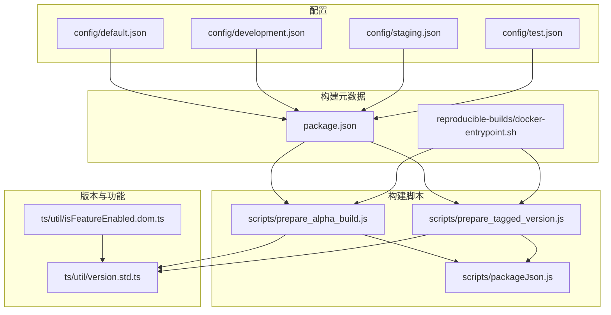
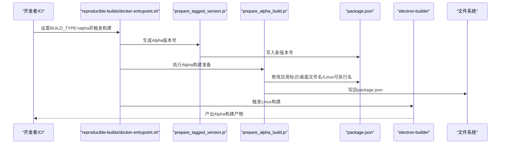
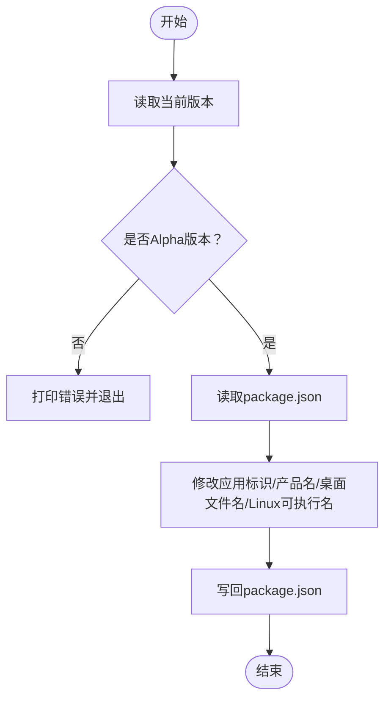
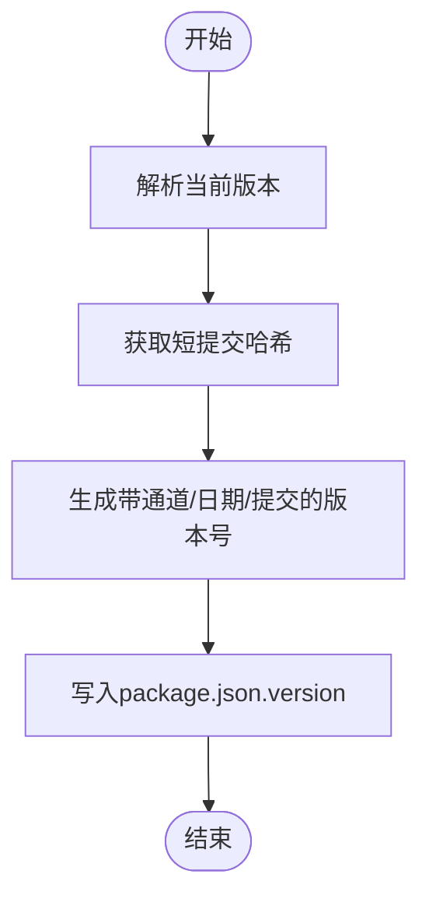
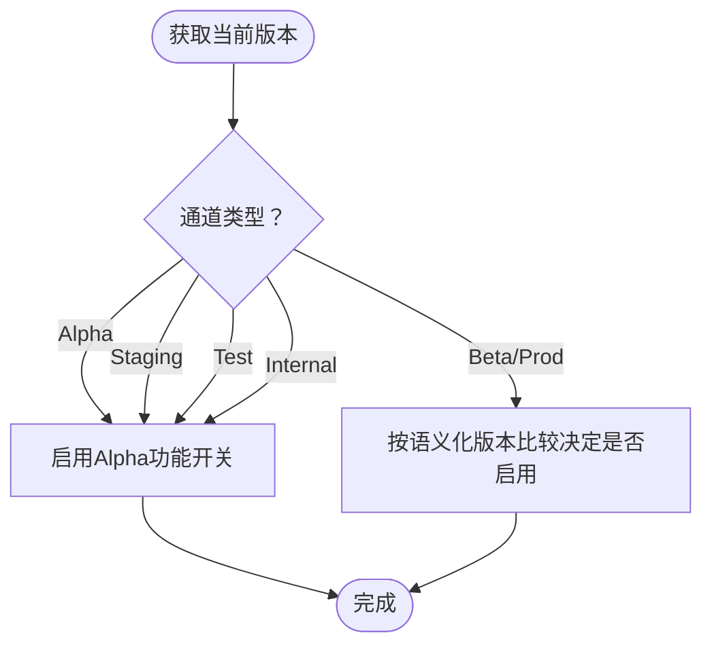
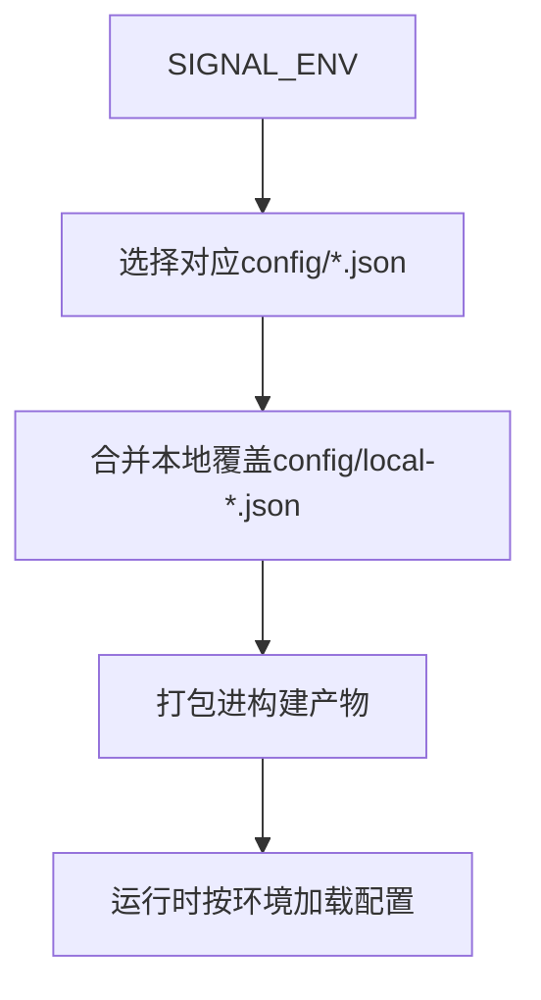
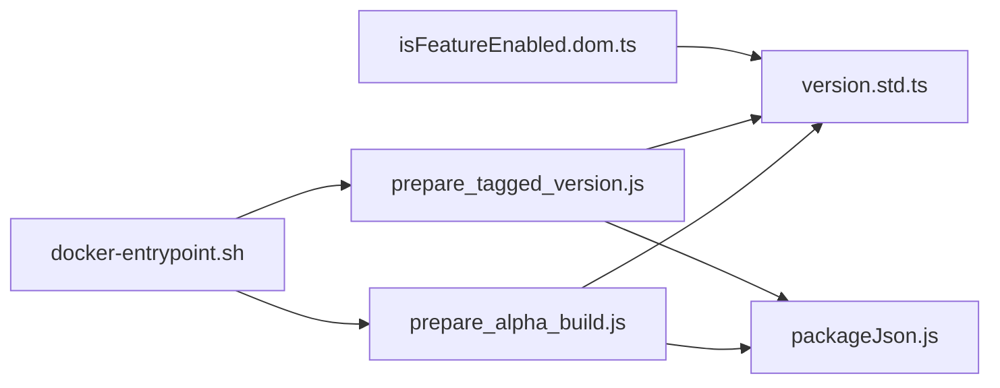

# Alpha构建

<cite>
**本文引用的文件**
- [scripts/prepare_alpha_build.js](file://scripts/prepare_alpha_build.js)
- [scripts/prepare_tagged_version.js](file://scripts/prepare_tagged_version.js)
- [scripts/packageJson.js](file://scripts/packageJson.js)
- [ts/util/version.std.ts](file://ts/util/version.std.ts)
- [package.json](file://package.json)
- [config/default.json](file://config/default.json)
- [config/development.json](file://config/development.json)
- [config/staging.json](file://config/staging.json)
- [config/test.json](file://config/test.json)
- [reproducible-builds/docker-entrypoint.sh](file://reproducible-builds/docker-entrypoint.sh)
- [ts/util/isFeatureEnabled.dom.ts](file://ts/util/isFeatureEnabled.dom.ts)
- [ts/logging/debuglogs.node.ts](file://ts/logging/debuglogs.node.ts)
- [ts/types/Polls.dom.ts](file://ts/types/Polls.dom.ts)
</cite>

## 目录
1. [引言](#引言)
2. [项目结构](#项目结构)
3. [核心组件](#核心组件)
4. [架构总览](#架构总览)
5. [详细组件分析](#详细组件分析)
6. [依赖关系分析](#依赖关系分析)
7. [性能考量](#性能考量)
8. [故障排查指南](#故障排查指南)
9. [结论](#结论)
10. [附录](#附录)

## 引言
本文件面向Signal-Desktop的Alpha构建流程，系统性说明prepare_alpha_build.js脚本的实现细节与使用方式，涵盖以下主题：
- 版本标记与通道识别：如何通过版本字符串判断Alpha通道
- 开发环境配置：如何在不同环境（默认、开发、测试、预发布）下加载配置
- 功能开关管理：如何基于版本通道启用或禁用特定功能
- Alpha构建用途与特性：早期功能测试、内部用户反馈收集、稳定性验证
- Alpha构建的特殊处理：调试工具集成、日志级别设置、性能监控注入
- 常见问题定位与解决：功能冲突、配置加载失败、测试数据管理

## 项目结构
与Alpha构建直接相关的目录与文件：
- scripts：构建前置脚本（prepare_alpha_build.js、prepare_tagged_version.js、packageJson.js）
- ts/util：版本识别与功能开关逻辑（version.std.ts、isFeatureEnabled.dom.ts）
- config：运行时配置（default.json、development.json、staging.json、test.json）
- package.json：构建元数据与electron-builder配置
- reproducible-builds：可复现构建入口（包含Alpha构建触发链）

图表来源
- [scripts/prepare_alpha_build.js](file://scripts/prepare_alpha_build.js#L1-L82)
- [scripts/prepare_tagged_version.js](file://scripts/prepare_tagged_version.js#L1-L38)
- [scripts/packageJson.js](file://scripts/packageJson.js#L1-L16)
- [ts/util/version.std.ts](file://ts/util/version.std.ts#L1-L68)
- [ts/util/isFeatureEnabled.dom.ts](file://ts/util/isFeatureEnabled.dom.ts#L42-L98)
- [config/default.json](file://config/default.json#L1-L36)
- [config/development.json](file://config/development.json#L1-L5)
- [config/staging.json](file://config/staging.json#L1-L5)
- [config/test.json](file://config/test.json#L1-L5)
- [package.json](file://package.json#L1-L714)
- [reproducible-builds/docker-entrypoint.sh](file://reproducible-builds/docker-entrypoint.sh#L41-L73)

章节来源
- [scripts/prepare_alpha_build.js](file://scripts/prepare_alpha_build.js#L1-L82)
- [scripts/prepare_tagged_version.js](file://scripts/prepare_tagged_version.js#L1-L38)
- [scripts/packageJson.js](file://scripts/packageJson.js#L1-L16)
- [ts/util/version.std.ts](file://ts/util/version.std.ts#L1-L68)
- [package.json](file://package.json#L1-L714)
- [config/default.json](file://config/default.json#L1-L36)
- [config/development.json](file://config/development.json#L1-L5)
- [config/staging.json](file://config/staging.json#L1-L5)
- [config/test.json](file://config/test.json#L1-L5)
- [reproducible-builds/docker-entrypoint.sh](file://reproducible-builds/docker-entrypoint.sh#L41-L73)

## 核心组件
- Alpha构建前置脚本：prepare_alpha_build.js
  - 负责校验当前版本是否为Alpha通道，并修改package.json中与应用标识、桌面文件名、Linux可执行名等相关的字段，以支持与生产版并行安装
- 版本识别工具：version.std.ts
  - 提供isAlpha等方法，用于识别Alpha通道版本
- 版本生成工具：prepare_tagged_version.js
  - 为Alpha/测试/预发布等通道生成带时间戳与短提交哈希的版本号
- 配置加载机制：config/*.json
  - 默认配置、开发配置、测试配置、预发布配置分别控制存储档案、开发者工具开关、更新策略等
- 功能开关：isFeatureEnabled.dom.ts
  - 基于版本通道（Alpha、Staging、Test）、内部用户、语义化版本比较等条件动态启用功能
- 构建入口：reproducible-builds/docker-entrypoint.sh
  - 在容器内按BUILD_TYPE自动选择prepare-*脚本链路，其中Alpha构建会先生成Alpha版本再执行Alpha构建

章节来源
- [scripts/prepare_alpha_build.js](file://scripts/prepare_alpha_build.js#L1-L82)
- [ts/util/version.std.ts](file://ts/util/version.std.ts#L1-L68)
- [scripts/prepare_tagged_version.js](file://scripts/prepare_tagged_version.js#L1-L38)
- [config/default.json](file://config/default.json#L1-L36)
- [config/development.json](file://config/development.json#L1-L5)
- [config/test.json](file://config/test.json#L1-L5)
- [config/staging.json](file://config/staging.json#L1-L5)
- [ts/util/isFeatureEnabled.dom.ts](file://ts/util/isFeatureEnabled.dom.ts#L42-L98)
- [reproducible-builds/docker-entrypoint.sh](file://reproducible-builds/docker-entrypoint.sh#L41-L73)

## 架构总览
Alpha构建从“版本生成”到“构建打包”的端到端流程如下：

图表来源
- [reproducible-builds/docker-entrypoint.sh](file://reproducible-builds/docker-entrypoint.sh#L41-L73)
- [scripts/prepare_tagged_version.js](file://scripts/prepare_tagged_version.js#L1-L38)
- [scripts/prepare_alpha_build.js](file://scripts/prepare_alpha_build.js#L1-L82)
- [package.json](file://package.json#L1-L714)

## 详细组件分析

### 组件A：prepare_alpha_build.js（Alpha构建准备）
- 核心职责
  - 校验当前版本是否为Alpha通道；若非Alpha则直接退出
  - 将package.json中的应用名称、产品名称、应用ID、Linux桌面条目、可执行名等字段替换为Alpha专用值，确保与生产版并行安装不冲突
- 关键实现点
  - 使用version.std.ts中的isAlpha进行通道判断
  - 读取并写回package.json，确保后续electron-builder使用正确的构建元数据
- 适用场景
  - Alpha构建用于早期功能测试、内部用户反馈收集、稳定性验证

图表来源
- [scripts/prepare_alpha_build.js](file://scripts/prepare_alpha_build.js#L1-L82)
- [ts/util/version.std.ts](file://ts/util/version.std.ts#L1-L68)
- [scripts/packageJson.js](file://scripts/packageJson.js#L1-L16)

章节来源
- [scripts/prepare_alpha_build.js](file://scripts/prepare_alpha_build.js#L1-L82)
- [scripts/packageJson.js](file://scripts/packageJson.js#L1-L16)
- [ts/util/version.std.ts](file://ts/util/version.std.ts#L1-L68)

### 组件B：prepare_tagged_version.js（版本号生成）
- 核心职责
  - 依据当前版本与短提交哈希生成带通道前缀的时间戳版本号，便于追踪构建来源
- 关键实现点
  - 调用version.std.ts的generateTaggedVersion生成格式化的版本字符串
  - 更新package.json中的version字段

图表来源
- [scripts/prepare_tagged_version.js](file://scripts/prepare_tagged_version.js#L1-L38)
- [ts/util/version.std.ts](file://ts/util/version.std.ts#L36-L68)
- [scripts/packageJson.js](file://scripts/packageJson.js#L1-L16)

章节来源
- [scripts/prepare_tagged_version.js](file://scripts/prepare_tagged_version.js#L1-L38)
- [ts/util/version.std.ts](file://ts/util/version.std.ts#L36-L68)
- [scripts/packageJson.js](file://scripts/packageJson.js#L1-L16)

### 组件C：版本通道识别与功能开关（version.std.ts、isFeatureEnabled.dom.ts）
- 版本通道识别
  - isAlpha用于识别Alpha通道版本，配合isBeta、isProduction等方法统一版本判定
- 功能开关策略
  - isFeatureEnabled.dom.ts根据当前版本通道（Alpha/Staging/Test）或内部用户状态动态启用功能
  - 对于Poll发送/接收等能力，按通道映射到对应的远程配置开关

图表来源
- [ts/util/version.std.ts](file://ts/util/version.std.ts#L1-L68)
- [ts/util/isFeatureEnabled.dom.ts](file://ts/util/isFeatureEnabled.dom.ts#L42-L98)
- [ts/types/Polls.dom.ts](file://ts/types/Polls.dom.ts#L121-L172)

章节来源
- [ts/util/version.std.ts](file://ts/util/version.std.ts#L1-L68)
- [ts/util/isFeatureEnabled.dom.ts](file://ts/util/isFeatureEnabled.dom.ts#L42-L98)
- [ts/types/Polls.dom.ts](file://ts/types/Polls.dom.ts#L121-L172)

### 组件D：开发环境配置加载（config/*.json）
- 配置加载规则
  - package.json中electron-builder的files字段包含config/${env.SIGNAL_ENV}.json与config/local-${env.SIGNAL_ENV}.json，构建时会打包对应环境配置
- 典型配置项
  - storageProfile：指定存储档案（development/staging/test）
  - openDevTools：是否自动打开开发者工具
  - updatesEnabled：是否允许更新检查
  - 服务器地址、CDN、挑战码服务等网络配置

图表来源
- [package.json](file://package.json#L580-L620)
- [config/default.json](file://config/default.json#L1-L36)
- [config/development.json](file://config/development.json#L1-L5)
- [config/staging.json](file://config/staging.json#L1-L5)
- [config/test.json](file://config/test.json#L1-L5)

章节来源
- [package.json](file://package.json#L580-L620)
- [config/default.json](file://config/default.json#L1-L36)
- [config/development.json](file://config/development.json#L1-L5)
- [config/staging.json](file://config/staging.json#L1-L5)
- [config/test.json](file://config/test.json#L1-L5)

### 组件E：调试工具与日志（debuglogs.node.ts）
- 日志导出与格式化
  - debuglogs.node.ts提供系统信息、用户信息、能力、远程配置、统计与日志条目的格式化输出，便于问题排查
- 与Alpha构建的关系
  - Alpha构建通常开启开发者工具与更详细的日志输出，有助于早期问题定位

章节来源
- [ts/logging/debuglogs.node.ts](file://ts/logging/debuglogs.node.ts#L47-L90)

## 依赖关系分析
- prepare_alpha_build.js依赖
  - ts/util/version.std.ts：通道识别
  - scripts/packageJson.js：读取/写回package.json
- prepare_tagged_version.js依赖
  - ts/util/version.std.ts：生成带通道的版本号
  - scripts/packageJson.js：更新package.json
- isFeatureEnabled.dom.ts依赖
  - ts/util/version.std.ts：通道识别
  - 远程配置：按通道启用功能
- 构建入口
  - reproducible-builds/docker-entrypoint.sh：按BUILD_TYPE调用prepare-*脚本链路

图表来源
- [scripts/prepare_alpha_build.js](file://scripts/prepare_alpha_build.js#L1-L82)
- [scripts/prepare_tagged_version.js](file://scripts/prepare_tagged_version.js#L1-L38)
- [scripts/packageJson.js](file://scripts/packageJson.js#L1-L16)
- [ts/util/version.std.ts](file://ts/util/version.std.ts#L1-L68)
- [ts/util/isFeatureEnabled.dom.ts](file://ts/util/isFeatureEnabled.dom.ts#L42-L98)
- [reproducible-builds/docker-entrypoint.sh](file://reproducible-builds/docker-entrypoint.sh#L41-L73)

章节来源
- [scripts/prepare_alpha_build.js](file://scripts/prepare_alpha_build.js#L1-L82)
- [scripts/prepare_tagged_version.js](file://scripts/prepare_tagged_version.js#L1-L38)
- [scripts/packageJson.js](file://scripts/packageJson.js#L1-L16)
- [ts/util/version.std.ts](file://ts/util/version.std.ts#L1-L68)
- [ts/util/isFeatureEnabled.dom.ts](file://ts/util/isFeatureEnabled.dom.ts#L42-L98)
- [reproducible-builds/docker-entrypoint.sh](file://reproducible-builds/docker-entrypoint.sh#L41-L73)

## 性能考量
- Alpha构建通常用于早期测试，建议：
  - 合理使用开发者工具与日志级别，避免在生产环境开启高开销的日志
  - 控制功能开关数量，减少不必要的远程配置查询
  - 在CI中并行构建多平台产物，缩短反馈周期

## 故障排查指南
- 症状：构建失败或未生效
  - 检查版本通道是否正确（必须为Alpha），否则prepare_alpha_build.js会直接退出
  - 确认package.json已被正确修改（应用名称、产品名、桌面文件名、Linux可执行名）
- 症状：功能未按预期启用
  - 核对当前版本通道是否为Alpha/Staging/Test或内部用户
  - 检查远程配置开关是否已针对Alpha通道开启
- 症状：配置加载异常
  - 确认SIGNAL_ENV与config/*.json匹配
  - 检查config/local-*.json是否正确覆盖了默认配置
- 症状：测试数据污染
  - Alpha构建建议使用独立的storageProfile（如development/staging/test），避免与生产数据混用

章节来源
- [scripts/prepare_alpha_build.js](file://scripts/prepare_alpha_build.js#L1-L82)
- [ts/util/isFeatureEnabled.dom.ts](file://ts/util/isFeatureEnabled.dom.ts#L42-L98)
- [config/default.json](file://config/default.json#L1-L36)
- [config/development.json](file://config/development.json#L1-L5)
- [config/staging.json](file://config/staging.json#L1-L5)
- [config/test.json](file://config/test.json#L1-L5)

## 结论
Alpha构建通过“版本生成—构建准备—打包分发”的闭环，为早期功能测试、内部反馈与稳定性验证提供了可靠支撑。其关键在于：
- 明确的版本通道识别与版本号生成策略
- 构建前对应用标识与文件名的隔离处理
- 基于通道的功能开关与配置加载机制
- 可复现构建入口与CI集成

## 附录
- Alpha构建典型用途
  - 早期功能测试：在Alpha通道快速验证新功能
  - 内部用户反馈：通过内部用户或测试环境开关收集反馈
  - 稳定性验证：在更宽松的配置下进行压力与回归测试
- 建议实践
  - 在Alpha构建中保持开发者工具与日志可见性
  - 使用独立的storageProfile与测试数据源
  - 严格区分Alpha与生产版本的更新策略与功能开关