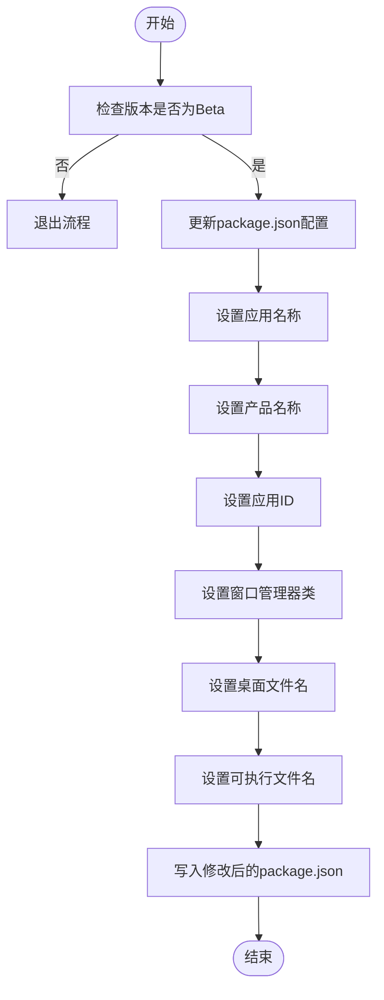
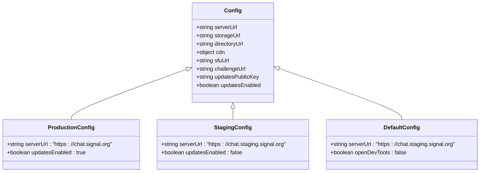
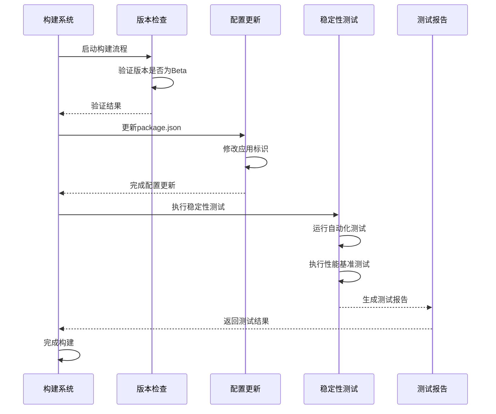

# Beta构建

<cite>
**本文档中引用的文件**  
- [prepare_beta_build.js](file://scripts/prepare_beta_build.js)
- [version.std.ts](file://ts/util/version.std.ts)
- [packageJson.js](file://scripts/packageJson.js)
- [package.json](file://package.json)
- [staging.json](file://config/staging.json)
- [production.json](file://config/production.json)
- [default.json](file://config/default.json)
</cite>

## 目录
1. [简介](#简介)
2. [Beta构建用途与特点](#beta构建用途与特点)
3. [prepare_beta_build.js实现细节](#prepare_beta_buildjs实现细节)
4. [预发布版本标记策略](#预发布版本标记策略)
5. [准生产环境配置](#准生产环境配置)
6. [功能稳定性验证](#功能稳定性验证)
7. [特殊处理流程](#特殊处理流程)
8. [常见问题与解决方案](#常见问题与解决方案)

## 简介
Signal-Desktop的Beta构建流程是确保新功能在发布到生产环境前经过充分测试的关键环节。该流程通过`prepare_beta_build.js`脚本实现，专门用于准备和配置Beta版本的构建。Beta版本允许外部用户测试新功能，同时保持与生产版本的并行安装能力。本文档详细说明了Beta构建的各个方面，包括脚本实现、配置策略和验证机制。

## Beta构建用途与特点
Beta构建主要用于外部用户测试，确保新功能的完整性和兼容性。其主要特点包括：

- **外部用户测试**：允许选定的外部用户群体在真实环境中测试新功能。
- **功能完整性验证**：确保所有新功能按预期工作，没有破坏现有功能。
- **兼容性验证**：测试新版本与不同操作系统和硬件配置的兼容性。
- **并行安装**：Beta版本可以与生产版本同时安装，便于用户在稳定版本和测试版本之间切换。
- **反馈收集**：通过Beta测试收集用户反馈，为最终发布提供改进依据。

**Section sources**
- [prepare_beta_build.js](file://scripts/prepare_beta_build.js)

## prepare_beta_build.js实现细节
`prepare_beta_build.js`脚本是Beta构建流程的核心，负责在构建过程中修改`package.json`文件以适应Beta版本的需求。脚本的主要功能包括验证版本号、更新应用标识和写入修改后的配置。



**Diagram sources**
- [prepare_beta_build.js](file://scripts/prepare_beta_build.js#L1-L81)

**Section sources**
- [prepare_beta_build.js](file://scripts/prepare_beta_build.js#L1-L81)

## 预发布版本标记策略
Signal-Desktop使用语义化版本控制（SemVer）来管理版本号，Beta版本通过预发布标识符进行标记。版本号格式为`主版本号.次版本号.修订号-beta.构建号`。

脚本通过`isBeta`函数验证当前版本是否为Beta版本：

```javascript
export const isBeta = (version: string): boolean =>
  semver.parse(version)?.prerelease[0] === 'beta';
```

如果版本号不包含`beta`预发布标识符，脚本将直接退出，确保只有正确的Beta版本才能继续构建流程。这种策略保证了构建过程的严谨性，防止意外发布非Beta版本。

**Section sources**
- [version.std.ts](file://ts/util/version.std.ts#L16-L17)
- [prepare_beta_build.js](file://scripts/prepare_beta_build.js#L16-L18)

## 准生产环境配置
Beta构建使用准生产环境配置，既不同于开发环境的宽松配置，也不同于生产环境的严格限制。这种配置平衡了测试需求和安全性要求。



**Diagram sources**
- [production.json](file://config/production.json)
- [staging.json](file://config/staging.json)
- [default.json](file://config/default.json)

**Section sources**
- [production.json](file://config/production.json)
- [staging.json](file://config/staging.json)
- [default.json](file://config/default.json)

## 功能稳定性验证
Beta构建包含多种功能稳定性验证机制，确保新功能在发布前经过充分测试。这些验证包括：

- **版本兼容性检查**：确保Beta版本与服务器端和其他客户端的兼容性。
- **功能开关控制**：通过远程配置控制新功能的启用状态，便于逐步发布。
- **自动化测试**：运行全面的自动化测试套件，包括单元测试、集成测试和端到端测试。
- **性能基准测试**：比较Beta版本与生产版本的性能指标，确保没有性能退化。



**Diagram sources**
- [prepare_beta_build.js](file://scripts/prepare_beta_build.js)
- [version.std.ts](file://ts/util/version.std.ts)

**Section sources**
- [prepare_beta_build.js](file://scripts/prepare_beta_build.js)
- [version.std.ts](file://ts/util/version.std.ts)

## 特殊处理流程
Beta构建包含一系列特殊处理流程，以支持测试和反馈收集：

- **用户反馈收集机制**：集成反馈渠道，便于Beta测试者报告问题和建议。
- **崩溃报告集成**：自动收集和上报应用崩溃信息，帮助开发团队快速定位和修复问题。
- **性能基准测试**：定期执行性能测试，监控应用的响应时间、内存使用等关键指标。
- **日志记录增强**：增加详细的日志记录，便于问题诊断和分析。

这些特殊处理流程确保了Beta版本能够提供有价值的测试数据，同时为最终用户版本的质量提供保障。

**Section sources**
- [prepare_beta_build.js](file://scripts/prepare_beta_build.js)
- [config/production.json](file://config/production.json)

## 常见问题与解决方案
在Beta构建过程中可能会遇到一些常见问题，以下是这些问题及其解决方案：

- **兼容性问题**：不同操作系统或硬件配置可能导致功能异常。解决方案是建立全面的测试矩阵，覆盖主要的用户环境。
- **性能瓶颈**：新功能可能引入性能问题。解决方案是进行严格的性能基准测试，并与生产版本进行对比。
- **用户反馈处理**：大量用户反馈可能导致处理困难。解决方案是建立有效的反馈分类和优先级系统，确保关键问题得到及时处理。
- **配置错误**：错误的构建配置可能导致构建失败。解决方案是实施配置验证机制，确保所有必要配置都正确设置。

通过预见和解决这些问题，可以确保Beta构建流程的顺利进行，为最终的生产发布奠定坚实基础。

**Section sources**
- [prepare_beta_build.js](file://scripts/prepare_beta_build.js)
- [version.std.ts](file://ts/util/version.std.ts)
- [package.json](file://package.json)