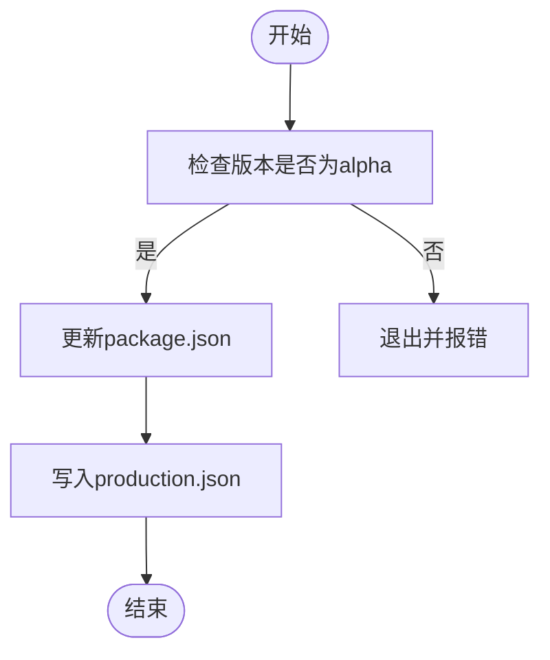
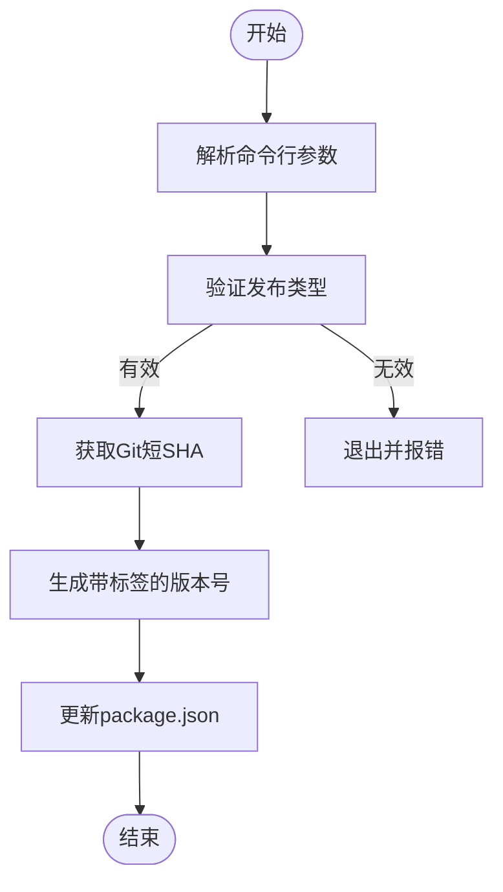
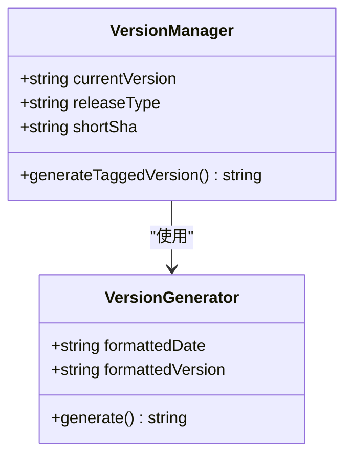
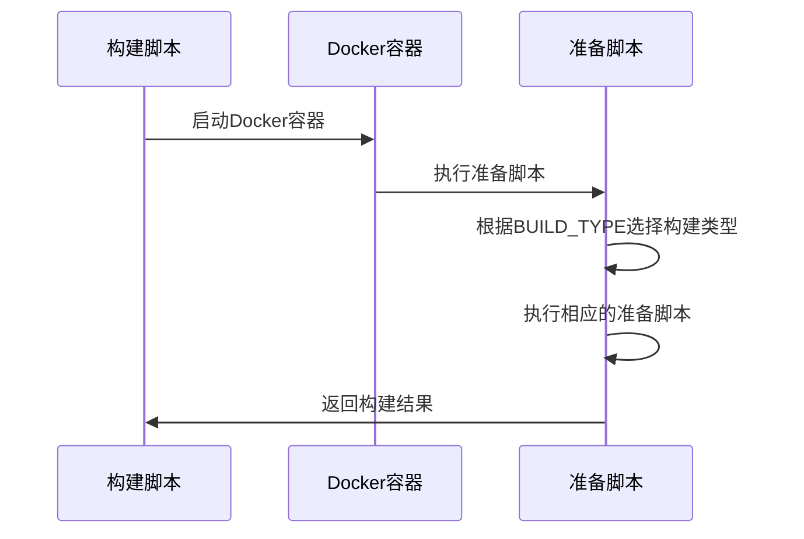

# Staging构建

<cite>
**本文档中引用的文件**  
- [prepare_staging_build.js](file://scripts/prepare_staging_build.js)
- [prepare_tagged_version.js](file://scripts/prepare_tagged_version.js)
- [packageJson.js](file://scripts/packageJson.js)
- [version.std.ts](file://ts/util/version.std.ts)
- [staging.json](file://config/staging.json)
- [production.json](file://config/production.json)
- [default.json](file://config/default.json)
- [package.json](file://package.json)
- [build.sh](file://reproducible-builds/build.sh)
- [docker-entrypoint.sh](file://reproducible-builds/docker-entrypoint.sh)
</cite>

## 目录
1. [Staging构建概述](#staging构建概述)
2. [Staging构建用途与特点](#staging构建用途与特点)
3. [prepare_staging_build.js脚本实现细节](#prepare_staging_buildjs脚本实现细节)
4. [prepare_tagged_version.js脚本实现细节](#prepare_tagged_versionjs脚本实现细节)
5. [生产环境配置应用](#生产环境配置应用)
6. [版本标签管理](#版本标签管理)
7. [发布准备流程](#发布准备流程)
8. [特殊处理流程](#特殊处理流程)
9. [常见问题与解决方案](#常见问题与解决方案)

## Staging构建概述

Staging构建是Signal-Desktop项目中用于最终验证、发布候选版本测试和生产环境模拟的关键构建流程。该流程通过`prepare_staging_build.js`和`prepare_tagged_version.js`脚本实现，确保构建的版本能够准确反映生产环境的行为，同时允许开发团队进行最后的验证和测试。

**Section sources**
- [prepare_staging_build.js](file://scripts/prepare_staging_build.js#L1-L95)
- [prepare_tagged_version.js](file://scripts/prepare_tagged_version.js#L1-L38)

## Staging构建用途与特点

Staging构建主要用于以下几个方面：
- **最终验证**：在发布到生产环境之前，对新版本进行全面的功能和性能验证。
- **发布候选版本测试**：作为发布候选版本（Release Candidate），供内部团队和外部测试人员进行测试。
- **生产环境模拟**：模拟生产环境的配置和行为，确保构建的版本在生产环境中能够正常运行。

Staging构建的特点包括：
- 使用`staging`作为版本前缀，以区别于其他构建类型。
- 启用开发工具（DevTools），便于调试和问题排查。
- 使用特定的配置文件（如`staging.json`），以确保与生产环境的一致性。

**Section sources**
- [staging.json](file://config/staging.json#L1-L5)
- [default.json](file://config/default.json#L1-L36)

## prepare_staging_build.js脚本实现细节

`prepare_staging_build.js`脚本负责准备Staging构建所需的环境和配置。其主要功能包括：
- 验证当前版本是否为alpha版本，确保只有alpha版本可以转换为staging版本。
- 更新`package.json`文件中的关键字段，如版本号、应用名称、产品名称、应用ID等，以反映Staging构建的特性。
- 生成并写入`production.json`文件，包含更新启用和CI模式的配置。

**Diagram sources**
- [prepare_staging_build.js](file://scripts/prepare_staging_build.js#L1-L95)

**Section sources**
- [prepare_staging_build.js](file://scripts/prepare_staging_build.js#L1-L95)

## prepare_tagged_version.js脚本实现细节

`prepare_tagged_version.js`脚本负责生成带有标签的版本号。其主要功能包括：
- 接收发布类型（alpha、axolotl、adhoc）作为参数，确保输入的有效性。
- 从Git仓库获取短SHA值，用于生成唯一的版本标识。
- 调用`generateTaggedVersion`函数，根据当前版本、发布类型和短SHA值生成新的版本号。
- 更新`package.json`文件中的版本号字段。

**Diagram sources**
- [prepare_tagged_version.js](file://scripts/prepare_tagged_version.js#L1-L38)

**Section sources**
- [prepare_tagged_version.js](file://scripts/prepare_tagged_version.js#L1-L38)

## 生产环境配置应用

Staging构建通过应用生产环境配置来确保与生产环境的一致性。具体配置包括：
- **服务器URL**：使用`chat.signal.org`作为聊天服务器的URL。
- **存储URL**：使用`storage.signal.org`作为存储服务器的URL。
- **目录URL**：使用`cdsi.signal.org`作为目录服务器的URL。
- **CDN配置**：配置多个CDN节点，以提高资源加载速度。
- **SFU URL**：使用`sfu.voip.signal.org`作为SFU服务器的URL。
- **挑战URL**：配置生成验证码的URL。
- **注册挑战URL**：配置注册验证码的URL。
- **Stripe发布密钥**：配置Stripe支付的发布密钥。
- **更新启用**：启用自动更新功能。

这些配置确保Staging构建能够在与生产环境相同的网络条件下运行，从而提供更准确的测试结果。

**Section sources**
- [production.json](file://config/production.json#L1-L24)

## 版本标签管理

版本标签管理是Staging构建中的重要环节，通过`generateTaggedVersion`函数实现。该函数根据当前版本、发布类型和Git短SHA值生成唯一的版本号。生成的版本号格式为`{主版本}.{次版本}.{修订版本}-{发布类型}.{日期时间}.{短SHA}`，确保每个构建都有唯一的标识。

**Diagram sources**
- [version.std.ts](file://ts/util/version.std.ts#L36-L67)

**Section sources**
- [version.std.ts](file://ts/util/version.std.ts#L36-L67)

## 发布准备流程

发布准备流程通过`reproducible-builds`目录下的脚本实现，确保构建过程的可重复性和一致性。具体流程包括：
- **Docker容器准备**：使用Docker容器来隔离构建环境，确保依赖项的一致性。
- **构建类型选择**：根据`BUILD_TYPE`环境变量选择不同的构建类型（如public、alpha、staging等）。
- **脚本执行**：根据构建类型执行相应的准备脚本，如`prepare-beta-build`、`prepare-alpha-version`、`prepare-staging-build`等。
- **目标平台构建**：根据`BUILD_TARGETS`环境变量指定的目标平台（如deb、appimage）进行构建。

**Diagram sources**
- [build.sh](file://reproducible-builds/build.sh#L1-L36)
- [docker-entrypoint.sh](file://reproducible-builds/docker-entrypoint.sh#L41-L73)

**Section sources**
- [build.sh](file://reproducible-builds/build.sh#L1-L36)
- [docker-entrypoint.sh](file://reproducible-builds/docker-entrypoint.sh#L41-L73)

## 特殊处理流程

Staging构建中的特殊处理流程包括安全检查、性能优化和兼容性验证。这些流程确保构建的版本在生产环境中能够安全、高效地运行。

- **安全检查**：通过`flipFuses`函数禁用`ELECTRON_RUN_AS_NODE`，启用Cookie加密，确保应用的安全性。
- **性能优化**：使用`esbuild`进行代码打包和压缩，减少应用的启动时间和内存占用。
- **兼容性验证**：通过`reproducible-builds`脚本确保构建过程的可重复性，避免因环境差异导致的问题。

**Section sources**
- [fuse-electron.node.ts](file://ts/scripts/fuse-electron.node.ts#L1-L41)
- [esbuild.js](file://scripts/esbuild.js#L90-L151)

## 常见问题与解决方案

在Staging构建过程中，可能会遇到一些常见问题，如配置差异、版本管理错误和发布流程中断。以下是这些问题的解决方案：

- **配置差异**：确保`staging.json`和`production.json`文件中的配置一致，避免因配置差异导致的问题。
- **版本管理错误**：使用`generateTaggedVersion`函数生成唯一的版本号，避免版本冲突。
- **发布流程中断**：通过Docker容器隔离构建环境，确保构建过程的稳定性和可重复性。

**Section sources**
- [staging.json](file://config/staging.json#L1-L5)
- [production.json](file://config/production.json#L1-L24)
- [version.std.ts](file://ts/util/version.std.ts#L36-L67)
- [build.sh](file://reproducible-builds/build.sh#L1-L36)
- [docker-entrypoint.sh](file://reproducible-builds/docker-entrypoint.sh#L41-L73)