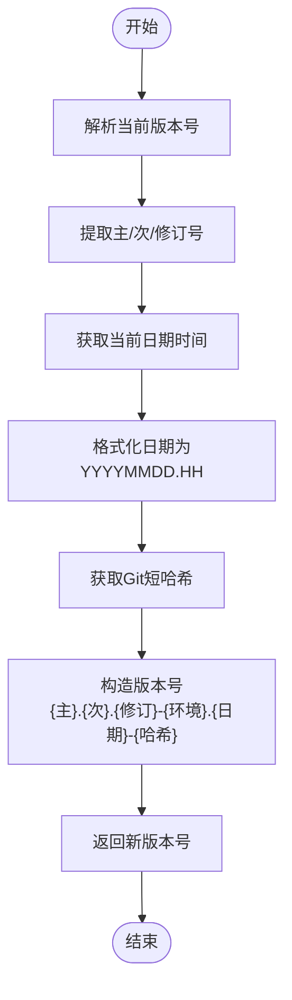
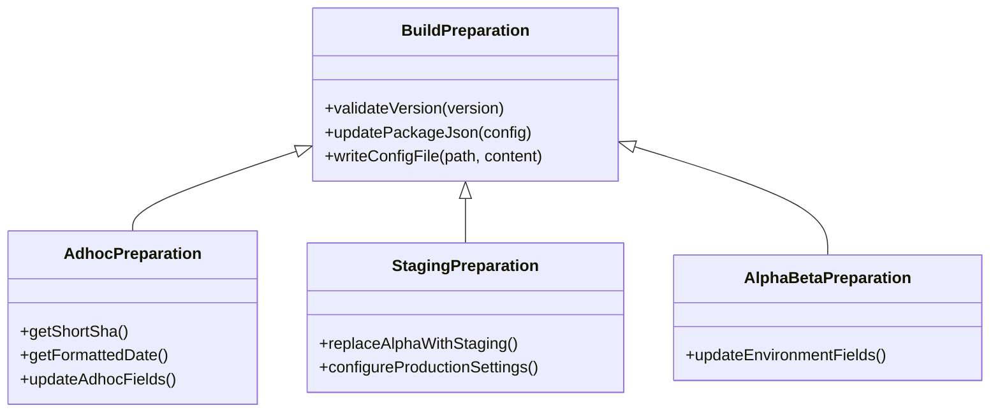

# 环境特定构建

<cite>
**本文档中引用的文件**  
- [prepare_adhoc_build.js](file://scripts/prepare_adhoc_build.js)
- [prepare_alpha_build.js](file://scripts/prepare_alpha_build.js)
- [prepare_beta_build.js](file://scripts/prepare_beta_build.js)
- [prepare_staging_build.js](file://scripts/prepare_staging_build.js)
- [prepare_tagged_version.js](file://scripts/prepare_tagged_version.js)
- [version.std.ts](file://ts/util/version.std.ts)
- [packageJson.js](file://scripts/packageJson.js)
- [package.json](file://package.json)
- [default.json](file://config/default.json)
- [staging.json](file://config/staging.json)
- [development.json](file://config/development.json)
</cite>

## 目录
1. [简介](#简介)
2. [构建环境概述](#构建环境概述)
3. [版本管理机制](#版本管理机制)
4. [准备脚本实现细节](#准备脚本实现细节)
5. [配置文件差异与应用场景](#配置文件差异与应用场景)
6. [特殊处理流程](#特殊处理流程)
7. [常见问题与解决方案](#常见问题与解决方案)

## 简介
Signal-Desktop项目通过一系列准备脚本来支持不同环境的构建，包括adhoc、alpha、beta和staging等。这些脚本确保了各环境构建产物的独立性和可区分性，同时允许并行安装不同版本的应用程序。本文档详细说明这些构建准备流程的具体实现和使用方法。

## 构建环境概述
Signal-Desktop定义了多种构建环境，每种环境都有其特定用途和标识：

- **Adhoc构建**：用于临时测试和开发验证，具有时间戳和Git提交哈希的唯一标识
- **Alpha构建**：内部测试版本，用于功能验证和早期反馈
- **Beta构建**：公开测试版本，面向更广泛的测试用户群体
- **Staging构建**：预生产环境，用于最终验证和发布前测试

这些环境通过不同的准备脚本进行配置，确保构建产物在名称、标识符和行为上都有明确区分。

**Section sources**
- [prepare_adhoc_build.js](file://scripts/prepare_adhoc_build.js)
- [prepare_alpha_build.js](file://scripts/prepare_alpha_build.js)
- [prepare_beta_build.js](file://scripts/prepare_beta_build.js)
- [prepare_staging_build.js](file://scripts/prepare_staging_build.js)

## 版本管理机制
Signal-Desktop使用语义化版本控制（SemVer）来管理不同环境的版本号。版本管理的核心逻辑位于`version.std.ts`文件中，通过一系列函数来判断版本类型。

### 版本类型检测
系统通过解析版本号的预发布标识符来确定版本类型：
- `isAlpha(version)`：检测版本是否为alpha版本
- `isBeta(version)`：检测版本是否为beta版本
- `isAdhoc(version)`：检测版本是否为adhoc版本
- `isStaging(version)`：检测版本是否为staging版本

### 临时版本生成
`generateTaggedVersion`函数负责生成带有时间戳和Git哈希的临时版本号。该函数从当前版本中提取主版本号、次版本号和修订号，然后添加环境标识、格式化日期和短Git哈希，形成唯一的版本标识。

**Diagram sources**
- [version.std.ts](file://ts/util/version.std.ts#L36-L67)

**Section sources**
- [version.std.ts](file://ts/util/version.std.ts#L6-L67)

## 准备脚本实现细节
各环境的准备脚本遵循相似的实现模式，但针对特定环境进行了定制化配置。

### Adhoc构建准备
`prepare_adhoc_build.js`脚本为临时构建生成唯一的标识符，包含日期和Git提交哈希：

1. 验证当前版本是否为adhoc版本
2. 获取Git短哈希
3. 生成格式化日期（YYYYMMDD）
4. 更新package.json中的多个字段，包括：
   - 应用名称（name）
   - 产品名称（productName）
   - 应用ID（appId）
   - 可执行文件名（executableName）
   - 桌面文件名（desktopName）

这种命名策略确保了每个adhoc构建都是唯一的，便于开发人员区分和管理。

### Alpha/Beta构建准备
`prepare_alpha_build.js`和`prepare_beta_build.js`脚本的实现非常相似，主要区别在于版本验证：

1. 验证当前版本是否符合预期的预发布类型
2. 更新package.json中的关键字段，添加环境后缀
3. 确保构建产物具有独特的标识，避免与生产版本冲突

这些脚本通过修改应用ID、产品名称和可执行文件名，确保alpha和beta版本可以与生产版本并行安装。

### Staging构建准备
`prepare_staging_build.js`脚本除了执行与其他环境类似的package.json修改外，还包含额外的配置：

1. 将版本号中的"alpha"替换为"staging"
2. 更新package.json中的所有标识字段
3. 生成并写入`config/production.json`配置文件，启用更新功能并设置CI模式为"benchmark"

这种双重配置确保了staging环境既具有独特的应用标识，又具有特定的运行时行为。

**Diagram sources**
- [prepare_adhoc_build.js](file://scripts/prepare_adhoc_build.js#L1-L104)
- [prepare_alpha_build.js](file://scripts/prepare_alpha_build.js#L1-L82)
- [prepare_beta_build.js](file://scripts/prepare_beta_build.js#L1-L81)
- [prepare_staging_build.js](file://scripts/prepare_staging_build.js#L1-L95)

**Section sources**
- [prepare_adhoc_build.js](file://scripts/prepare_adhoc_build.js#L1-L104)
- [prepare_alpha_build.js](file://scripts/prepare_alpha_build.js#L1-L82)
- [prepare_beta_build.js](file://scripts/prepare_beta_build.js#L1-L81)
- [prepare_staging_build.js](file://scripts/prepare_staging_build.js#L1-L95)

## 配置文件差异与应用场景
不同环境使用不同的配置文件来控制应用行为，这些配置文件位于`config/`目录下。

### 默认配置
`default.json`文件包含staging环境的服务器端点和安全配置，是大多数非生产环境的基础配置。它指定了staging环境的聊天服务器、存储服务器和目录服务器URL。

### 开发环境配置
`development.json`文件启用了开发人员工具（openDevTools），并设置了存储配置文件为"development"，便于开发调试。

### Staging环境配置
`staging.json`文件同样启用了开发人员工具，但使用"staging"存储配置文件，用于预生产环境的测试和验证。

这些配置文件的分层设计允许通过环境变量或构建脚本选择适当的配置，确保应用在不同环境中连接到正确的后端服务。

**Section sources**
- [default.json](file://config/default.json#L1-L36)
- [development.json](file://config/development.json#L1-L5)
- [staging.json](file://config/staging.json#L1-L5)

## 特殊处理流程
不同环境的构建包含特定的特殊处理流程，以满足各自的测试和发布需求。

### 代码注入与功能开关
某些环境构建会注入特定的代码或启用功能开关。例如，staging构建会生成特殊的`production.json`配置文件，启用更新功能并设置基准测试模式。

### 调试信息添加
开发和测试环境通常会包含额外的调试信息和日志记录功能，帮助开发人员诊断问题。这些功能在生产构建中会被禁用。

### 构建产物标记
所有非生产构建都会在应用名称、产品名称和可执行文件名中添加环境后缀，确保用户能够清楚地识别当前运行的版本类型。

## 常见问题与解决方案
在环境特定构建过程中可能会遇到一些常见问题，以下是相应的解决方案。

### 版本冲突
当版本号不符合预期格式时，准备脚本会验证失败。确保在运行准备脚本前，package.json中的版本号符合相应的预发布格式要求。

### 配置错误
错误的配置可能导致应用连接到错误的服务器或行为异常。通过严格的配置文件管理和环境变量验证来避免此类问题。

### 构建产物混淆
由于命名冲突导致的构建产物混淆问题通过独特的命名策略解决。每个环境使用不同的应用ID、产品名称和可执行文件名，确保系统能够区分不同版本。