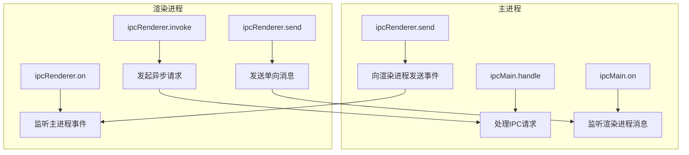
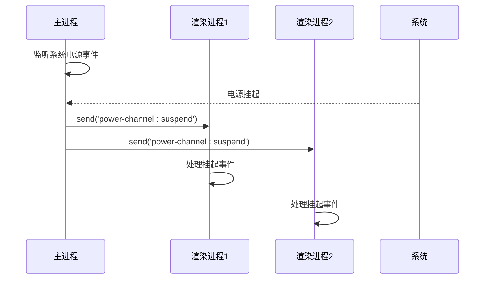

# IPC通信机制

<cite>
**本文档中引用的文件**   
- [attachment_channel.main.ts](file://app/attachment_channel.main.ts)
- [sql_channel.main.ts](file://app/sql_channel.main.ts)
- [global_errors.main.ts](file://app/global_errors.main.ts)
- [main.main.ts](file://app/main.main.ts)
- [preload.wrapper.ts](file://preload.wrapper.ts)
- [windows/main/preload.preload.ts](file://ts/windows/main/preload.preload.ts)
- [windows/main/start.preload.ts](file://ts/windows/main/start.preload.ts)
- [context/config.preload.ts](file://ts/context/config.preload.ts)
- [windows/screenShare/preload.preload.ts](file://ts/windows/screenShare/preload.preload.ts)
- [main/powerChannel.main.ts](file://ts/main/powerChannel.main.ts)
- [util/createIPCEvents.preload.ts](file://ts/util/createIPCEvents.preload.ts)
- [background.preload.ts](file://ts/background.preload.ts)
</cite>

## 目录
1. [引言](#引言)
2. [IPC架构概述](#ipc架构概述)
3. [预加载脚本与安全桥梁](#预加载脚本与安全桥梁)
4. [核心IPC通道实现](#核心ipc通道实现)
5. [通信协议设计原则](#通信协议设计原则)
6. [通信模式与最佳实践](#通信模式与最佳实践)
7. [错误处理与安全考虑](#错误处理与安全考虑)
8. [结论](#结论)

## 引言

Signal-Desktop应用程序采用Electron框架构建，该框架结合了Chromium渲染引擎和Node.js运行时。这种架构将应用程序分为两个主要进程：主进程（main process）和渲染进程（renderer process）。主进程负责管理应用程序生命周期、窗口创建和系统级操作，而渲染进程则负责用户界面的呈现。进程间通信（IPC）机制是连接这两个进程的关键，它允许渲染进程安全地请求主进程执行特权操作，如文件系统访问、数据库查询和系统通知。

## IPC架构概述

Signal-Desktop的IPC架构基于Electron的`ipcMain`和`ipcRenderer`模块构建，采用请求-响应和事件发布-订阅模式进行通信。主进程通过`ipcMain.handle`方法注册通道，等待来自渲染进程的请求。渲染进程则使用`ipcRenderer.invoke`发起异步请求，或使用`ipcRenderer.send`发送单向消息。对于事件通知，主进程使用`ipcRenderer.send`向渲染进程广播事件，而渲染进程通过`ipcRenderer.on`监听这些事件。

**图源**
- [main.main.ts](file://app/main.main.ts)
- [windows/main/preload.preload.ts](file://ts/windows/main/preload.preload.ts)

## 预加载脚本与安全桥梁

预加载脚本是Signal-Desktop IPC安全模型的核心。它们作为主进程和渲染进程之间的受控桥梁，暴露有限的、经过严格审查的API给渲染进程。预加载脚本在渲染进程的上下文中运行，但可以访问Node.js和Electron的完整API。通过`contextBridge.exposeInMainWorld`，预加载脚本可以将一个安全的、沙箱化的对象暴露给渲染进程的全局作用域，从而防止恶意代码直接访问危险的API。

**图源**
- [windows/main/preload.preload.ts](file://ts/windows/main/preload.preload.ts)
- [windows/main/start.preload.ts](file://ts/windows/main/start.preload.ts)

**本节来源**
- [windows/main/preload.preload.ts](file://ts/windows/main/preload.preload.ts#L1-L28)
- [windows/main/start.preload.ts](file://ts/windows/main/start.preload.ts#L145-L166)

## 核心IPC通道实现

### 附件处理通道

附件处理通道（`attachment_channel.main.ts`）负责安全地提供加密附件文件的流式访问。它通过自定义的`attachment://`协议处理程序实现，允许渲染进程请求特定附件的字节范围。主进程验证请求的路径是否在允许的目录内，然后根据附件的加密状态（明文或密文）解密并流式传输数据。该通道支持HTTP范围请求，允许浏览器高效地加载大文件的部分内容。

**本节来源**
- [attachment_channel.main.ts](file://app/attachment_channel.main.ts#L1-L794)

### SQL查询通道

SQL查询通道（`sql_channel.main.ts`）为渲染进程提供了一个安全的接口来执行数据库操作。它通过`ipcMain.handle`注册了`sql-channel:read`和`sql-channel:write`等通道。渲染进程通过`ipcRenderer.invoke`调用这些通道，传入要执行的SQL操作名称和参数。主进程在接收到请求后，会调用底层的`MainSQL`实例执行查询，并将结果包装在一个包含`ok`标志和`value`或`error`字段的对象中返回，确保错误不会直接暴露给渲染进程。

**本节来源**
- [sql_channel.main.ts](file://app/sql_channel.main.ts#L1-L104)

### 全局错误处理通道

全局错误处理通道（`global_errors.main.ts`）负责捕获和处理主进程中未捕获的异常和渲染进程崩溃事件。它通过监听`process.on('uncaughtException')`和`app.on('render-process-gone')`等事件来实现。当发生严重错误时，它会显示一个错误对话框，允许用户复制错误信息并退出应用程序，确保应用程序不会在不稳定的状态下继续运行。

**本节来源**
- [global_errors.main.ts](file://app/global_errors.main.ts#L1-L85)

## 通信协议设计原则

### 异步处理与错误传播

Signal-Desktop的IPC通信严格遵循异步原则。所有`ipcMain.handle`处理器都返回一个Promise，这使得主进程可以执行可能耗时的I/O操作（如文件读取或数据库查询）而不会阻塞。为了确保错误被正确处理，`wrapResult`函数被用来包装每个SQL处理器，它将任何抛出的错误捕获并序列化，然后返回一个包含`ok: false`和`error`对象的响应。渲染进程在接收到响应后，必须检查`ok`标志以确定操作是否成功。

### 超时机制

虽然代码库中没有显式的IPC超时设置，但应用程序通过其他机制实现了超时控制。例如，在处理附件流时，`GROWING_FILE_TIMEOUT`常量（15秒）用于防止对正在下载的文件的请求无限期挂起。此外，应用程序使用`LongTimeout`类来管理长时间运行的定时器，确保即使在长时间延迟后，回调也能被正确执行。

**本节来源**
- [sql_channel.main.ts](file://app/sql_channel.main.ts#L30-L48)
- [attachment_channel.main.ts](file://app/attachment_channel.main.ts#L88)
- [util/timeout.std.ts](file://ts/util/timeout.std.ts#L42-L102)

## 通信模式与最佳实践

### 请求-响应模式

这是最常用的IPC模式，用于需要从主进程获取数据或执行操作并等待结果的场景。例如，渲染进程通过`ipcRenderer.invoke('get-config')`同步获取配置信息。这种模式简单直接，但应避免用于长时间运行的操作，以免阻塞渲染进程。

### 事件发布-订阅模式

此模式用于主进程向一个或多个渲染进程广播状态变化。例如，`powerChannel.main.ts`监听系统的电源事件（如`suspend`或`resume`），并在发生时通过`ipcRenderer.send`向所有渲染进程发送`power-channel:suspend`事件。渲染进程通过`ipcRenderer.on`订阅这些事件，以便在系统休眠时暂停后台任务。

**图源**
- [main/powerChannel.main.ts](file://ts/main/powerChannel.main.ts#L1-L30)

### 双向通信

在某些情况下，需要建立更持久的双向通信通道。`createIPCEvents`函数创建了一个包含getter、setter和callback的综合对象，通过`contextBridge`暴露给渲染进程。这允许渲染进程不仅调用方法，还能监听来自主进程的更新事件，例如`onZoomFactorChange`，从而实现更动态的交互。

**本节来源**
- [util/createIPCEvents.preload.ts](file://ts/util/createIPCEvents.preload.ts#L1-L471)

## 错误处理与安全考虑

### 输入验证与路径安全

IPC处理器在执行任何操作之前都会进行严格的输入验证。例如，附件通道使用`isPathInside`函数确保请求的文件路径位于预定义的安全目录（如`attachmentsDir`或`downloadsDir`）内，防止路径遍历攻击。此外，所有传入的字符串参数都会经过解析和验证，例如使用`zod`库来验证`disposition`参数的值。

### 数据清理与序列化

为了确保跨进程传输的数据是安全且可序列化的，Signal-Desktop使用`cleanDataForIpc`函数来清理数据。该函数会移除`undefined`、`null`值和`Symbol`，并将`Set`等不可序列化的对象转换为数组。这防止了在`postMessage`或`JSON.stringify`过程中出现意外行为。

### 权限最小化

预加载脚本遵循权限最小化原则，只暴露渲染进程绝对需要的功能。例如，`about`窗口的预加载脚本只暴露了应用环境和平台信息，而`screenShare`窗口的预加载脚本只暴露了停止共享和获取状态的方法。这大大减少了攻击面。

**本节来源**
- [attachment_channel.main.ts](file://app/attachment_channel.main.ts#L617-L618)
- [test-node/sql/cleanDataForIpc_test.std.ts](file://ts/test-node/sql/cleanDataForIpc_test.std.ts#L92-L152)
- [windows/about/preload.preload.ts](file://ts/windows/about/preload.preload.ts#L1-L23)
- [windows/screenShare/preload.preload.ts](file://ts/windows/screenShare/preload.preload.ts#L1-L35)

## 结论

Signal-Desktop的IPC机制是一个精心设计的系统，它在提供强大功能的同时，优先考虑了安全性和稳定性。通过利用Electron的原生IPC功能、`contextBridge`进行安全暴露以及严格的输入验证，该应用程序成功地在隔离的渲染进程和拥有系统权限的主进程之间建立了安全的通信通道。其模块化的通道设计（如附件、SQL和全局错误处理）使得代码易于维护和扩展。最佳实践，如异步处理、错误封装和权限最小化，确保了应用程序的健壮性。这种架构为构建安全、高性能的桌面应用程序提供了一个优秀的范例。