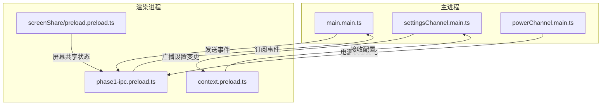
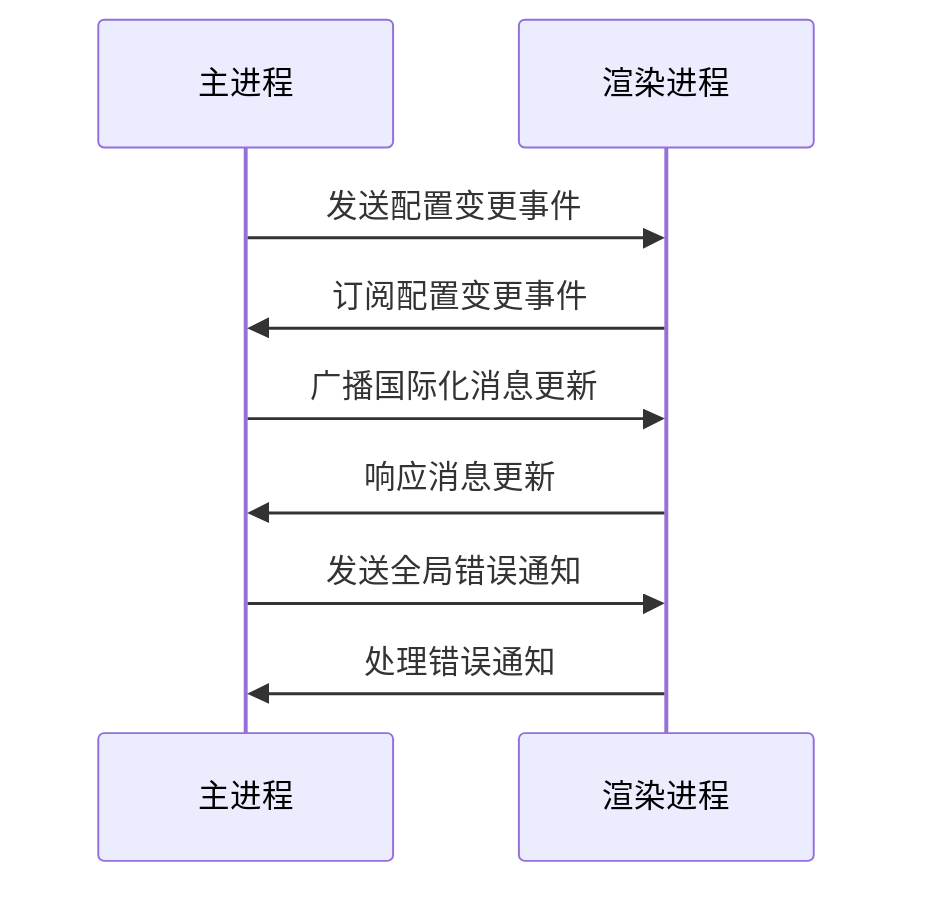
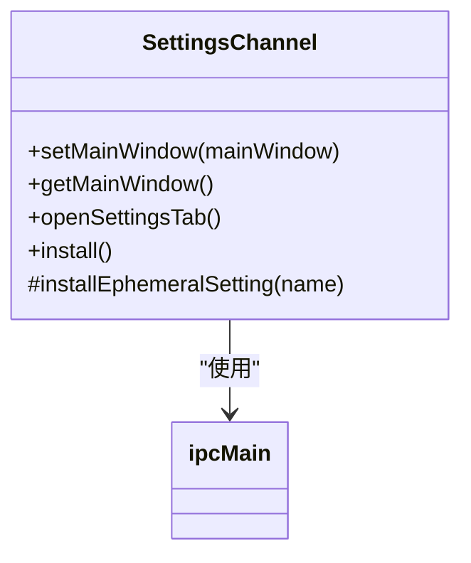
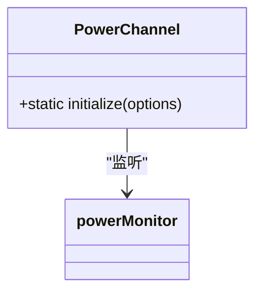
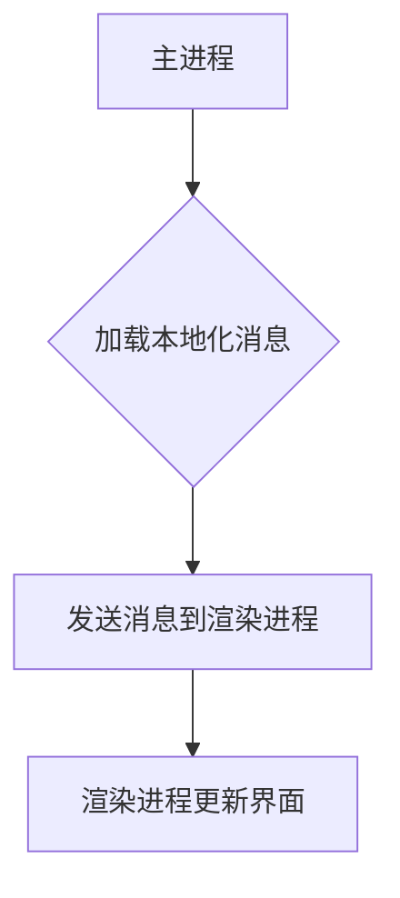
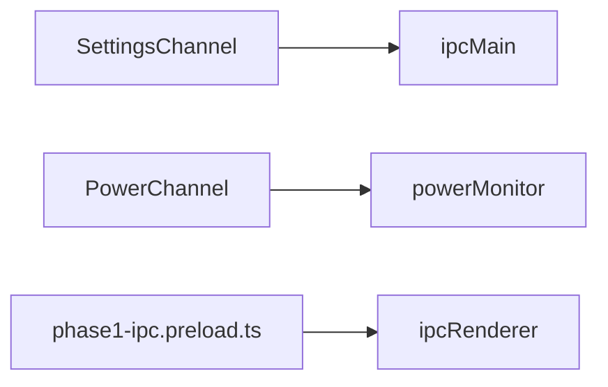

# 事件驱动IPC通信

<cite>
**本文档中引用的文件**  
- [main.main.ts](file://app/main.main.ts)
- [phase1-ipc.preload.ts](file://ts/windows/main/phase1-ipc.preload.ts)
- [settingsChannel.main.ts](file://ts/main/settingsChannel.main.ts)
- [powerChannel.main.ts](file://ts/main/powerChannel.main.ts)
- [screenShare/preload.preload.ts](file://ts/windows/screenShare/preload.preload.ts)
- [locale.node.ts](file://app/locale.node.ts)
- [EventTarget.std.ts](file://ts/textsecure/EventTarget.std.ts)
- [context.preload.ts](file://ts/windows/context.preload.ts)
</cite>

## 目录
1. [简介](#简介)
2. [项目结构](#项目结构)
3. [核心组件](#核心组件)
4. [架构概述](#架构概述)
5. [详细组件分析](#详细组件分析)
6. [依赖分析](#依赖分析)
7. [性能考虑](#性能考虑)
8. [故障排除指南](#故障排除指南)
9. [结论](#结论)

## 简介
Signal-Desktop 使用事件驱动的 IPC（进程间通信）机制来实现主进程与渲染进程之间的通信。该系统基于 Electron 的 IPC 模块，通过事件订阅和发布模式实现双向通信。主进程负责广播事件，而渲染进程则订阅这些事件以响应状态变化。这种设计支持国际化消息更新、全局错误通知和配置变更等场景。

## 项目结构
Signal-Desktop 的项目结构清晰地分离了主进程和渲染进程的代码。主进程代码位于 `app/` 目录下，而渲染进程代码则分布在 `ts/` 目录中。事件驱动的 IPC 通信主要通过 `ipcMain` 和 `ipcRenderer` 模块实现，相关逻辑分布在多个文件中。

**图表来源**
- [main.main.ts](file://app/main.main.ts#L1-L800)
- [phase1-ipc.preload.ts](file://ts/windows/main/phase1-ipc.preload.ts#L1-L546)
- [settingsChannel.main.ts](file://ts/main/settingsChannel.main.ts#L1-L154)

**章节来源**
- [main.main.ts](file://app/main.main.ts#L1-L800)
- [phase1-ipc.preload.ts](file://ts/windows/main/phase1-ipc.preload.ts#L1-L546)

## 核心组件
Signal-Desktop 的事件驱动 IPC 通信系统由多个核心组件构成，包括主进程中的 `SettingsChannel` 和 `PowerChannel`，以及渲染进程中的 `phase1-ipc.preload.ts`。这些组件共同实现了事件的发布、订阅和处理。

**章节来源**
- [settingsChannel.main.ts](file://ts/main/settingsChannel.main.ts#L1-L154)
- [powerChannel.main.ts](file://ts/main/powerChannel.main.ts#L1-L30)

## 架构概述
Signal-Desktop 的事件驱动 IPC 通信架构基于 Electron 的 `ipcMain` 和 `ipcRenderer` 模块。主进程通过 `ipcMain.on` 监听事件，而渲染进程通过 `ipcRenderer.on` 订阅事件。事件通道的设计支持多种使用场景，包括国际化消息更新、全局错误通知和配置变更。

**图表来源**
- [main.main.ts](file://app/main.main.ts#L1-L800)
- [phase1-ipc.preload.ts](file://ts/windows/main/phase1-ipc.preload.ts#L1-L546)

## 详细组件分析

### SettingsChannel 分析
`SettingsChannel` 类负责管理设置相关的事件通信。它通过 `ipc.handle` 方法处理设置的获取和设置请求，并在设置变更时广播事件。

**图表来源**
- [settingsChannel.main.ts](file://ts/main/settingsChannel.main.ts#L1-L154)

### PowerChannel 分析
`PowerChannel` 类通过 `powerMonitor` 模块监听电源状态变化，并将这些变化作为事件广播给渲染进程。

**图表来源**
- [powerChannel.main.ts](file://ts/main/powerChannel.main.ts#L1-L30)

### 国际化消息更新
国际化消息更新通过 `locale.node.ts` 文件实现。主进程加载本地化消息并将其发送给渲染进程，渲染进程则根据当前语言环境更新界面。

**图表来源**
- [locale.node.ts](file://app/locale.node.ts#L1-L218)

**章节来源**
- [locale.node.ts](file://app/locale.node.ts#L1-L218)

## 依赖分析
Signal-Desktop 的事件驱动 IPC 通信系统依赖于 Electron 的 `ipcMain` 和 `ipcRenderer` 模块，以及 `powerMonitor` 模块。这些模块提供了事件通信和电源状态监听的基础功能。

**图表来源**
- [settingsChannel.main.ts](file://ts/main/settingsChannel.main.ts#L1-L154)
- [powerChannel.main.ts](file://ts/main/powerChannel.main.ts#L1-L30)
- [phase1-ipc.preload.ts](file://ts/windows/main/phase1-ipc.preload.ts#L1-L546)

**章节来源**
- [settingsChannel.main.ts](file://ts/main/settingsChannel.main.ts#L1-L154)
- [powerChannel.main.ts](file://ts/main/powerChannel.main.ts#L1-L30)

## 性能考虑
事件驱动的 IPC 通信在性能上具有优势，因为它避免了轮询机制的开销。然而，频繁的事件广播可能会导致性能问题，因此需要合理设计事件的触发条件和频率。

## 故障排除指南
在调试事件驱动的 IPC 通信时，可以通过日志记录事件的发送和接收情况。此外，可以使用 Electron 的开发者工具来监控 IPC 通信的状态。

**章节来源**
- [main.main.ts](file://app/main.main.ts#L1-L800)
- [phase1-ipc.preload.ts](file://ts/windows/main/phase1-ipc.preload.ts#L1-L546)

## 结论
Signal-Desktop 的事件驱动 IPC 通信系统通过 Electron 的 IPC 模块实现了主进程与渲染进程之间的高效通信。该系统支持多种使用场景，并通过合理的架构设计保证了性能和可维护性。