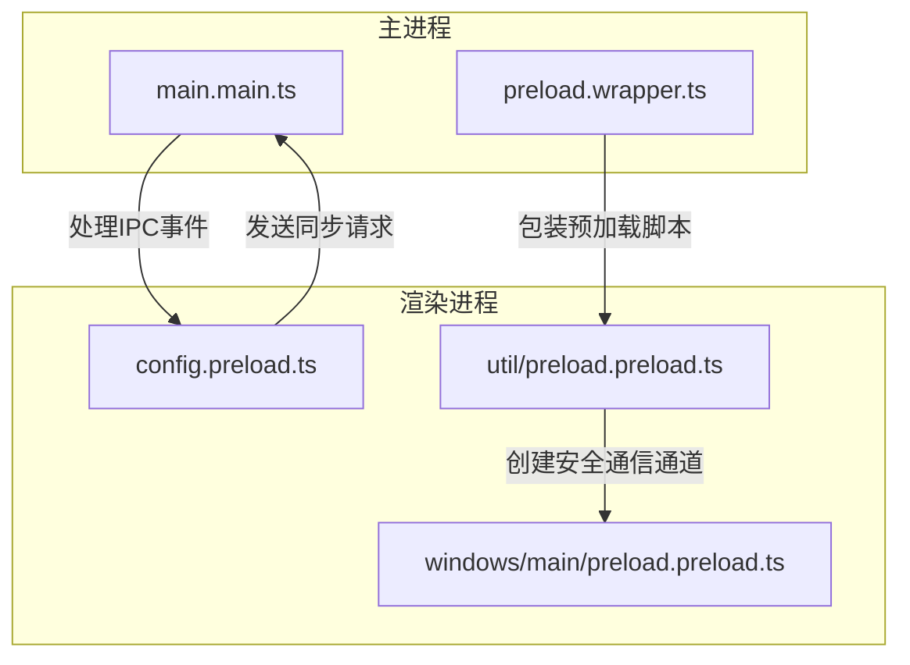
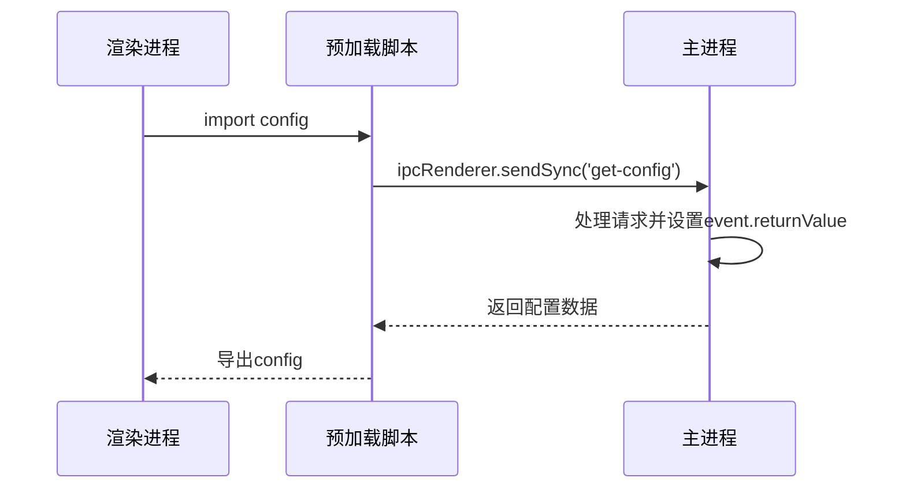
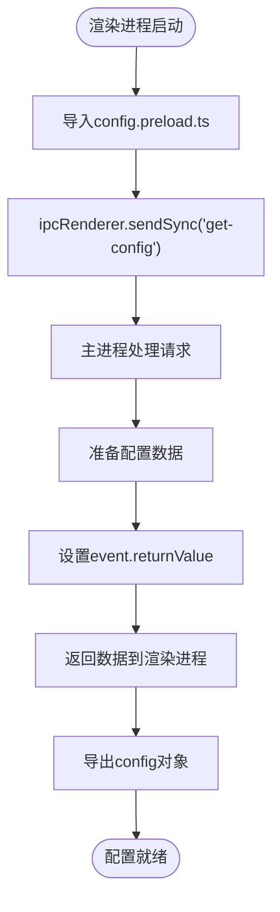
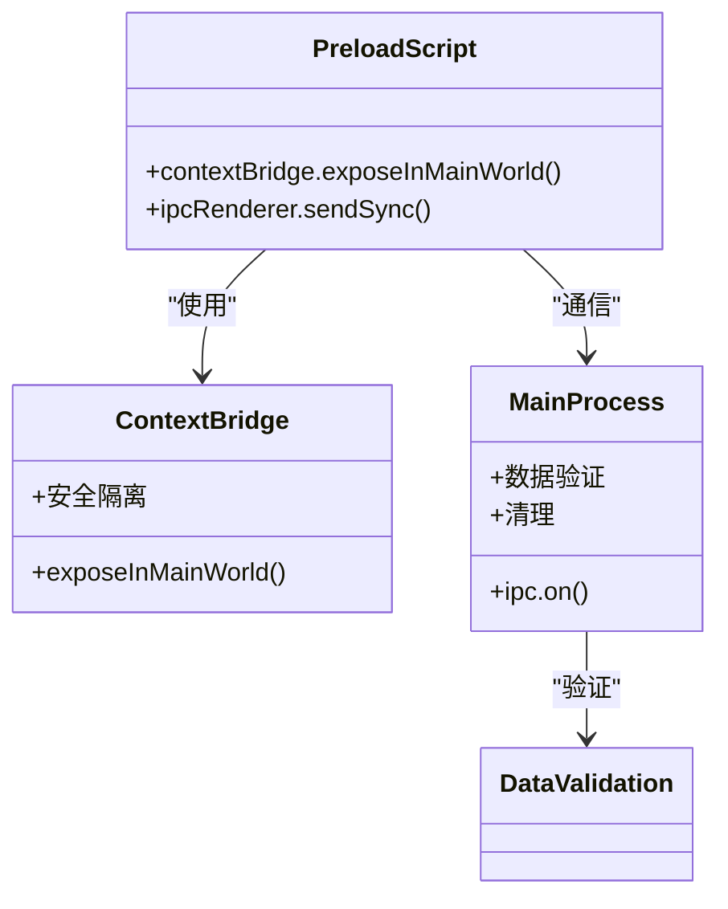
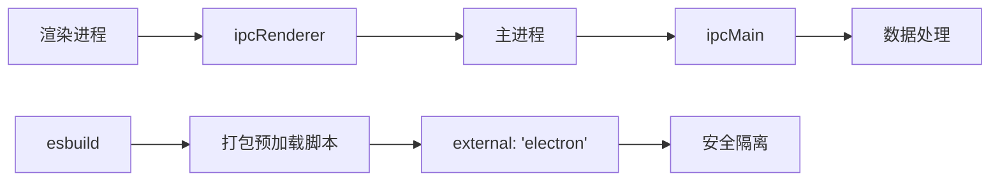

# 同步IPC通信

<cite>
**本文档引用的文件**  
- [config.preload.ts](file://ts/context/config.preload.ts)
- [main.main.ts](file://app/main.main.ts)
- [preload.preload.ts](file://ts/util/preload.preload.ts)
- [preload.wrapper.ts](file://preload.wrapper.ts)
- [phase1-ipc.preload.ts](file://ts/windows/main/phase1-ipc.preload.ts)
- [about\preload.preload.ts](file://ts/windows/about/preload.preload.ts)
- [debuglog\preload.preload.ts](file://ts/windows/debuglog/preload.preload.ts)
- [permissions\preload.preload.ts](file://ts/windows/permissions/preload.preload.ts)
- [esbuild.js](file://scripts/esbuild.js)
</cite>

## 目录
1. [引言](#引言)
2. [项目结构](#项目结构)
3. [核心组件](#核心组件)
4. [架构概述](#架构概述)
5. [详细组件分析](#详细组件分析)
6. [依赖分析](#依赖分析)
7. [性能考虑](#性能考虑)
8. [故障排除指南](#故障排除指南)
9. [结论](#结论)

## 引言
本文档详细描述了Signal-Desktop应用程序中同步IPC（进程间通信）的实现机制。文档深入探讨了主进程与渲染进程之间的直接调用和响应处理，重点分析了同步通信模式的安全设计，以及如何防止渲染进程执行危险操作。文档还记录了同步通信的使用场景、性能影响和最佳实践，并提供了实际代码示例来展示同步IPC调用的完整生命周期。

## 项目结构
Signal-Desktop项目采用模块化的文件组织结构，将不同功能的代码分离到不同的目录中。同步IPC通信的核心实现主要分布在`app`、`ts`和`scripts`目录中。`app`目录包含主进程的主入口文件`main.main.ts`，负责处理IPC事件。`ts`目录包含渲染进程的预加载脚本，这些脚本在渲染进程启动时执行，用于设置安全的通信通道。`scripts`目录包含构建脚本，用于打包和配置预加载脚本。

**图示来源**
- [main.main.ts](file://app/main.main.ts#L2777-L2868)
- [config.preload.ts](file://ts/context/config.preload.ts#L8)
- [preload.wrapper.ts](file://preload.wrapper.ts#L42-L47)
- [preload.preload.ts](file://ts/util/preload.preload.ts#L7)

## 核心组件
同步IPC通信的核心组件包括主进程中的`ipc.on`事件处理器和渲染进程中的`ipcRenderer.sendSync`调用。主进程通过`ipc.on`监听特定的IPC事件，如`get-config`，并在事件处理函数中设置`event.returnValue`来返回数据。渲染进程通过`ipcRenderer.sendSync`发送同步请求，并直接获取返回值。这种模式确保了配置数据在渲染进程启动时能够立即可用。

**节来源**
- [main.main.ts](file://app/main.main.ts#L2777-L2868)
- [config.preload.ts](file://ts/context/config.preload.ts#L8)

## 架构概述
Signal-Desktop的同步IPC通信架构基于Electron的`ipcRenderer.sendSync`和`ipcMain.on`机制。渲染进程在预加载脚本中通过`sendSync`发送同步请求，主进程在`main.main.ts`中通过`on`监听器接收请求并返回数据。为了安全起见，预加载脚本使用`contextBridge.exposeInMainWorld`将有限的API暴露给渲染进程，防止直接访问Node.js和Electron的危险API。

**图示来源**
- [config.preload.ts](file://ts/context/config.preload.ts#L8)
- [main.main.ts](file://app/main.main.ts#L2777-L2868)

## 详细组件分析
### 配置获取分析
配置获取是同步IPC通信的一个典型用例。渲染进程需要在启动时立即获取应用程序的配置，因此使用同步通信模式是必要的。`config.preload.ts`文件中的代码展示了如何通过`ipcRenderer.sendSync`获取配置数据。

**图示来源**
- [config.preload.ts](file://ts/context/config.preload.ts#L8)
- [main.main.ts](file://app/main.main.ts#L2777-L2868)

### 安全设计分析
Signal-Desktop通过多种机制确保同步IPC通信的安全性。首先，预加载脚本使用`contextBridge`将API暴露给渲染进程，而不是直接暴露`ipcRenderer`。其次，主进程对所有传入的数据进行严格的验证和清理，防止恶意数据注入。最后，构建脚本`esbuild.js`配置了外部依赖，确保预加载脚本不会意外包含危险的Node.js模块。

**图示来源**
- [preload.preload.ts](file://ts/util/preload.preload.ts#L4)
- [main.main.ts](file://app/main.main.ts#L2777-L2868)
- [esbuild.js](file://scripts/esbuild.js#L107)

## 依赖分析
同步IPC通信的实现依赖于Electron框架的`ipcRenderer`和`ipcMain`模块。构建系统依赖于`esbuild`来打包预加载脚本，并通过`external`配置确保`electron`模块不会被打包进预加载脚本中。这种设计确保了预加载脚本的轻量化和安全性。

**图示来源**
- [preload.wrapper.ts](file://preload.wrapper.ts#L7)
- [esbuild.js](file://scripts/esbuild.js#L107)
- [main.main.ts](file://app/main.main.ts#L2777)

## 性能考虑
同步IPC通信虽然能够确保数据的即时可用性，但也可能阻塞渲染进程的主线程。Signal-Desktop通过将同步通信限制在启动时的必要配置获取上，最小化了对性能的影响。对于非关键数据，应用程序使用异步IPC通信或其他机制来避免阻塞。

## 故障排除指南
当同步IPC通信出现问题时，首先应检查主进程和渲染进程的日志。常见的问题包括事件名称不匹配、数据序列化错误和安全上下文问题。确保预加载脚本正确配置了`contextBridge`，并且主进程正确处理了IPC事件。

**节来源**
- [main.main.ts](file://app/main.main.ts#L2777-L2868)
- [preload.wrapper.ts](file://preload.wrapper.ts#L26-L27)

## 结论
Signal-Desktop的同步IPC通信机制通过精心设计的架构和严格的安全措施，实现了主进程与渲染进程之间的高效、安全通信。通过限制同步通信的使用范围，并结合`contextBridge`和数据验证，应用程序在保证性能的同时，最大限度地减少了安全风险。