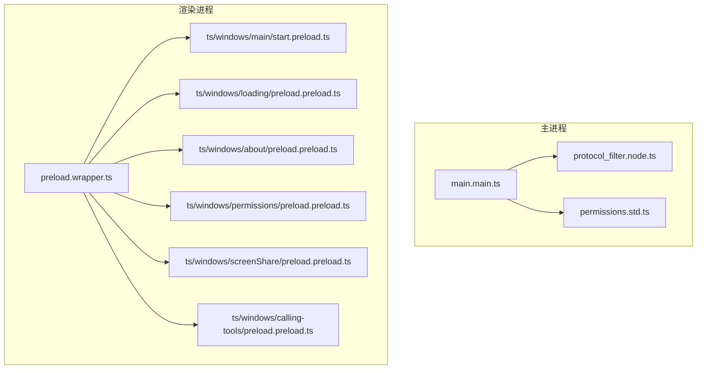
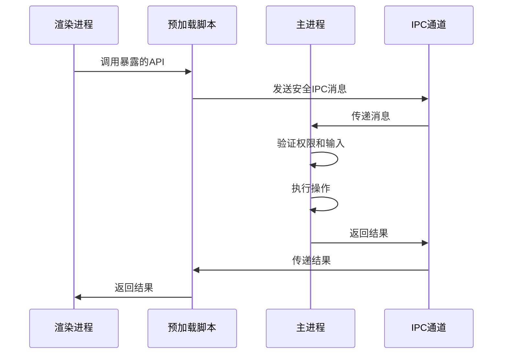
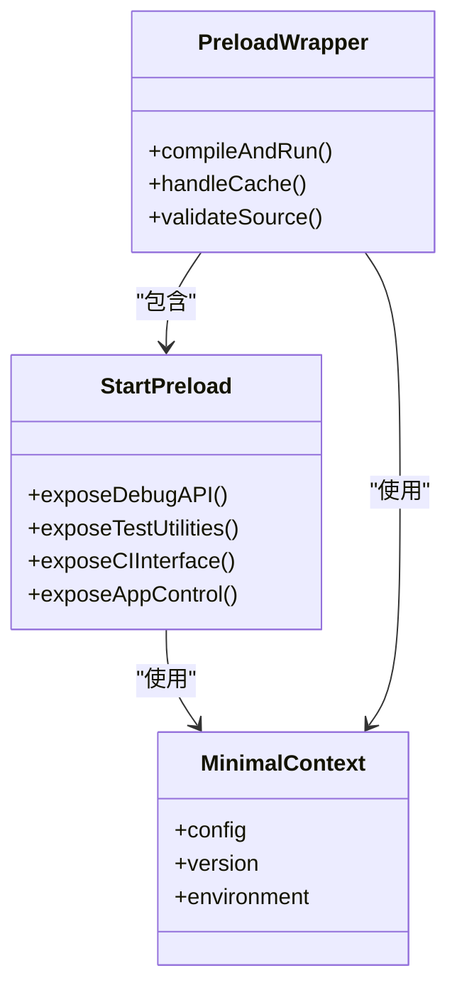
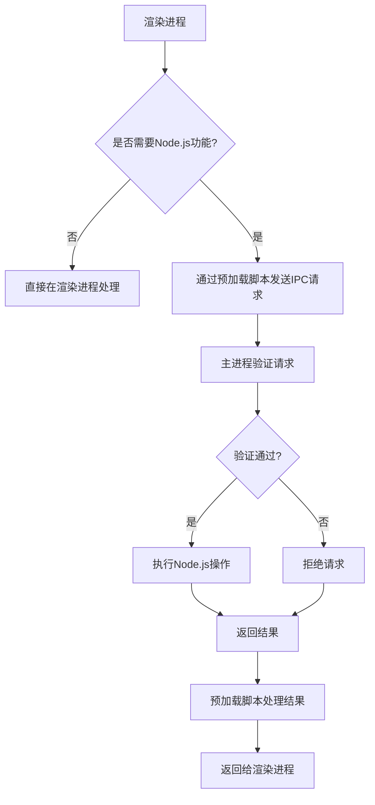
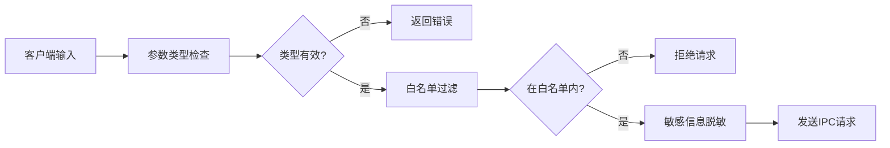
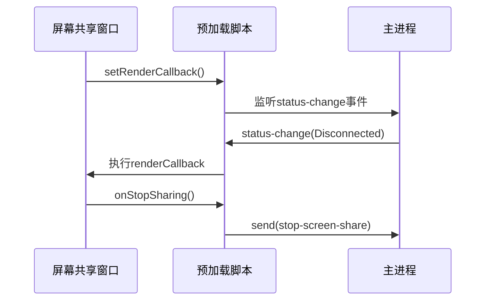
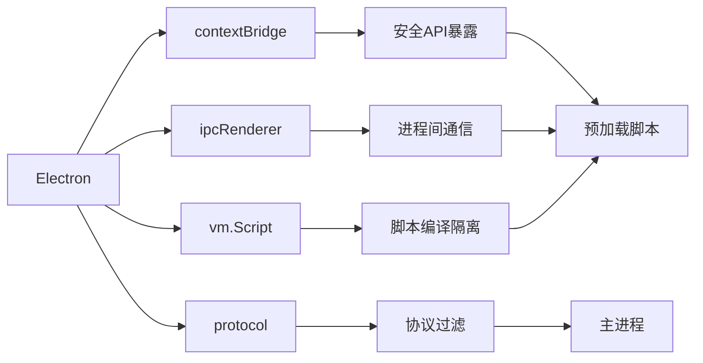

# 安全IPC通信策略

<cite>
**本文档中引用的文件**  
- [preload.wrapper.ts](file://preload.wrapper.ts)
- [ts/windows/main/start.preload.ts](file://ts/windows/main/start.preload.ts)
- [ts/windows/main/preload.preload.ts](file://ts/windows/main/preload.preload.ts)
- [ts/windows/loading/preload.preload.ts](file://ts/windows/loading/preload.preload.ts)
- [ts/windows/about/preload.preload.ts](file://ts/windows/about/preload.preload.ts)
- [ts/windows/permissions/preload.preload.ts](file://ts/windows/permissions/preload.preload.ts)
- [ts/windows/screenShare/preload.preload.ts](file://ts/windows/screenShare/preload.preload.ts)
- [ts/windows/calling-tools/preload.preload.ts](file://ts/windows/calling-tools/preload.preload.ts)
- [app/protocol_filter.node.ts](file://app/protocol_filter.node.ts)
- [app/permissions.std.ts](file://app/permissions.std.ts)
- [ts/textsecure/preconnect.preload.ts](file://ts/textsecure/preconnect.preload.ts)
- [ts/util/createHTTPSAgent.node.ts](file://ts/util/createHTTPSAgent.node.ts)
- [ts/test-node/sql/cleanDataForIpc_test.std.ts](file://ts/test-node/sql/cleanDataForIpc_test.std.ts)
</cite>

## 目录
1. [引言](#引言)
2. [项目结构](#项目结构)
3. [核心组件](#核心组件)
4. [架构概述](#架构概述)
5. [详细组件分析](#详细组件分析)
6. [依赖分析](#依赖分析)
7. [性能考虑](#性能考虑)
8. [故障排除指南](#故障排除指南)
9. [结论](#结论)

## 引言
Signal-Desktop 是一个注重隐私和安全的桌面通信应用，其安全IPC（进程间通信）策略是保障用户数据安全的核心机制。本文档深入探讨Signal-Desktop如何通过预加载脚本作为安全边界，防止XSS攻击和任意代码执行，并详细描述上下文隔离的实现机制、渲染进程与Node.js环境的分离策略。

## 项目结构
Signal-Desktop采用Electron框架构建，其项目结构清晰地划分了主进程、渲染进程和共享组件。安全IPC通信主要通过预加载脚本（preload scripts）实现，这些脚本位于`ts/windows/*/preload.preload.ts`路径下，为不同的窗口提供定制化的安全通信接口。

**图示来源**
- [preload.wrapper.ts](file://preload.wrapper.ts)
- [app/protocol_filter.node.ts](file://app/protocol_filter.node.ts)
- [app/permissions.std.ts](file://app/permissions.std.ts)

**本节来源**
- [preload.wrapper.ts](file://preload.wrapper.ts)
- [app/protocol_filter.node.ts](file://app/protocol_filter.node.ts)

## 核心组件
Signal-Desktop的安全IPC通信策略围绕预加载脚本构建，这些脚本作为渲染进程与主进程之间的安全桥梁。通过`contextBridge.exposeInMainWorld`方法，仅暴露必要的API给渲染进程，有效防止了直接访问Node.js环境带来的安全风险。

**本节来源**
- [ts/windows/main/start.preload.ts](file://ts/windows/main/start.preload.ts)
- [ts/windows/main/preload.preload.ts](file://ts/windows/main/preload.preload.ts)

## 架构概述
Signal-Desktop采用多层安全架构，通过预加载脚本实现上下文隔离，确保渲染进程无法直接访问Node.js的危险API。主进程通过IPC通道接收来自渲染进程的安全请求，并在验证后执行相应操作。

**图示来源**
- [ts/windows/main/start.preload.ts](file://ts/windows/main/start.preload.ts)
- [app/protocol_filter.node.ts](file://app/protocol_filter.node.ts)

## 详细组件分析

### 预加载脚本设计
预加载脚本作为安全边界，通过`contextBridge`机制暴露有限的API给渲染进程，防止XSS攻击和任意代码执行。

#### 安全边界实现

**图示来源**
- [preload.wrapper.ts](file://preload.wrapper.ts)
- [ts/windows/main/start.preload.ts](file://ts/windows/main/start.preload.ts)
- [ts/windows/loading/preload.preload.ts](file://ts/windows/loading/preload.preload.ts)

### 上下文隔离机制
Signal-Desktop通过Electron的上下文隔离特性，严格分离渲染进程的JavaScript环境与Node.js环境，防止恶意代码访问系统资源。

#### 隔离策略

**图示来源**
- [ts/windows/main/start.preload.ts](file://ts/windows/main/start.preload.ts)
- [app/permissions.std.ts](file://app/permissions.std.ts)

**本节来源**
- [ts/windows/main/start.preload.ts](file://ts/windows/main/start.preload.ts)
- [app/permissions.std.ts](file://app/permissions.std.ts)

### 安全通信最佳实践
Signal-Desktop实施了严格的安全通信最佳实践，包括输入验证、权限控制和敏感信息保护。

#### 输入验证与过滤

**图示来源**
- [ts/test-node/sql/cleanDataForIpc_test.std.ts](file://ts/test-node/sql/cleanDataForIpc_test.std.ts)
- [ts/windows/main/start.preload.ts](file://ts/windows/main/start.preload.ts)

### 实际代码示例
Signal-Desktop的预加载脚本展示了安全IPC通道的实现，包括参数类型检查、白名单过滤和错误信息脱敏处理。

#### 屏幕共享窗口通信

**图示来源**
- [ts/windows/screenShare/preload.preload.ts](file://ts/windows/screenShare/preload.preload.ts)

**本节来源**
- [ts/windows/screenShare/preload.preload.ts](file://ts/windows/screenShare/preload.preload.ts)
- [ts/windows/calling-tools/preload.preload.ts](file://ts/windows/calling-tools/preload.preload.ts)

## 依赖分析
Signal-Desktop的安全IPC通信依赖于Electron框架的核心特性，包括contextBridge、ipcRenderer和protocol拦截机制。这些依赖共同构建了一个安全的通信环境。

**图示来源**
- [preload.wrapper.ts](file://preload.wrapper.ts)
- [app/protocol_filter.node.ts](file://app/protocol_filter.node.ts)

**本节来源**
- [preload.wrapper.ts](file://preload.wrapper.ts)
- [app/protocol_filter.node.ts](file://app/protocol_filter.node.ts)

## 性能考虑
预加载脚本的缓存机制显著提升了应用启动性能，通过`preload.bundle.cache`文件避免了重复的脚本编译过程。

## 故障排除指南
当遇到IPC通信问题时，应检查预加载脚本的暴露API、IPC通道名称和权限配置。

**本节来源**
- [ts/windows/main/start.preload.ts](file://ts/windows/main/start.preload.ts)
- [app/permissions.std.ts](file://app/permissions.std.ts)

## 结论
Signal-Desktop通过精心设计的预加载脚本和上下文隔离机制，构建了一个安全可靠的IPC通信体系。这种架构有效防止了XSS攻击和任意代码执行，同时通过严格的输入验证和权限控制确保了通信安全。