# 异步IPC通信

<cite>
**本文档引用的文件**   
- [sql_channel.main.ts](file://app/sql_channel.main.ts)
- [attachment_channel.main.ts](file://app/attachment_channel.main.ts)
- [channels.preload.ts](file://ts/sql/channels.preload.ts)
- [Client.preload.ts](file://ts/sql/Client.preload.ts)
- [phase1-ipc.preload.ts](file://ts/windows/main/phase1-ipc.preload.ts)
- [cleanDataForIpc.std.ts](file://ts/sql/cleanDataForIpc.std.ts)
- [TaskWithTimeout.std.ts](file://ts/textsecure/TaskWithTimeout.std.js)
</cite>

## 目录
1. [引言](#引言)
2. [异步IPC通信架构](#异步ipc通信架构)
3. [SQL查询通道](#sql查询通道)
4. [附件处理通道](#附件处理通道)
5. [消息队列与回调机制](#消息队列与回调机制)
6. [错误传播与超时处理](#错误传播与超时处理)
7. [资源管理策略](#资源管理策略)
8. [使用场景与生命周期](#使用场景与生命周期)
9. [结论](#结论)

## 引言
Signal-Desktop应用采用异步IPC（进程间通信）机制来实现主进程与渲染进程之间的非阻塞通信。这种设计模式确保了UI的响应性，同时允许后台执行耗时操作。本文档深入分析了异步IPC通信的实现机制，重点关注SQL查询通道和附件处理通道的设计与实现。

**异步IPC通信**的核心目标是实现主进程与渲染进程之间的高效、可靠通信，同时避免阻塞UI线程。通过使用Electron的`ipcMain.handle`和`ipcRenderer.invoke`API，Signal-Desktop实现了双向异步通信模式。

## 异步IPC通信架构

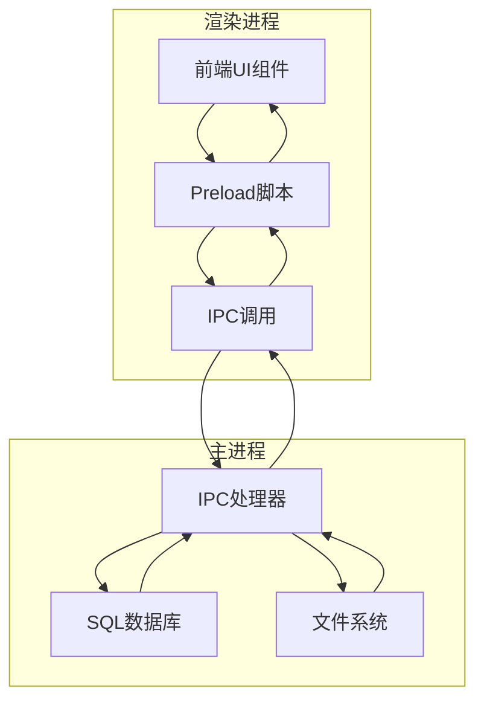

**图示来源**
- [sql_channel.main.ts](file://app/sql_channel.main.ts#L4-104)
- [channels.preload.ts](file://ts/sql/channels.preload.ts#L4-91)
- [phase1-ipc.preload.ts](file://ts/windows/main/phase1-ipc.preload.ts#L5-546)

**异步IPC通信架构**采用分层设计，将通信逻辑与业务逻辑分离。渲染进程通过Preload脚本发起IPC调用，主进程中的IPC处理器接收请求并执行相应操作，然后将结果异步返回给渲染进程。

## SQL查询通道

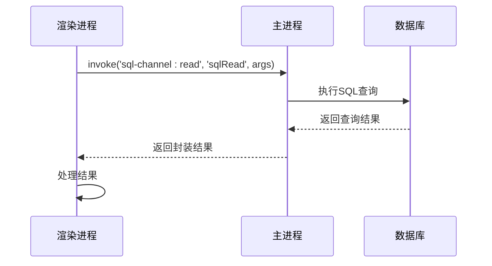

**图示来源**
- [sql_channel.main.ts](file://app/sql_channel.main.ts#L23-104)
- [channels.preload.ts](file://ts/sql/channels.preload.ts#L12-62)

**SQL查询通道**是Signal-Desktop中最重要的异步通信通道之一，负责处理所有与数据库相关的操作。该通道通过以下机制实现：

1. **通道注册**：在`sql_channel.main.ts`中定义了多个IPC通道，包括`sql-channel:read`、`sql-channel:write`等
2. **请求处理**：使用`wrapResult`函数包装SQL操作，确保异常被捕获并正确返回
3. **类型安全**：通过TypeScript类型定义确保SQL操作的类型安全

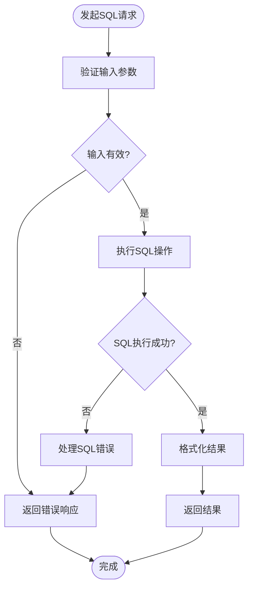

**图示来源**
- [sql_channel.main.ts](file://app/sql_channel.main.ts#L30-48)
- [Client.preload.ts](file://ts/sql/Client.preload.ts#L176-200)

## 附件处理通道

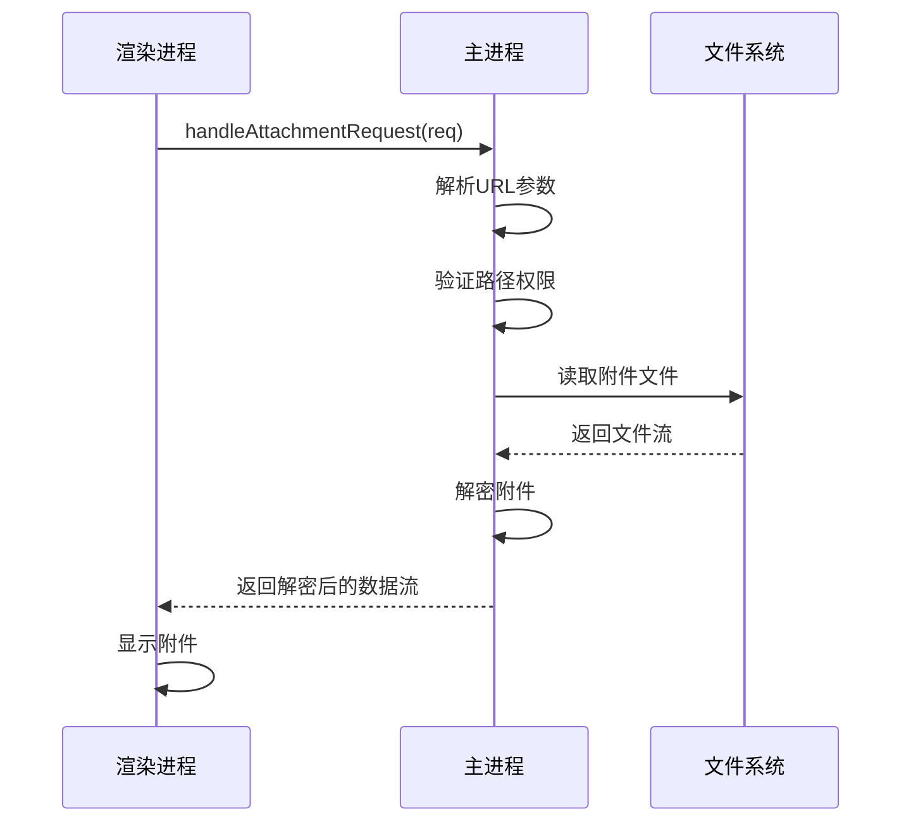

**图示来源**
- [attachment_channel.main.ts](file://app/attachment_channel.main.ts#L569-794)
- [attachment_channel.main.ts](file://app/attachment_channel.main.ts#L728-793)

**附件处理通道**专门用于处理附件的读取、解密和传输。该通道具有以下特点：

1. **安全性**：通过`isPathInside`函数确保路径安全，防止目录遍历攻击
2. **流式处理**：使用`PassThrough`流和`GrowingFile`实现大文件的流式处理
3. **缓存机制**：使用LRU缓存存储解密密钥和摘要，提高重复访问性能

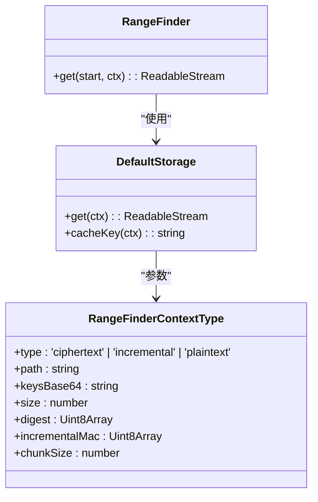

**图示来源**
- [attachment_channel.main.ts](file://app/attachment_channel.main.ts#L90-265)
- [attachment_channel.main.ts](file://app/attachment_channel.main.ts#L266-268)

## 消息队列与回调机制

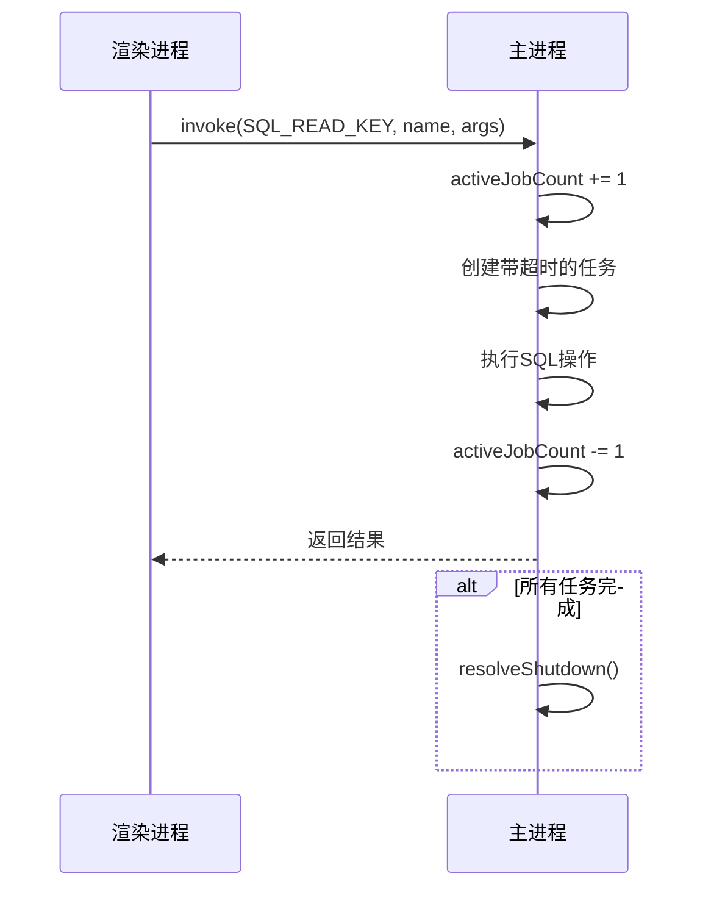

**图示来源**
- [channels.preload.ts](file://ts/sql/channels.preload.ts#L48-61)
- [channels.preload.ts](file://ts/sql/channels.preload.ts#L56-58)

**消息队列与回调机制**是异步IPC通信的核心组成部分。Signal-Desktop通过以下方式实现：

1. **任务计数**：使用`activeJobCount`跟踪活跃任务数量
2. **优雅关闭**：通过`explodePromise`实现应用关闭时的任务等待
3. **超时控制**：集成`TaskWithTimeout`确保任务不会无限期挂起

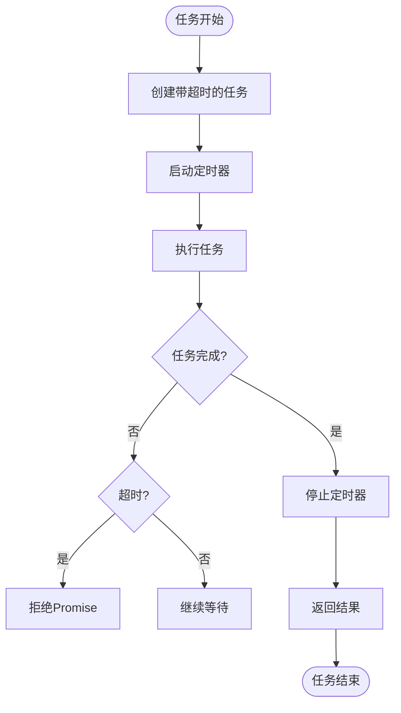

**图示来源**
- [TaskWithTimeout.std.ts](file://ts/textsecure/TaskWithTimeout.std.ts#L52-129)
- [channels.preload.ts](file://ts/sql/channels.preload.ts#L48-61)

## 错误传播与超时处理

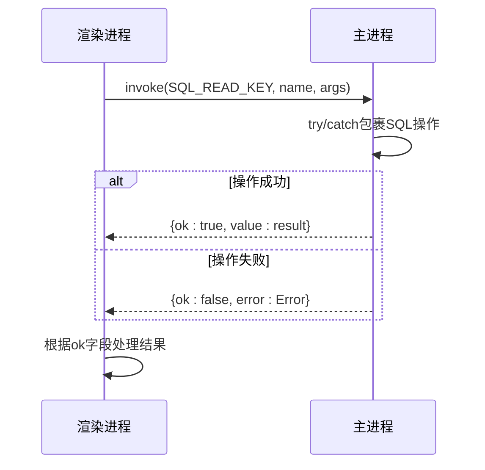

**图示来源**
- [sql_channel.main.ts](file://app/sql_channel.main.ts#L30-48)
- [channels.preload.ts](file://ts/sql/channels.preload.ts#L50-54)

**错误传播与超时处理**机制确保了通信的可靠性：

1. **错误封装**：所有错误都被封装在结果对象中，避免异常跨进程传播
2. **超时保护**：每个IPC调用都有默认30分钟的超时限制
3. **日志记录**：详细的错误日志帮助诊断问题

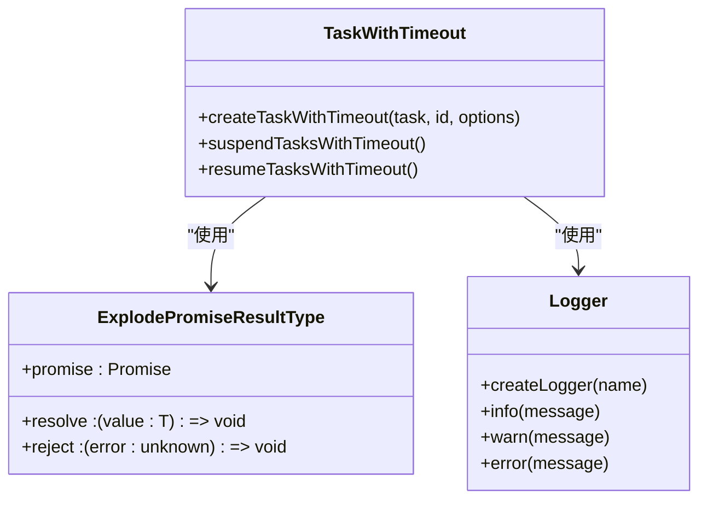

**图示来源**
- [explodePromise.std.ts](file://ts/util/explodePromise.std.ts#L4-28)
- [TaskWithTimeout.std.ts](file://ts/textsecure/TaskWithTimeout.std.ts#L12-17)
- [log.std.js](file://ts/logging/log.std.js)

## 资源管理策略

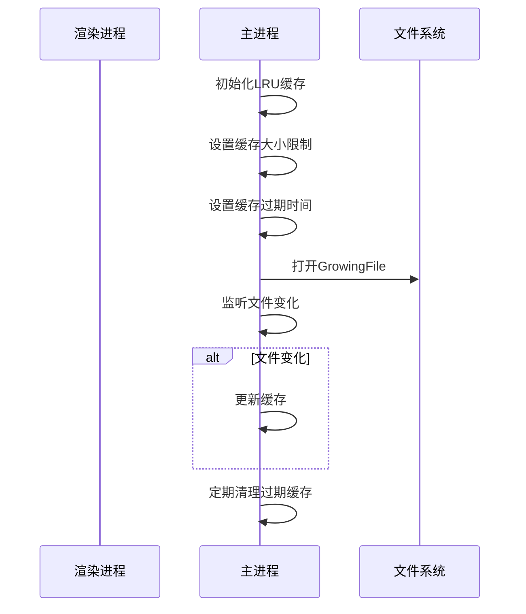

**图示来源**
- [attachment_channel.main.ts](file://app/attachment_channel.main.ts#L118-122)
- [attachment_channel.main.ts](file://app/attachment_channel.main.ts#L136-145)

**资源管理策略**包括：

1. **内存缓存**：使用LRU缓存存储频繁访问的数据
2. **文件锁定**：通过`GrowingFile`处理正在写入的文件
3. **定期清理**：自动清理过期和无用的附件文件

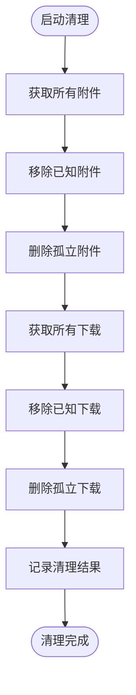

**图示来源**
- [attachment_channel.main.ts](file://app/attachment_channel.main.ts#L292-400)
- [attachment_channel.main.ts](file://app/attachment_channel.main.ts#L402-496)

## 使用场景与生命周期

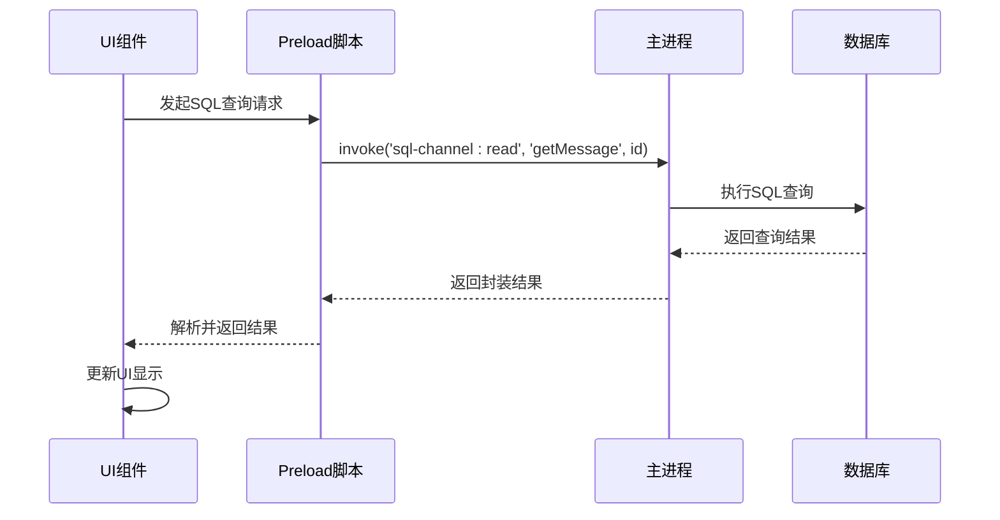

**图示来源**
- [Client.preload.ts](file://ts/sql/Client.preload.ts#L202-217)
- [DataReader](file://ts/sql/Client.preload.ts#L202)

**使用场景与生命周期**展示了异步IPC调用的完整流程：

1. **请求发起**：UI组件通过Preload脚本发起IPC调用
2. **请求处理**：主进程接收请求并执行相应操作
3. **结果返回**：处理结果通过IPC通道返回
4. **UI更新**：Preload脚本解析结果并更新UI

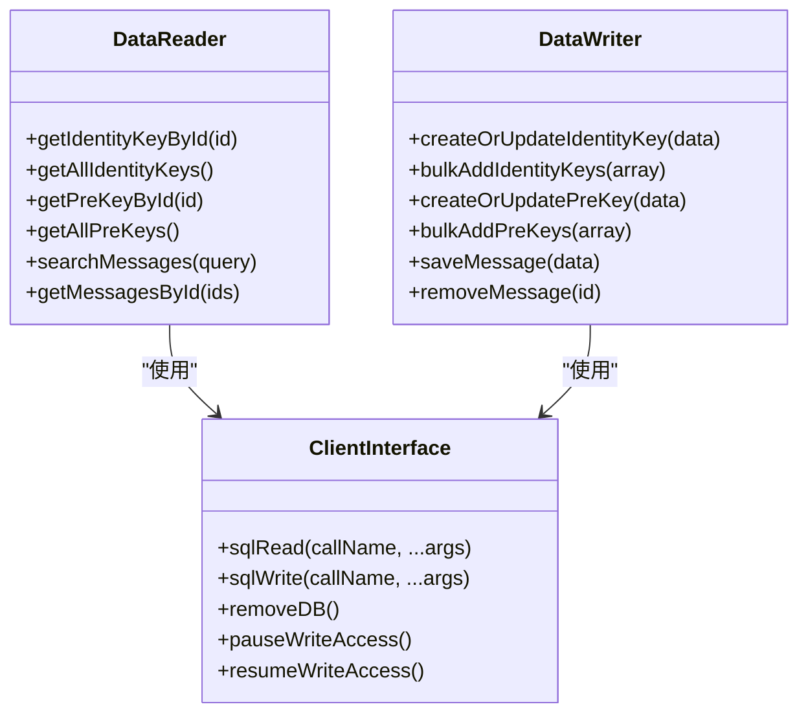

**图示来源**
- [Client.preload.ts](file://ts/sql/Client.preload.ts#L202-234)
- [Client.preload.ts](file://ts/sql/Client.preload.ts#L176-174)

## 结论
Signal-Desktop的异步IPC通信机制通过精心设计的架构实现了主进程与渲染进程之间的高效、可靠通信。SQL查询通道和附件处理通道分别针对不同类型的后台操作进行了优化，确保了应用的性能和用户体验。消息队列、回调机制、错误传播和资源管理策略共同构成了一个健壮的通信框架，为应用的稳定运行提供了保障。

**异步IPC通信**的设计体现了Signal-Desktop对性能、安全性和可靠性的高度重视。通过使用TypeScript类型系统、Promise机制和流式处理，该通信框架不仅功能强大，而且易于维护和扩展。