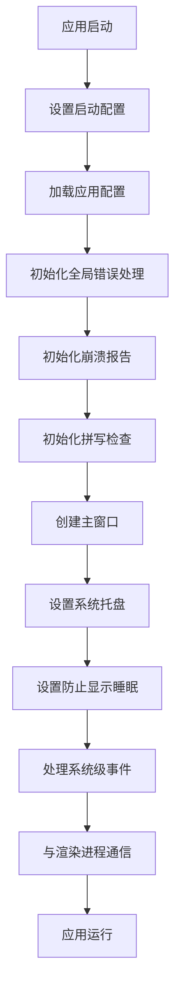
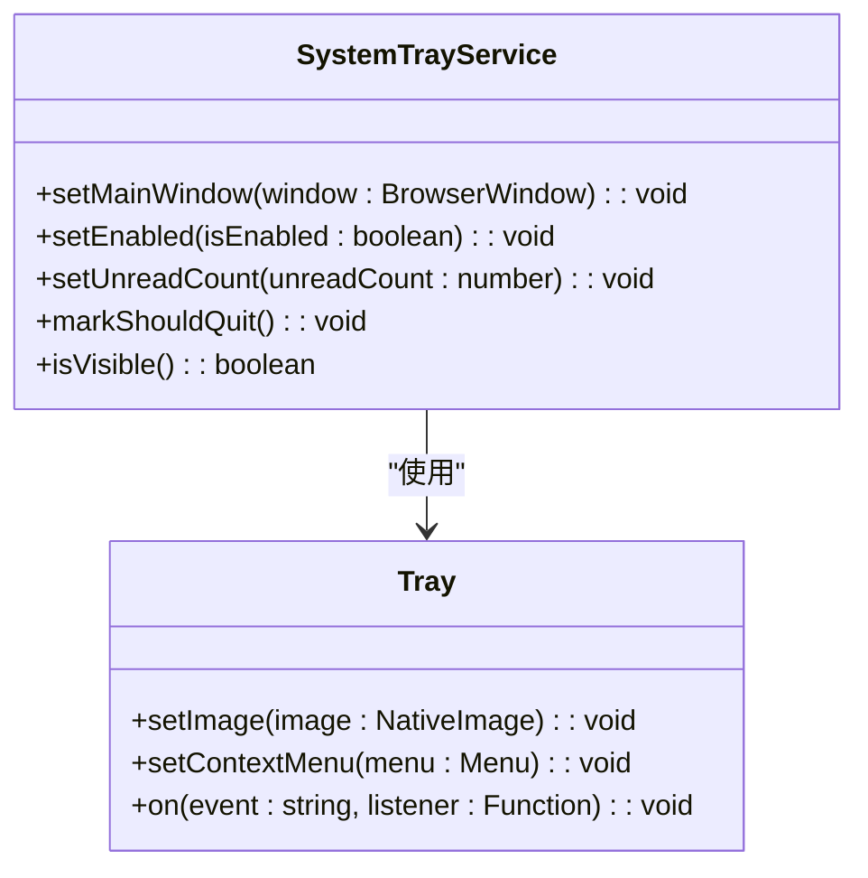
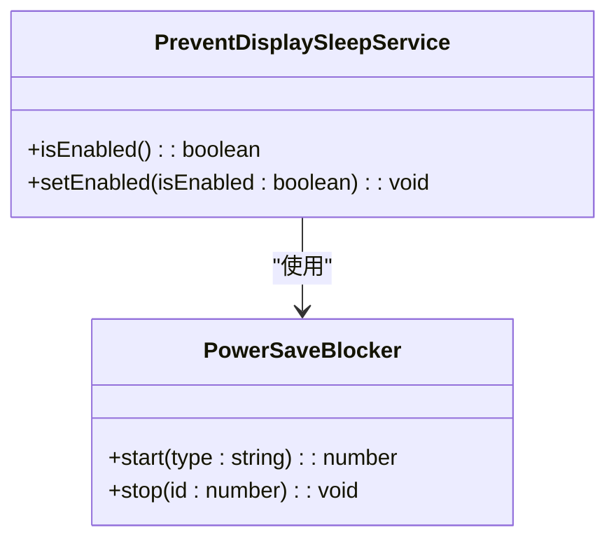
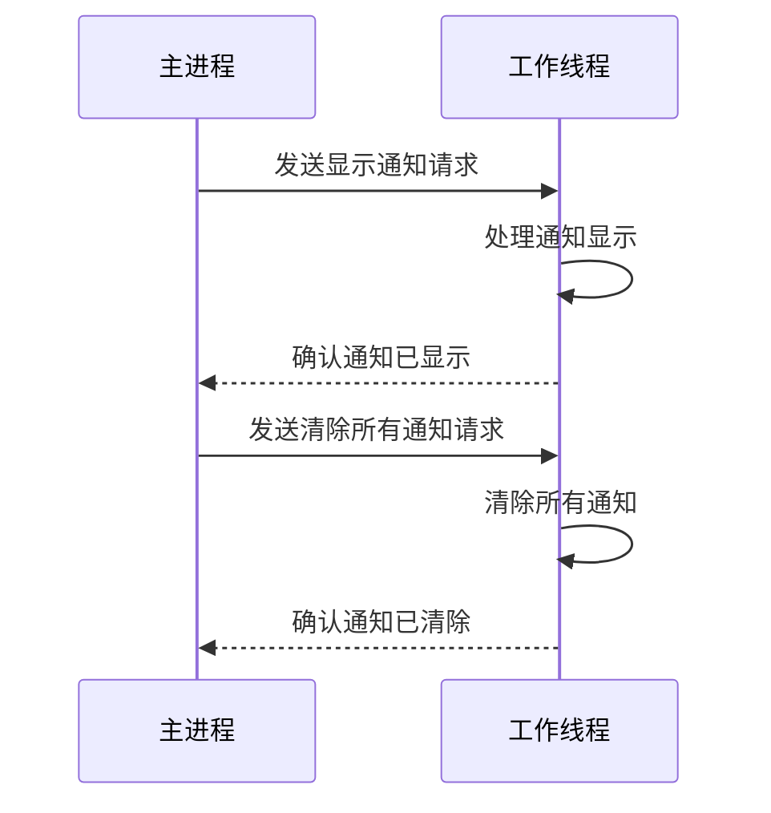
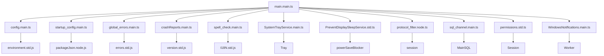

# 主进程架构

<cite>
**本文档中引用的文件**   
- [main.main.ts](file://app/main.main.ts)
- [config.main.ts](file://app/config.main.ts)
- [startup_config.main.ts](file://app/startup_config.main.ts)
- [window_state.std.ts](file://app/window_state.std.ts)
- [menu.std.ts](file://app/menu.std.ts)
- [SystemTrayService.main.ts](file://app/SystemTrayService.main.ts)
- [PreventDisplaySleepService.std.ts](file://app/PreventDisplaySleepService.std.ts)
- [protocol_filter.node.ts](file://app/protocol_filter.node.ts)
- [crashReports.main.ts](file://app/crashReports.main.ts)
- [user_config.main.ts](file://app/user_config.main.ts)
- [WindowsNotifications.main.ts](file://app/WindowsNotifications.main.ts)
- [spell_check.main.ts](file://app/spell_check.main.ts)
- [permissions.std.ts](file://app/permissions.std.ts)
- [global_errors.main.ts](file://app/global_errors.main.ts)
- [sql_channel.main.ts](file://app/sql_channel.main.ts)
</cite>

## 目录
1. [简介](#简介)
2. [项目结构](#项目结构)
3. [核心组件](#核心组件)
4. [架构概述](#架构概述)
5. [详细组件分析](#详细组件分析)
6. [依赖关系分析](#依赖关系分析)
7. [性能考虑](#性能考虑)
8. [故障排除指南](#故障排除指南)
9. [结论](#结论)

## 简介
Signal-Desktop主进程架构文档深入探讨了基于Electron框架的桌面应用程序主进程设计原理和实现细节。该文档全面解析了应用生命周期管理、系统集成服务（如系统托盘、通知、防止显示睡眠等）的实现机制。文档详细描述了主进程如何处理系统级事件、管理窗口状态和处理协议过滤，记录了主进程与操作系统交互的具体实现，包括文件协议处理、启动配置和崩溃报告机制。同时，文档还说明了主进程的安全考虑，如权限管理和敏感数据处理，并提供了主进程模块间的依赖关系图，解释了关键设计决策背后的权衡。

## 项目结构
Signal-Desktop项目的主进程相关代码主要位于`app`目录下，该目录包含了主进程的核心功能实现。项目结构清晰地分离了主进程和渲染进程的代码，其中`app`目录专门存放主进程相关的TypeScript文件。主进程负责管理应用的生命周期、系统集成、窗口管理和安全控制等核心功能。通过`main.main.ts`作为主进程的入口点，协调各个服务模块的初始化和运行。项目还包含`config`目录用于存放不同环境的配置文件，`_locales`目录用于国际化支持，以及`components`和`stylesheets`等目录用于UI组件和样式管理。

**图示来源**
- [main.main.ts](file://app/main.main.ts)
- [config.main.ts](file://app/config.main.ts)
- [startup_config.main.ts](file://app/startup_config.main.ts)
- [window_state.std.ts](file://app/window_state.std.ts)
- [menu.std.ts](file://app/menu.std.ts)
- [SystemTrayService.main.ts](file://app/SystemTrayService.main.ts)
- [PreventDisplaySleepService.std.ts](file://app/PreventDisplaySleepService.std.ts)
- [protocol_filter.node.ts](file://app/protocol_filter.node.ts)
- [crashReports.main.ts](file://app/crashReports.main.ts)
- [user_config.main.ts](file://app/user_config.main.ts)
- [WindowsNotifications.main.ts](file://app/WindowsNotifications.main.ts)
- [spell_check.main.ts](file://app/spell_check.main.ts)
- [permissions.std.ts](file://app/permissions.std.ts)
- [global_errors.main.ts](file://app/global_errors.main.ts)
- [sql_channel.main.ts](file://app/sql_channel.main.ts)

**本节来源**
- [main.main.ts](file://app/main.main.ts)
- [config.main.ts](file://app/config.main.ts)
- [startup_config.main.ts](file://app/startup_config.main.ts)
- [window_state.std.ts](file://app/window_state.std.ts)
- [menu.std.ts](file://app/menu.std.ts)
- [SystemTrayService.main.ts](file://app/SystemTrayService.main.ts)
- [PreventDisplaySleepService.std.ts](file://app/PreventDisplaySleepService.std.ts)
- [protocol_filter.node.ts](file://app/protocol_filter.node.ts)
- [crashReports.main.ts](file://app/crashReports.main.ts)
- [user_config.main.ts](file://app/user_config.main.ts)
- [WindowsNotifications.main.ts](file://app/WindowsNotifications.main.ts)
- [spell_check.main.ts](file://app/spell_check.main.ts)
- [permissions.std.ts](file://app/permissions.std.ts)
- [global_errors.main.ts](file://app/global_errors.main.ts)
- [sql_channel.main.ts](file://app/sql_channel.main.ts)

## 核心组件
Signal-Desktop主进程的核心组件包括应用生命周期管理、系统集成服务、窗口状态管理、菜单系统、协议过滤和崩溃报告机制。`main.main.ts`作为主进程的入口点，负责协调各个服务模块的初始化和运行。`config.main.ts`处理应用配置，`startup_config.main.ts`设置启动时的环境变量和应用标识。`window_state.std.ts`管理应用的窗口状态和退出标志，`menu.std.ts`定义了应用的菜单结构。`SystemTrayService.main.ts`实现了系统托盘功能，`PreventDisplaySleepService.std.ts`防止显示睡眠，`protocol_filter.node.ts`处理文件和网络协议，`crashReports.main.ts`负责崩溃报告的收集和处理。

**本节来源**
- [main.main.ts](file://app/main.main.ts)
- [config.main.ts](file://app/config.main.ts)
- [startup_config.main.ts](file://app/startup_config.main.ts)
- [window_state.std.ts](file://app/window_state.std.ts)
- [menu.std.ts](file://app/menu.std.ts)
- [SystemTrayService.main.ts](file://app/SystemTrayService.main.ts)
- [PreventDisplaySleepService.std.ts](file://app/PreventDisplaySleepService.std.ts)
- [protocol_filter.node.ts](file://app/protocol_filter.node.ts)
- [crashReports.main.ts](file://app/crashReports.main.ts)

## 架构概述
Signal-Desktop主进程采用模块化设计，通过`main.main.ts`作为核心协调器，初始化和管理各个独立的服务模块。主进程首先通过`startup_config.main.ts`设置应用的用户模型ID和文件权限，然后通过`config.main.ts`加载应用配置。接着，主进程初始化全局错误处理、崩溃报告、拼写检查等基础服务。在应用准备就绪后，主进程创建主窗口并设置系统托盘、防止显示睡眠等系统集成服务。主进程通过Electron的IPC机制与渲染进程通信，处理系统级事件和用户交互。

**图示来源**
- [main.main.ts](file://app/main.main.ts)
- [config.main.ts](file://app/config.main.ts)
- [startup_config.main.ts](file://app/startup_config.main.ts)
- [global_errors.main.ts](file://app/global_errors.main.ts)
- [crashReports.main.ts](file://app/crashReports.main.ts)
- [spell_check.main.ts](file://app/spell_check.main.ts)
- [SystemTrayService.main.ts](file://app/SystemTrayService.main.ts)
- [PreventDisplaySleepService.std.ts](file://app/PreventDisplaySleepService.std.ts)

## 详细组件分析

### 应用生命周期管理
Signal-Desktop主进程通过`main.main.ts`中的`app`模块事件监听器来管理应用的生命周期。主进程在`ready`事件触发时初始化各个服务模块，并在`before-quit`和`window-all-closed`事件中处理应用退出逻辑。通过`window_state.std.ts`中的标志位管理应用的退出状态，确保在适当的时候安全退出。

**本节来源**
- [main.main.ts](file://app/main.main.ts)
- [window_state.std.ts](file://app/window_state.std.ts)

### 系统集成服务
#### 系统托盘服务
`SystemTrayService.main.ts`实现了系统托盘功能，通过Electron的`Tray`类创建和管理系统托盘图标。服务根据应用的可见状态动态更新托盘图标的上下文菜单，提供显示/隐藏窗口和退出应用的选项。服务还处理不同操作系统的托盘图标适配，确保在Windows、macOS和Linux上都能正常工作。

**图示来源**
- [SystemTrayService.main.ts](file://app/SystemTrayService.main.ts)

#### 防止显示睡眠服务
`PreventDisplaySleepService.std.ts`通过Electron的`powerSaveBlocker`模块防止系统进入睡眠状态。服务在需要时启动阻止器，在不需要时停止阻止器，确保在通话等关键操作期间系统保持唤醒状态。

**图示来源**
- [PreventDisplaySleepService.std.ts](file://app/PreventDisplaySleepService.std.ts)

#### 通知服务
`WindowsNotifications.main.ts`通过Node.js的`worker_threads`模块在独立线程中处理Windows通知，避免阻塞主进程。服务通过IPC与主进程通信，处理显示和清除通知的请求。

**图示来源**
- [WindowsNotifications.main.ts](file://app/WindowsNotifications.main.ts)

### 窗口状态管理
`window_state.std.ts`提供了一组简单的函数来管理应用的退出状态。通过`markShouldQuit`、`markReadyForShutdown`等函数，主进程可以协调各个模块的退出流程，确保在安全的情况下退出应用。

**本节来源**
- [window_state.std.ts](file://app/window_state.std.ts)

### 菜单系统
`menu.std.ts`定义了应用的菜单结构，通过`createTemplate`函数根据平台和用户设置动态生成菜单。菜单系统支持国际化，通过`i18n`函数获取本地化字符串。

**本节来源**
- [menu.std.ts](file://app/menu.std.ts)

### 协议过滤
`protocol_filter.node.ts`通过Electron的`protocol`模块拦截和处理文件和网络协议请求。服务实现了严格的文件路径验证，防止恶意文件访问，同时禁用不必要的网络协议以提高安全性。

**本节来源**
- [protocol_filter.node.ts](file://app/protocol_filter.node.ts)

### 崩溃报告机制
`crashReports.main.ts`通过Electron的`crashReporter`模块收集崩溃报告，并通过IPC提供获取崩溃报告数量、写入日志和清除报告的功能。服务在非生产环境中启用崩溃报告，帮助开发人员诊断问题。

**本节来源**
- [crashReports.main.ts](file://app/crashReports.main.ts)

### 权限管理
`permissions.std.ts`通过Electron的`session`模块设置权限请求处理程序，控制应用对系统资源的访问。服务根据预定义的权限策略批准或拒绝权限请求，确保应用的安全性。

**本节来源**
- [permissions.std.ts](file://app/permissions.std.ts)

### 全局错误处理
`global_errors.main.ts`通过监听`uncaughtException`和`unhandledRejection`等事件处理未捕获的异常和拒绝的Promise。服务在发生严重错误时显示错误对话框，允许用户复制错误信息并退出应用。

**本节来源**
- [global_errors.main.ts](file://app/global_errors.main.ts)

### SQL通道
`sql_channel.main.ts`通过IPC提供安全的数据库访问接口，封装了SQL读写操作。服务通过`wrapResult`函数包装数据库操作，确保在发生错误时能够正确处理。

**本节来源**
- [sql_channel.main.ts](file://app/sql_channel.main.ts)

## 依赖关系分析
Signal-Desktop主进程的各个模块之间存在明确的依赖关系。`main.main.ts`作为核心模块，依赖于所有其他服务模块。`config.main.ts`和`startup_config.main.ts`在应用启动早期被加载，为其他模块提供配置和环境设置。`global_errors.main.ts`和`crashReports.main.ts`提供基础的错误处理能力，被所有模块间接依赖。`SystemTrayService.main.ts`和`PreventDisplaySleepService.std.ts`等系统集成服务依赖于Electron的原生模块，通过封装提供更高级的API。

**图示来源**
- [main.main.ts](file://app/main.main.ts)
- [config.main.ts](file://app/config.main.ts)
- [startup_config.main.ts](file://app/startup_config.main.ts)
- [global_errors.main.ts](file://app/global_errors.main.ts)
- [crashReports.main.ts](file://app/crashReports.main.ts)
- [spell_check.main.ts](file://app/spell_check.main.ts)
- [SystemTrayService.main.ts](file://app/SystemTrayService.main.ts)
- [PreventDisplaySleepService.std.ts](file://app/PreventDisplaySleepService.std.ts)
- [protocol_filter.node.ts](file://app/protocol_filter.node.ts)
- [sql_channel.main.ts](file://app/sql_channel.main.ts)
- [permissions.std.ts](file://app/permissions.std.ts)
- [WindowsNotifications.main.ts](file://app/WindowsNotifications.main.ts)

**本节来源**
- [main.main.ts](file://app/main.main.ts)
- [config.main.ts](file://app/config.main.ts)
- [startup_config.main.ts](file://app/startup_config.main.ts)
- [global_errors.main.ts](file://app/global_errors.main.ts)
- [crashReports.main.ts](file://app/crashReports.main.ts)
- [spell_check.main.ts](file://app/spell_check.main.ts)
- [SystemTrayService.main.ts](file://app/SystemTrayService.main.ts)
- [PreventDisplaySleepService.std.ts](file://app/PreventDisplaySleepService.std.ts)
- [protocol_filter.node.ts](file://app/protocol_filter.node.ts)
- [sql_channel.main.ts](file://app/sql_channel.main.ts)
- [permissions.std.ts](file://app/permissions.std.ts)
- [WindowsNotifications.main.ts](file://app/WindowsNotifications.main.ts)

## 性能考虑
Signal-Desktop主进程在设计时考虑了性能优化。通过将通知处理等耗时操作移至独立的工作线程，避免阻塞主进程的事件循环。服务的初始化采用懒加载策略，只在需要时才创建和初始化相关资源。数据库操作通过`sql_channel.main.ts`进行封装，确保在主线程外执行，避免影响UI响应性。应用还通过`window_state.std.ts`中的标志位优化退出流程，确保在安全的情况下快速退出。

## 故障排除指南
当Signal-Desktop主进程出现问题时，可以按照以下步骤进行排查：
1. 检查应用日志，查看是否有错误信息。
2. 确认应用配置是否正确，特别是`config.main.ts`中的配置。
3. 检查系统托盘服务是否正常工作，查看`SystemTrayService.main.ts`的日志。
4. 确认防止显示睡眠服务是否正常，查看`PreventDisplaySleepService.std.ts`的日志。
5. 检查协议过滤是否正常工作，查看`protocol_filter.node.ts`的日志。
6. 确认崩溃报告机制是否启用，查看`crashReports.main.ts`的日志。

**本节来源**
- [main.main.ts](file://app/main.main.ts)
- [config.main.ts](file://app/config.main.ts)
- [SystemTrayService.main.ts](file://app/SystemTrayService.main.ts)
- [PreventDisplaySleepService.std.ts](file://app/PreventDisplaySleepService.std.ts)
- [protocol_filter.node.ts](file://app/protocol_filter.node.ts)
- [crashReports.main.ts](file://app/crashReports.main.ts)

## 结论
Signal-Desktop主进程架构展示了如何通过Electron框架构建一个功能丰富、安全可靠的桌面应用程序。通过模块化设计和清晰的职责分离，主进程能够高效地管理应用的生命周期、系统集成和安全控制。文档详细分析了各个核心组件的实现细节，为理解和维护Signal-Desktop的主进程提供了全面的参考。未来的工作可以进一步优化性能，增强安全性，并扩展对更多操作系统特性的支持。