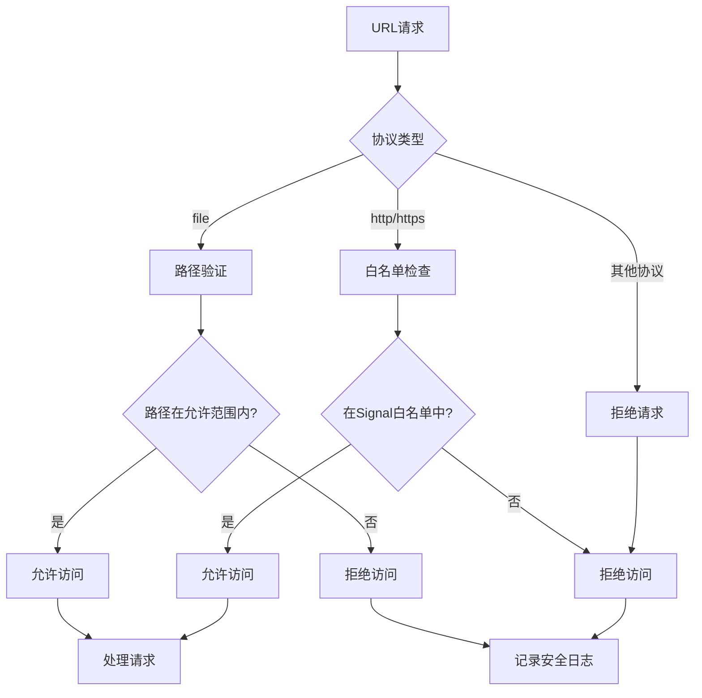
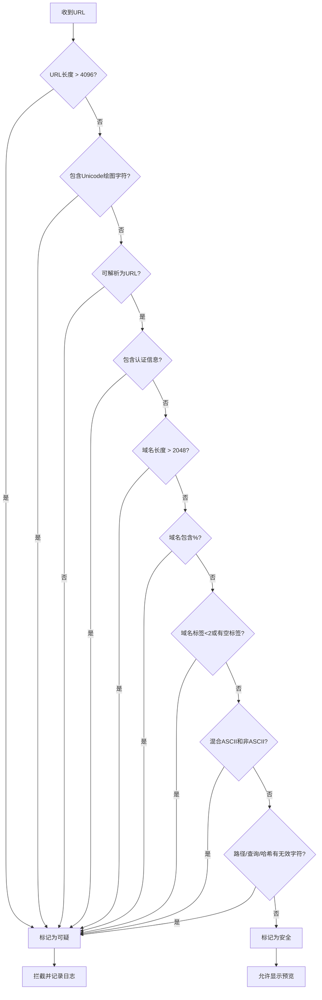

# 协议安全

<cite>
**本文档中引用的文件**   
- [protocol_filter.node.ts](file://app/protocol_filter.node.ts)
- [LinkPreview.std.ts](file://ts/types/LinkPreview.std.ts)
- [linkPreviewFetch.preload.ts](file://ts/linkPreviews/linkPreviewFetch.preload.ts)
- [signalRoutes.std.ts](file://ts/util/signalRoutes.std.ts)
- [url.std.ts](file://ts/util/url.std.ts)
- [protocol_filter_test.node.ts](file://ts/test-node/app/protocol_filter_test.node.ts)
- [LinkPreview_test.std.ts](file://ts/test-node/types/LinkPreview_test.std.ts)
</cite>

## 目录
1. [简介](#简介)
2. [协议过滤器实现原理](#协议过滤器实现原理)
3. [协议白名单配置与管理](#协议白名单配置与管理)
4. [URL协议处理逻辑](#url协议处理逻辑)
5. [安全验证流程](#安全验证流程)
6. [恶意链接检测与拦截机制](#恶意链接检测与拦截机制)
7. [代码示例分析](#代码示例分析)
8. [总结](#总结)

## 简介
Signal-Desktop应用通过严格的协议安全机制来保护用户免受恶意链接和不安全协议的威胁。该机制主要由协议过滤器、URL验证系统和链接预览安全检查三部分组成，共同构建了一个多层次的安全防护体系。协议过滤器负责拦截和处理各种URL协议请求，确保只有经过授权的协议才能被处理；URL验证系统对链接进行全面的安全性检查，防止钓鱼链接和混淆域名的攻击；链接预览功能则在显示网页预览时实施严格的安全策略，避免加载恶意内容。这些机制协同工作，为用户提供了一个安全可靠的通信环境。

## 协议过滤器实现原理
协议过滤器是Signal-Desktop安全架构的核心组件，负责拦截和处理所有协议请求。其主要功能是通过Electron的protocol模块注册自定义协议处理器，对file、http、https等协议进行拦截和验证。过滤器实现了两个主要处理函数：_createFileHandler用于处理文件协议请求，installWebHandler用于处理Web协议请求。对于文件协议，过滤器会验证请求路径是否在允许的根目录范围内，包括用户数据路径、安装路径以及各种资源目录（如头像、徽章、贴纸等）。对于Web协议，过滤器默认禁用大多数协议（如javascript、mailto、ftp等），只有在特定条件下才允许HTTP/HTTPS请求。这种设计确保了应用只能访问授权的文件资源，并防止了潜在的跨站脚本攻击和其他Web安全威胁。

**Section sources**
- [protocol_filter.node.ts](file://app/protocol_filter.node.ts#L24-L179)

## 协议白名单配置与管理
协议白名单机制通过严格定义允许访问的协议类型和域名来增强安全性。系统维护了一个明确的协议白名单，只允许https:、sgnl:和signalcaptcha:三种协议。对于域名，白名单包括signal.me、signal.group、signal.link和signal.art等官方域名。这种白名单策略通过signalRoutes.std.ts文件中的SignalRouteProtocols和SignalRouteHostnames常量进行定义和管理。当接收到URL请求时，系统会首先检查协议和主机名是否在白名单中，只有匹配的请求才会被进一步处理。此外，系统还实现了自动重定向功能，将HTTP请求重定向到HTTPS，确保通信的安全性。这种基于白名单的访问控制机制有效防止了钓鱼网站和恶意链接的攻击，确保用户只能访问可信的Signal服务。

**Section sources**
- [signalRoutes.std.ts](file://ts/util/signalRoutes.std.ts#L32-L43)
- [signalRoutes.std.ts](file://ts/util/signalRoutes.std.ts#L662-L663)

## URL协议处理逻辑
URL协议处理逻辑实现了对不同协议的精细化控制和安全处理。系统对file协议的处理特别严格，通过_urlToPath函数将URL转换为文件系统路径，并进行多重验证：首先解码URL，然后移除查询字符串，最后验证路径是否在允许的根目录范围内。对于Web协议，系统采用"默认拒绝"策略，即除了明确允许的协议外，其他所有协议都被禁用。具体来说，about、content、chrome、cid、data、filesystem、ftp、gopher、javascript和mailto等协议都被明确禁用。HTTP和HTTPS协议的处理则取决于enableHttp配置，通常在生产环境中被禁用以防止网络请求。这种分层的协议处理策略确保了应用的安全性，防止了潜在的安全漏洞和攻击向量。

**Diagram sources**
- [protocol_filter.node.ts](file://app/protocol_filter.node.ts#L36-L179)
- [signalRoutes.std.ts](file://ts/util/signalRoutes.std.ts#L32-L43)

## 安全验证流程
安全验证流程对URL进行全面的安全性检查，防止各种类型的网络攻击。系统通过isLinkSneaky函数实施多层次的验证策略：首先检查URL长度，超过4096字符的链接被视为可疑；然后检查是否存在Unicode绘图字符，这类字符常用于混淆攻击；接着验证URL是否可解析，无法解析的URL被视为恶意；检查是否包含认证信息（用户名/密码），包含认证信息的链接被视为钓鱼风险；验证域名长度不超过2048字符，防止超长域名攻击；检查域名是否包含百分号编码，防止混淆攻击；确保域名至少有两个标签且无空标签；最后检查域名是否混合使用ASCII和非ASCII字符，防止同形异义字攻击。此外，系统还验证路径、查询字符串和哈希部分是否只包含有效的URI字符。这些严格的验证规则共同构成了一个强大的安全防线，有效防止了各种网络钓鱼和混淆攻击。

**Section sources**
- [LinkPreview.std.ts](file://ts/types/LinkPreview.std.ts#L244-L315)

## 恶意链接检测与拦截机制
恶意链接检测与拦截机制通过综合分析和实时拦截来保护用户安全。系统首先通过isLinkSneaky函数检测潜在的恶意链接，该函数实施了多种检测策略：检测超长链接（超过4096字符）、包含Unicode绘图字符的链接、无法解析的URL、包含认证信息的链接、超长域名（超过2048字符）、包含百分号编码的域名、标签少于两个或包含空标签的域名，以及混合使用ASCII和非ASCII字符的域名。对于链接的路径、查询字符串和哈希部分，系统检查是否包含无效字符。检测到的恶意链接会被立即拦截，并记录安全日志。此外，系统还维护了一个排除域名列表（如example.com、localhost等），这些域名的链接预览会被禁用。这种主动检测和拦截机制有效防止了钓鱼攻击、混淆攻击和其他网络威胁，确保用户不会意外访问恶意网站。

**Diagram sources**
- [LinkPreview.std.ts](file://ts/types/LinkPreview.std.ts#L244-L315)

## 代码示例分析
代码示例展示了协议过滤和安全验证的核心实现。在protocol_filter.node.ts中，_urlToPath函数负责将URL转换为文件系统路径，通过解码URL、移除查询字符串等步骤确保路径安全。_createFileHandler函数创建文件协议处理器，验证请求路径是否在允许的根目录范围内。installWebHandler函数则注册Web协议处理器，禁用大多数潜在危险的协议。在LinkPreview.std.ts中，isLinkSneaky函数实施了全面的安全检查，包括长度检查、Unicode检查、域名验证等。signalRoutes.std.ts中的_route函数使用URLPattern语法定义路由匹配规则，确保只有符合特定模式的URL才能被处理。这些代码示例体现了Signal-Desktop安全设计的核心原则：最小权限、默认拒绝和深度防御，通过多层安全检查确保系统的整体安全性。

**Section sources**
- [protocol_filter.node.ts](file://app/protocol_filter.node.ts#L36-L179)
- [LinkPreview.std.ts](file://ts/types/LinkPreview.std.ts#L244-L315)
- [signalRoutes.std.ts](file://ts/util/signalRoutes.std.ts#L75-L207)

## 总结
Signal-Desktop的协议安全机制通过协议过滤器、白名单管理和多层次验证构建了一个全面的安全防护体系。该机制采用"默认拒绝"的安全策略，只允许明确授权的协议和域名，有效防止了各种网络攻击。协议过滤器严格控制文件和Web协议的访问，确保应用只能访问授权资源。白名单机制限制了可访问的协议和域名，防止钓鱼攻击。安全验证流程对URL进行全面检查，识别和拦截恶意链接。这些安全措施共同作用，为用户提供了一个安全可靠的通信环境，体现了Signal对用户隐私和安全的高度重视。这种深度防御的安全架构是Signal-Desktop能够获得用户信任的重要基础。