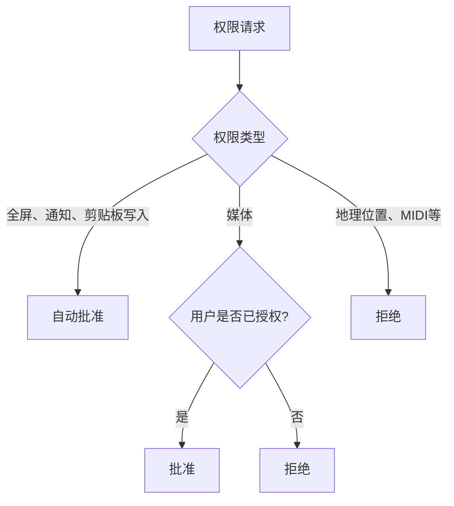
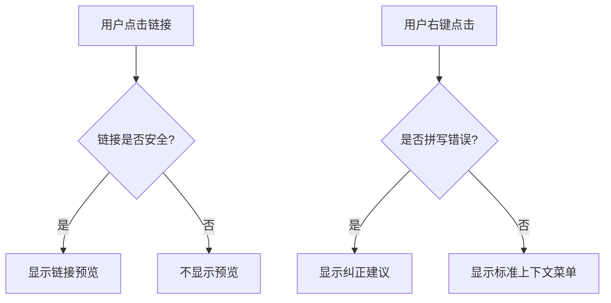
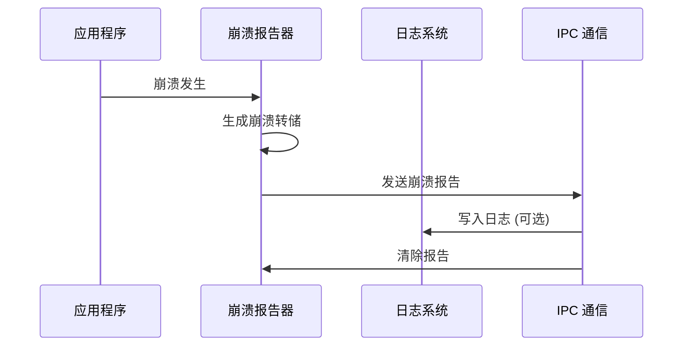
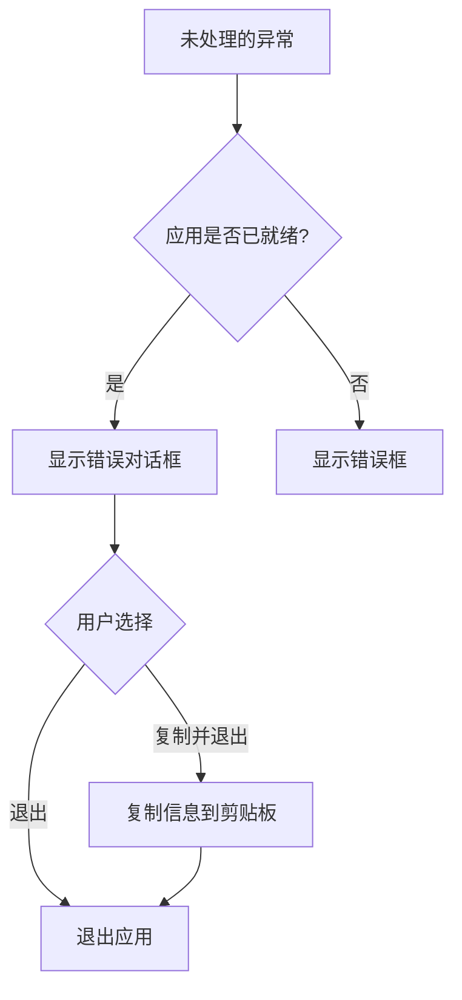
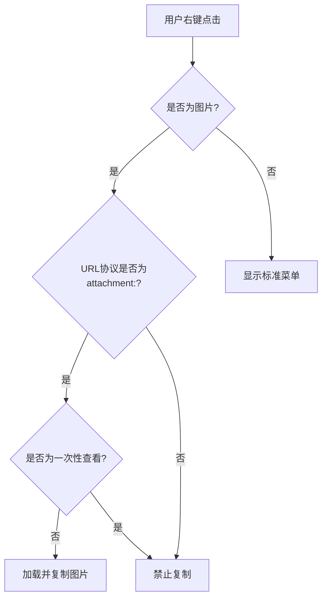
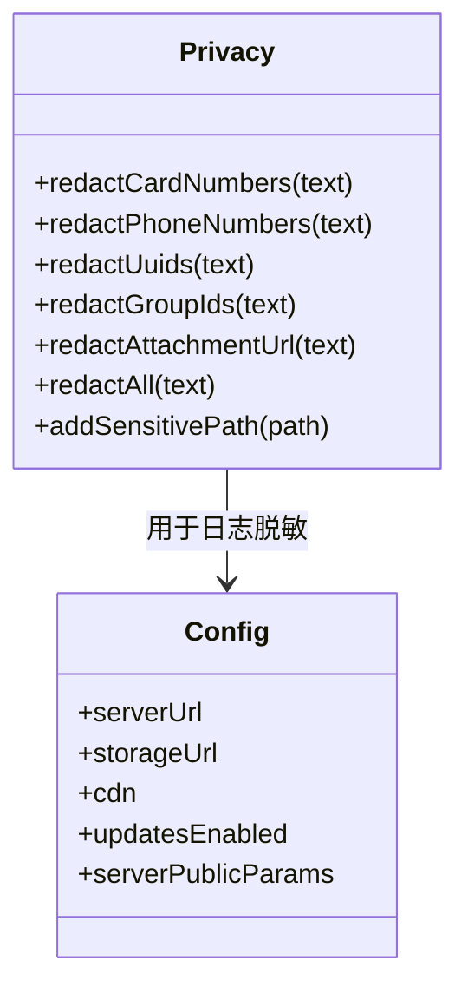

# 安全机制

<cite>
**本文档引用的文件**   
- [permissions.std.ts](file://app/permissions.std.ts)
- [protocol_filter.node.ts](file://app/protocol_filter.node.ts)
- [crashReports.main.ts](file://app/crashReports.main.ts)
- [global_errors.main.ts](file://app/global_errors.main.ts)
- [spell_check.main.ts](file://app/spell_check.main.ts)
- [main.main.ts](file://app/main.main.ts)
- [config/main.js](file://app/config.main.js)
- [user_config.main.ts](file://app/user_config.main.ts)
- [default.json](file://config/default.json)
- [production.json](file://config/production.json)
- [LinkPreview.std.ts](file://ts/types/LinkPreview.std.ts)
- [privacy.node.ts](file://ts/util/privacy.node.ts)
- [attachment_channel.main.ts](file://app/attachment_channel.main.ts)
</cite>

## 目录
1. [简介](#简介)
2. [权限管理](#权限管理)
3. [协议过滤与恶意链接防护](#协议过滤与恶意链接防护)
4. [崩溃报告机制](#崩溃报告机制)
5. [全局错误处理](#全局错误处理)
6. [拼写检查安全边界](#拼写检查安全边界)
7. [数据保护与隐私措施](#数据保护与隐私措施)

## 简介
Signal-Desktop 实现了多层次的安全机制，确保用户数据的机密性、完整性和可用性。本文档详细阐述了权限管理、协议过滤、崩溃报告、全局错误处理和辅助功能的安全实现。系统通过严格的权限控制、协议白名单、恶意链接过滤、崩溃报告匿名化和全局异常捕获等策略，构建了一个安全可靠的通信环境。

## 权限管理
Signal-Desktop 的权限管理机制基于 Electron 的会话权限请求处理程序，通过 `installPermissionsHandler` 函数实现。该机制定义了一个权限白名单，明确允许、默认关闭和禁止的权限。

- **允许的权限**：全屏（`fullscreen`）、通知（`notifications`）和剪贴板安全写入（`clipboard-sanitized-write`）默认启用，以支持视频播放、消息通知和文本复制功能。
- **用户可启用的权限**：媒体访问（`media`）权限默认关闭，用户需在设置中明确授权才能访问麦克风和摄像头，用于语音消息和通话功能。
- **禁止的权限**：地理位置（`geolocation`）、MIDI Sysex（`midiSysex`）、打开外部链接（`openExternal`）和指针锁定（`pointerLock`）被明确禁止，以防止潜在的安全风险。

当应用请求权限时，系统会根据预定义的规则和用户配置进行决策。例如，对于媒体权限，系统会检查用户是否已启用相应的麦克风或摄像头权限，并据此决定是否批准请求。

**图表来源**
- [permissions.std.ts](file://app/permissions.std.ts#L14-L80)

**章节来源**
- [permissions.std.ts](file://app/permissions.std.ts#L1-L96)
- [main.main.ts](file://app/main.main.ts#L39)

## 协议过滤与恶意链接防护
Signal-Desktop 通过 `protocol_filter.node.ts` 文件实现了严格的协议过滤和恶意链接防护机制，防止恶意文件访问和网络请求。

### 协议白名单机制
系统通过 `installWebHandler` 函数禁用所有非必要的浏览器 URI 协议，包括 `about`、`content`、`chrome`、`cid`、`data`、`filesystem`、`ftp`、`gopher`、`javascript` 和 `mailto`。HTTP/HTTPS 协议仅在特定条件下启用，确保所有网络请求都通过 Node.js 层进行安全处理。

### 恶意链接过滤策略
链接预览功能通过 `LinkPreview.std.ts` 中的 `shouldPreviewHref` 和 `isLinkSneaky` 函数实现严格的过滤策略。系统检查链接的协议、域名、路径、查询参数和片段，确保其安全性。

- **协议检查**：仅允许 HTTPS 协议。
- **域名检查**：排除 `debuglogs.org`、`example.com`、`localhost` 和 `onion` 等可疑域名。
- **链接特征检查**：检测并拒绝包含认证信息（如 `user:pass@`）、混合字符集（如拉丁字母与西里尔字母混用）、超长链接（超过 4096 字符）、Unicode 绘图字符和控制字符的链接。

### 用户提示流程
当用户尝试访问被过滤的链接时，系统不会直接打开，而是通过上下文菜单提供复制链接选项。对于拼写检查，系统在用户右键点击拼写错误的单词时，提供纠正建议和复制选项，确保用户对操作有完全的控制权。

**图表来源**
- [protocol_filter.node.ts](file://app/protocol_filter.node.ts#L145-L178)
- [LinkPreview.std.ts](file://ts/types/LinkPreview.std.ts#L72-L79)
- [spell_check.main.ts](file://app/spell_check.main.ts#L95-L235)

**章节来源**
- [protocol_filter.node.ts](file://app/protocol_filter.node.ts#L1-L179)
- [LinkPreview.std.ts](file://ts/types/LinkPreview.std.ts#L1-L316)
- [spell_check.main.ts](file://app/spell_check.main.ts#L1-L236)

## 崩溃报告机制
崩溃报告机制在 `crashReports.main.ts` 中实现，通过 Electron 的 `crashReporter` 模块收集崩溃信息，并在非生产环境中启用。

### 收集与匿名化
崩溃报告仅在非生产环境或强制启用时激活。系统收集崩溃转储文件（minidump），并使用 `dumpToJSONString` 和 Zod 模式验证其结构。在日志中输出前，系统会过滤掉无关的模块信息，仅保留 Electron、Signal 和 Node.js 插件相关的模块，以减少敏感信息的暴露。

### 发送机制
崩溃报告默认不上传到服务器（`uploadToServer: false`）。系统提供 IPC 处理程序 `crash-reports:get-count`、`crash-reports:write-to-log` 和 `crash-reports:erase`，允许主进程查询待处理的崩溃报告数量、将其写入调试日志并清除。这确保了崩溃信息的本地化处理和用户控制。

**图表来源**
- [crashReports.main.ts](file://app/crashReports.main.ts#L103-L230)

**章节来源**
- [crashReports.main.ts](file://app/crashReports.main.ts#L1-L230)
- [main.main.ts](file://app/main.main.ts#L40)

## 全局错误处理
全局错误处理机制在 `global_errors.main.ts` 中实现，通过监听 `uncaughtException`、`unhandledRejection` 和 `render-process-gone` 事件捕获未处理的错误。

### 异常捕获
系统捕获所有未处理的异常和 Promise 拒绝，并通过 `handleError` 函数进行统一处理。如果应用已准备就绪，会显示一个包含错误详情的对话框，提供“退出”和“复制错误并退出”两个选项。如果应用尚未准备就绪，则使用 `showErrorBox` 显示错误。

### 处理策略
当用户选择“复制错误并退出”时，系统会将错误信息、应用版本和操作系统信息复制到剪贴板，方便用户提交反馈。处理完成后，应用会调用 `app.exit(1)` 退出，防止在不稳定状态下继续运行。

**图表来源**
- [global_errors.main.ts](file://app/global_errors.main.ts#L63-L84)

**章节来源**
- [global_errors.main.ts](file://app/global_errors.main.ts#L1-L85)
- [main.main.ts](file://app/main.main.ts#L38)

## 拼写检查安全边界
拼写检查功能在 `spell_check.main.ts` 中实现，通过 Electron 的 `session.setSpellCheckerLanguages` API 启用。

### 安全边界
系统通过 `setup` 函数初始化拼写检查器，根据用户的系统语言偏好和可用词典设置语言。在上下文菜单中，系统严格限制了可执行的操作，仅允许在可编辑区域执行剪切、复制、粘贴和全选等基本编辑操作。

### 数据保护措施
当用户尝试复制图片时，系统会检查图片的 URL 协议。仅当协议为 `attachment:` 且不是一次性查看（`disposition=temporary`）时，才允许加载并复制图片到剪贴板。这防止了从恶意网站复制图片的风险。

**图表来源**
- [spell_check.main.ts](file://app/spell_check.main.ts#L95-L235)

**章节来源**
- [spell_check.main.ts](file://app/spell_check.main.ts#L1-L236)

## 数据保护与隐私措施
Signal-Desktop 通过 `privacy.node.ts` 文件实现了全面的数据保护和隐私措施。

### 敏感数据脱敏
系统定义了多个正则表达式模式，用于识别和脱敏敏感信息，包括信用卡号、电话号码、UUID、群组ID和附件URL。`redactAll` 函数组合了所有脱敏规则，确保日志和错误信息中不包含任何个人身份信息（PII）。

### 敏感路径管理
通过 `addSensitivePath` 函数，系统将应用根目录和用户指定的路径标记为敏感路径。在日志输出前，这些路径会被替换为 `[REDACTED]`，防止文件系统路径泄露。

### 配置安全
配置文件 `default.json` 和 `production.json` 包含了服务器URL、CDN地址和公钥等关键信息。生产环境配置启用了更新功能（`updatesEnabled: true`），并使用了生产环境的服务器地址和密钥，确保了配置的安全性。

**图表来源**
- [privacy.node.ts](file://ts/util/privacy.node.ts#L116-L243)
- [default.json](file://config/default.json#L1-L36)
- [production.json](file://config/production.json#L1-L24)

**章节来源**
- [privacy.node.ts](file://ts/util/privacy.node.ts#L1-L243)
- [default.json](file://config/default.json#L1-L36)
- [production.json](file://config/production.json#L1-L24)
- [user_config.main.ts](file://app/user_config.main.ts#L1-L51)
- [attachment_channel.main.ts](file://app/attachment_channel.main.ts#L1-L794)