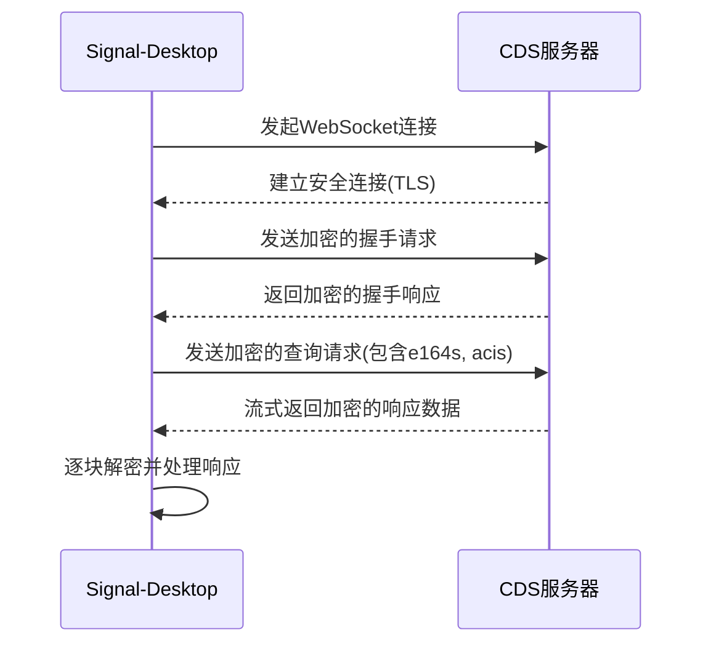
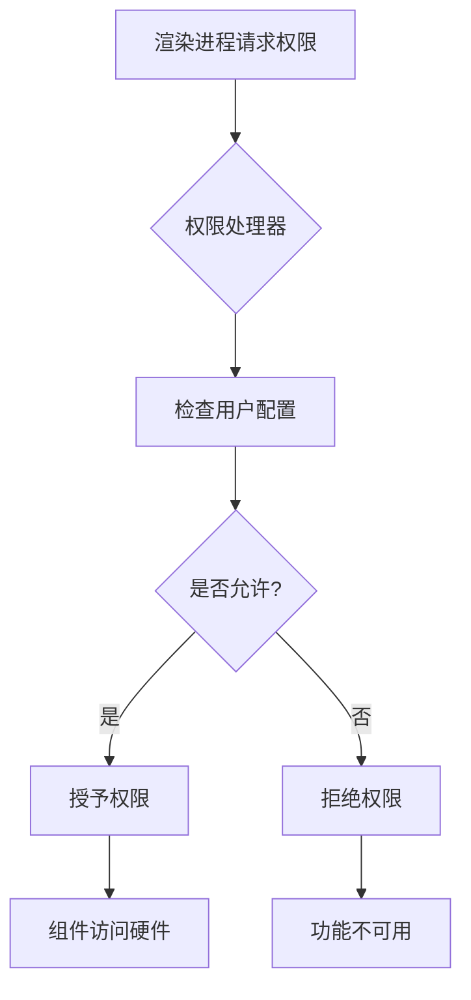
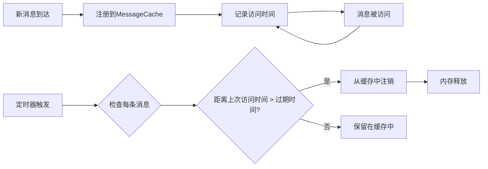
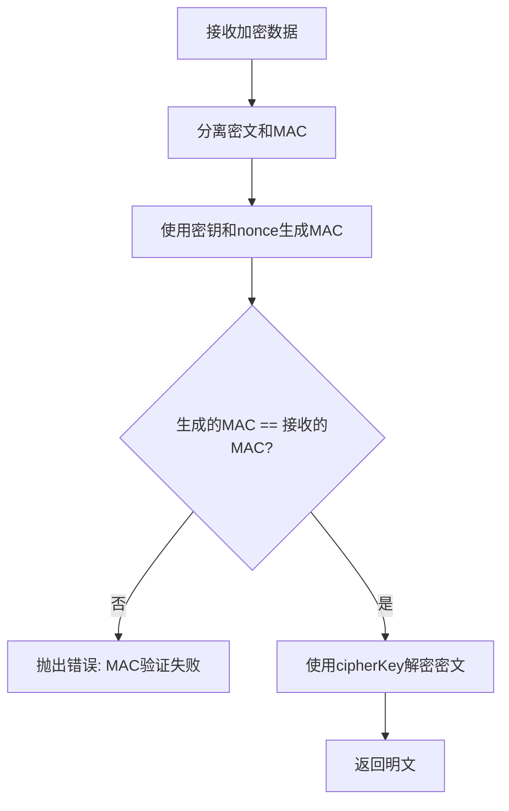

# 数据保护

<cite>
**本文档中引用的文件**  
- [spell_check.main.ts](file://app/spell_check.main.ts)
- [privacy.node.ts](file://ts/util/privacy.node.ts)
- [Crypto.node.ts](file://ts/Crypto.node.ts)
- [CDSSocketBase.node.ts](file://ts/textsecure/cds/CDSSocketBase.node.ts)
- [MessageCache.preload.ts](file://ts/services/MessageCache.preload.ts)
- [senderCertificate.preload.ts](file://ts/services/senderCertificate.preload.ts)
- [assert.std.ts](file://ts/util/assert.std.ts)
- [permissions.std.ts](file://app/permissions.std.ts)
</cite>

## 目录
1. [引言](#引言)
2. [拼写检查功能的数据安全边界](#拼写检查功能的数据安全边界)
3. [外部服务交互时的数据处理策略](#外部服务交互时的数据处理策略)
4. [敏感数据的访问控制与使用限制](#敏感数据的访问控制与使用限制)
5. [本地缓存的安全管理](#本地缓存的安全管理)
6. [数据隔离与安全通信实现](#数据隔离与安全通信实现)
7. [访问审计机制](#访问审计机制)
8. [结论](#结论)

## 引言
Signal-Desktop 作为一款注重隐私保护的通信应用，其核心设计原则之一是确保用户数据在任何情况下都受到严格保护。本文件详细阐述 Signal-Desktop 中的数据保护机制，重点分析拼写检查等辅助功能如何在不泄露用户隐私的前提下正常运作。文档将深入探讨数据在本地处理、与外部服务交互、加密传输以及本地存储过程中的安全策略，确保即使在提供便利功能的同时，也能最大限度地保护用户隐私。

## 拼写检查功能的数据安全边界

Signal-Desktop 的拼写检查功能被设计为在本地完全运行，其数据安全边界严格限制在用户设备内部。该功能通过 Electron 框架的 `session.setSpellCheckerLanguages` API 实现，所有文本的拼写检查均在本地完成，不会将用户输入的任何文本内容发送到远程服务器。

当用户在可编辑区域输入文本时，Electron 的 `context-menu` 事件会触发拼写检查。如果检测到拼写错误（`params.misspelledWord`），系统会从本地加载的词典中生成建议列表（`params.dictionarySuggestions`），并直接在右键菜单中显示。整个过程不涉及任何网络请求，用户输入的文本始终保留在本地内存中。

此外，代码中明确处理了与拼写检查相关的日志记录，确保不会意外泄露敏感信息。例如，在 `spell_check.main.ts` 文件中，对字典下载和初始化过程的日志记录仅包含语言代码（如 `en-US`），而不包含任何用户文本内容。

**Section sources**
- [spell_check.main.ts](file://app/spell_check.main.ts#L68-L93)

## 外部服务交互时的数据处理策略

当 Signal-Desktop 必须与外部服务进行交互时，例如在联系人发现服务（CDS）中，系统采用了一套严格的数据处理和加密策略来保护用户隐私。

### 数据传输的加密机制
与外部服务的通信采用端到端加密和传输层安全（TLS）双重保护。以 `CDSSocketBase.node.ts` 为例，该文件定义了与 CDS 服务器通信的基类。所有请求数据在发送前都会被加密，响应数据在接收后立即解密。

**Diagram sources**
- [CDSSocketBase.node.ts](file://ts/textsecure/cds/CDSSocketBase.node.ts#L68-L127)

在 `CDSSocketBase` 类中，`request` 方法负责构建和发送加密请求。用户电话号码（e164s）和身份标识（ACI）与访问密钥配对后，通过 `Proto.CDSClientRequest.encode` 进行序列化，并在 `sendRequest` 抽象方法中被进一步加密后发送。响应数据通过 `decryptResponse` 抽象方法解密，确保敏感信息在传输过程中始终处于加密状态。

### 数据最小化原则
在与外部服务交互时，Signal-Desktop 遵循数据最小化原则。例如，在 CDS 请求中，系统仅发送必要的电话号码和身份标识，而不发送任何与用户消息内容相关的信息。这最大限度地减少了暴露给外部服务的用户数据量。

**Section sources**
- [CDSSocketBase.node.ts](file://ts/textsecure/cds/CDSSocketBase.node.ts#L68-L127)

## 敏感数据的访问控制与使用限制

Signal-Desktop 通过多层次的访问控制和使用限制来保护敏感数据，确保数据只能被授权的组件以安全的方式访问。

### 运行时权限管理
应用在启动时通过 `installPermissionsHandler` 函数安装权限请求处理器。此处理器会拦截所有来自渲染进程的权限请求（如摄像头、麦克风访问），并根据用户配置决定是否授予。这为敏感硬件资源的访问建立了一道控制闸门。

**Diagram sources**
- [permissions.std.ts](file://app/permissions.std.ts#L83-L95)

### 代码级断言与验证
在核心逻辑中，广泛使用 `strictAssert` 和 `assertDev` 等断言函数来验证数据的完整性和安全性。例如，在 `senderCertificate.preload.ts` 中，`#fetchAndSaveCertificate` 方法在获取到服务器返回的发送者证书后，会立即验证其有效期，如果证书已过期或无效，则直接丢弃，防止使用不安全的凭证。

**Section sources**
- [permissions.std.ts](file://app/permissions.std.ts#L83-L95)
- [senderCertificate.preload.ts](file://ts/services/senderCertificate.preload.ts#L189-L197)
- [assert.std.ts](file://ts/util/assert.std.ts#L58-L75)

## 本地缓存的安全管理

Signal-Desktop 对本地缓存实施了严格的生命周期管理和自动清理策略，以防止敏感数据在内存中长期驻留。

### 消息缓存的自动过期
`MessageCache.preload.ts` 文件实现了一个基于 LRU（最近最少使用）算法的消息缓存系统。该系统不仅缓存消息以提高性能，还通过 `deleteExpiredMessages` 方法定期清理长时间未访问的消息。

**Diagram sources**
- [MessageCache.preload.ts](file://ts/services/MessageCache.preload.ts#L132-L147)

`deleteExpiredMessages` 方法会遍历缓存中的所有消息，检查其最后访问时间。如果消息未被访问的时间超过了设定的过期时间（默认为10分钟），并且该消息不属于当前活跃的会话，则会将其从缓存中移除。这种机制确保了不活跃的敏感消息不会在内存中无限期保留。

**Section sources**
- [MessageCache.preload.ts](file://ts/services/MessageCache.preload.ts#L132-L147)

## 数据隔离与安全通信实现

Signal-Desktop 通过加密库和安全的数据处理函数实现了数据隔离和安全通信。

### 加密库的使用
`Crypto.node.ts` 文件封装了底层的加密原语，为应用提供安全的加密、解密和哈希功能。例如，`decryptSymmetric` 函数在解密数据前会先验证消息认证码（MAC），确保数据的完整性和真实性。如果 MAC 验证失败，函数会抛出错误，防止解密被篡改的数据。

**Diagram sources**
- [Crypto.node.ts](file://ts/Crypto.node.ts#L262-L280)

### 数据脱敏与红队
为了防止敏感信息意外泄露（如日志记录），Signal-Desktop 提供了强大的数据脱敏功能。`privacy.node.ts` 文件定义了一系列 `redact*` 函数，用于自动识别和屏蔽敏感信息。

这些函数包括：
- `redactPhoneNumbers`: 屏蔽电话号码，保留最后三位数字。
- `redactUuids`: 屏蔽用户唯一标识符（UUID），保留最后三位字符。
- `redactCardNumbers`: 屏蔽信用卡号，完全替换为 `[REDACTED]`。
- `redactAttachmentUrl`: 屏蔽附件URL中的查询参数（如密钥）。

`redactAll` 函数会按特定顺序组合调用这些函数，形成一个全面的脱敏管道，确保日志或错误报告中不会包含任何可识别的用户信息。

**Section sources**
- [Crypto.node.ts](file://ts/Crypto.node.ts#L262-L280)
- [privacy.node.ts](file://ts/util/privacy.node.ts#L120-L240)

## 访问审计机制

虽然 Signal-Desktop 的设计侧重于预防而非事后审计，但其代码结构本身提供了强大的“审计”能力。

### 日志记录的精细化控制
应用使用 `createLogger` 创建了多个具有不同作用域的日志记录器（如 `spell_check`, `CDSSocket`, `MessageCache`）。这使得开发者可以精确地控制和审查特定组件的行为，而无需开启全局的详细日志，从而在调试和隐私保护之间取得平衡。

### 代码可追溯性
通过使用 TypeScript 和清晰的模块化结构，所有数据访问和处理逻辑都具有高度的可追溯性。例如，任何对消息缓存的访问都必须通过 `MessageCache` 类的 `getById` 或 `findBySender` 等公共方法，这些方法内部会记录访问时间，为潜在的审计需求提供了基础。

## 结论
Signal-Desktop 通过一套综合性的数据保护机制，成功地在提供强大功能和保护用户隐私之间取得了平衡。其核心策略包括：将辅助功能（如拼写检查）严格限制在本地运行；在与外部服务交互时采用加密和数据最小化原则；通过断言和权限管理实施严格的访问控制；利用自动过期机制管理本地缓存；以及通过数据脱敏防止信息泄露。这些措施共同构成了一个纵深防御体系，确保用户数据在任何时候都受到最高级别的保护。