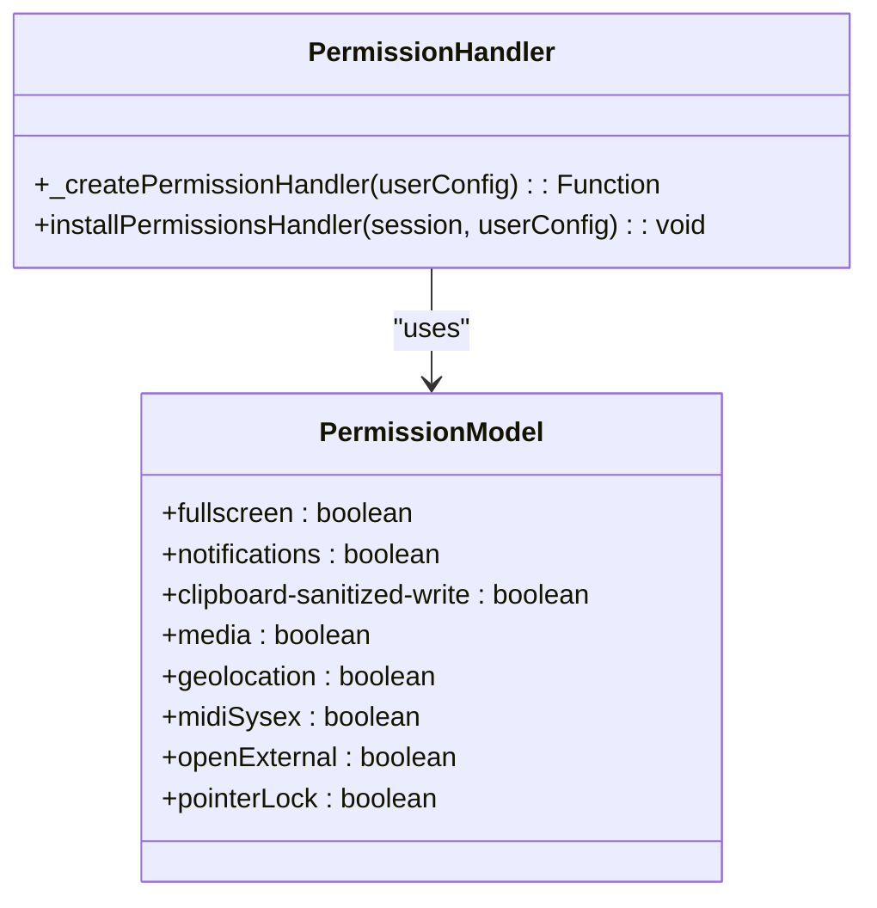
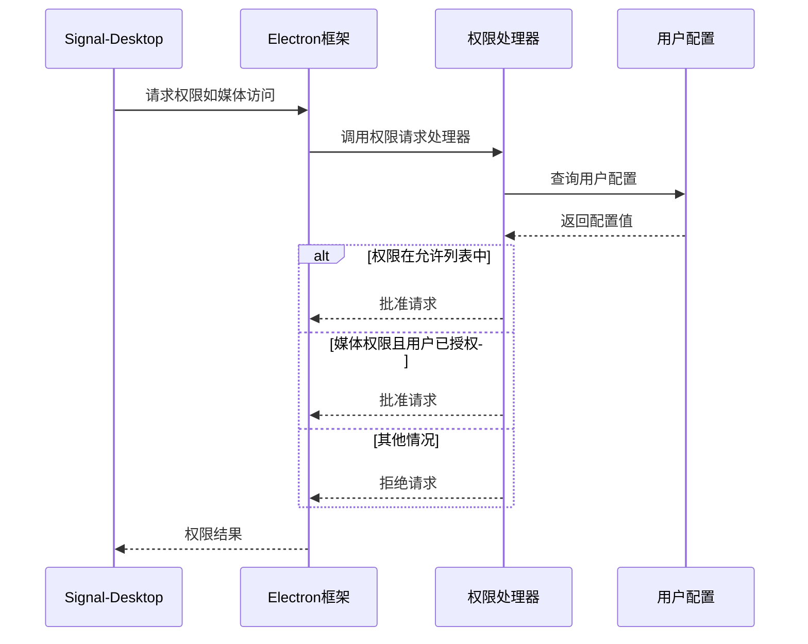
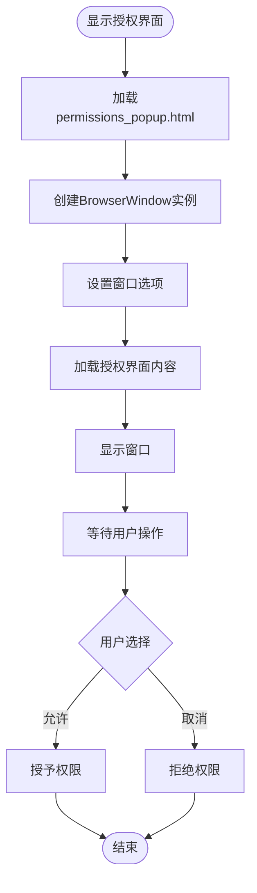

# 权限控制

<cite>
**本文档引用的文件**   
- [permissions.std.ts](file://app/permissions.std.ts)
- [main.main.ts](file://app/main.main.ts)
- [permissions_popup.html](file://permissions_popup.html)
- [PermissionsPopup.dom.tsx](file://ts/components/PermissionsPopup.dom.tsx)
- [PermissionsPopup.scss](file://stylesheets/components/PermissionsPopup.scss)
- [requestMicrophonePermissions.dom.ts](file://ts/util/requestMicrophonePermissions.dom.ts)
- [callingPermissions.dom.ts](file://ts/util/callingPermissions.dom.ts)
- [MediaPermissionsModal.dom.tsx](file://ts/components/MediaPermissionsModal.dom.tsx)
</cite>

## 目录
1. [简介](#简介)
2. [权限模型设计](#权限模型设计)
3. [权限请求流程](#权限请求流程)
4. [用户授权界面实现](#用户授权界面实现)
5. [权限验证机制](#权限验证机制)
6. [权限管理API](#权限管理api)
7. [降级处理策略](#降级处理策略)
8. [结论](#结论)

## 简介
Signal-Desktop应用的权限控制系统旨在安全地管理应用对系统资源的访问。该系统通过Electron框架的权限处理机制，结合自定义的权限模型，确保用户对麦克风、摄像头等敏感资源的访问有完全的控制权。权限控制机制在应用启动时安装，并在运行时根据用户配置和系统策略动态处理权限请求。

**Section sources**
- [permissions.std.ts](file://app/permissions.std.ts#L1-L97)

## 权限模型设计
Signal-Desktop的权限模型基于Electron的权限系统，定义了不同权限的默认状态和用户可配置性。权限模型主要包含以下几类：

- **允许的权限**：全屏显示、系统通知和剪贴板写入等基本功能权限，默认允许。
- **用户可配置的权限**：媒体访问（麦克风和摄像头），默认关闭，用户可手动启用。
- **禁止的权限**：地理位置、MIDI Sysex、外部链接打开和指针锁定等，出于安全考虑禁止。

权限模型通过`PERMISSIONS`常量对象定义，其中键为权限名称，值为默认状态。媒体权限的处理更为复杂，需要根据具体的媒体类型（音频或视频）和用户配置进行判断。

**Diagram sources **
- [permissions.std.ts](file://app/permissions.std.ts#L14-L28)

## 权限请求流程
权限请求流程从应用启动时安装权限处理器开始。`installPermissionsHandler`函数设置会话的权限请求处理器，该处理器根据预定义的权限模型和用户配置决定是否批准权限请求。

当应用需要访问受保护的资源时，Electron会触发权限请求。权限处理器根据请求的权限类型进行处理：
- 对于媒体权限，检查`details.mediaTypes`以确定是音频还是视频请求，并根据相应的用户配置（`mediaPermissions`或`mediaCameraPermissions`）决定是否批准。
- 对于其他预定义的权限，直接根据`PERMISSIONS`对象的值批准或拒绝。
- 对于未定义的权限，默认拒绝。

**Diagram sources **
- [permissions.std.ts](file://app/permissions.std.ts#L30-L80)

## 用户授权界面实现
当权限请求被拒绝且需要用户干预时，Signal-Desktop会显示一个用户授权界面。该界面通过`showPermissionsPopupWindow`函数创建，是一个模态对话框，阻止用户与主窗口交互直到做出选择。

授权界面的实现包含以下组件：
- **HTML结构**：`permissions_popup.html`定义了基本的页面结构和样式表引用。
- **React组件**：`PermissionsPopup`组件渲染授权界面的内容，包括消息文本和操作按钮。
- **样式定义**：`PermissionsPopup.scss`文件定义了界面的视觉样式，包括布局、颜色和字体。

界面根据请求上下文（语音通话、视频通话或语音备忘录）显示不同的消息，并提供"允许"和"取消"按钮供用户选择。

**Diagram sources **
- [main.main.ts](file://app/main.main.ts#L1534-L1597)
- [permissions_popup.html](file://permissions_popup.html#L1-L26)
- [PermissionsPopup.dom.tsx](file://ts/components/PermissionsPopup.dom.tsx#L1-L51)
- [PermissionsPopup.scss](file://stylesheets/components/PermissionsPopup.scss#L1-L38)

## 权限验证机制
权限验证机制分布在应用的不同功能模块中，确保在执行敏感操作前检查相应的权限。主要的验证方式包括：

- **直接API调用**：通过`window.IPC`接口调用`getMediaPermissions`和`getMediaCameraPermissions`方法检查当前权限状态。
- **封装的权限请求函数**：`requestMicrophonePermissions`和`requestCameraPermissions`函数封装了权限检查和请求逻辑，简化了调用方的代码。
- **组件级权限检查**：如`MediaPermissionsModal`组件在用户尝试访问媒体设备时显示系统权限设置指引。

权限验证通常遵循"检查-请求-再检查"的模式：先检查当前权限，如果未授权则请求用户授权，最后再次检查以确认最终状态。

**Section sources**
- [requestMicrophonePermissions.dom.ts](file://ts/util/requestMicrophonePermissions.dom.ts#L4-L16)
- [callingPermissions.dom.ts](file://ts/util/callingPermissions.dom.ts#L4-L13)
- [MediaPermissionsModal.dom.tsx](file://ts/components/MediaPermissionsModal.dom.tsx#L1-L89)

## 权限管理API
Signal-Desktop提供了清晰的API来管理权限，主要分为两类：

### IPC接口
主进程和渲染进程之间通过IPC（进程间通信）进行权限相关的通信：
- `show-permissions-popup`：显示权限授权界面
- `getMediaPermissions`：获取麦克风权限状态
- `getMediaCameraPermissions`：获取摄像头权限状态

### 工具函数
提供了一系列工具函数来简化权限管理：
- `requestMicrophonePermissions(forCalling)`：请求麦克风权限，根据是否用于通话显示不同消息
- `requestCameraPermissions()`：请求摄像头权限
- `installPermissionsHandler()`：安装权限处理器，通常在应用启动时调用

这些API的设计遵循了清晰的职责分离，将权限请求的逻辑与业务逻辑解耦，提高了代码的可维护性。

**Section sources**
- [main.main.ts](file://app/main.main.ts#L2753-L2757)
- [requestMicrophonePermissions.dom.ts](file://ts/util/requestMicrophonePermissions.dom.ts#L4-L16)
- [callingPermissions.dom.ts](file://ts/util/callingPermissions.dom.ts#L4-L13)

## 降级处理策略
当权限被拒绝或无法获取时，Signal-Desktop采用优雅的降级处理策略，确保应用的其他功能不受影响：

1. **静默失败**：对于非关键功能，如某些UI效果，权限被拒绝时简单地跳过相关操作。
2. **用户引导**：对于关键功能，如通话或语音消息，显示清晰的错误消息并引导用户到系统设置中手动授予权限。
3. **功能禁用**：在UI中禁用依赖于特定权限的功能按钮，防止用户尝试执行不可能的操作。
4. **状态同步**：确保权限状态在应用的不同部分保持同步，避免出现不一致的UI状态。

这种分层的降级策略平衡了安全性和用户体验，既保护了用户隐私，又不会让应用变得不可用。

**Section sources**
- [requestMicrophonePermissions.dom.ts](file://ts/util/requestMicrophonePermissions.dom.ts#L8-L12)
- [callingPermissions.dom.ts](file://ts/util/callingPermissions.dom.ts#L5-L9)

## 结论
Signal-Desktop的权限控制系统是一个精心设计的安全机制，它通过结合Electron的原生权限管理和自定义的用户界面，为用户提供了对敏感资源的完全控制。系统的设计体现了最小权限原则，只在必要时请求权限，并提供了清晰的用户反馈和降级路径。通过模块化的API和清晰的职责分离，权限管理代码易于维护和扩展，为应用的安全性提供了坚实的基础。