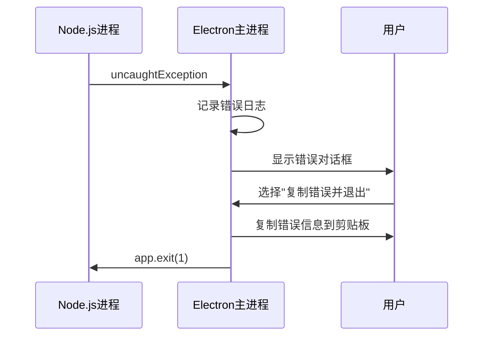
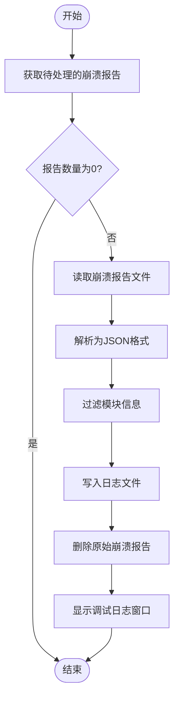
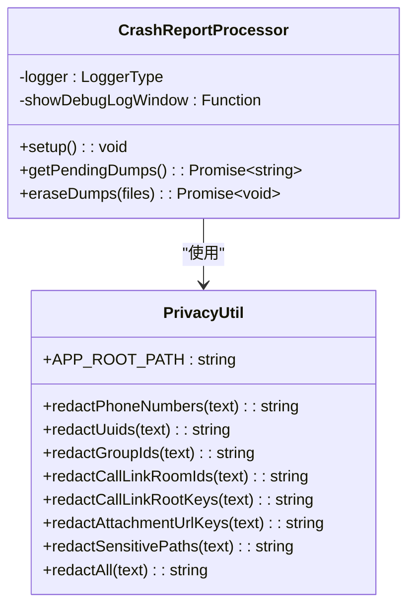
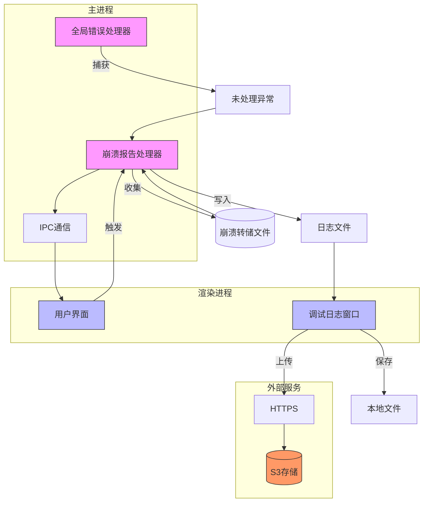

# 错误报告

<cite>
**本文档中引用的文件**   
- [crashReports.main.ts](file://app/crashReports.main.ts)
- [global_errors.main.ts](file://app/global_errors.main.ts)
- [main.main.ts](file://app/main.main.ts)
- [privacy.node.ts](file://ts/util/privacy.node.ts)
- [debuglogs.node.ts](file://ts/logging/debuglogs.node.ts)
- [uploadDebugLog.node.ts](file://ts/logging/uploadDebugLog.node.ts)
- [CrashReportDialog.dom.tsx](file://ts/components/CrashReportDialog.dom.tsx)
</cite>

## 目录
1. [简介](#简介)
2. [崩溃报告机制](#崩溃报告机制)
3. [全局错误处理](#全局错误处理)
4. [异常捕获与信息收集](#异常捕获与信息收集)
5. [数据匿名化处理](#数据匿名化处理)
6. [错误报告传输安全](#错误报告传输安全)
7. [用户界面交互](#用户界面交互)
8. [系统架构图](#系统架构图)

## 简介
Signal-Desktop的错误报告机制旨在确保应用程序在发生崩溃或异常时能够可靠地收集诊断信息，同时严格保护用户隐私。该系统包含两个核心组件：崩溃报告和全局错误处理。崩溃报告使用Electron的crashReporter模块捕获原生崩溃，而全局错误处理则通过Node.js的进程事件监听器捕获JavaScript异常。所有收集的敏感信息都会经过严格的匿名化处理，确保不会泄露用户身份或个人信息。

**Section sources**
- [crashReports.main.ts](file://app/crashReports.main.ts#L1-L230)
- [global_errors.main.ts](file://app/global_errors.main.ts#L1-L85)

## 崩溃报告机制
Signal-Desktop的崩溃报告机制基于Electron的crashReporter模块实现。当应用程序发生原生崩溃时，系统会自动生成minidump文件并存储在本地。这些崩溃报告不会自动上传到服务器，而是由用户手动触发处理。系统通过`setup`函数初始化崩溃报告功能，该函数接受日志记录器、调试日志窗口显示函数和强制启用标志作为参数。崩溃报告仅在非生产环境或强制启用时激活，确保生产环境的稳定性和隐私保护。

崩溃报告的存储位置根据操作系统有所不同：在Windows上位于`crashDumps/reports`目录，在macOS和Linux上位于`crashDumps/pending`目录。系统通过`getPendingDumps`函数获取待处理的崩溃报告列表，并使用Zod库定义了详细的崩溃数据结构模式，包括崩溃信息、线程信息、模块信息和系统信息等。

**Section sources**
- [crashReports.main.ts](file://app/crashReports.main.ts#L69-L82)
- [crashReports.main.ts](file://app/crashReports.main.ts#L19-L67)

## 全局错误处理
全局错误处理机制通过监听Node.js进程的`uncaughtException`和`unhandledRejection`事件来捕获未处理的异常和Promise拒绝。当检测到这些错误时，系统会调用`handleError`函数，该函数会将错误信息记录到控制台和日志文件中，并向用户显示错误对话框。对话框提供"退出"和"复制错误并退出"两个选项，用户可以选择复制详细的错误信息以便提交支持请求。

此外，系统还监听Electron的`render-process-gone`事件，该事件在渲染进程意外终止时触发。对于这些情况，系统会生成包含终止原因和退出代码的错误报告。全局错误处理程序通过`addHandler`函数注册，该函数在应用程序启动时被调用。

**Diagram sources**
- [global_errors.main.ts](file://app/global_errors.main.ts#L77-L83)
- [global_errors.main.ts](file://app/global_errors.main.ts#L64-L75)

## 异常捕获与信息收集
异常捕获和信息收集流程通过IPC（进程间通信）机制实现。主进程通过`ipc.handle`注册三个处理程序：`crash-reports:get-count`、`crash-reports:write-to-log`和`crash-reports:erase`。`get-count`处理程序计算待处理的崩溃报告数量，它会过滤掉类型为"Simulated Exception"的模拟崩溃报告，并自动删除无法读取的损坏报告文件。

`write-to-log`处理程序负责将崩溃报告写入日志文件。它会读取每个崩溃报告文件，将其转换为JSON格式，并进行数据过滤。系统会保留与Node.js插件（.node文件）和Electron/Signal相关的模块信息，而过滤掉其他无关的模块。处理完成后，系统会自动删除已处理的崩溃报告文件，并打开调试日志窗口显示结果。

**Diagram sources**
- [crashReports.main.ts](file://app/crashReports.main.ts#L157-L218)
- [crashReports.main.ts](file://app/crashReports.main.ts#L182-L199)

## 数据匿名化处理
数据匿名化处理是Signal-Desktop错误报告机制的核心隐私保护措施。系统通过`redactAll`函数实现全面的数据脱敏，该函数会识别并替换各种敏感信息。匿名化策略包括：电话号码（+后跟7-12位数字）、UUID、群组ID、调用链接房间ID、调用链接根密钥、附件URL密钥等。所有敏感信息都会被替换为"[REDACTED]"占位符，同时保留最后三位字符以帮助调试。

系统还实现了路径红acting功能，通过`addSensitivePath`函数将应用程序根路径添加到敏感路径列表中。任何包含这些路径的文本都会被自动红acting。此外，系统还会过滤信用卡号码，防止支付信息意外泄露。这些匿名化措施确保了即使在详细的崩溃报告中，也不会包含任何可识别用户身份的信息。

**Diagram sources**
- [privacy.node.ts](file://ts/util/privacy.node.ts#L19-L31)
- [privacy.node.ts](file://ts/util/privacy.node.ts#L223-L241)

## 错误报告传输安全
错误报告的传输安全通过HTTPS协议和安全的文件上传机制保障。当用户选择上传调试日志时，系统会向`https://debuglogs.org`发送GET请求获取预签名的S3上传表单。该请求包含User-Agent头信息，用于识别客户端版本。获取到上传凭证后，系统会使用FormData构建POST请求，将压缩后的日志文件上传到Amazon S3存储。

传输过程中，所有通信都通过HTTPS加密，确保数据在传输过程中的机密性和完整性。上传的文件名包含应用程序版本信息，但不包含任何用户标识。系统还实现了上传超时机制（1分钟），防止请求无限期挂起。上传成功后，用户会收到一个公开的下载链接，可以分享给技术支持团队。

**Section sources**
- [uploadDebugLog.node.ts](file://ts/logging/uploadDebugLog.node.ts#L1-L119)
- [debuglogs.node.ts](file://ts/logging/debuglogs.node.ts#L1-L126)

## 用户界面交互
用户界面交互通过`CrashReportDialog`组件实现，该组件在检测到未处理的崩溃报告时向用户显示。对话框提供两个操作按钮："清除"和"提交"。点击"提交"按钮会触发`writeCrashReportsToLog`操作，将崩溃报告写入日志并打开调试日志窗口；点击"清除"按钮会删除所有待处理的崩溃报告。

调试日志窗口显示完整的系统信息和日志内容，包括时间戳、用户代理、Node.js版本、应用程序版本、操作系统版本等。用户可以选择保存日志文件到本地或直接上传到服务器。整个用户界面设计简洁明了，确保用户能够轻松理解和处理崩溃报告，同时提供足够的信息供技术支持分析问题。

**Section sources**
- [CrashReportDialog.dom.tsx](file://ts/components/CrashReportDialog.dom.tsx#L1-L76)
- [SmartCrashReportDialog.preload.tsx](file://ts/state/smart/CrashReportDialog.preload.tsx#L1-L23)

## 系统架构图

**Diagram sources**
- [crashReports.main.ts](file://app/crashReports.main.ts)
- [global_errors.main.ts](file://app/global_errors.main.ts)
- [uploadDebugLog.node.ts](file://ts/logging/uploadDebugLog.node.ts)