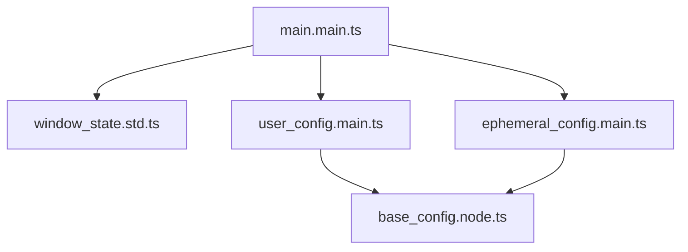
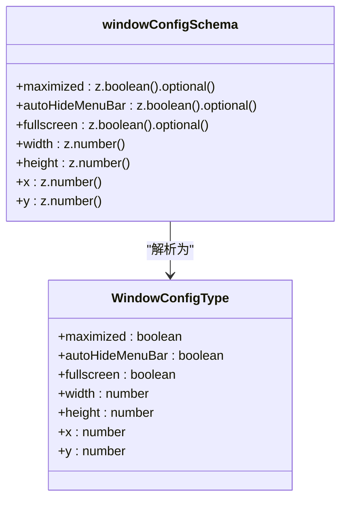
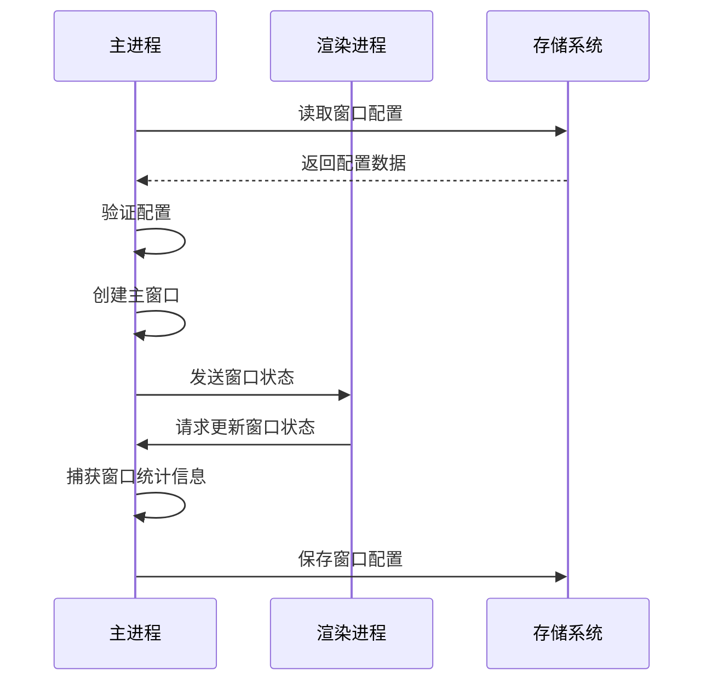
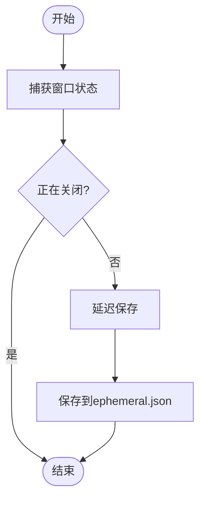
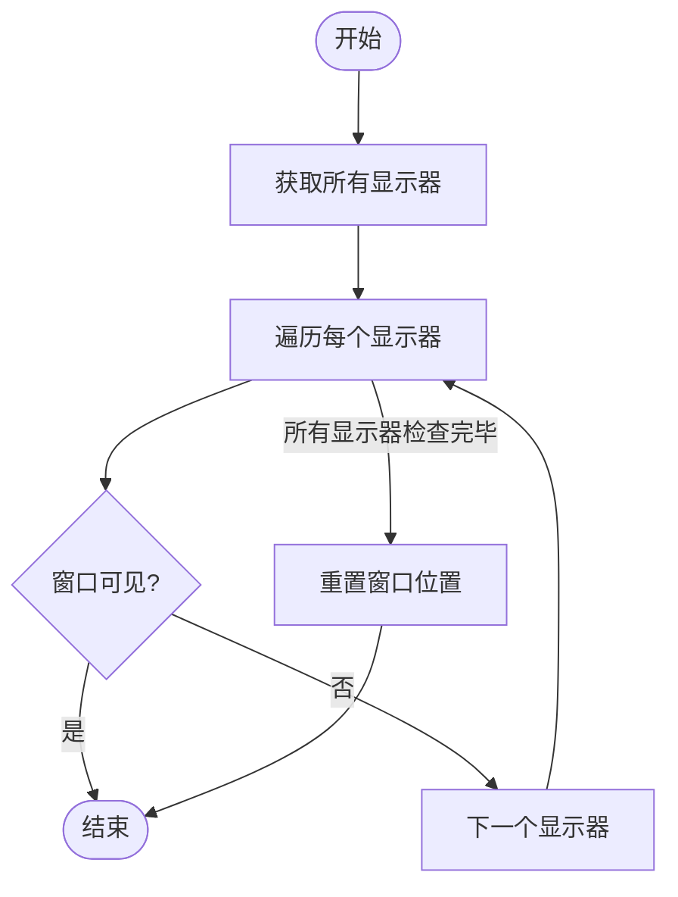
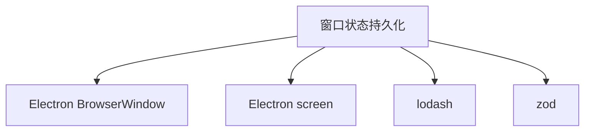

# 状态持久化

<cite>
**本文档中引用的文件**  
- [main.main.ts](file://app/main.main.ts)
- [window_state.std.ts](file://app/window_state.std.ts)
- [user_config.main.ts](file://app/user_config.main.ts)
- [ephemeral_config.main.ts](file://app/ephemeral_config.main.ts)
- [base_config.node.ts](file://app/base_config.node.ts)
</cite>

## 目录
1. [简介](#简介)
2. [项目结构](#项目结构)
3. [核心组件](#核心组件)
4. [架构概述](#架构概述)
5. [详细组件分析](#详细组件分析)
6. [依赖分析](#依赖分析)
7. [性能考虑](#性能考虑)
8. [故障排除指南](#故障排除指南)
9. [结论](#结论)

## 简介
本文档详细描述了Signal-Desktop应用程序中窗口状态持久化的实现机制。该功能确保用户在关闭和重新启动应用程序时，窗口的位置、大小、最大化状态等属性能够被正确保存和恢复。文档涵盖了状态数据的序列化格式、存储位置、读写流程，以及在多显示器环境下的坐标计算和适配逻辑。此外，还说明了状态持久化与用户配置的集成方式，以及配置重置时的默认状态处理。

## 项目结构
Signal-Desktop的窗口状态持久化功能主要由以下几个核心文件组成：

- `app/main.main.ts`：主进程入口文件，负责创建主窗口并管理窗口状态的保存和恢复。
- `app/window_state.std.ts`：定义窗口状态标志，用于控制应用程序的关闭流程。
- `app/user_config.main.ts` 和 `app/ephemeral_config.main.ts`：分别管理用户配置和临时配置，其中窗口状态信息存储在临时配置中。
- `app/base_config.node.ts`：提供配置文件读写的基础功能，支持JSON格式的序列化和反序列化。

这些文件共同协作，实现了窗口状态的持久化功能。

**图表来源**  
- [main.main.ts](file://app/main.main.ts#L425-L450)
- [user_config.main.ts](file://app/user_config.main.ts#L42-L51)
- [ephemeral_config.main.ts](file://app/ephemeral_config.main.ts#L13-L22)

**章节来源**  
- [main.main.ts](file://app/main.main.ts#L1-L3387)
- [window_state.std.ts](file://app/window_state.std.ts#L1-L37)

## 核心组件
窗口状态持久化的核心组件包括窗口配置的读取、验证和保存逻辑。在应用程序启动时，`main.main.ts`文件会从`user_config`和`ephemeral_config`中读取窗口配置，并使用Zod库进行验证。如果配置有效，则应用该配置来初始化主窗口的大小和位置。

**图表来源**  
- [main.main.ts](file://app/main.main.ts#L427-L436)

**章节来源**  
- [main.main.ts](file://app/main.main.ts#L425-L450)

## 架构概述
Signal-Desktop的窗口状态持久化架构基于Electron的主进程和渲染进程通信机制。主进程负责管理窗口的创建和状态保存，而渲染进程则通过IPC（Inter-Process Communication）与主进程交互，获取和更新窗口状态。

**图表来源**  
- [main.main.ts](file://app/main.main.ts#L810-L844)
- [window_state.std.ts](file://app/window_state.std.ts#L4-L37)

**章节来源**  
- [main.main.ts](file://app/main.main.ts#L800-L871)

## 详细组件分析

### 窗口状态管理分析
窗口状态管理的核心逻辑位于`main.main.ts`文件中。当窗口发生大小调整、移动、最大化或还原时，`captureWindowStats`函数会被触发，捕获当前窗口的状态并更新到`windowConfig`对象中。然后通过`debouncedSaveStats`函数将配置保存到`ephemeral.json`文件中。

**图表来源**  
- [main.main.ts](file://app/main.main.ts#L810-L844)

**章节来源**  
- [main.main.ts](file://app/main.main.ts#L800-L871)

### 多显示器环境适配分析
在多显示器环境下，Signal-Desktop通过`screen.getAllDisplays()`获取所有显示器的信息，并检查窗口是否在任何显示器的可见区域内。如果窗口位置超出所有显示器的边界，则重置其位置，确保窗口在下次启动时显示在主显示器上。

**图表来源**  
- [main.main.ts](file://app/main.main.ts#L757-L771)

**章节来源**  
- [main.main.ts](file://app/main.main.ts#L746-L772)

## 依赖分析
窗口状态持久化功能依赖于以下几个关键模块：

- Electron的`BrowserWindow`类，用于创建和管理主窗口。
- `screen`模块，用于获取显示器信息。
- `lodash`库，用于对象操作和函数节流。
- `zod`库，用于配置数据的类型验证。

**图表来源**  
- [main.main.ts](file://app/main.main.ts#L16-L33)
- [base_config.node.ts](file://app/base_config.node.ts#L7-L8)

**章节来源**  
- [main.main.ts](file://app/main.main.ts#L1-L3387)
- [base_config.node.ts](file://app/base_config.node.ts#L1-L127)

## 性能考虑
为了提高性能，Signal-Desktop采用了函数节流技术，通过`debounce`函数将窗口状态的保存操作延迟500毫秒执行。这可以避免在用户频繁调整窗口大小时频繁写入磁盘，从而减少I/O操作对性能的影响。

## 故障排除指南
如果窗口状态未能正确保存或恢复，可以尝试以下步骤进行排查：

1. 检查`ephemeral.json`文件是否存在且可写。
2. 确认`windowConfigSchema`验证通过，配置数据格式正确。
3. 查看日志文件，确认是否有相关的错误信息。

**章节来源**  
- [main.main.ts](file://app/main.main.ts#L800-L871)
- [base_config.node.ts](file://app/base_config.node.ts#L84-L96)

## 结论
Signal-Desktop的窗口状态持久化功能通过合理的架构设计和高效的实现方式，确保了用户在不同会话之间能够获得一致的用户体验。通过对窗口状态的精确管理和多显示器环境的适配，该功能为用户提供了便捷和可靠的服务。