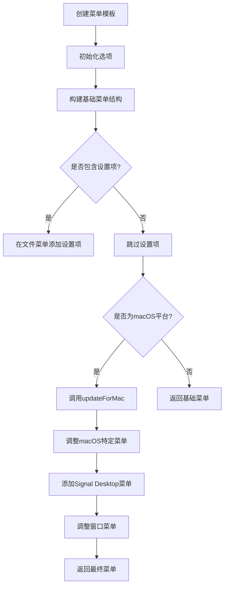
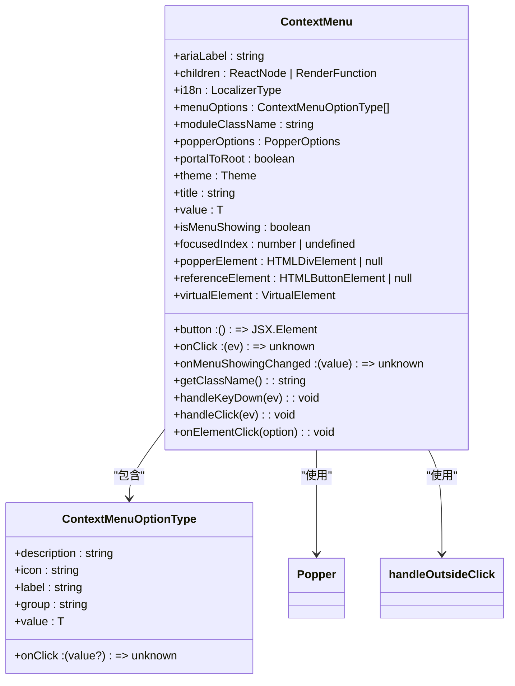
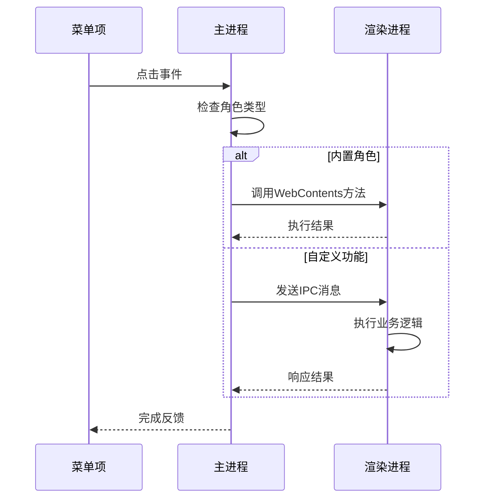
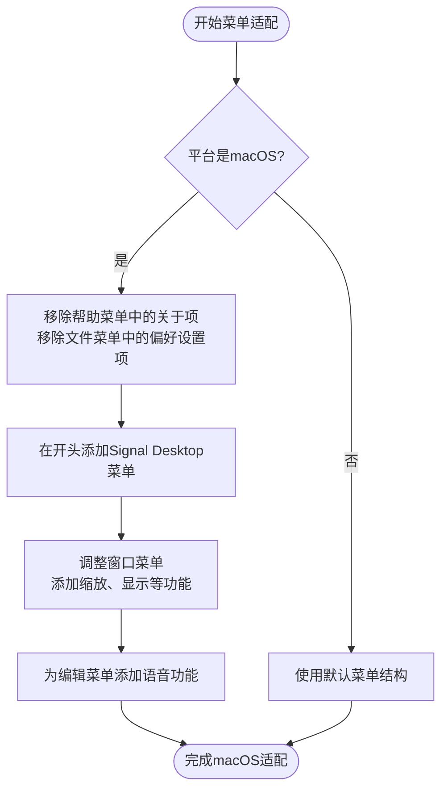
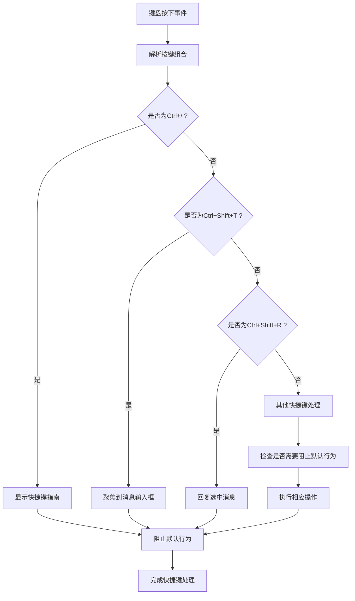
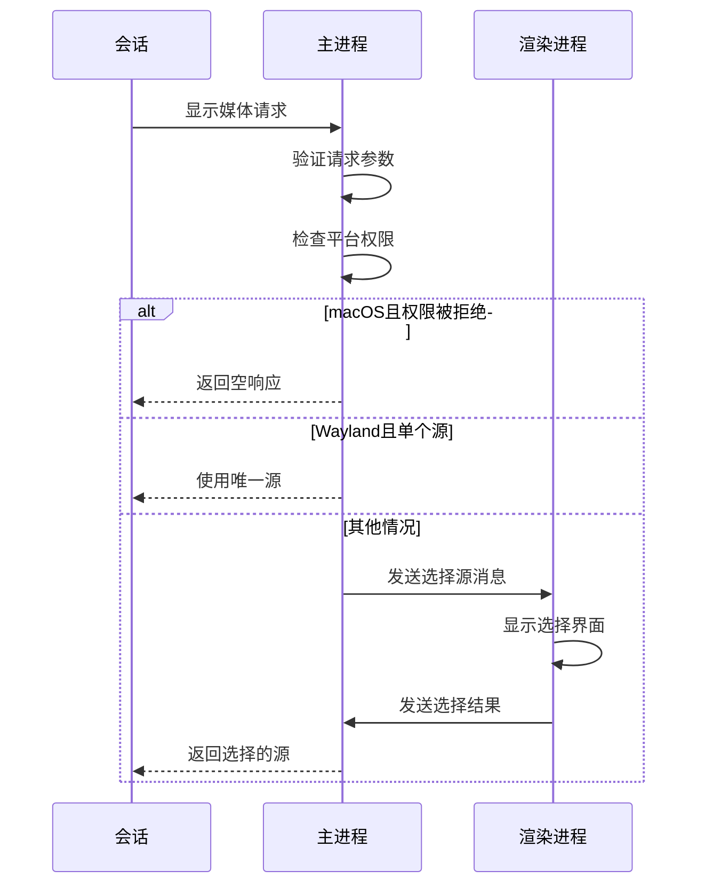

# 用户界面控制

<cite>
**本文档引用的文件**   
- [menu.std.ts](file://app/menu.std.ts)
- [main.main.ts](file://app/main.main.ts)
- [types/menu.std.ts](file://ts/types/menu.std.ts)
- [ContextMenu.dom.tsx](file://ts/components/ContextMenu.dom.tsx)
- [addGlobalKeyboardShortcuts.preload.ts](file://ts/services/addGlobalKeyboardShortcuts.preload.ts)
- [ShortcutGuide.dom.tsx](file://ts/components/ShortcutGuide.dom.tsx)
- [updateDefaultSession.main.ts](file://app/updateDefaultSession.main.ts)
</cite>

## 目录
1. [引言](#引言)
2. [主菜单结构与构建](#主菜单结构与构建)
3. [上下文菜单实现](#上下文菜单实现)
4. [菜单事件处理机制](#菜单事件处理机制)
5. [跨平台菜单适配](#跨平台菜单适配)
6. [快捷键注册与处理](#快捷键注册与处理)
7. [窗口间通信与状态管理](#窗口间通信与状态管理)
8. [默认会话更新机制](#默认会话更新机制)
9. [结论](#结论)

## 引言

Signal-Desktop应用程序的用户界面控制机制围绕Electron框架构建，实现了跨平台的主菜单和上下文菜单系统。该系统通过TypeScript实现类型安全的菜单定义和事件处理，支持动态更新和跨平台适配。主菜单提供应用程序级别的功能访问，而上下文菜单则为特定UI元素提供上下文相关的操作选项。整个系统通过IPC（进程间通信）机制在主进程和渲染进程之间协调，确保用户交互的响应性和一致性。

**Section sources**
- [menu.std.ts](file://app/menu.std.ts#L1-L402)
- [main.main.ts](file://app/main.main.ts#L2405-L3279)

## 主菜单结构与构建

Signal-Desktop的主菜单采用模块化设计，通过`createTemplate`函数动态生成菜单模板。该函数接收包含平台信息、开发选项和功能回调的配置对象，返回符合Electron菜单规范的结构化数据。主菜单包含五个顶级菜单项：文件、编辑、视图、窗口和帮助，每个菜单项包含特定功能的子菜单。

菜单构建过程首先定义基础结构，然后根据运行时条件进行动态调整。例如，开发模式下会添加开发者工具选项，而生产环境中则提供加入测试版的入口。菜单项通过i18n国际化接口获取本地化标签，确保多语言支持。菜单结构定义在`menu.std.ts`文件中，使用TypeScript接口`MenuListType`和`MenuOptionsType`确保类型安全。

**Diagram sources **
- [menu.std.ts](file://app/menu.std.ts#L17-L401)

**Section sources**
- [menu.std.ts](file://app/menu.std.ts#L17-L401)
- [types/menu.std.ts](file://ts/types/menu.std.ts#L6-L40)

## 上下文菜单实现

上下文菜单通过`ContextMenu.dom.tsx`组件实现，采用React和Popper.js库提供定位功能。该组件支持两种使用模式：直接提供子元素或通过渲染函数自定义按钮。上下文菜单的显示由`isMenuShowing`状态控制，通过`useEffect`钩子管理DOM类名，确保在菜单显示时正确处理可拖拽区域。

上下文菜单支持键盘导航，包括使用Tab键或方向键在选项间移动，Enter键选择选项，以及Escape键关闭菜单。菜单项可以分组显示，通过`group`属性自动添加分隔线。组件通过`handleOutsideClick`工具函数实现点击外部关闭功能，确保用户体验的一致性。菜单的定位基于虚拟元素，使其能够精确显示在鼠标光标位置。

**Diagram sources **
- [ContextMenu.dom.tsx](file://ts/components/ContextMenu.dom.tsx#L20-L364)

**Section sources**
- [ContextMenu.dom.tsx](file://ts/components/ContextMenu.dom.tsx#L1-L364)

## 菜单事件处理机制

菜单事件处理采用分层架构，主进程负责处理原生菜单事件，而渲染进程处理自定义UI组件的交互。主进程通过Electron的`ipcMain`模块监听菜单点击事件，根据菜单项的角色执行相应操作。例如，"复制"、"粘贴"等编辑操作直接调用WebContents方法，而"退出"操作则调用应用程序的退出方法。

对于自定义功能，菜单项的`click`回调指向在`main.main.ts`中定义的函数，这些函数通过IPC与渲染进程通信。例如，显示设置窗口的回调会通过`settingsChannel.openSettingsTab()`打开设置标签页。这种设计将UI逻辑与业务逻辑分离，提高了代码的可维护性。事件处理还包含错误处理和日志记录，确保系统的稳定性。

**Diagram sources **
- [main.main.ts](file://app/main.main.ts#L3215-L3267)

**Section sources**
- [main.main.ts](file://app/main.main.ts#L3215-L3267)
- [menu.std.ts](file://app/menu.std.ts#L2418-L2423)

## 跨平台菜单适配

Signal-Desktop通过`updateForMac`函数实现macOS平台的特殊菜单适配，这是跨平台UI设计的关键部分。在macOS上，应用程序菜单（包含关于、偏好设置等）位于屏幕左上角，与其他平台的文件菜单位置不同。`updateForMac`函数负责重新组织菜单结构，将帮助菜单中的"关于"项和文件菜单中的"偏好设置"项移动到新的Signal Desktop菜单中。

该函数还调整了窗口菜单，添加了macOS特有的"缩放"和"显示所有"功能。同时，为编辑菜单添加了语音功能子菜单，包含"开始朗读"和"停止朗读"选项。这些调整确保了Signal-Desktop在macOS上遵循人机界面指南（HIG），提供符合平台惯例的用户体验。对于Windows和Linux平台，则使用通用的菜单结构，确保跨平台的一致性。

**Diagram sources **
- [menu.std.ts](file://app/menu.std.ts#L264-L401)

**Section sources**
- [menu.std.ts](file://app/menu.std.ts#L264-L401)
- [menu_test.node.ts](file://ts/test-node/app/menu_test.node.ts#L116-L217)

## 快捷键注册与处理

快捷键系统通过`addGlobalKeyboardShortcuts.preload.ts`实现全局键盘事件监听。该模块在文档级别监听`keydown`事件，根据组合键执行相应操作。快捷键处理采用优先级机制，首先处理高优先级的快捷键如显示快捷键指南（Ctrl+/），然后处理其他功能快捷键。

系统区分命令键（macOS上的Command，其他平台上的Ctrl）和控制键，确保跨平台一致性。快捷键功能覆盖导航、消息操作和输入等多个方面，如使用Ctrl+Shift+T聚焦到消息输入框，Ctrl+Shift+R回复选中的消息。对于可能与浏览器默认行为冲突的快捷键，系统会调用`preventDefault()`和`stopPropagation()`阻止默认行为。

**Diagram sources **
- [addGlobalKeyboardShortcuts.preload.ts](file://ts/services/addGlobalKeyboardShortcuts.preload.ts#L1-L556)

**Section sources**
- [addGlobalKeyboardShortcuts.preload.ts](file://ts/services/addGlobalKeyboardShortcuts.preload.ts#L1-L556)
- [ShortcutGuide.dom.tsx](file://ts/components/ShortcutGuide.dom.tsx#L358-L531)

## 窗口间通信与状态管理

Signal-Desktop通过Electron的IPC机制实现主进程与渲染进程之间的双向通信。主进程通过`ipcMain.handle`定义异步处理程序，渲染进程通过`ipcRenderer.invoke`调用这些处理程序。例如，`getMainWindowStats`处理程序返回窗口的最大化和全屏状态，`getMenuOptions`返回菜单配置选项。

对于单向通信，主进程使用`ipcMain.on`监听事件，渲染进程使用`ipcRenderer.send`发送事件。这种模式用于更新UI状态，如`window:set-menu-options`事件通知渲染进程菜单选项已更新。通信数据通过TypeScript接口定义，确保类型安全。系统还使用Redux管理应用状态，通过`window.reduxStore`和`window.reduxActions`在预加载脚本中访问状态和操作。

**Section sources**
- [main.main.ts](file://app/main.main.ts#L3270-L3279)
- [phase1-ipc.preload.ts](file://ts/windows/main/phase1-ipc.preload.ts#L98-L130)

## 默认会话更新机制

默认会话更新机制通过`updateDefaultSession.main.ts`文件实现，负责配置Electron会话的全局行为。该模块设置拼写检查字典的下载URL，确保离线字典更新功能正常工作。它还配置了媒体捕获请求处理程序，用于处理屏幕共享请求。

媒体捕获处理程序首先检查请求类型，仅支持视频请求。在macOS上，它会检查屏幕共享权限状态，如果被拒绝则直接返回空响应以避免崩溃。在Linux Wayland环境下，如果只有一个捕获源，则直接使用该源。对于其他情况，生成唯一ID并发送`select-capture-sources`消息，等待用户选择后通过`ipcMain.once`监听响应。

**Diagram sources **
- [updateDefaultSession.main.ts](file://app/updateDefaultSession.main.ts#L1-L83)

**Section sources**
- [updateDefaultSession.main.ts](file://app/updateDefaultSession.main.ts#L1-L83)
- [screenShare/preload.preload.ts](file://ts/windows/screenShare/preload.preload.ts#L1-L34)

## 结论

Signal-Desktop的用户界面控制系统展示了现代桌面应用程序开发的最佳实践。通过Electron框架，它实现了跨平台的原生体验，同时利用TypeScript提供了类型安全的代码结构。菜单系统的设计考虑了不同操作系统的UI惯例，通过条件逻辑实现平台特定的适配。

事件处理机制清晰地分离了主进程和渲染进程的职责，通过IPC通信确保了系统的响应性和稳定性。快捷键系统提供了丰富的键盘操作，增强了用户体验。整个系统体现了模块化设计思想，各个组件职责明确，易于维护和扩展。这种架构为Signal-Desktop提供了可靠、高效的用户界面控制能力，支持其作为安全通信平台的核心功能。