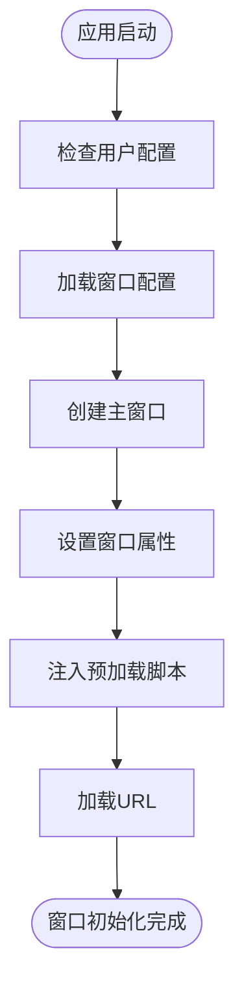
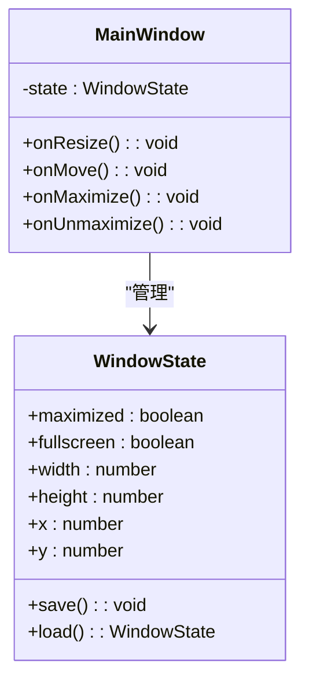
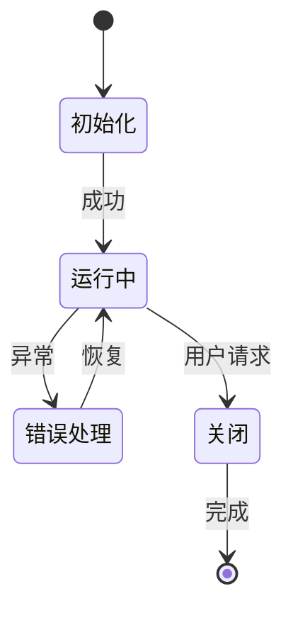

# 窗口生命周期

<cite>
**本文档引用的文件**  
- [main.main.ts](file://app/main.main.ts)
- [window_state.std.ts](file://app/window_state.std.ts)
- [preload.preload.ts](file://ts/windows/main/preload.preload.ts)
- [start.preload.js](file://ts/windows/main/start.preload.js)
- [loading.html](file://loading.html)
- [background.html](file://background.html)
</cite>

## 目录
1. [简介](#简介)
2. [窗口创建与初始化](#窗口创建与初始化)
3. [窗口显示与隐藏](#窗口显示与隐藏)
4. [窗口状态管理](#窗口状态管理)
5. [窗口关闭与清理](#窗口关闭与清理)
6. [窗口事件监听与处理](#窗口事件监听与处理)
7. [异常恢复与重启策略](#异常恢复与重启策略)
8. [总结](#总结)

## 简介
Signal-Desktop的窗口生命周期管理涉及主窗口的创建、初始化、显示、隐藏和关闭的完整流程。该系统通过Electron框架实现，确保了跨平台的一致性，并提供了丰富的用户体验功能，如最小化到系统托盘、全屏切换和窗口状态持久化。

**Section sources**
- [main.main.ts](file://app/main.main.ts#L1-L100)

## 窗口创建与初始化
主窗口的创建始于`createWindow`函数，该函数在应用启动时被调用。窗口的尺寸、位置和其他属性从用户配置中读取，并在必要时进行调整以适应当前显示器的工作区域。窗口的背景颜色根据用户的主题设置动态确定，而预加载脚本则用于在渲染进程中执行必要的初始化任务。

**Diagram sources**
- [main.main.ts](file://app/main.main.ts#L681-L800)
- [preload.preload.ts](file://ts/windows/main/preload.preload.ts#L1-L28)

**Section sources**
- [main.main.ts](file://app/main.main.ts#L681-L800)
- [preload.preload.ts](file://ts/windows/main/preload.preload.ts#L1-L28)

## 窗口显示与隐藏
窗口的显示和隐藏由`showWindow`和`hide`方法控制。当窗口需要显示时，如果它已经可见，则使用`focusAndForceToTop`方法将其置于最前端；否则，调用`show`方法。在某些情况下，如窗口处于全屏模式时关闭，会先退出全屏再隐藏窗口，以避免黑屏问题。

**Section sources**
- [main.main.ts](file://app/main.main.ts#L242-L256)
- [main.main.ts](file://app/main.main.ts#L913-L920)

## 窗口状态管理
窗口的状态（如最大化、最小化、全屏）通过监听相应的事件来管理。每当窗口大小或位置发生变化时，`captureWindowStats`函数会被调用，更新内存中的窗口配置，并通过防抖机制定期保存到持久化存储中。这确保了即使在意外关闭后，窗口也能恢复到上次的状态。

**Diagram sources**
- [main.main.ts](file://app/main.main.ts#L810-L844)

**Section sources**
- [main.main.ts](file://app/main.main.ts#L810-L844)

## 窗口关闭与清理
当用户尝试关闭窗口时，`close`事件处理器会被触发。在此过程中，应用会检查是否正在进行重要操作（如通话），并可能请求用户确认。如果确认关闭，窗口将被隐藏而非立即销毁，以便在支持系统托盘的平台上重新显示。最终，当应用真正退出时，所有资源将被释放，数据库连接关闭，应用终止。

**Section sources**
- [main.main.ts](file://app/main.main.ts#L864-L981)

## 窗口事件监听与处理
为了响应各种窗口事件，Signal-Desktop注册了多个事件监听器。这些监听器负责处理如窗口聚焦、失焦、进入/退出全屏等事件，并向渲染进程发送相应的消息。此外，通过IPC（进程间通信）机制，主进程可以接收来自渲染进程的请求，如显示或隐藏窗口。

**Section sources**
- [main.main.ts](file://app/main.main.ts#L537-L583)
- [main.main.ts](file://app/main.main.ts#L998-L1017)

## 异常恢复与重启策略
在遇到异常情况时，Signal-Desktop具备一定的恢复能力。例如，如果预加载脚本加载失败，错误信息将被记录，但不会阻止应用继续运行。此外，通过`windowState`模块，应用能够标记其是否准备好关闭，从而在重启或更新时做出适当的决策。

**Diagram sources**
- [window_state.std.ts](file://app/window_state.std.ts#L1-L37)

**Section sources**
- [window_state.std.ts](file://app/window_state.std.ts#L1-L37)
- [main.main.ts](file://app/main.main.ts#L975-L980)

## 总结
Signal-Desktop的窗口生命周期管理是一个复杂但高效的过程，涵盖了从创建到销毁的每一个环节。通过精心设计的事件处理和状态管理机制，确保了用户在不同操作下的流畅体验，同时也为开发者提供了强大的调试和维护工具。

**Section sources**
- [main.main.ts](file://app/main.main.ts#L1-L3387)
- [window_state.std.ts](file://app/window_state.std.ts#L1-L37)