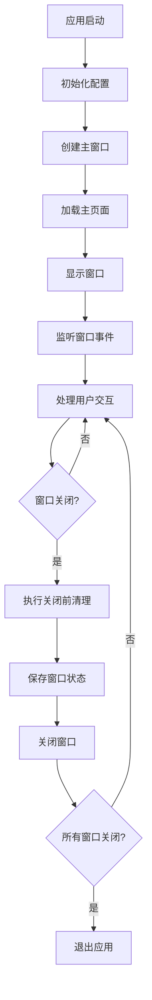
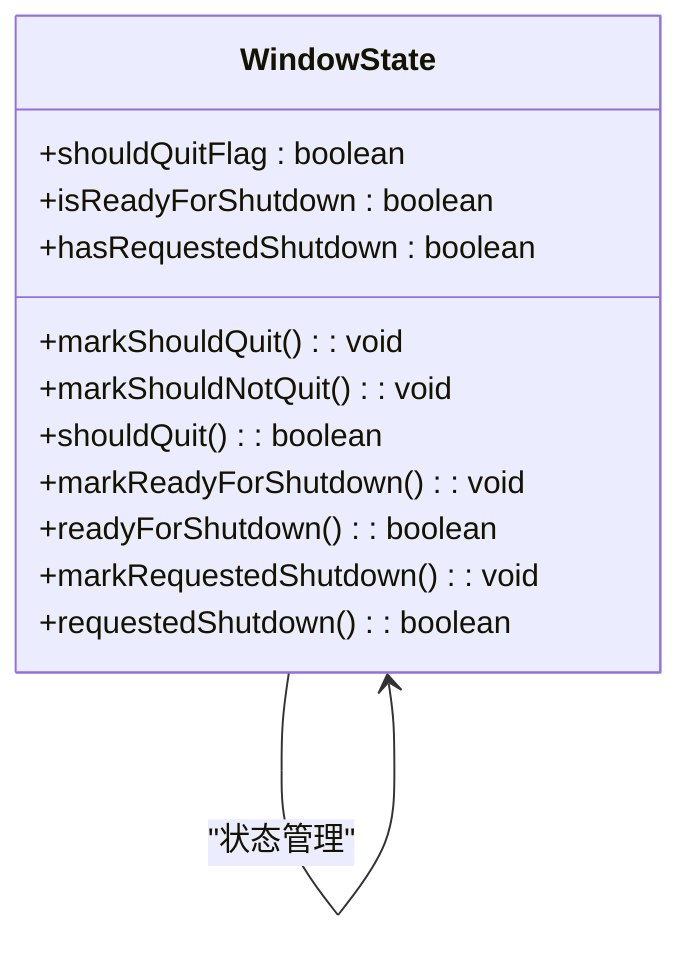
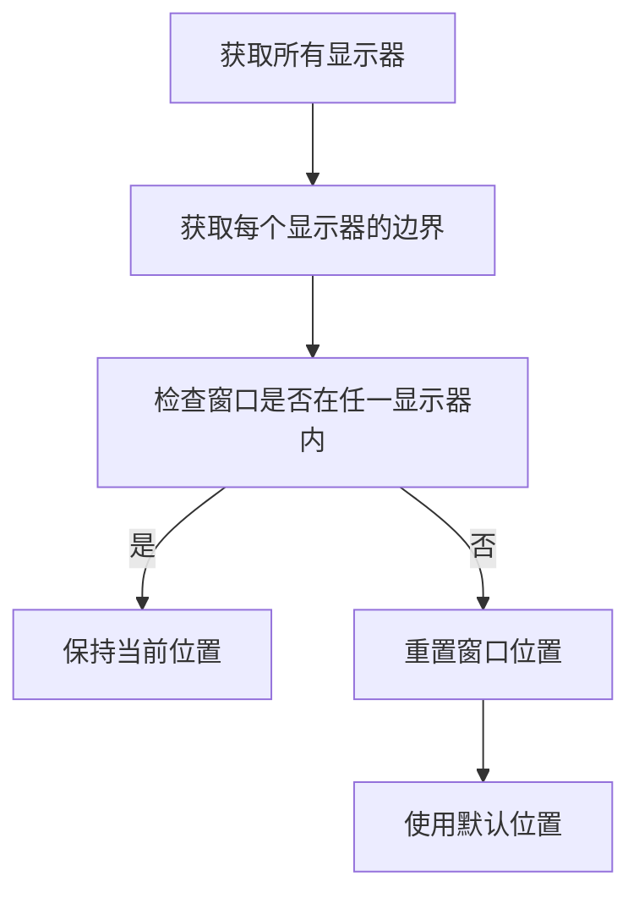
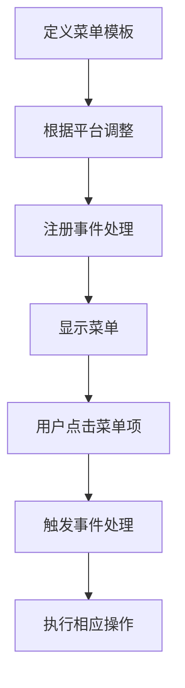
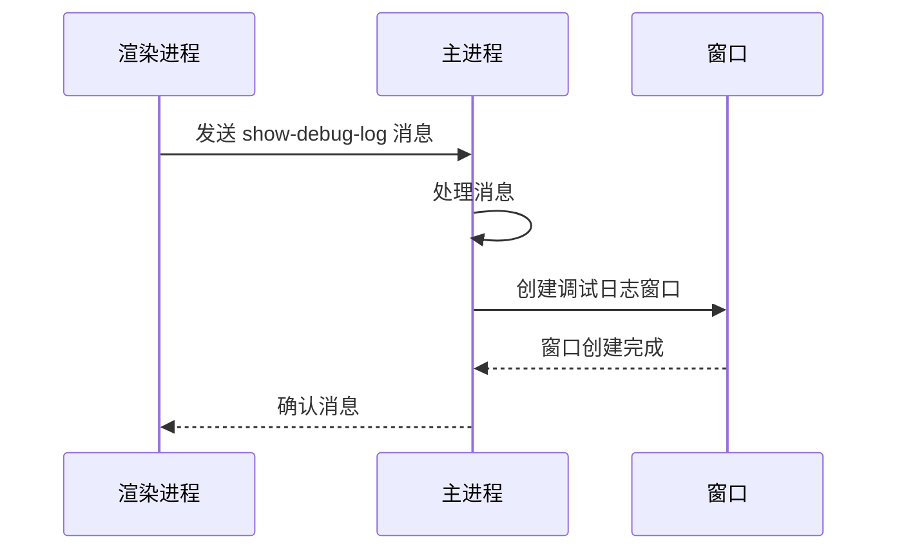
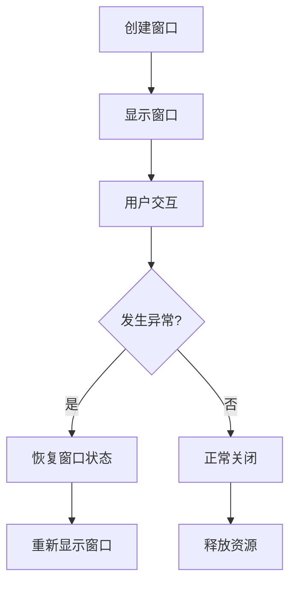

# 窗口管理

<cite>
**本文档中引用的文件**  
- [main.main.ts](file://app/main.main.ts)
- [window_state.std.ts](file://app/window_state.std.ts)
- [menu.std.ts](file://app/menu.std.ts)
- [phase1-ipc.preload.ts](file://ts/windows/main/phase1-ipc.preload.ts)
- [window.d.ts](file://ts/window.d.ts)
</cite>

## 目录
1. [简介](#简介)
2. [主窗口创建与生命周期](#主窗口创建与生命周期)
3. [窗口状态管理与持久化](#窗口状态管理与持久化)
4. [多显示器环境下的窗口定位](#多显示器环境下的窗口定位)
5. [应用菜单构建与事件处理](#应用菜单构建与事件处理)
6. [默认会话更新与窗口通信](#默认会话更新与窗口通信)
7. [窗口操作示例与异常恢复](#窗口操作示例与异常恢复)

## 简介
Signal-Desktop使用Electron框架实现跨平台桌面应用，其窗口管理机制涵盖了主窗口的创建、状态管理、生命周期控制、持久化存储以及多显示器支持。本文档深入分析其窗口管理的核心实现，包括窗口位置、大小和状态的持久化策略，应用菜单的构建与更新流程，以及窗口间通信模式。

## 主窗口创建与生命周期
Signal-Desktop的主窗口创建过程在`main.main.ts`文件中实现，通过Electron的`BrowserWindow`类创建主窗口实例。窗口创建前会进行一系列配置，包括设置窗口图标、标题栏样式、窗口大小和位置等。窗口创建后，会监听各种窗口事件，如`resize`、`move`、`maximize`、`unmaximize`等，以捕获窗口状态变化。

主窗口的生命周期由Electron的事件系统管理。当用户尝试关闭窗口时，会触发`close`事件，此时应用会执行关闭前的清理工作，如保存窗口状态、释放资源等。如果应用尚未准备好关闭，可以通过阻止默认行为来延迟关闭。当所有窗口都关闭后，应用会退出。

**Diagram sources**  
- [main.main.ts](file://app/main.main.ts#L776-L784)
- [main.main.ts](file://app/main.main.ts#L864-L871)

**Section sources**  
- [main.main.ts](file://app/main.main.ts#L1-L200)

## 窗口状态管理与持久化
Signal-Desktop通过`window_state.std.ts`文件管理窗口状态。该文件提供了标记窗口状态的函数，如`markShouldQuit`、`markReadyForShutdown`等。窗口状态的持久化通过在窗口事件触发时保存状态实现。例如，当窗口大小或位置发生变化时，会调用`captureWindowStats`函数捕获当前窗口状态，并通过`debouncedSaveStats`函数延迟保存到配置文件中。

窗口状态的持久化策略包括：
- 窗口位置和大小：保存窗口的x、y坐标以及宽度和高度。
- 窗口最大化状态：保存窗口是否处于最大化状态。
- 窗口全屏状态：保存窗口是否处于全屏状态。

这些状态信息在应用重启时会被读取，用于恢复窗口的先前状态。

**Diagram sources**  
- [window_state.std.ts](file://app/window_state.std.ts#L1-L37)

**Section sources**  
- [main.main.ts](file://app/main.main.ts#L829-L849)
- [window_state.std.ts](file://app/window_state.std.ts#L1-L37)

## 多显示器环境下的窗口定位
在多显示器环境下，Signal-Desktop会检查窗口位置是否在任何显示器的可见区域内。如果窗口位置不在任何显示器的可见区域内，会重置窗口位置，使其显示在主显示器上。这一逻辑在`main.main.ts`文件中的`visibleOnAnyScreen`函数中实现。

具体实现步骤如下：
1. 获取所有显示器的显示区域。
2. 检查窗口位置是否在任一显示器的显示区域内。
3. 如果不在任何显示器的显示区域内，删除窗口的x和y坐标，让Electron自动选择一个合适的位置。

**Diagram sources**  
- [main.main.ts](file://app/main.main.ts#L616-L625)

**Section sources**  
- [main.main.ts](file://app/main.main.ts#L746-L772)

## 应用菜单构建与事件处理
Signal-Desktop的应用菜单在`menu.std.ts`文件中定义。菜单的构建基于平台和应用状态动态生成。菜单项包括文件、编辑、视图、窗口和帮助等标准菜单。每个菜单项都关联一个事件处理函数，当用户点击菜单项时，会触发相应的操作。

菜单的构建过程如下：
1. 定义菜单模板，包括菜单项的标签、加速键和点击事件。
2. 根据平台（macOS、Windows、Linux）调整菜单结构。
3. 注册菜单事件处理函数。

例如，"视图"菜单中的"切换全屏"项会触发`togglefullscreen`角色，该角色会切换窗口的全屏状态。

**Diagram sources**  
- [menu.std.ts](file://app/menu.std.ts#L1-L402)

**Section sources**  
- [menu.std.ts](file://app/menu.std.ts#L1-L402)
- [main.main.ts](file://app/main.main.ts#L3218-L3267)

## 默认会话更新与窗口通信
Signal-Desktop通过`updateDefaultSession.main.ts`文件实现默认会话的更新。当应用启动或用户登录时，会更新默认会话信息。窗口间的通信通过Electron的IPC（进程间通信）机制实现。主进程和渲染进程之间通过`ipcMain`和`ipcRenderer`进行通信。

例如，当需要显示调试日志窗口时，渲染进程会发送`show-debug-log`消息，主进程接收到消息后创建并显示调试日志窗口。

**Diagram sources**  
- [phase1-ipc.preload.ts](file://ts/windows/main/phase1-ipc.preload.ts#L85-L165)
- [window.d.ts](file://ts/window.d.ts#L28-L70)

**Section sources**  
- [updateDefaultSession.main.ts](file://app/updateDefaultSession.main.ts)
- [phase1-ipc.preload.ts](file://ts/windows/main/phase1-ipc.preload.ts#L85-L165)

## 窗口操作示例与异常恢复
Signal-Desktop提供了丰富的窗口操作API，包括创建、显示、隐藏和关闭窗口。以下是一些常见的窗口操作示例：

- **创建窗口**：使用`new BrowserWindow(options)`创建新窗口。
- **显示窗口**：调用`window.show()`显示窗口。
- **隐藏窗口**：调用`window.hide()`隐藏窗口。
- **关闭窗口**：调用`window.close()`关闭窗口。

当窗口状态异常时，如窗口位置超出显示器范围，应用会自动恢复窗口到有效位置。此外，通过监听窗口事件，可以及时捕获和处理异常情况，确保应用的稳定运行。

**Diagram sources**  
- [main.main.ts](file://app/main.main.ts#L776-L784)
- [main.main.ts](file://app/main.main.ts#L864-L871)

**Section sources**  
- [main.main.ts](file://app/main.main.ts#L776-L871)