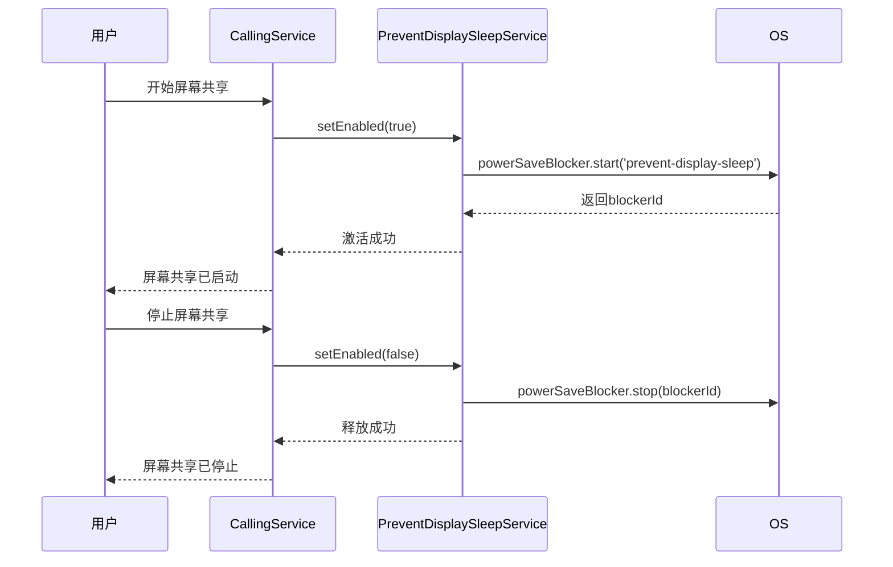

# 电源管理

<cite>
**本文档引用的文件**  
- [PreventDisplaySleepService.std.ts](file://app/PreventDisplaySleepService.std.ts)
- [main.main.ts](file://app/main.main.ts)
- [powerChannel.main.ts](file://ts/main/powerChannel.main.ts)
- [calling.preload.ts](file://ts/services/calling.preload.ts)
- [desktopCapturer.preload.ts](file://ts/util/desktopCapturer.preload.ts)
- [PreventDisplaySleepService_test.std.ts](file://ts/test-node/app/PreventDisplaySleepService_test.std.ts)
</cite>

## 目录
1. [简介](#简介)
2. [核心组件](#核心组件)
3. [服务生命周期与激活策略](#服务生命周期与激活策略)
4. [关键场景下的行为分析](#关键场景下的行为分析)
5. [与操作系统电源管理API的交互](#与操作系统电源管理api的交互)
6. [资源占用优化与跨平台兼容性](#资源占用优化与跨平台兼容性)
7. [电池消耗控制策略](#电池消耗控制策略)
8. [服务使用示例](#服务使用示例)
9. [常见问题排查](#常见问题排查)
10. [结论](#结论)

## 简介
Signal-Desktop电源管理服务旨在防止在关键通信场景下显示器进入睡眠状态，确保通话和屏幕共享等重要功能的连续性。该服务通过Electron的`powerSaveBlocker` API与操作系统底层电源管理机制交互，精确控制显示器睡眠行为。服务设计注重资源效率，仅在必要时激活，并在场景结束后及时释放资源，避免不必要的电池消耗。本文档深入分析`PreventDisplaySleepService.std.ts`的实现机制，涵盖其在通话、屏幕共享等场景下的激活与释放逻辑，以及生命周期管理、资源优化和跨平台兼容性处理。

## 核心组件

`PreventDisplaySleepService`是Signal-Desktop中负责管理显示器睡眠状态的核心服务。该服务封装了Electron的`powerSaveBlocker`功能，提供了一个简洁、安全的接口来控制显示器的睡眠行为。服务的主要职责是防止在进行通话或屏幕共享时显示器自动关闭，从而保证用户体验的连续性。

服务的核心逻辑非常清晰：通过`setEnabled`方法接收一个布尔值参数，决定是否阻止显示器睡眠。当启用时，服务调用`powerSaveBlocker.start('prevent-display-sleep')`创建一个阻止器ID；当禁用时，通过该ID调用`stop`方法释放阻止器。服务内部通过`blockerId`属性跟踪当前阻止器的状态，确保不会重复创建或释放。

**Section sources**
- [PreventDisplaySleepService.std.ts](file://app/PreventDisplaySleepService.std.ts#L1-L46)

## 服务生命周期与激活策略

`PreventDisplaySleepService`的生命周期管理严谨且高效。服务的激活与释放严格遵循“按需启用，及时释放”的原则，确保系统资源得到最优利用。

服务的激活策略基于两个核心场景：正在进行通话（包括一对一通话和群组通话）和正在进行屏幕共享。当用户发起或加入一个通话时，服务被激活；当通话结束时，服务被释放。同样，当用户开始屏幕共享时，服务被激活；当停止共享时，服务被释放。这种策略确保了在用户进行关键通信时，显示器不会因系统节能策略而关闭。

服务的实现中包含了重要的状态检查机制。在`#enable`方法中，会首先检查`blockerId`是否已定义，以防止重复创建阻止器。同样，在`#disable`方法中，也会检查`blockerId`是否存在，以避免对未激活的服务进行释放操作。这种防御性编程确保了服务的稳定性和可靠性。

**Section sources**
- [PreventDisplaySleepService.std.ts](file://app/PreventDisplaySleepService.std.ts#L32-L45)
- [main.main.ts](file://app/main.main.ts#L192-L194)

## 关键场景下的行为分析

### 通话场景下的行为
在通话场景中，`PreventDisplaySleepService`的激活由通话服务直接控制。当`calling.preload.ts`中的`#startPresenting`或`setPresenting`方法被调用时，会触发对电源管理服务的调用。具体来说，当`mediaStream`不为空时，表示用户正在开始屏幕共享，此时会调用`preventDisplaySleepService.setEnabled(true)`来激活服务。当`mediaStream`为空时，表示用户停止了共享，此时会调用`preventDisplaySleepService.setEnabled(false)`来释放服务。



**Diagram sources**
- [calling.preload.ts](file://ts/services/calling.preload.ts#L2646-L2665)
- [PreventDisplaySleepService.std.ts](file://app/PreventDisplaySleepService.std.ts#L18-L30)

### 屏幕共享场景下的行为
在屏幕共享场景中，服务的行为与通话场景紧密集成。`desktopCapturer.preload.ts`文件中的`onStart`回调函数在屏幕共享开始时被触发，此时会通知上层服务。虽然该文件本身不直接调用电源管理服务，但它为`calling.preload.ts`提供了必要的事件通知，从而间接触发了电源管理服务的激活。

服务在屏幕共享场景下的行为特点是“即时响应”。一旦共享开始，服务立即激活，确保从第一帧画面开始，显示器就处于唤醒状态。这种即时性对于提供无缝的用户体验至关重要。

**Section sources**
- [desktopCapturer.preload.ts](file://ts/util/desktopCapturer.preload.ts#L268-L282)
- [calling.preload.ts](file://ts/services/calling.preload.ts#L2601-L2611)

## 与操作系统电源管理API的交互

`PreventDisplaySleepService`通过Electron框架提供的`powerSaveBlocker`模块与操作系统的电源管理API进行交互。`powerSaveBlocker`是一个跨平台的抽象层，它在不同操作系统上使用相应的原生API来阻止系统进入节能模式。

在Windows上，它可能使用`SetThreadExecutionState` API；在macOS上，它可能使用`IOPMAssertionCreateWithName`；在Linux上，它可能通过D-Bus与电源管理守护进程（如UPower或logind）通信。`prevent-display-sleep`类型专门用于阻止显示器进入睡眠状态，而不会影响系统的其他节能功能（如CPU降频）。

服务通过`start`方法创建一个阻止器，并获得一个唯一的`blockerId`。这个ID是服务与操作系统交互的关键。当需要释放阻止时，服务使用相同的ID调用`stop`方法。这种基于ID的管理模式确保了操作的精确性和安全性。

```mermaid
flowchart TD
A[PreventDisplaySleepService] --> B["setEnabled(true)"]
B --> C["#enable()"]
C --> D{"blockerId 已存在?"}
D --> |否| E["调用 powerSaveBlocker.start()"]
E --> F["获取 blockerId"]
F --> G["存储 blockerId"]
D --> |是| H[无操作]
I[setEnabled(false)] --> J["#disable()"]
J --> K{"blockerId 存在?"}
K --> |是| L["调用 powerSaveBlocker.stop(blockerId)"]
L --> M["删除 blockerId"]
K --> |否| N[无操作]
```

**Diagram sources**
- [PreventDisplaySleepService.std.ts](file://app/PreventDisplaySleepService.std.ts#L32-L45)

## 资源占用优化与跨平台兼容性

`PreventDisplaySleepService`在设计上充分考虑了资源占用优化和跨平台兼容性。

在资源占用方面，服务采用了“懒加载”和“即时释放”策略。阻止器仅在必要时创建，并在场景结束后立即销毁。服务内部的`blockerId`属性确保了阻止器不会被重复创建，避免了资源泄漏。此外，服务的实现非常轻量，除了必要的状态跟踪外，几乎没有额外的内存开销。

在跨平台兼容性方面，服务完全依赖于Electron的`powerSaveBlocker` API。Electron作为跨平台框架，已经处理了不同操作系统之间的差异。这意味着`PreventDisplaySleepService`无需关心底层操作系统的具体实现，只需调用统一的Electron API即可。这极大地简化了开发和维护工作，并确保了在Windows、macOS和Linux上行为的一致性。

**Section sources**
- [PreventDisplaySleepService.std.ts](file://app/PreventDisplaySleepService.std.ts#L33-L34)
- [PreventDisplaySleepService.std.ts](file://app/PreventDisplaySleepService.std.ts#L40-L41)

## 电池消耗控制策略

`PreventDisplaySleepService`的核心设计原则之一就是最小化对电池的影响。服务通过以下策略有效控制电池消耗：

1.  **精确的激活范围**：服务仅阻止“显示器睡眠”，而不阻止“应用挂起”或其他系统节能模式。这意味着CPU和其他组件仍然可以进入低功耗状态，只有显示器保持唤醒。
2.  **最短的激活时间**：服务仅在通话或屏幕共享进行时激活。一旦这些活动结束，服务会立即释放阻止器，让系统恢复正常的节能策略。
3.  **防重复机制**：服务内部的检查逻辑防止了多次创建阻止器，避免了不必要的系统调用和潜在的资源浪费。
4.  **明确的日志记录**：服务通过`createLogger`记录每次激活和释放的操作，便于监控和调试，确保没有意外的长时间激活。

这些策略共同作用，确保了在提供必要功能的同时，将对设备电池寿命的影响降到最低。

**Section sources**
- [PreventDisplaySleepService.std.ts](file://app/PreventDisplaySleepService.std.ts#L19-L23)
- [PreventDisplaySleepService.std.ts](file://app/PreventDisplaySleepService.std.ts#L36-L37)

## 服务使用示例

以下代码示例展示了如何在Signal-Desktop中使用`PreventDisplaySleepService`：

```typescript
// 1. 服务初始化 (在 main.main.ts 中)
const preventDisplaySleepService = new PreventDisplaySleepService(powerSaveBlocker);

// 2. 启用服务 (阻止显示器睡眠)
preventDisplaySleepService.setEnabled(true);

// 3. 查询服务状态
const isPreventingSleep = preventDisplaySleepService.isEnabled();

// 4. 禁用服务 (允许显示器睡眠)
preventDisplaySleepService.setEnabled(false);
```

**Section sources**
- [main.main.ts](file://app/main.main.ts#L192-L194)
- [PreventDisplaySleepService.std.ts](file://app/PreventDisplaySleepService.std.ts#L14-L16)
- [PreventDisplaySleepService.std.ts](file://app/PreventDisplaySleepService.std.ts#L18-L30)

## 常见问题排查

### 无法阻止显示器睡眠
如果服务未能阻止显示器睡眠，可能的原因包括：
- **Electron API 失败**：`powerSaveBlocker.start()`调用可能因权限问题或系统策略而失败。检查应用日志中是否有相关错误信息。
- **服务未正确激活**：确保在通话或屏幕共享开始时调用了`setEnabled(true)`。检查`calling.preload.ts`中的逻辑是否正确。
- **操作系统策略覆盖**：某些操作系统或第三方电源管理软件可能有更高级别的设置，覆盖了应用级别的请求。

### 资源泄漏
如果怀疑存在资源泄漏（例如，阻止器未被释放），可以：
- **检查日志**：查看服务日志，确认`setEnabled(false)`是否被调用。
- **验证状态**：在服务释放后，调用`isEnabled()`方法，确认返回`false`。
- **单元测试验证**：参考`PreventDisplaySleepService_test.std.ts`中的测试用例，特别是`it('can start and stop power blocking')`，确保`start`和`stop`方法被正确调用。

**Section sources**
- [PreventDisplaySleepService_test.std.ts](file://ts/test-node/app/PreventDisplaySleepService_test.std.ts#L79-L89)
- [PreventDisplaySleepService.std.ts](file://app/PreventDisplaySleepService.std.ts#L14-L16)

## 结论
`PreventDisplaySleepService`是一个设计精良、高效可靠的电源管理组件。它通过简洁的接口和严谨的生命周期管理，有效地解决了在关键通信场景下显示器睡眠的问题。服务充分利用了Electron的跨平台能力，实现了在不同操作系统上的一致行为。其资源优化策略确保了在提供必要功能的同时，最大限度地减少了对系统性能和电池寿命的影响。通过对激活与释放逻辑的精确控制，该服务为Signal-Desktop的通话和屏幕共享功能提供了坚实的底层支持。