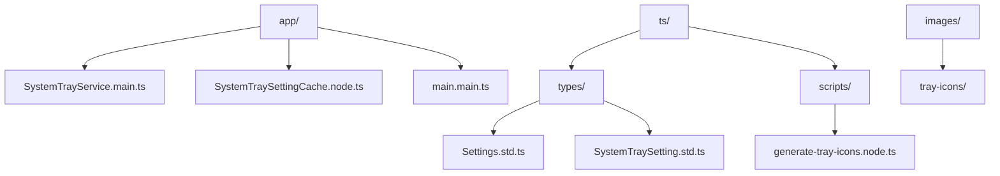
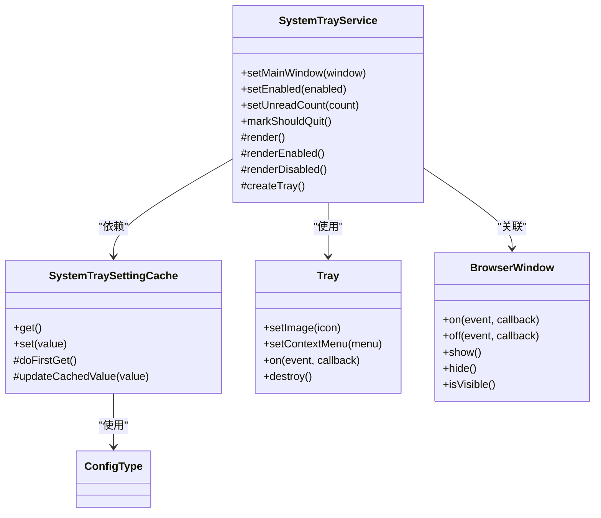
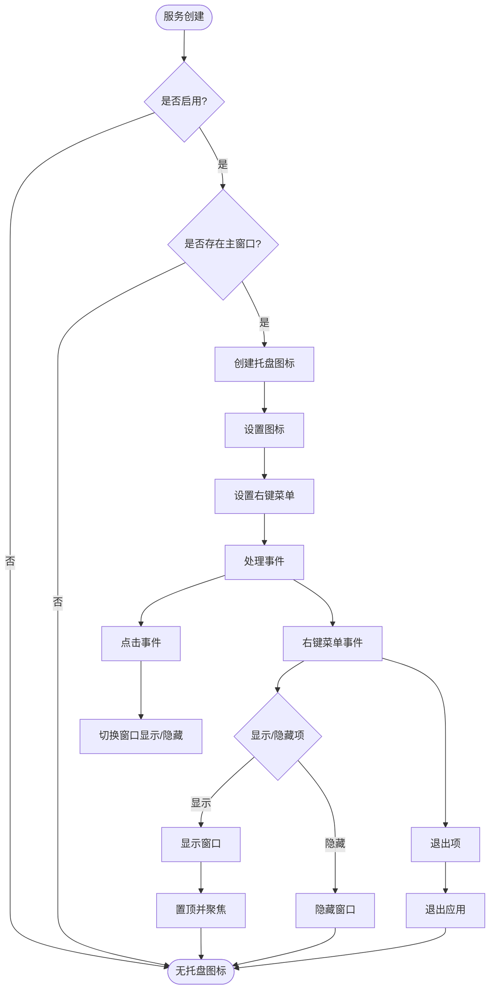
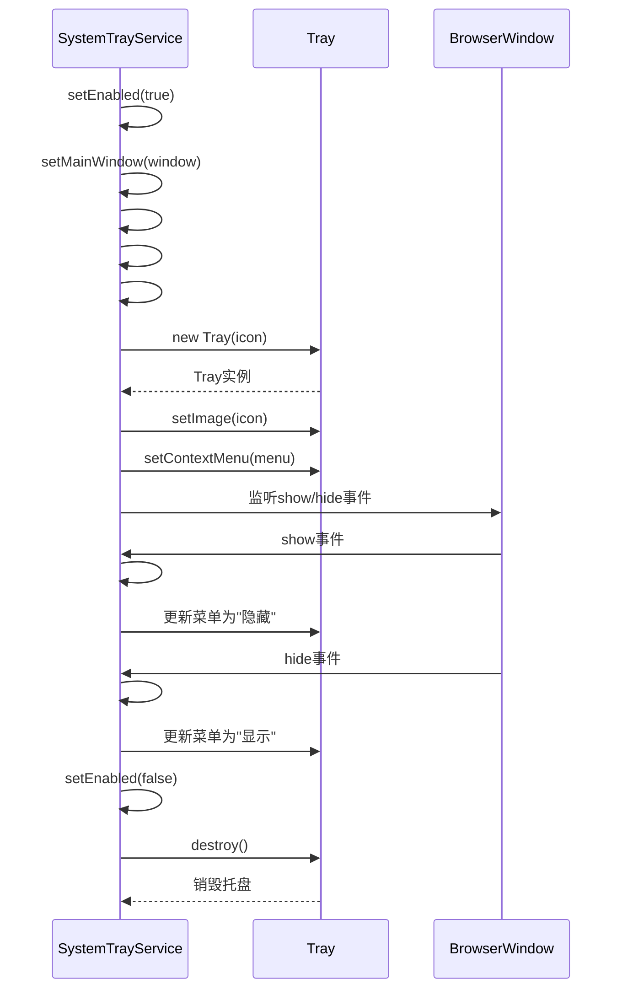
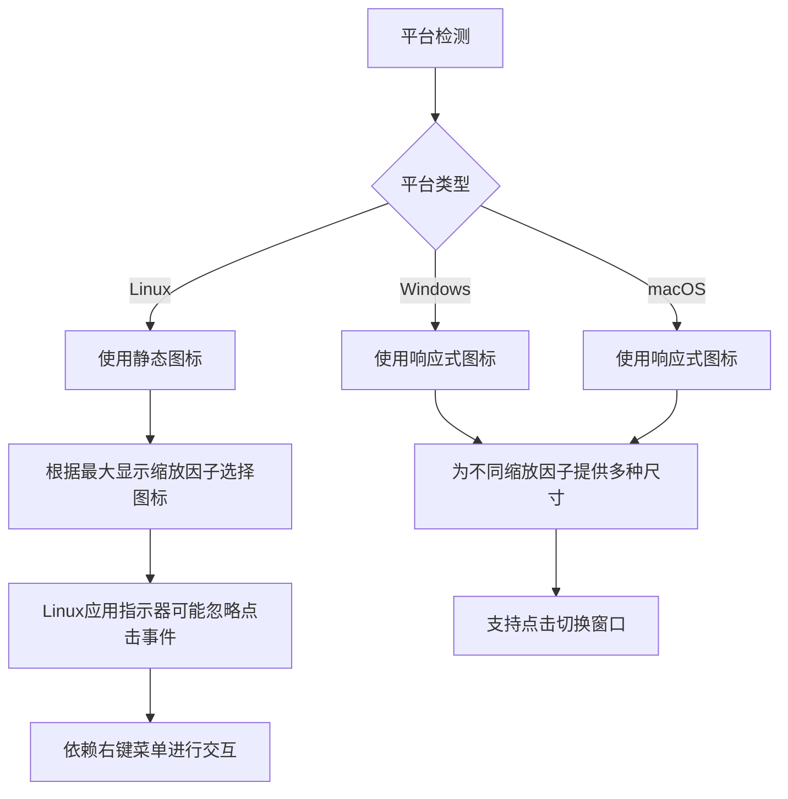
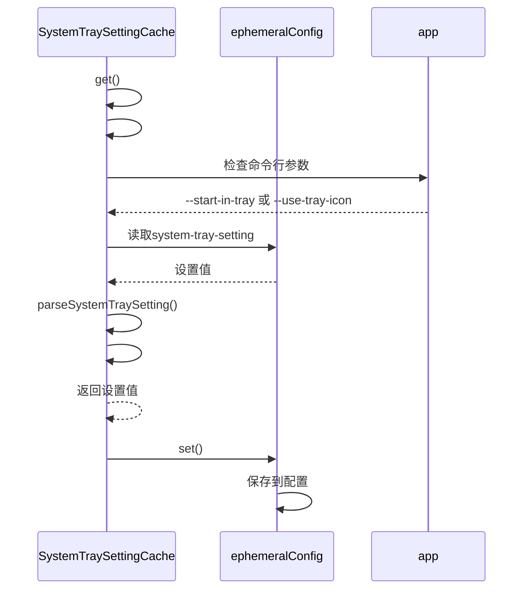
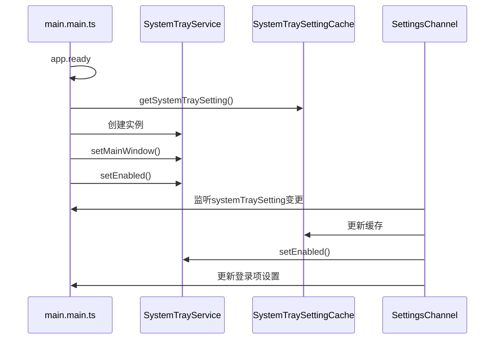
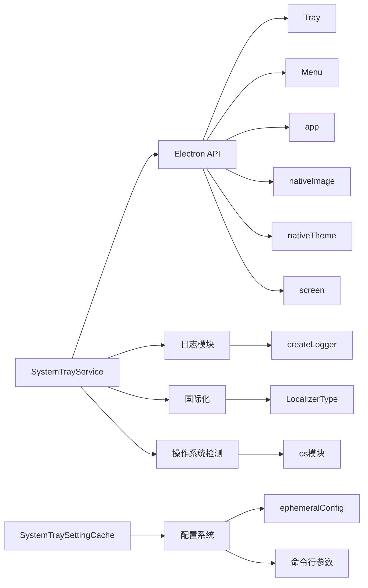

# 系统托盘服务

<cite>
**本文档中引用的文件**  
- [SystemTrayService.main.ts](file://app/SystemTrayService.main.ts)
- [SystemTraySettingCache.node.ts](file://app/SystemTraySettingCache.node.ts)
- [Settings.std.ts](file://ts/types/Settings.std.ts)
- [SystemTraySetting.std.ts](file://ts/types/SystemTraySetting.std.ts)
- [main.main.ts](file://app/main.main.ts)
- [generate-tray-icons.node.ts](file://ts/scripts/generate-tray-icons.node.ts)
</cite>

## 目录
1. [简介](#简介)
2. [项目结构](#项目结构)
3. [核心组件](#核心组件)
4. [架构概述](#架构概述)
5. [详细组件分析](#详细组件分析)
6. [依赖分析](#依赖分析)
7. [性能考虑](#性能考虑)
8. [故障排除指南](#故障排除指南)
9. [结论](#结论)

## 简介
Signal-Desktop系统托盘服务为应用程序提供系统托盘图标管理功能，允许用户在最小化时将应用隐藏到系统托盘，并通过托盘图标快速访问应用。该服务实现了跨平台兼容性，支持Windows和Linux操作系统，并提供了丰富的用户交互功能，包括右键菜单、点击事件处理和未读消息计数显示。

## 项目结构
Signal-Desktop的系统托盘服务相关文件主要位于app目录下，包括核心服务实现和设置缓存组件。

**Diagram sources**
- [SystemTrayService.main.ts](file://app/SystemTrayService.main.ts#L1-L361)
- [SystemTraySettingCache.node.ts](file://app/SystemTraySettingCache.node.ts#L1-L92)

**Section sources**
- [SystemTrayService.main.ts](file://app/SystemTrayService.main.ts#L1-L361)
- [SystemTraySettingCache.node.ts](file://app/SystemTraySettingCache.node.ts#L1-L92)

## 核心组件
系统托盘服务的核心组件包括SystemTrayService类，负责管理托盘图标的创建、更新和销毁；SystemTraySettingCache类，用于缓存和获取托盘设置；以及相关的类型定义和配置文件。

**Section sources**
- [SystemTrayService.main.ts](file://app/SystemTrayService.main.ts#L1-L361)
- [SystemTraySettingCache.node.ts](file://app/SystemTraySettingCache.node.ts#L1-L92)
- [Settings.std.ts](file://ts/types/Settings.std.ts#L1-L85)

## 架构概述
系统托盘服务的架构基于Electron的Tray API，通过SystemTrayService类封装了托盘图标的管理逻辑。服务与主窗口交互，监听窗口的显示和隐藏状态，并根据未读消息数量动态更新托盘图标。

**Diagram sources**
- [SystemTrayService.main.ts](file://app/SystemTrayService.main.ts#L28-L245)
- [SystemTraySettingCache.node.ts](file://app/SystemTraySettingCache.node.ts#L19-L91)

## 详细组件分析

### SystemTrayService 分析
SystemTrayService类是系统托盘服务的核心，负责管理托盘图标的整个生命周期。

#### 实现机制
SystemTrayService通过以下机制实现托盘图标的管理：

**Diagram sources**
- [SystemTrayService.main.ts](file://app/SystemTrayService.main.ts#L122-L236)

**Section sources**
- [SystemTrayService.main.ts](file://app/SystemTrayService.main.ts#L28-L245)

#### 托盘图标管理
托盘图标的创建、更新和销毁过程如下：

**Diagram sources**
- [SystemTrayService.main.ts](file://app/SystemTrayService.main.ts#L77-L207)

#### 跨平台兼容性处理
系统托盘服务针对不同操作系统进行了特殊处理：

**Diagram sources**
- [SystemTrayService.main.ts](file://app/SystemTrayService.main.ts#L313-L345)

### 托盘设置持久化
系统托盘设置的持久化机制通过SystemTraySettingCache类实现。

**Diagram sources**
- [SystemTraySettingCache.node.ts](file://app/SystemTraySettingCache.node.ts#L28-L91)

**Section sources**
- [SystemTraySettingCache.node.ts](file://app/SystemTraySettingCache.node.ts#L19-L91)

### 应用主进程通信
系统托盘服务与应用主进程通过事件监听和配置变更进行通信。

**Diagram sources**
- [main.main.ts](file://app/main.main.ts#L2134-L2145)

## 依赖分析
系统托盘服务依赖于多个Electron API和内部模块。

**Diagram sources**
- [SystemTrayService.main.ts](file://app/SystemTrayService.main.ts#L4-L8)
- [SystemTraySettingCache.node.ts](file://app/SystemTraySettingCache.node.ts#L5-L11)

**Section sources**
- [SystemTrayService.main.ts](file://app/SystemTrayService.main.ts#L4-L8)
- [SystemTraySettingCache.node.ts](file://app/SystemTraySettingCache.node.ts#L5-L11)

## 性能考虑
系统托盘服务在性能方面进行了多项优化：

1. **图标缓存**：使用Map对象缓存已创建的托盘图标，避免重复创建
2. **事件去重**：在设置启用状态和未读计数时检查值是否变化，避免不必要的渲染
3. **资源预加载**：在服务创建时监听主题变化事件，及时响应系统主题切换
4. **内存管理**：在应用退出时标记状态，避免双重销毁托盘实例

## 故障排除指南
以下是系统托盘服务常见问题的排查方法：

### 图标不显示
- **检查条件**：确保同时满足"已启用"和"存在主窗口"两个条件
- **平台支持**：确认当前操作系统支持系统托盘（仅Windows和Linux）
- **设置检查**：验证system-tray-setting配置是否正确
- **日志查看**：检查日志中的"System tray service"相关记录

### 菜单无法响应
- **Linux特殊性**：在Linux上，应用指示器可能忽略点击事件，应使用右键菜单
- **事件监听**：确认主窗口的show/hide事件监听器正确注册和注销
- **菜单构建**：检查Menu.buildFromTemplate是否正确构建了菜单项

### 动态更新失效
- **缓存问题**：检查托盘图标缓存机制是否正常工作
- **渲染触发**：确保setUnreadCount等方法能正确触发#render调用
- **权限问题**：在某些Linux桌面环境中，可能需要额外的权限才能显示托盘图标

**Section sources**
- [SystemTrayService.main.ts](file://app/SystemTrayService.main.ts#L1-L361)
- [SystemTraySettingCache.node.ts](file://app/SystemTraySettingCache.node.ts#L1-L92)

## 结论
Signal-Desktop系统托盘服务通过精心设计的架构实现了跨平台的托盘图标管理功能。服务采用了模块化设计，将托盘管理逻辑与设置持久化分离，提高了代码的可维护性。通过图标缓存、事件去重等优化措施，确保了服务的性能表现。针对不同操作系统的特性进行了专门处理，保证了在各种环境下的稳定运行。该服务为用户提供了便捷的应用访问方式，增强了Signal-Desktop的用户体验。