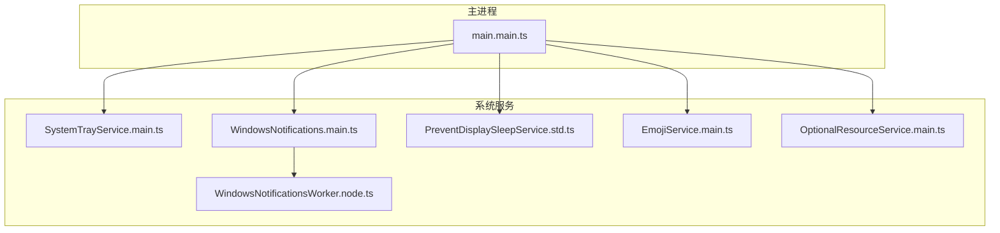
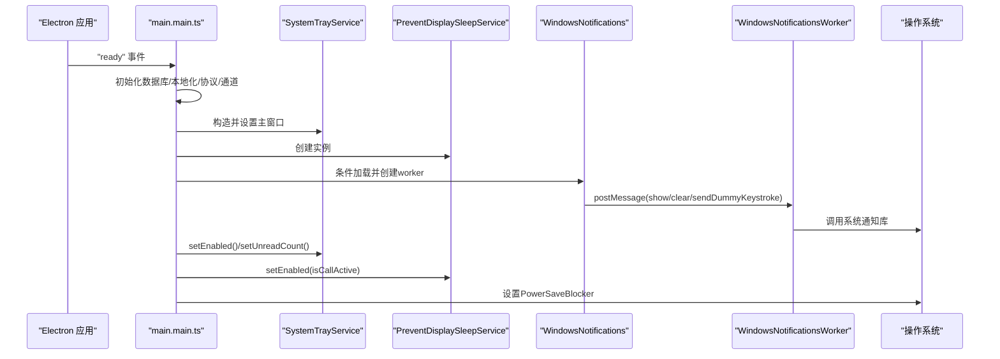
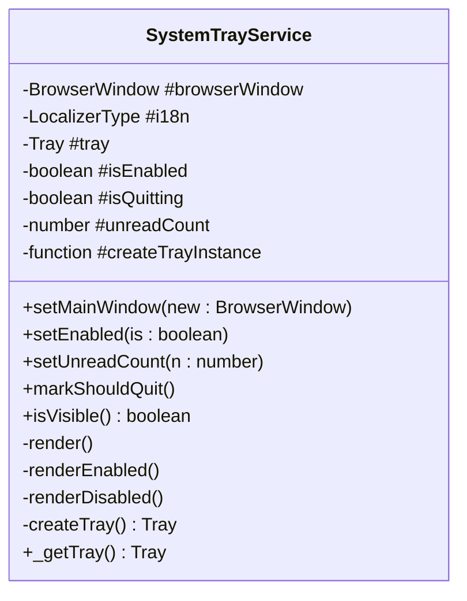
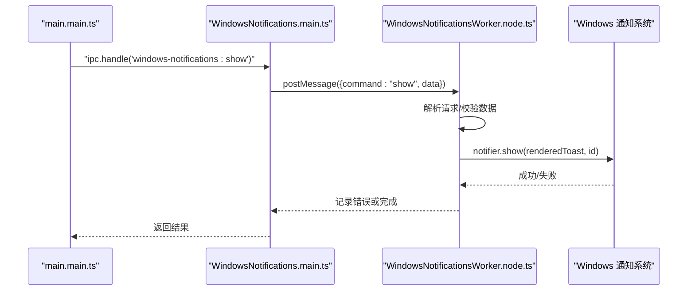
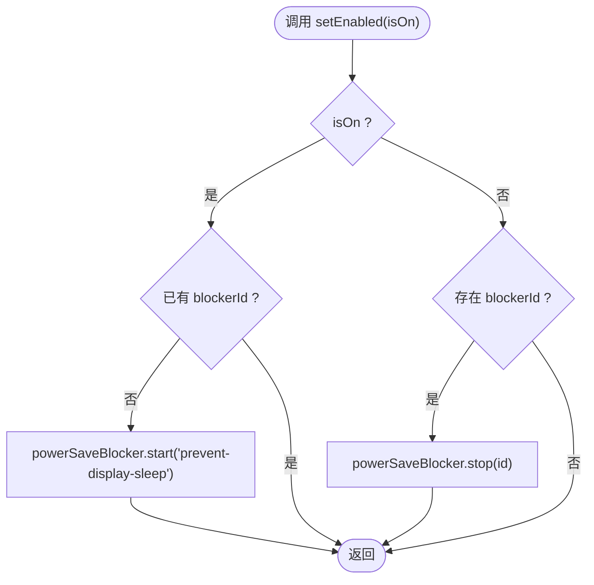
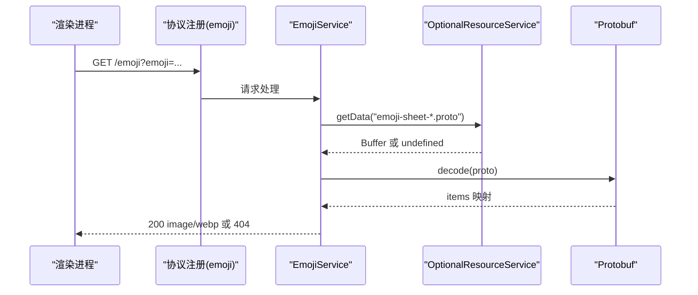
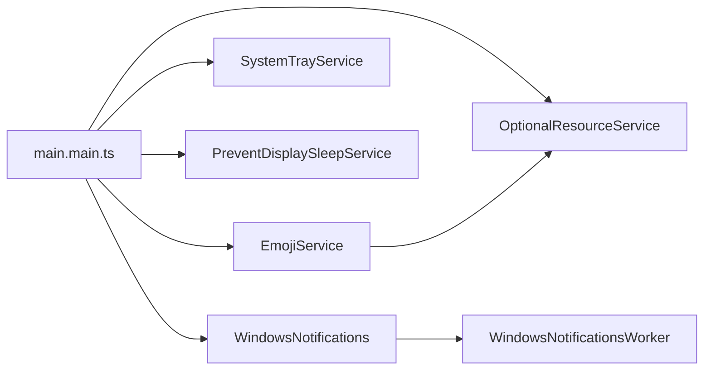

# 系统服务

<cite>
**本文引用的文件**
- [SystemTrayService.main.ts](file://app/SystemTrayService.main.ts)
- [WindowsNotifications.main.ts](file://app/WindowsNotifications.main.ts)
- [WindowsNotificationsWorker.node.ts](file://app/WindowsNotificationsWorker.node.ts)
- [PreventDisplaySleepService.std.ts](file://app/PreventDisplaySleepService.std.ts)
- [EmojiService.main.ts](file://app/EmojiService.main.ts)
- [OptionalResourceService.main.ts](file://app/OptionalResourceService.main.ts)
- [main.main.ts](file://app/main.main.ts)
</cite>

## 目录
1. [简介](#简介)
2. [项目结构](#项目结构)
3. [核心组件](#核心组件)
4. [架构总览](#架构总览)
5. [详细组件分析](#详细组件分析)
6. [依赖分析](#依赖分析)
7. [性能考量](#性能考量)
8. [故障排查指南](#故障排查指南)
9. [结论](#结论)
10. [附录](#附录)

## 简介
本文件面向Signal-Desktop的系统服务，聚焦以下四个关键服务：
- 系统托盘服务：负责在各平台（Windows/macOS/Linux）管理托盘图标、上下文菜单、显示/隐藏主窗口等。
- Windows通知服务：通过worker线程在Windows上渲染系统通知，并支持“虚拟按键”以提升前台窗口可见性。
- 防止显示睡眠服务：基于Electron的PowerSaveBlocker，按需阻止系统进入节能/休眠状态。
- 表情符号服务：通过自定义协议提供表情包图像资源，结合可选资源服务进行缓存与校验。

文档将从架构、数据流、处理逻辑、错误处理、生命周期与资源释放、服务间协作与依赖注入等方面进行深入解析，并给出序列图与流程图帮助理解。

## 项目结构
围绕系统服务的相关文件组织如下：
- app层：系统托盘、Windows通知、防止显示睡眠、表情符号与可选资源服务均位于app目录下。
- 主进程入口：app/main.main.ts负责应用生命周期、IPC通道、服务实例化与事件绑定。

图表来源
- [main.main.ts](file://app/main.main.ts#L2045-L2367)
- [SystemTrayService.main.ts](file://app/SystemTrayService.main.ts#L1-L245)
- [WindowsNotifications.main.ts](file://app/WindowsNotifications.main.ts#L1-L79)
- [WindowsNotificationsWorker.node.ts](file://app/WindowsNotificationsWorker.node.ts#L1-L84)
- [PreventDisplaySleepService.std.ts](file://app/PreventDisplaySleepService.std.ts#L1-L47)
- [EmojiService.main.ts](file://app/EmojiService.main.ts#L1-L108)
- [OptionalResourceService.main.ts](file://app/OptionalResourceService.main.ts#L1-L191)

章节来源
- [main.main.ts](file://app/main.main.ts#L2045-L2367)

## 核心组件
- 系统托盘服务：封装Electron Tray实例，动态生成多分辨率图标，响应窗口可见性变化，提供启用/禁用与未读计数更新接口。
- Windows通知服务：在Windows平台通过worker线程调用系统通知库，支持显示单条通知、清空通知与发送“虚拟按键”。
- 防止显示睡眠服务：封装PowerSaveBlocker，按需开启/关闭阻止显示睡眠。
- 表情符号服务：注册自定义协议，按需拉取可选资源中的表情包图像，使用LRU缓存与校验。

章节来源
- [SystemTrayService.main.ts](file://app/SystemTrayService.main.ts#L1-L245)
- [WindowsNotifications.main.ts](file://app/WindowsNotifications.main.ts#L1-L79)
- [WindowsNotificationsWorker.node.ts](file://app/WindowsNotificationsWorker.node.ts#L1-L84)
- [PreventDisplaySleepService.std.ts](file://app/PreventDisplaySleepService.std.ts#L1-L47)
- [EmojiService.main.ts](file://app/EmojiService.main.ts#L1-L108)
- [OptionalResourceService.main.ts](file://app/OptionalResourceService.main.ts#L1-L191)

## 架构总览
系统服务在主进程内由app/main.main.ts统一初始化与调度，形成“主进程入口—服务实例—平台适配”的分层架构。

图表来源
- [main.main.ts](file://app/main.main.ts#L2045-L2367)
- [WindowsNotifications.main.ts](file://app/WindowsNotifications.main.ts#L1-L79)
- [WindowsNotificationsWorker.node.ts](file://app/WindowsNotificationsWorker.node.ts#L1-L84)
- [SystemTrayService.main.ts](file://app/SystemTrayService.main.ts#L1-L245)
- [PreventDisplaySleepService.std.ts](file://app/PreventDisplaySleepService.std.ts#L1-L47)

## 详细组件分析

### 系统托盘服务 SystemTrayService
职责与交互
- 维护Tray实例，根据窗口可见性与启用状态决定是否显示托盘图标。
- 动态生成多分辨率图标（Linux静态缩放，Windows/macOS响应式），支持未读计数变化。
- 提供上下文菜单：显示/隐藏主窗口、退出应用；点击托盘图标也支持切换显示。
- 响应主题变更（nativeTheme.updated）重新渲染图标。

生命周期与资源释放
- setMainWindow：为旧窗口解绑show/hide事件，为新窗口绑定事件，触发重绘。
- setEnabled：控制是否启用托盘图标。
- markShouldQuit：在应用退出前标记，避免重复销毁Tray实例。
- 可见性查询：用于外部判断是否已创建托盘。

错误处理
- 图标设置失败时回退到默认图标。
- 上下文菜单点击回调中对当前窗口引用进行二次检查，避免竞态。

复杂度与性能
- 图标缓存：按未读数键值缓存NativeImage，避免重复读取磁盘。
- 多分辨率图标：在非Linux平台使用addRepresentation批量添加，减少多次IO。
- 平台差异：Linux强制scaleFactor=1.0，按最高缩放因子选择基准尺寸。

图表来源
- [SystemTrayService.main.ts](file://app/SystemTrayService.main.ts#L1-L245)

章节来源
- [SystemTrayService.main.ts](file://app/SystemTrayService.main.ts#L1-L245)

### Windows通知服务 WindowsNotifications
职责与交互
- 在Windows平台创建worker线程，传递AUMID，用于系统通知分组与标识。
- 主进程通过IPC向worker发送命令：显示通知、清空通知、发送“虚拟按键”。
- 使用通知数据Schema进行参数校验，失败时记录日志。

工作流
- show：先移除既有通知，再渲染并显示新通知。
- clearAll：移除指定分组的通知。
- sendDummyKeystroke：发送虚拟按键以确保前台窗口可见（解决特定平台焦点问题）。

图表来源
- [WindowsNotifications.main.ts](file://app/WindowsNotifications.main.ts#L1-L79)
- [WindowsNotificationsWorker.node.ts](file://app/WindowsNotificationsWorker.node.ts#L1-L84)

章节来源
- [WindowsNotifications.main.ts](file://app/WindowsNotifications.main.ts#L1-L79)
- [WindowsNotificationsWorker.node.ts](file://app/WindowsNotificationsWorker.node.ts#L1-L84)

### 防止显示睡眠服务 PreventDisplaySleepService
职责与交互
- 基于Electron的powerSaveBlocker.start/stop，按需阻止系统进入节能/休眠状态。
- 提供isEnabled/setEnabled接口，内部维护blockerId，避免重复开启。

生命周期
- 启动：在app/main.ts中构造实例并监听“开始通话”事件切换状态。
- 关闭：应用退出前由主进程清理。

图表来源
- [PreventDisplaySleepService.std.ts](file://app/PreventDisplaySleepService.std.ts#L1-L47)
- [main.main.ts](file://app/main.main.ts#L1138-L1140)

章节来源
- [PreventDisplaySleepService.std.ts](file://app/PreventDisplaySleepService.std.ts#L1-L47)
- [main.main.ts](file://app/main.main.ts#L1138-L1140)

### 表情符号服务 EmojiService
职责与交互
- 注册自定义协议“emoji”，解析查询参数获取表情码点。
- 通过OptionalResourceService按需拉取表情包资源（proto），解码后构建图像映射，LRU缓存sheet。
- 对未找到项返回404，成功时返回image/webp并设置缓存头。

依赖注入
- 依赖OptionalResourceService进行资源下载与缓存校验。
- 依赖Protobuf解码表情包数据。

图表来源
- [EmojiService.main.ts](file://app/EmojiService.main.ts#L1-L108)
- [OptionalResourceService.main.ts](file://app/OptionalResourceService.main.ts#L1-L191)

章节来源
- [EmojiService.main.ts](file://app/EmojiService.main.ts#L1-L108)
- [OptionalResourceService.main.ts](file://app/OptionalResourceService.main.ts#L1-L191)

## 依赖分析
服务间协作与依赖注入
- main.main.ts在ready事件后：
  - 初始化OptionalResourceService与EmojiService（注册协议处理器）。
  - 构造SystemTrayService并设置主窗口与启用状态。
  - 构造PreventDisplaySleepService并监听“开始通话”事件切换。
  - 条件创建WindowsNotifications worker（仅Windows）。
- SystemTrayService依赖Electron Tray/Menu/Screen/nativeTheme。
- WindowsNotifications依赖worker线程与@indutny/simple-windows-notifications。
- EmojiService依赖OptionalResourceService与Protobuf。
- PreventDisplaySleepService依赖Electron powerSaveBlocker。

图表来源
- [main.main.ts](file://app/main.main.ts#L2045-L2367)
- [WindowsNotifications.main.ts](file://app/WindowsNotifications.main.ts#L1-L79)
- [WindowsNotificationsWorker.node.ts](file://app/WindowsNotificationsWorker.node.ts#L1-L84)
- [EmojiService.main.ts](file://app/EmojiService.main.ts#L1-L108)
- [OptionalResourceService.main.ts](file://app/OptionalResourceService.main.ts#L1-L191)
- [SystemTrayService.main.ts](file://app/SystemTrayService.main.ts#L1-L245)
- [PreventDisplaySleepService.std.ts](file://app/PreventDisplaySleepService.std.ts#L1-L47)

章节来源
- [main.main.ts](file://app/main.main.ts#L2045-L2367)

## 性能考量
- 图标与表情包缓存
  - SystemTrayService对NativeImage进行按未读数键值缓存，避免重复读取磁盘。
  - EmojiService对sheet使用LRU缓存，每sheet约500KB，限制数量避免内存膨胀。
- I/O并发与一致性
  - OptionalResourceService对同一文件路径使用队列串行化读写，保证缓存一致性与落盘安全。
- 渲染与主线程
  - Windows通知通过worker线程执行，避免阻塞主进程UI。
- 功耗控制
  - PreventDisplaySleepService仅在通话等场景开启，降低能耗。

[本节为通用指导，不直接分析具体文件]

## 故障排查指南
常见问题与定位建议
- 托盘图标不显示或闪烁
  - 检查是否已设置主窗口与启用状态；确认平台缩放因子与图标尺寸匹配。
  - 若图标设置失败，会回退到默认图标，查看日志中警告信息。
- Windows通知不出现
  - 确认已在Windows平台创建worker；检查AUMID配置；查看worker日志错误。
  - 发送“虚拟按键”命令以提升前台可见性。
- 无法阻止显示睡眠
  - 确认PowerSaveBlocker已开启且未被重复启动；检查事件触发时机（如开始通话）。
- 表情包图片404
  - 检查资源声明与校验（digest/size）；确认OptionalResourceService缓存命中；查看Protobuf解码是否成功。
- 应用退出异常
  - 确认before-quit/quit事件中已标记shouldQuit并清理Tray实例；检查窗口关闭流程与关闭确认对话框。

章节来源
- [SystemTrayService.main.ts](file://app/SystemTrayService.main.ts#L122-L207)
- [WindowsNotifications.main.ts](file://app/WindowsNotifications.main.ts#L1-L79)
- [WindowsNotificationsWorker.node.ts](file://app/WindowsNotificationsWorker.node.ts#L1-L84)
- [PreventDisplaySleepService.std.ts](file://app/PreventDisplaySleepService.std.ts#L1-L47)
- [EmojiService.main.ts](file://app/EmojiService.main.ts#L66-L108)
- [OptionalResourceService.main.ts](file://app/OptionalResourceService.main.ts#L56-L101)
- [main.main.ts](file://app/main.main.ts#L2555-L2594)

## 结论
Signal-Desktop的系统服务通过清晰的职责划分与平台适配，在不同操作系统上实现了稳定的托盘、通知、睡眠控制与表情资源服务。主进程以事件驱动的方式协调服务生命周期，配合worker线程与缓存策略，兼顾了可用性与性能。建议在后续迭代中持续关注：
- 托盘图标在高DPI环境下的可读性与一致性。
- Windows通知的跨版本兼容与错误恢复。
- 表情包资源的增量更新与缓存淘汰策略。
- 通话场景外的节能优化与用户体验平衡。

[本节为总结性内容，不直接分析具体文件]

## 附录
- 服务注册与启动流程（代码片段路径）
  - 托盘服务：[main.main.ts](file://app/main.main.ts#L2353-L2359)
  - 防止显示睡眠：[main.main.ts](file://app/main.main.ts#L192-L194)
  - Windows通知：[WindowsNotifications.main.ts](file://app/WindowsNotifications.main.ts#L21-L35)
  - 表情符号服务：[main.main.ts](file://app/main.main.ts#L2078-L2081)
- 服务停止与资源释放
  - 托盘退出标记：[SystemTrayService.main.ts](file://app/SystemTrayService.main.ts#L111-L116)
  - 应用退出事件：[main.main.ts](file://app/main.main.ts#L2555-L2579)