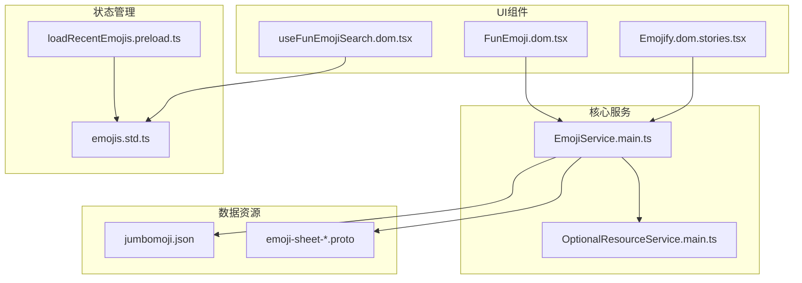
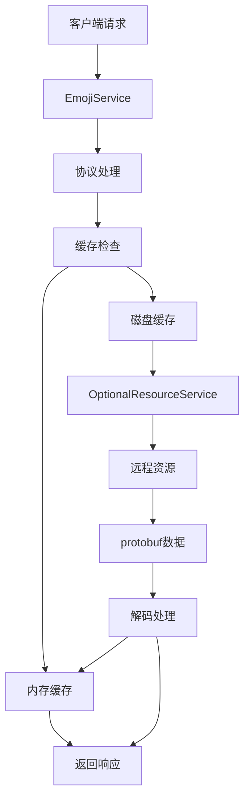
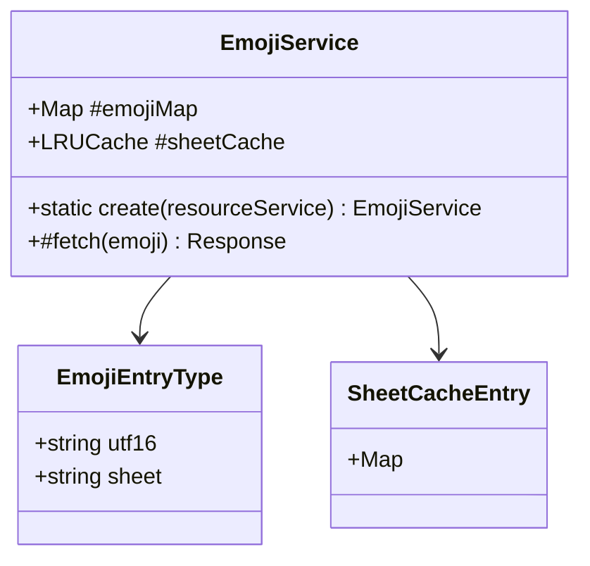
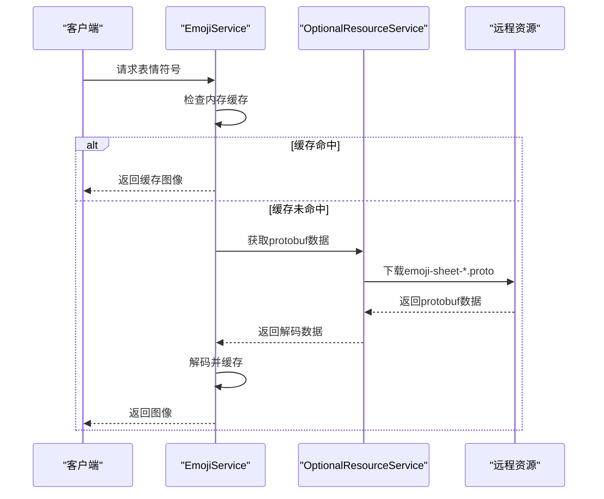
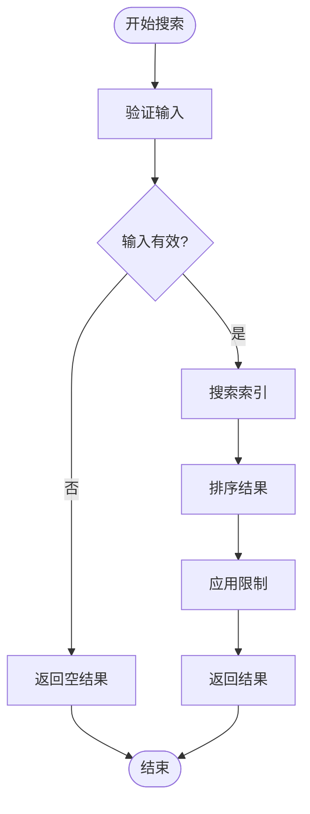
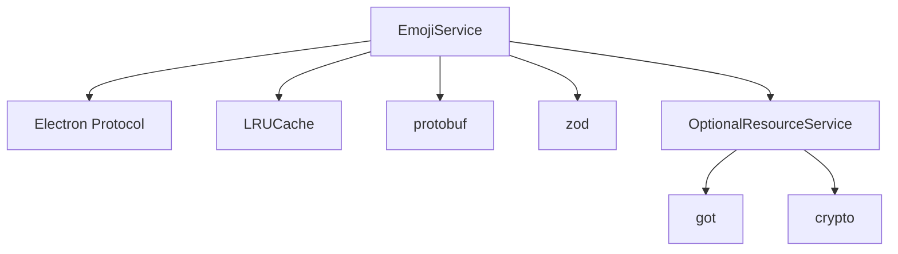

# 表情符号服务

<cite>
**本文档中引用的文件**  
- [EmojiService.main.ts](file://app/EmojiService.main.ts)
- [OptionalResourceService.main.ts](file://app/OptionalResourceService.main.ts)
- [jumbomoji.json](file://build/jumbomoji.json)
- [emojis.std.ts](file://ts/components/fun/data/emojis.std.ts)
- [Emojify.dom.stories.tsx](file://ts/components/conversation/Emojify.dom.stories.tsx)
- [useFunEmojiSearch.dom.tsx](file://ts/components/fun/useFunEmojiSearch.dom.tsx)
- [loadRecentEmojis.preload.ts](file://ts/util/loadRecentEmojis.preload.ts)
</cite>

## 目录
1. [简介](#简介)
2. [项目结构](#项目结构)
3. [核心组件](#核心组件)
4. [架构概述](#架构概述)
5. [详细组件分析](#详细组件分析)
6. [依赖分析](#依赖分析)
7. [性能考虑](#性能考虑)
8. [故障排除指南](#故障排除指南)
9. [结论](#结论)

## 简介
Signal-Desktop的表情符号服务为应用程序提供了一套完整的表情符号管理解决方案，包括表情符号的加载、缓存、渲染优化和用户交互功能。该服务通过高效的缓存机制和按需加载策略，确保表情符号在各种设备上的快速响应和流畅显示。服务支持高分辨率和动画表情符号，并通过与UI组件的紧密集成，提供一致的用户体验。此外，服务还实现了表情符号搜索、分类和最近使用记录管理功能，增强了用户交互的便捷性。

## 项目结构
Signal-Desktop的表情符号相关文件分布在多个目录中，形成了清晰的模块化结构。核心服务实现位于`app`目录下的`EmojiService.main.ts`，负责表情符号的加载和缓存管理。表情符号数据和配置文件存储在`build`目录中，包括`jumbomoji.json`等资源文件。UI组件和相关工具位于`ts/components/fun`目录中，提供了表情符号的渲染、搜索和选择功能。状态管理和最近使用记录处理则在`ts/state/selectors/emojis.std.ts`和`ts/util/loadRecentEmojis.preload.ts`中实现。

**Diagram sources**
- [EmojiService.main.ts](file://app/EmojiService.main.ts#L1-L107)
- [jumbomoji.json](file://build/jumbomoji.json#L1-L3901)
- [Emojify.dom.stories.tsx](file://ts/components/conversation/Emojify.dom.stories.tsx#L52-L113)

**Section sources**
- [app](file://app)
- [build](file://build)
- [ts/components/fun](file://ts/components/fun)
- [ts/state](file://ts/state)

## 核心组件
表情符号服务的核心组件包括`EmojiService`类，它负责管理表情符号的加载、缓存和提供HTTP协议处理。服务通过`OptionalResourceService`获取远程资源，并使用LRU缓存策略优化性能。`EmojiService`在初始化时读取`jumbomoji.json`文件，构建表情符号映射表，然后通过Electron的协议处理机制提供表情符号图像服务。服务还与UI组件集成，支持表情符号的搜索、分类和最近使用记录管理。

**Section sources**
- [EmojiService.main.ts](file://app/EmojiService.main.ts#L28-L107)
- [OptionalResourceService.main.ts](file://app/OptionalResourceService.main.ts#L33-L190)

## 架构概述
表情符号服务采用分层架构设计，将数据获取、缓存管理和UI集成分离。服务层负责从远程资源加载表情符号数据，并将其缓存在内存中。数据层通过`jumbomoji.json`文件和`emoji-sheet-*.proto`文件管理表情符号的元数据和图像数据。UI层通过React组件和Hooks提供表情符号的渲染和交互功能。这种分层设计确保了服务的可维护性和可扩展性。

**Diagram sources**
- [EmojiService.main.ts](file://app/EmojiService.main.ts#L40-L48)
- [OptionalResourceService.main.ts](file://app/OptionalResourceService.main.ts#L56-L100)

## 详细组件分析

### EmojiService分析
`EmojiService`是表情符号服务的核心类，负责管理表情符号的整个生命周期。服务通过静态方法`create`初始化，读取`jumbomoji.json`文件并构建表情符号映射表。服务使用两个缓存层：内存中的LRU缓存和磁盘缓存，以优化性能和减少网络请求。

**Diagram sources**
- [EmojiService.main.ts](file://app/EmojiService.main.ts#L28-L107)

**Section sources**
- [EmojiService.main.ts](file://app/EmojiService.main.ts#L28-L107)

### 表情符号加载流程
表情符号的加载流程从客户端请求开始，通过Electron的协议处理机制触发。服务首先检查内存缓存，如果未命中则通过`OptionalResourceService`从远程获取数据。获取的数据被解码并存储在缓存中，然后返回给客户端。

**Diagram sources**
- [EmojiService.main.ts](file://app/EmojiService.main.ts#L66-L106)
- [OptionalResourceService.main.ts](file://app/OptionalResourceService.main.ts#L56-L100)

### 表情符号搜索与分类
表情符号搜索和分类功能通过`useFunEmojiSearch`和`useFunEmojiLocalizer`等Hooks实现。这些Hooks利用预构建的搜索索引和本地化索引，提供快速的搜索和分类功能。搜索结果根据匹配度和排名进行排序，确保最相关的结果优先显示。

**Diagram sources**
- [useFunEmojiSearch.dom.tsx](file://ts/components/fun/useFunEmojiSearch.dom.tsx#L124-L156)
- [emojis.std.ts](file://ts/components/fun/data/emojis.std.ts#L1-L200)

**Section sources**
- [useFunEmojiSearch.dom.tsx](file://ts/components/fun/useFunEmojiSearch.dom.tsx#L124-L156)
- [emojis.std.ts](file://ts/components/fun/data/emojis.std.ts#L1-L200)

## 依赖分析
表情符号服务依赖于多个核心组件和外部库。主要依赖包括Electron的协议处理机制、LRU缓存库、protobuf解码库和zod验证库。服务通过`OptionalResourceService`与远程资源交互，确保资源的可靠获取和验证。

**Diagram sources**
- [EmojiService.main.ts](file://app/EmojiService.main.ts#L4-L8)
- [OptionalResourceService.main.ts](file://app/OptionalResourceService.main.ts#L9-L10)

**Section sources**
- [EmojiService.main.ts](file://app/EmojiService.main.ts#L4-L8)
- [OptionalResourceService.main.ts](file://app/OptionalResourceService.main.ts#L9-L10)

## 性能考虑
表情符号服务通过多种策略优化性能。首先，使用LRU缓存策略减少重复的网络请求和文件读取。其次，通过按需加载和预加载策略平衡内存使用和响应速度。此外，服务利用WebP格式的图像数据，减少传输大小和加载时间。

**Section sources**
- [EmojiService.main.ts](file://app/EmojiService.main.ts#L31-L34)
- [OptionalResourceService.main.ts](file://app/OptionalResourceService.main.ts#L36-L40)

## 故障排除指南
当遇到表情符号显示异常或加载缓慢的问题时，可以按照以下步骤进行排查：
1. 检查网络连接是否正常
2. 验证`jumbomoji.json`文件是否完整
3. 检查`emoji-sheet-*.proto`文件是否存在
4. 确认缓存是否正常工作
5. 查看日志文件中的错误信息

**Section sources**
- [EmojiService.main.ts](file://app/EmojiService.main.ts#L67-L97)
- [OptionalResourceService.main.ts](file://app/OptionalResourceService.main.ts#L71-L89)

## 结论
Signal-Desktop的表情符号服务通过精心设计的架构和优化策略，提供了高效、可靠的表情符号管理功能。服务的模块化设计和清晰的依赖关系确保了代码的可维护性和可扩展性。通过深入理解服务的实现机制，开发者可以更好地利用和扩展这一功能，为用户提供更优质的体验。