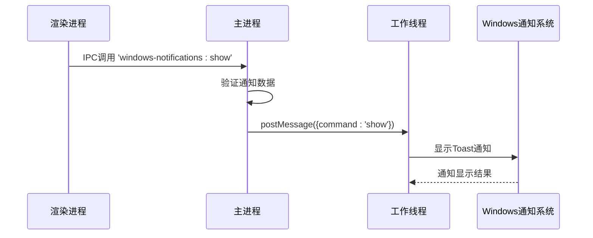
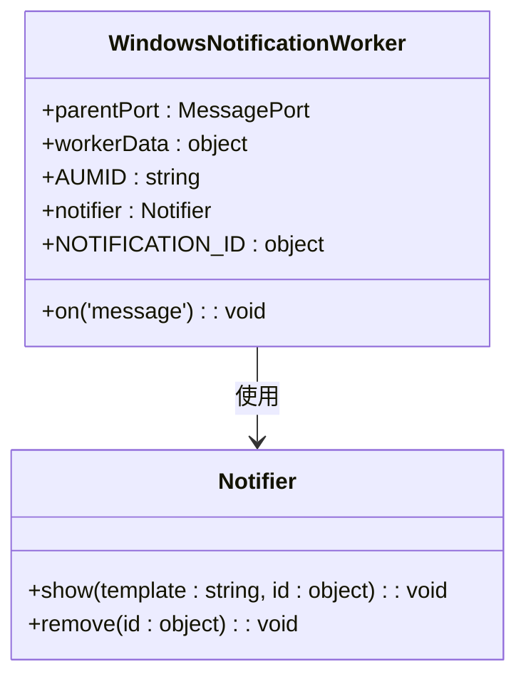
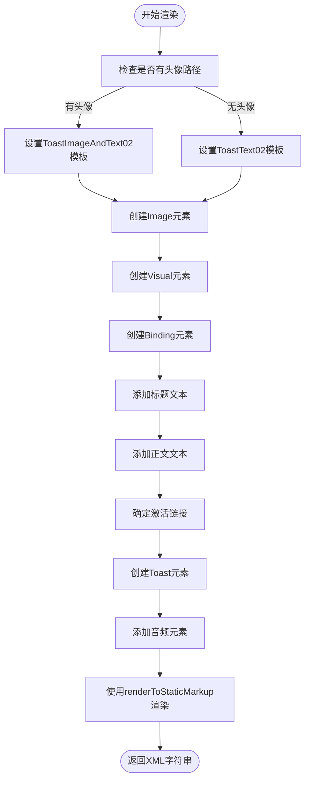

# 通知系统

<cite>
**本文档引用的文件**  
- [WindowsNotifications.main.ts](file://app/WindowsNotifications.main.ts)
- [WindowsNotificationsWorker.node.ts](file://app/WindowsNotificationsWorker.node.ts)
- [renderWindowsToast.std.tsx](file://app/renderWindowsToast.std.tsx)
- [permissions.std.ts](file://app/permissions.std.ts)
- [notifications.std.ts](file://ts/types/notifications.std.ts)
- [signalRoutes.std.ts](file://ts/util/signalRoutes.std.ts)
- [notifications.preload.ts](file://ts/services/notifications.preload.ts)
</cite>

## 目录
1. [简介](#简介)
2. [核心组件](#核心组件)
3. [通知主服务实现](#通知主服务实现)
4. [通知工作线程职责](#通知工作线程职责)
5. [Windows Toast通知渲染](#windows-toast通知渲染)
6. [权限管理与用户交互](#权限管理与用户交互)
7. [声音播放与点击事件处理](#声音播放与点击事件处理)
8. [通知服务集成](#通知服务集成)
9. [兼容性处理](#兼容性处理)
10. [错误处理与故障排查](#错误处理与故障排查)

## 简介
Signal-Desktop的通知系统为Windows平台提供了原生通知功能，通过Electron框架与Windows操作系统深度集成。该系统采用主进程-工作线程架构，确保通知的可靠显示和管理。通知系统支持多种通知类型，包括消息通知、来电通知、群组通话通知等，并提供丰富的用户交互功能。

## 核心组件
Signal-Desktop的通知系统由多个核心组件构成，这些组件协同工作以提供完整的通知功能。系统采用分层架构，将通知的创建、显示和管理分离到不同的模块中。

**Section sources**
- [WindowsNotifications.main.ts](file://app/WindowsNotifications.main.ts#L1-L79)
- [WindowsNotificationsWorker.node.ts](file://app/WindowsNotificationsWorker.node.ts#L1-L84)
- [renderWindowsToast.std.tsx](file://app/renderWindowsToast.std.tsx#L1-L101)

## 通知主服务实现
通知主服务（WindowsNotifications.main.ts）负责在主进程中管理通知的生命周期。该服务使用Electron的IPC机制与渲染进程通信，并通过Node.js工作线程与Windows操作系统交互。

服务初始化时，仅在Windows系统上创建工作线程实例，确保跨平台兼容性。工作线程接收来自主进程的通知请求，并通过`@indutny/simple-windows-notifications`库与Windows通知系统交互。

主服务提供了三个核心功能：发送虚拟按键事件、显示通知和清除所有通知。这些功能通过IPC处理器暴露给渲染进程，允许应用程序在适当的时候触发通知。

**Diagram sources**
- [WindowsNotifications.main.ts](file://app/WindowsNotifications.main.ts#L23-L78)
- [WindowsNotificationsWorker.node.ts](file://app/WindowsNotificationsWorker.node.ts#L40-L57)

**Section sources**
- [WindowsNotifications.main.ts](file://app/WindowsNotifications.main.ts#L1-L79)

## 通知工作线程职责
通知工作线程（WindowsNotificationsWorker.node.ts）是通知系统的核心执行单元，运行在独立的Node.js线程中。这种设计避免了主进程的阻塞，确保应用程序的响应性。

工作线程的主要职责包括：
- 接收来自主进程的通知命令
- 使用`@indutny/simple-windows-notifications`库创建和管理Windows Toast通知
- 处理通知的显示、清除和虚拟按键事件
- 管理通知ID，确保每次只显示一个通知

工作线程在启动时验证运行环境，仅在Windows系统上执行。它使用AUMID（应用程序用户模型ID）标识Signal应用程序，确保通知正确关联到应用程序。

工作线程实现了命令模式，通过`command`字段区分不同的操作类型。对于`show`命令，工作线程首先清除之前的通知，然后显示新通知，确保通知的单一性。

**Diagram sources**
- [WindowsNotificationsWorker.node.ts](file://app/WindowsNotificationsWorker.node.ts#L1-L84)

**Section sources**
- [WindowsNotificationsWorker.node.ts](file://app/WindowsNotificationsWorker.node.ts#L1-L84)

## Windows Toast通知渲染
Windows Toast通知渲染组件（renderWindowsToast.std.tsx）负责生成符合Windows通知规范的XML模板。该组件使用React的服务器端渲染功能，将React元素转换为静态HTML字符串，然后作为Toast通知的XML内容。

渲染函数根据通知数据生成不同类型的Toast模板：
- 带头像的通知使用`ToastImageAndText02`模板
- 不带头像的通知使用`ToastText02`模板

通知的激活链接根据通知类型动态生成，使用`signalRoutes.std.ts`中的路由配置。例如，消息通知会链接到特定会话，来电通知会激活应用程序窗口。

声音播放通过`ms-winsoundevent:Notification.IM`系统声音实现，为不同类型的通知提供适当的音频反馈。

**Diagram sources**
- [renderWindowsToast.std.tsx](file://app/renderWindowsToast.std.tsx#L47-L100)

**Section sources**
- [renderWindowsToast.std.tsx](file://app/renderWindowsToast.std.tsx#L1-L101)

## 权限管理与用户交互
通知系统的权限管理通过Electron的会话权限处理器实现。在`permissions.std.ts`文件中，通知权限被明确设置为允许，确保应用程序能够显示系统通知。

用户交互通过通知的激活链接实现。当用户点击通知时，Windows会启动相应的协议处理程序，Signal应用程序捕获该事件并执行相应的操作。例如，点击消息通知会打开对应的会话窗口。

通知系统还支持虚拟按键事件，用于在特定情况下激活应用程序。这种机制在处理来电通知时特别有用，可以确保应用程序获得焦点。

**Section sources**
- [permissions.std.ts](file://app/permissions.std.ts#L1-L97)
- [signalRoutes.std.ts](file://ts/util/signalRoutes.std.ts#L472-L555)

## 声音播放与点击事件处理
声音播放功能在通知服务中实现。当显示通知时，系统根据用户设置决定是否播放声音。对于消息通知，通常播放即时消息声音；对于来电通知，则播放来电铃声。

点击事件处理通过令牌机制实现。通知服务生成唯一的令牌，并将其与通知数据关联。当用户点击通知时，系统使用该令牌查找对应的通知数据，并执行相应的操作，如打开会话或接听来电。

在`notifications.preload.ts`文件中，通知服务的`notify`方法处理点击事件，根据通知类型调用相应的应用程序功能。

**Section sources**
- [notifications.preload.ts](file://ts/services/notifications.preload.ts#L150-L232)
- [WindowsNotificationsWorker.node.ts](file://app/WindowsNotificationsWorker.node.ts#L71-L78)

## 通知服务集成
通知服务与Signal的消息系统深度集成。当收到新消息时，消息接收器调用通知服务的`add`方法，将消息数据转换为通知数据。

通知服务使用防抖机制，避免在短时间内显示过多通知。这在处理批量消息同步时特别重要，可以防止通知泛滥。

通知的显示逻辑考虑了多种因素，包括应用程序是否处于焦点状态、用户的通知设置以及消息的敏感性。例如，对于即将消失的消息，系统可能会隐藏消息内容以保护隐私。

**Section sources**
- [notifications.preload.ts](file://ts/services/notifications.preload.ts#L138-L144)
- [notifications.preload.ts](file://ts/services/notifications.preload.ts#L331-L478)

## 兼容性处理
通知系统针对不同Windows版本进行了兼容性处理。通过使用标准的Windows通知API，系统确保在Windows 10及更高版本上正常工作。

对于非Windows平台，系统提供降级方案，使用Electron的原生通知功能。这种设计确保了跨平台的一致性体验。

通知数据的验证使用Zod库进行，确保所有通知数据符合预期的模式。这包括验证头像路径、消息内容、通知类型等关键字段。

**Section sources**
- [WindowsNotifications.main.ts](file://app/WindowsNotifications.main.ts#L23-L35)
- [notifications.std.ts](file://ts/types/notifications.std.ts#L15-L51)

## 错误处理与故障排查
通知系统实现了全面的错误处理机制。所有关键操作都包含try-catch块，确保异常不会导致应用程序崩溃。错误信息被记录到日志中，便于调试和问题排查。

常见问题如通知不弹出、声音不播放的排查方法包括：
- 检查Windows通知设置，确保Signal应用程序的通知权限已启用
- 验证应用程序的AUMID配置是否正确
- 检查工作线程是否正常启动
- 查看应用程序日志中的错误信息

系统还提供了清除所有通知的功能，可用于解决通知卡住的问题。

**Section sources**
- [WindowsNotificationsWorker.node.ts](file://app/WindowsNotificationsWorker.node.ts#L52-L56)
- [WindowsNotifications.main.ts](file://app/WindowsNotifications.main.ts#L64-L66)
- [notifications.preload.ts](file://ts/services/notifications.preload.ts#L512-L527)