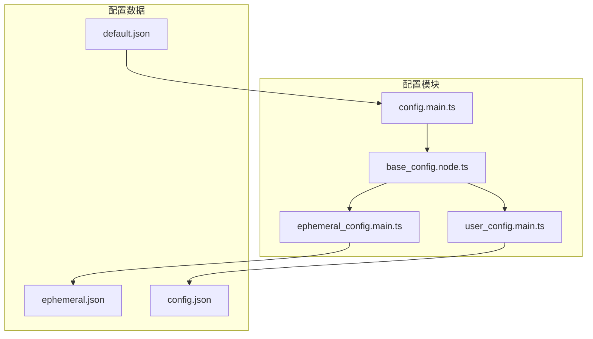
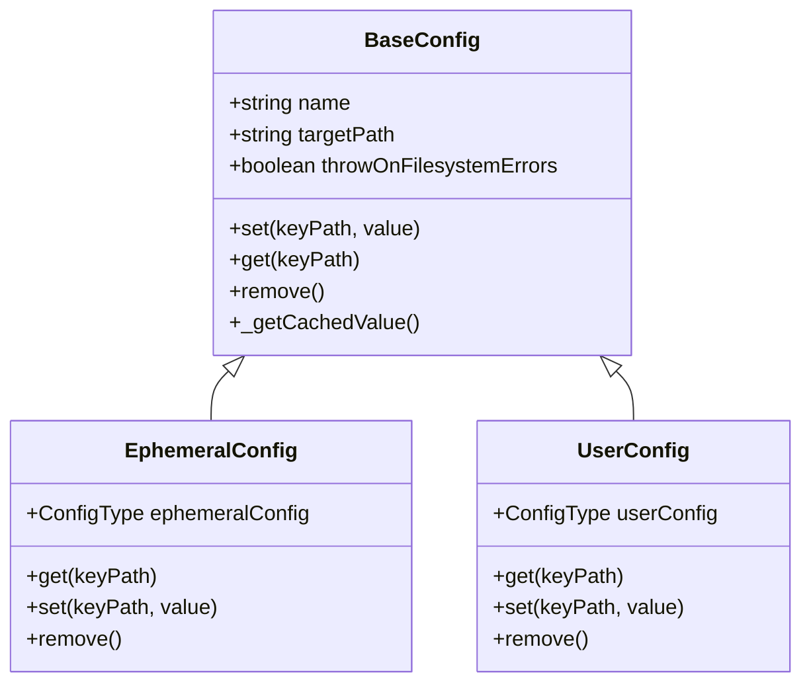
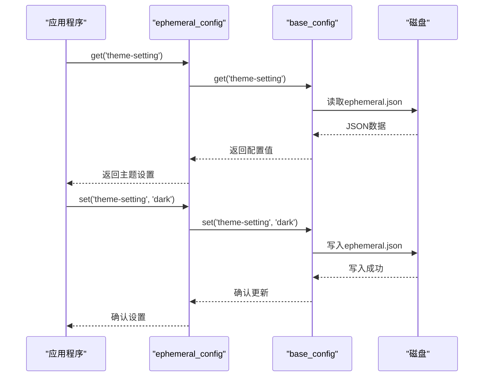
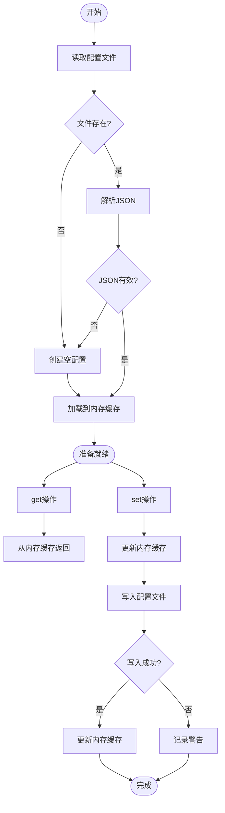
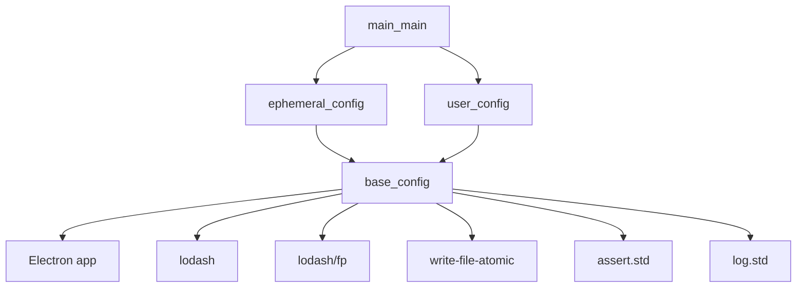

# 临时配置

<cite>
**本文档中引用的文件**
- [ephemeral_config.main.ts](file://app/ephemeral_config.main.ts)
- [base_config.node.ts](file://app/base_config.node.ts)
- [user_config.main.ts](file://app/user_config.main.ts)
- [main.main.ts](file://app/main.main.ts)
- [SystemTraySettingCache.node.ts](file://app/SystemTraySettingCache.node.ts)
- [config.main.ts](file://app/config.main.ts)
- [default.json](file://config/default.json)
</cite>

## 目录
1. [简介](#简介)
2. [项目结构](#项目结构)
3. [核心组件](#核心组件)
4. [架构概述](#架构概述)
5. [详细组件分析](#详细组件分析)
6. [依赖分析](#依赖分析)
7. [性能考虑](#性能考虑)
8. [故障排除指南](#故障排除指南)
9. [结论](#结论)
10. [附录](#附录)（如有必要）

## 简介
Signal-Desktop应用程序实现了复杂的配置管理系统，该系统由多个层次组成，包括持久化配置、用户配置和临时配置。本文件重点介绍ephemeral_config和base_config的运行时配置管理机制，深入探讨临时配置的生命周期管理、内存存储策略和会话间隔离机制。文档详细描述了临时配置与持久化配置的交互模式、优先级规则和覆盖逻辑，以及配置变更的实时响应、事件广播和状态同步实现。

## 项目结构
Signal-Desktop的配置系统由多个文件和目录组成，形成了一个分层的配置管理架构。核心配置文件位于app目录下，包括ephemeral_config.main.ts、base_config.node.ts、user_config.main.ts和config.main.ts。持久化配置数据存储在userData目录下的ephemeral.json和config.json文件中。默认配置值定义在config目录下的default.json文件中。



**Diagram sources**
- [ephemeral_config.main.ts](file://app/ephemeral_config.main.ts#L1-L22)
- [base_config.node.ts](file://app/base_config.node.ts#L1-L127)
- [user_config.main.ts](file://app/user_config.main.ts#L1-L51)
- [config.main.ts](file://app/config.main.ts#L1-L77)
- [default.json](file://config/default.json#L1-L36)

**Section sources**
- [app](file://app)
- [config](file://config)

## 核心组件
Signal-Desktop的配置系统由两个核心组件组成：base_config.node.ts和ephemeral_config.main.ts。base_config.node.ts提供了基础的配置管理功能，包括读取、写入和删除配置数据。ephemeral_config.main.ts基于base_config.node.ts构建，专门用于管理临时配置数据。临时配置系统设计用于存储在应用程序会话期间需要持久化但不需要长期保存的用户偏好设置。

**Section sources**
- [base_config.node.ts](file://app/base_config.node.ts#L1-L127)
- [ephemeral_config.main.ts](file://app/ephemeral_config.main.ts#L1-L22)

## 架构概述
Signal-Desktop的配置管理架构采用分层设计，其中base_config.node.ts作为底层基础组件，提供通用的配置操作接口。ephemeral_config.main.ts和user_config.main.ts都基于base_config.node.ts构建，分别管理临时配置和用户配置。这种设计实现了代码复用和功能分离，确保了配置管理的一致性和可靠性。



**Diagram sources**
- [base_config.node.ts](file://app/base_config.node.ts#L31-L126)
- [ephemeral_config.main.ts](file://app/ephemeral_config.main.ts#L13-L21)
- [user_config.main.ts](file://app/user_config.main.ts#L42-L50)

## 详细组件分析

### 临时配置分析
ephemeral_config.main.ts是Signal-Desktop中临时配置管理的核心组件。它通过导入base_config.node.ts中的start函数来创建一个专门用于管理临时配置的实例。临时配置数据存储在userData目录下的ephemeral.json文件中，用于保存在应用程序会话期间需要持久化的用户偏好设置。



**Diagram sources**
- [ephemeral_config.main.ts](file://app/ephemeral_config.main.ts#L13-L21)
- [base_config.node.ts](file://app/base_config.node.ts#L75-L88)
- [main.main.ts](file://app/main.main.ts#L334-L349)

### 基础配置分析
base_config.node.ts是Signal-Desktop配置系统的基础组件，提供了通用的配置管理功能。它实现了配置数据的读取、写入和删除操作，支持通过点符号访问嵌套配置项。该组件使用write-file-atomic库确保配置文件写入的原子性，防止在写入过程中出现文件损坏。



**Diagram sources**
- [base_config.node.ts](file://app/base_config.node.ts#L43-L88)
- [base_config.node.ts](file://app/base_config.node.ts#L75-L97)

**Section sources**
- [base_config.node.ts](file://app/base_config.node.ts#L1-L127)

### 用户配置分析
user_config.main.ts管理用户的持久化配置数据，与ephemeral_config.main.ts形成互补。用户配置存储在config.json文件中，用于保存需要长期保留的用户设置。与临时配置不同，用户配置在文件系统错误时会抛出异常，确保配置数据的完整性和可靠性。

**Section sources**
- [user_config.main.ts](file://app/user_config.main.ts#L42-L50)

## 依赖分析
Signal-Desktop的配置系统依赖于多个外部库和内部模块。主要依赖包括Electron的app模块用于获取userData路径，lodash和lodash/fp用于处理JavaScript对象，write-file-atomic用于确保文件写入的原子性。这些依赖关系确保了配置系统的稳定性和可靠性。



**Diagram sources**
- [base_config.node.ts](file://app/base_config.node.ts#L4-L11)
- [ephemeral_config.main.ts](file://app/ephemeral_config.main.ts#L8)
- [user_config.main.ts](file://app/user_config.main.ts#L8)
- [main.main.ts](file://app/main.main.ts#L9)

## 性能考虑
Signal-Desktop的配置系统在设计时考虑了性能因素。配置数据在首次读取后会被缓存在内存中，后续的get操作直接从内存中返回，避免了频繁的磁盘I/O操作。set操作虽然需要写入磁盘，但通过使用write-file-atomic库确保了写入的原子性和安全性。对于临时配置，系统在文件系统错误时不会抛出异常，而是继续使用内存中的数据，确保了应用程序的稳定运行。

## 故障排除指南
在使用Signal-Desktop的配置系统时，可能会遇到一些常见问题。如果临时配置文件损坏，系统会自动创建一个新的空配置文件，不会影响应用程序的正常运行。如果用户配置文件无法访问，系统会抛出异常，需要检查文件权限和磁盘空间。在开发和测试环境中，可以通过设置环境变量来覆盖默认配置值，便于调试和测试。

**Section sources**
- [base_config.node.ts](file://app/base_config.node.ts#L54-L69)
- [config.main.ts](file://app/config.main.ts#L20-L27)

## 结论
Signal-Desktop的配置管理系统通过ephemeral_config和base_config的协同工作，实现了灵活、可靠的运行时配置管理。临时配置系统为用户偏好设置提供了会话级别的持久化存储，而基础配置组件确保了配置操作的原子性和安全性。这种分层设计不仅提高了代码的可维护性，还增强了系统的稳定性和用户体验。

## 附录
### 配置文件路径
- 临时配置文件: userData/ephemeral.json
- 用户配置文件: userData/config.json
- 默认配置文件: config/default.json

### 配置操作示例
```typescript
// 获取临时配置
const theme = ephemeralConfig.get('theme-setting');

// 设置临时配置
ephemeralConfig.set('theme-setting', 'dark');

// 删除临时配置
ephemeralConfig.remove();
```