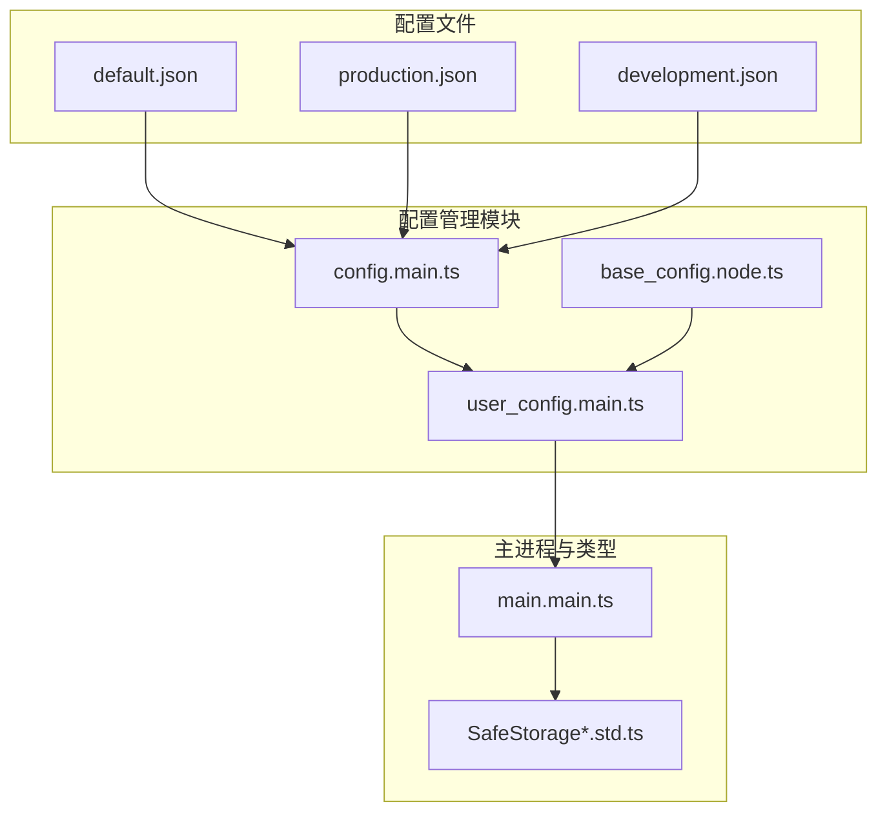
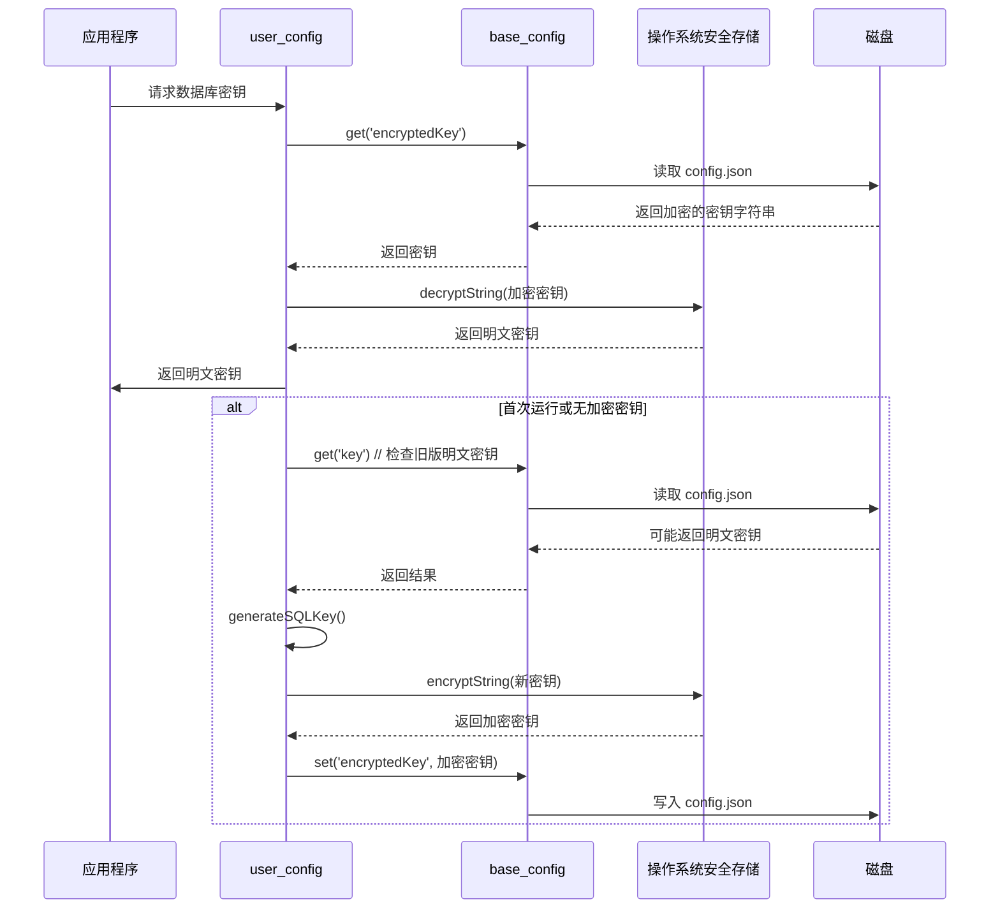
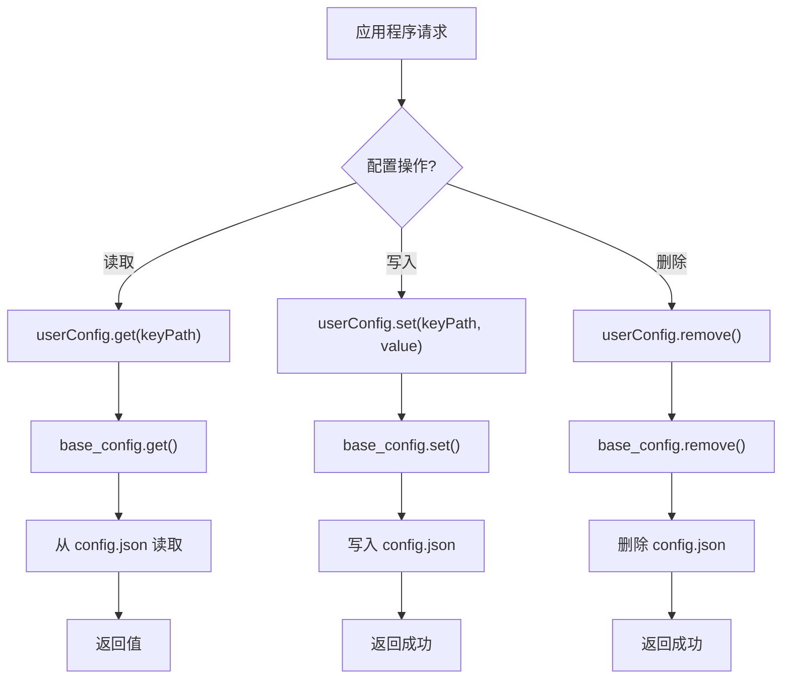
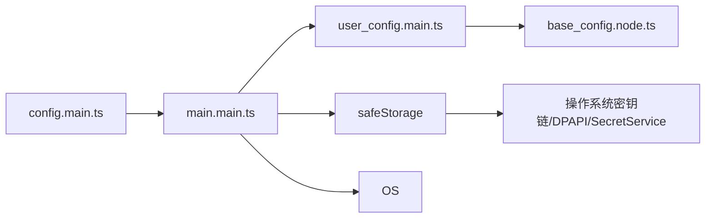

# 安全存储

<cite>
**本文档中引用的文件**  
- [user_config.main.ts](file://app/user_config.main.ts)
- [base_config.node.ts](file://app/base_config.node.ts)
- [main.main.ts](file://app/main.main.ts)
- [config.main.ts](file://app/config.main.ts)
- [SafeStorageDecryptionError.std.ts](file://ts/types/SafeStorageDecryptionError.std.ts)
- [SafeStorageBackendChangeError.std.ts](file://ts/types/SafeStorageBackendChangeError.std.ts)
- [default.json](file://config/default.json)
- [production.json](file://config/production.json)
- [development.json](file://config/development.json)
</cite>

## 目录
1. [简介](#简介)
2. [项目结构](#项目结构)
3. [核心组件](#核心组件)
4. [架构概述](#架构概述)
5. [详细组件分析](#详细组件分析)
6. [依赖分析](#依赖分析)
7. [性能考虑](#性能考虑)
8. [故障排除指南](#故障排除指南)
9. [结论](#结论)

## 简介
Signal-Desktop 应用程序通过多层次的安全机制保护用户敏感配置数据。该系统采用基于操作系统的安全存储后端（如 Windows DPAPI、macOS Keychain 和 Linux Secret Service API）对数据库加密密钥进行加密存储，确保即使设备被物理访问，用户数据仍保持机密性。配置管理模块实现了对用户配置、临时配置和启动配置的分层管理，结合严格的访问控制策略和错误恢复机制，构建了一个健壮的安全存储体系。本文档深入解析其加密存储机制、密钥管理方案和安全审计功能。

## 项目结构
Signal-Desktop 的配置安全存储功能主要由 `app` 目录下的配置管理模块和 `ts` 目录下的类型定义共同实现。用户敏感数据的加密存储逻辑集中在 `user_config.main.ts` 和 `base_config.node.ts` 文件中，而核心的密钥加密与解密操作则在主进程的 `main.main.ts` 文件中完成。系统通过 `config` 目录中的 JSON 文件定义不同环境下的默认配置，为安全存储提供基础设置。



**图示来源**  
- [config/default.json](file://config/default.json)
- [config/production.json](file://config/production.json)
- [config/development.json](file://config/development.json)
- [app/base_config.node.ts](file://app/base_config.node.ts)
- [app/user_config.main.ts](file://app/user_config.main.ts)
- [app/config.main.ts](file://app/config.main.ts)
- [app/main.main.ts](file://app/main.main.ts)
- [ts/types/SafeStorageDecryptionError.std.ts](file://ts/types/SafeStorageDecryptionError.std.ts)

**本节来源**  
- [app/base_config.node.ts](file://app/base_config.node.ts#L1-L127)
- [app/user_config.main.ts](file://app/user_config.main.ts#L1-L51)
- [app/config.main.ts](file://app/config.main.ts#L1-L77)

## 核心组件
Signal-Desktop 的安全存储核心由三个关键组件构成：`base_config.node.ts` 提供了基础的配置文件读写和缓存功能；`user_config.main.ts` 利用此基础，指定了用户配置文件 `config.json` 的存储路径；而 `main.main.ts` 中的 `getSQLKey()` 函数则是整个安全机制的入口点，负责协调密钥的生成、加密存储和解密读取。这些组件共同协作，确保了用户数据库密钥这一最敏感信息的安全性。

**本节来源**  
- [app/base_config.node.ts](file://app/base_config.node.ts#L1-L127)
- [app/user_config.main.ts](file://app/user_config.main.ts#L1-L51)
- [app/main.main.ts](file://app/main.main.ts#L1627-L1743)

## 架构概述
Signal-Desktop 的安全存储架构采用分层设计。在最底层，`base_config` 模块提供通用的 JSON 文件持久化能力。在此之上，`user_config` 模块管理具体的用户配置文件。安全性的核心在于主进程的密钥管理逻辑：当需要访问加密数据库时，系统首先检查是否存在已加密的密钥（`encryptedKey`）。如果存在，则使用操作系统提供的安全存储服务（`safeStorage`）进行解密；如果不存在，则生成新密钥，并在支持的环境下将其加密后存储，同时保留一个明文副本用于迁移或降级场景。



**图示来源**  
- [app/main.main.ts](file://app/main.main.ts#L1627-L1743)
- [app/user_config.main.ts](file://app/user_config.main.ts#L42-L51)
- [app/base_config.node.ts](file://app/base_config.node.ts#L31-L127)

## 详细组件分析

### 用户配置管理分析
`user_config.main.ts` 模块是用户配置数据的直接管理者。它通过 `start()` 函数从 `base_config.node.ts` 创建一个配置实例，该实例指向用户数据目录下的 `config.json` 文件。此模块不直接处理加密逻辑，而是作为 `safeStorage` 加密/解密操作与持久化存储之间的桥梁。

#### 对于 API/服务组件：


**图示来源**  
- [app/user_config.main.ts](file://app/user_config.main.ts#L42-L51)
- [app/base_config.node.ts](file://app/base_config.node.ts#L31-L127)

### 密钥管理与安全存储分析
`getSQLKey()` 函数是安全存储机制的核心，它实现了复杂的密钥生命周期管理，包括密钥生成、迁移和错误处理。

#### 对于复杂逻辑组件：
```mermaid
flowchart TD
Start([开始]) --> CheckModernKey{"modernKeyValue 存在?"}
CheckModernKey --> |是| CheckEncryption{"加密可用?"}
CheckEncryption --> |否| ThrowError["抛出 '无法解密数据库密钥' 错误"]
CheckEncryption --> |是| Decrypt["safeStorage.decryptString()"]
Decrypt --> CheckLegacy{"legacyKeyValue 存在?"}
CheckLegacy --> |是| CompareKeys{"解密密钥 == 旧密钥?"}
CompareKeys --> |是| RemoveLegacy["删除旧密钥 'key'"]
CompareKeys --> |否| WarnMismatch["记录警告"]
WarnMismatch --> HandleError["handleSafeStorageDecryptionError()"]
HandleError --> |继续| UseLegacy["使用旧密钥"]
HandleError --> |退出| ExitApp["退出应用"]
UseLegacy --> ReturnKey
RemoveLegacy --> ReturnKey
CheckLegacy --> |否| CheckBackend{"Linux 且 backend 变化?"}
CheckBackend --> |是| ThrowBackendChange["抛出 SafeStorageBackendChangeError"]
CheckBackend --> |否| ReturnKey["返回解密密钥"]
CheckModernKey --> |否| CheckLegacyKey{"legacyKeyValue 存在?"}
CheckLegacyKey --> |是| SetUpdate["update = true"]
CheckLegacyKey --> |否| GenerateKey["generateSQLKey()"]
GenerateKey --> SetUpdate
SetUpdate --> CheckUpdate{"update == true?"}
CheckUpdate --> |是| CheckEncryptionAvailable{"加密可用?"}
CheckEncryptionAvailable --> |是| EncryptKey["safeStorage.encryptString(key)"]
EncryptKey --> StoreEncrypted["set('encryptedKey', ...)", "set('key', undefined)"]
CheckEncryptionAvailable --> |否| StorePlaintext["set('key', key)"]
StoreEncrypted --> ReturnKey
StorePlaintext --> ReturnKey
CheckUpdate --> |否| ReturnKey
```

**图示来源**  
- [app/main.main.ts](file://app/main.main.ts#L1627-L1743)
- [ts/types/SafeStorageDecryptionError.std.ts](file://ts/types/SafeStorageDecryptionError.std.ts#L1-L6)
- [ts/types/SafeStorageBackendChangeError.std.ts](file://ts/types/SafeStorageBackendChangeError.std.ts#L1-L24)

**本节来源**  
- [app/main.main.ts](file://app/main.main.ts#L1627-L1743)
- [ts/types/SafeStorageDecryptionError.std.ts](file://ts/types/SafeStorageDecryptionError.std.ts#L1-L7)
- [ts/types/SafeStorageBackendChangeError.std.ts](file://ts/types/SafeStorageBackendChangeError.std.ts#L1-L25)

## 依赖分析
安全存储功能依赖于多个内部和外部组件。`user_config` 模块直接依赖于 `base_config` 提供的持久化能力。主进程的密钥管理逻辑依赖于 Electron 的 `safeStorage` 模块来与操作系统的安全服务交互。此外，`config.main.ts` 提供的环境配置决定了 `safeStorage` 是否可用以及如何初始化。在 Linux 平台上，安全存储后端的选择（如 `basic_text`）会直接影响加密功能的可用性。



**图示来源**  
- [app/user_config.main.ts](file://app/user_config.main.ts#L8-L9)
- [app/main.main.ts](file://app/main.main.ts#L1648-L1649)
- [app/config.main.ts](file://app/config.main.ts#L10-L16)

**本节来源**  
- [app/user_config.main.ts](file://app/user_config.main.ts#L1-L51)
- [app/main.main.ts](file://app/main.main.ts#L1627-L1743)
- [app/config.main.ts](file://app/config.main.ts#L1-L77)

## 性能考虑
使用操作系统安全存储服务进行加密和解密操作会引入一定的性能开销，尤其是在应用启动时读取数据库密钥的阶段。然而，这种开销通常是可以接受的，因为它是一次性的，并且换取了极高的安全性。`safeStorage` 模块的 `isEncryptionAvailable()` 方法允许应用在启动时快速判断加密功能是否可用，避免了在不支持的环境下进行不必要的尝试。对于性能敏感的场景，系统通过缓存机制（`base_config` 中的 `cachedValue`）减少了对磁盘的频繁读写。

## 故障排除指南
当安全存储机制出现问题时，系统会抛出特定的错误类型以帮助诊断。`SafeStorageDecryptionError` 表示系统无法解密已存储的密钥，这可能是由于操作系统凭据更改或安全存储后端状态不一致导致。`SafeStorageBackendChangeError` 是一个更具体的错误，专门针对 Linux 平台，当桌面环境变化导致安全存储后端从加密模式（如 `kwallet`）切换到非加密模式（`basic_text`）时抛出，此时无法解密之前存储的密钥。处理此类问题通常需要用户重新链接设备或清除应用数据。

**本节来源**  
- [ts/types/SafeStorageDecryptionError.std.ts](file://ts/types/SafeStorageDecryptionError.std.ts#L1-L7)
- [ts/types/SafeStorageBackendChangeError.std.ts](file://ts/types/SafeStorageBackendChangeError.std.ts#L1-L25)
- [app/main.main.ts](file://app/main.main.ts#L1653-L1665)

## 结论
Signal-Desktop 的安全存储设计体现了纵深防御的安全理念。通过将数据库密钥的加密委托给经过充分验证的操作系统安全服务，它最大限度地利用了平台的安全特性。其优雅的密钥迁移逻辑确保了从旧版本到新版本的平滑过渡，同时通过详细的错误类型和日志记录，为用户和开发者提供了清晰的问题诊断路径。这种设计在安全性、兼容性和用户体验之间取得了良好的平衡，是保护用户隐私数据的坚实基础。