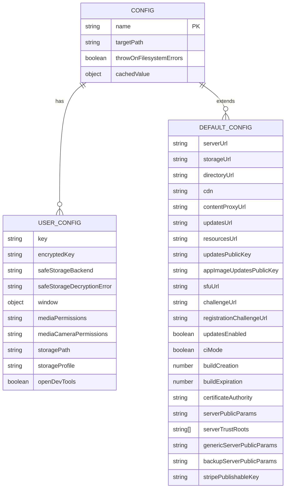
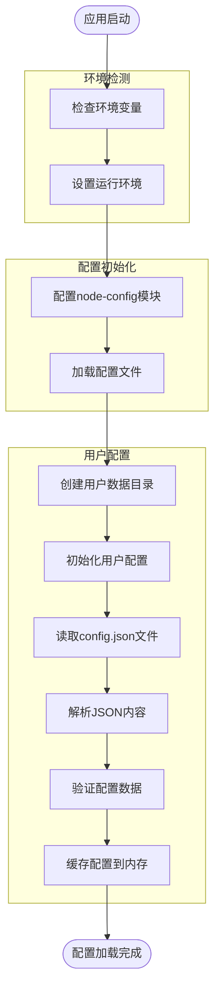
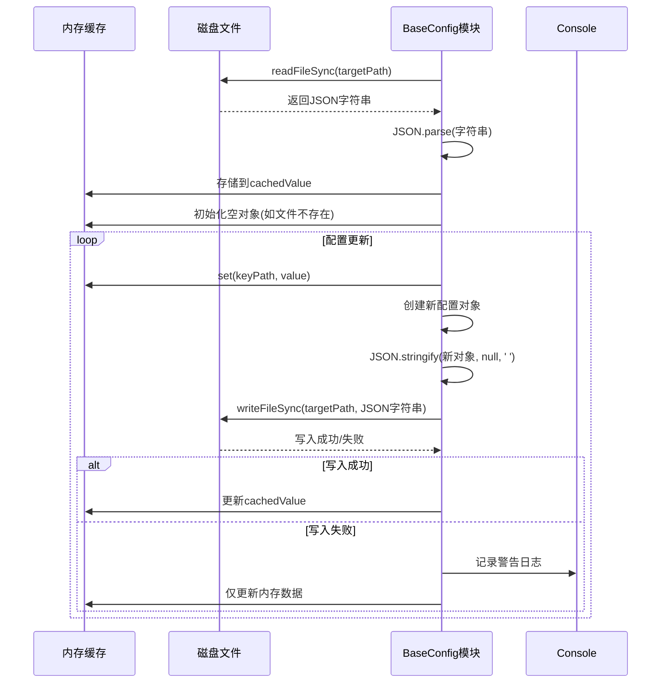
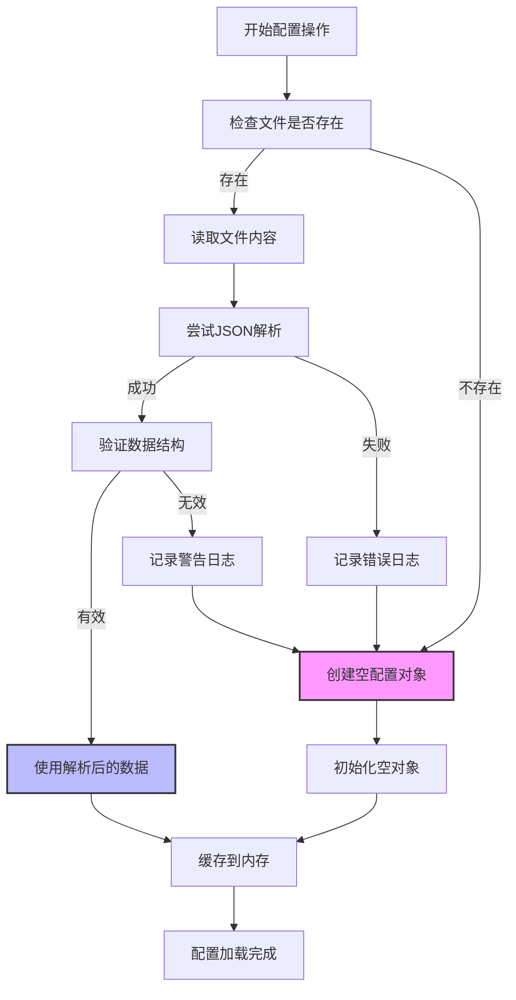
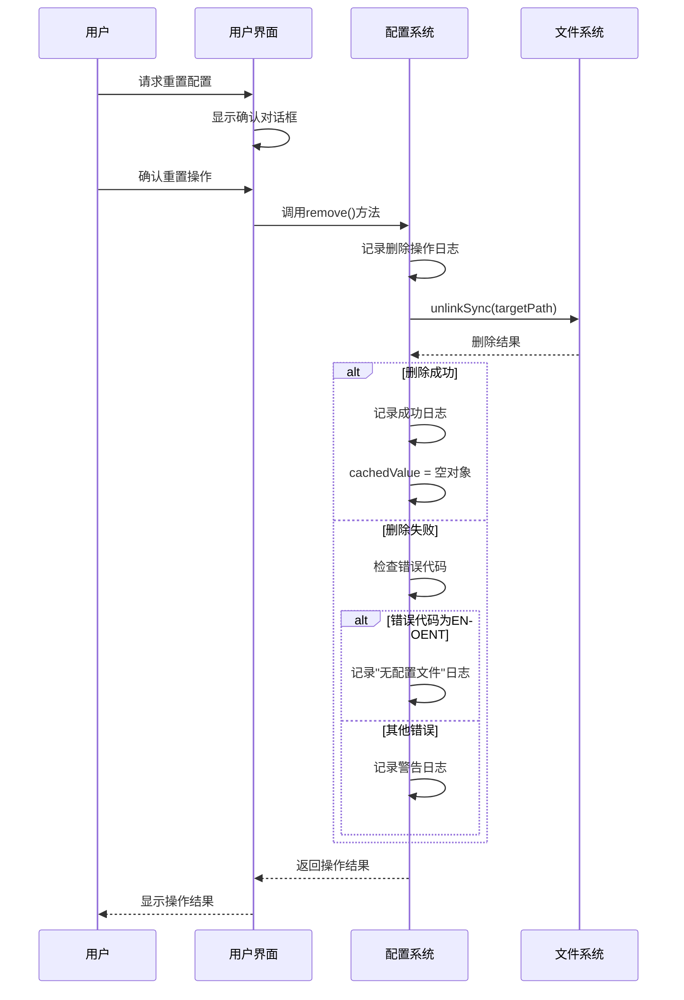
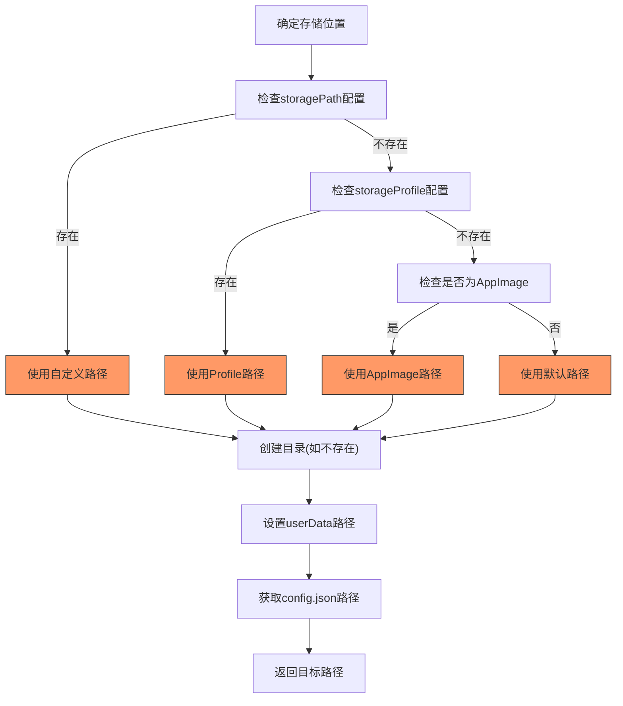
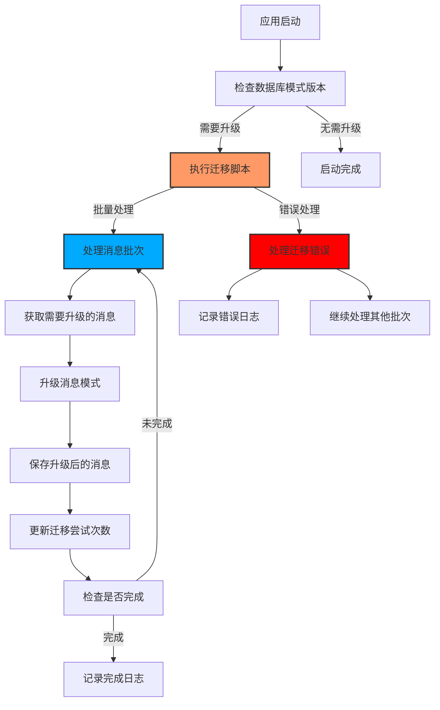
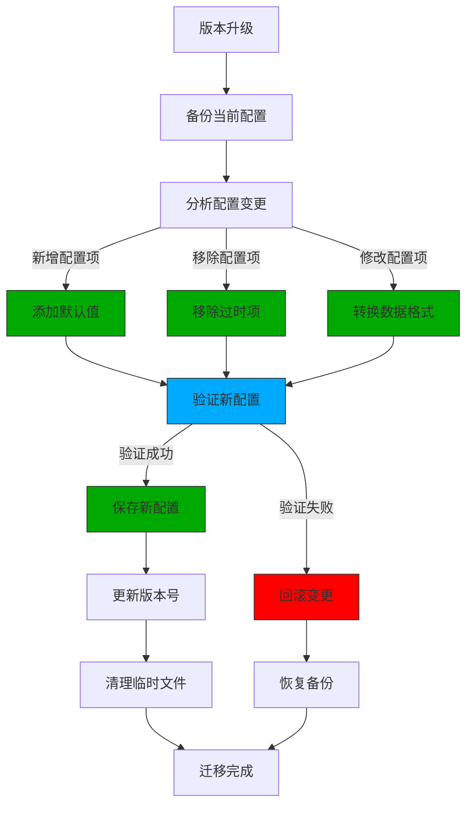

# 持久化配置

<cite>
**本文档中引用的文件**  
- [user_config.main.ts](file://app/user_config.main.ts)
- [base_config.node.ts](file://app/base_config.node.ts)
- [config.main.ts](file://app/config.main.ts)
- [default.json](file://config/default.json)
- [production.json](file://config/production.json)
- [development.json](file://config/development.json)
- [main.main.ts](file://app/main.main.ts)
</cite>

## 目录
1. [简介](#简介)
2. [配置文件结构](#配置文件结构)
3. [配置加载流程](#配置加载流程)
4. [序列化与反序列化](#序列化与反序列化)
5. [数据验证规则](#数据验证规则)
6. [默认值与覆盖逻辑](#默认值与覆盖逻辑)
7. [配置重置功能](#配置重置功能)
8. [存储位置与格式](#存储位置与格式)
9. [版本兼容性处理](#版本兼容性处理)
10. [配置操作示例](#配置操作示例)
11. [迁移与升级策略](#迁移与升级策略)

## 简介
Signal-Desktop的持久化配置系统采用分层架构，通过用户配置(user_config)和默认配置(default.json)的合并机制实现灵活的配置管理。系统在启动时根据环境变量加载相应的配置文件，并将用户自定义设置持久化到本地存储中。

**Section sources**
- [user_config.main.ts](file://app/user_config.main.ts#L1-L51)
- [config.main.ts](file://app/config.main.ts#L1-L77)

## 配置文件结构
Signal-Desktop的配置系统由多个JSON文件组成，形成一个层次化的配置结构。核心配置文件包括：

- **default.json**: 包含所有配置项的默认值，适用于所有环境
- **production.json**: 生产环境特定的配置覆盖
- **development.json**: 开发环境特定的配置覆盖
- **staging.json**: 预发布环境特定的配置覆盖

配置项采用嵌套的JSON对象结构，包含服务器URL、CDN配置、安全参数等关键信息。



**Diagram sources**
- [default.json](file://config/default.json#L1-L36)
- [production.json](file://config/production.json#L1-L24)

## 配置加载流程
配置系统的加载流程遵循严格的初始化顺序，确保在应用程序启动时正确设置所有配置参数。



**Diagram sources**
- [config.main.ts](file://app/config.main.ts#L19-L46)
- [user_config.main.ts](file://app/user_config.main.ts#L13-L34)

**Section sources**
- [config.main.ts](file://app/config.main.ts#L1-L77)
- [user_config.main.ts](file://app/user_config.main.ts#L1-L51)

## 序列化与反序列化
配置系统的序列化与反序列化过程通过`base_config.node.ts`中的`start`函数实现，确保配置数据在内存和磁盘之间的正确转换。



**Diagram sources**
- [base_config.node.ts](file://app/base_config.node.ts#L43-L88)

**Section sources**
- [base_config.node.ts](file://app/base_config.node.ts#L1-L127)

## 数据验证规则
配置系统在加载和保存过程中实施严格的数据验证规则，确保配置数据的完整性和正确性。



**Diagram sources**
- [base_config.node.ts](file://app/base_config.node.ts#L43-L69)

## 默认值与覆盖逻辑
配置系统采用分层覆盖机制，通过环境特定的配置文件实现默认值的灵活覆盖。

```mermaid
classDiagram
class DefaultConfig {
+serverUrl : string
+storageUrl : string
+directoryUrl : string
+cdn : object
+updatesEnabled : boolean
+openDevTools : boolean
}
class ProductionConfig {
+serverUrl : string
+updatesEnabled : boolean
}
class DevelopmentConfig {
+storageProfile : string
+openDevTools : boolean
}
class UserConfig {
+key : string
+encryptedKey : string
+window : object
+mediaPermissions : string
}
DefaultConfig <|-- ProductionConfig : "extends"
DefaultConfig <|-- DevelopmentConfig : "extends"
ProductionConfig --> UserConfig : "base for"
DevelopmentConfig --> UserConfig : "base for"
note right of DefaultConfig
包含所有环境的默认配置值
作为基础配置层
end note
note right of ProductionConfig
覆盖生产环境特定的配置项
如服务器URL、更新启用状态
end note
note right of DevelopmentConfig
覆盖开发环境特定的配置项
如存储配置文件、开发工具启用
end note
note right of UserConfig
存储用户特定的持久化配置
包括加密密钥、窗口状态等
end note
```

**Diagram sources**
- [default.json](file://config/default.json#L1-L36)
- [production.json](file://config/production.json#L1-L24)
- [development.json](file://config/development.json#L1-L5)

## 配置重置功能
系统提供完整的配置重置功能，允许用户清除所有持久化配置并恢复到默认状态。



**Diagram sources**
- [base_config.node.ts](file://app/base_config.node.ts#L99-L118)
- [main.main.ts](file://app/main.main.ts#L1958)

## 存储位置与格式
配置文件的存储位置根据操作系统和环境变量动态确定，确保跨平台兼容性。



**Diagram sources**
- [user_config.main.ts](file://app/user_config.main.ts#L15-L34)

## 版本兼容性处理
配置系统通过严格的版本控制和数据迁移策略确保不同版本间的兼容性。



**Diagram sources**
- [migrateMessageData.preload.ts](file://ts/messages/migrateMessageData.preload.ts#L49-L193)
- [index.node.ts](file://ts/sql/migrations/index.node.ts#L1550-L1576)

## 配置操作示例
以下代码示例展示了如何在Signal-Desktop中进行常见的配置操作。

```mermaid
classDiagram
class ConfigOperations {
+get(keyPath : string) : unknown
+set(keyPath : string, value : unknown) : void
+remove() : void
+_getCachedValue() : object
}
class UserConfig {
+get : function
+set : function
+remove : function
}
ConfigOperations <|-- UserConfig : "implements"
note right of ConfigOperations
核心配置操作接口
get : 根据路径获取配置值
set : 根据路径设置配置值
remove : 删除整个配置文件
_getCachedValue : 获取内存缓存(测试专用)
end note
note right of UserConfig
用户配置实例
通过bind方法继承ConfigOperations
提供全局访问接口
end note
```

**Diagram sources**
- [base_config.node.ts](file://app/base_config.node.ts#L22-L29)
- [user_config.main.ts](file://app/user_config.main.ts#L48-L50)

## 迁移与升级策略
系统采用渐进式的配置迁移策略，确保数据在版本升级过程中的完整性和一致性。



**Diagram sources**
- [background.preload.ts](file://ts/background.preload.ts#L3310-L3322)
- [removeAllConfiguration_test.preload.ts](file://ts/test-electron/sql/removeAllConfiguration_test.preload.ts#L1-L45)