# 配置同步

<cite>
**本文档中引用的文件**  
- [settingsChannel.main.ts](file://ts/main/settingsChannel.main.ts)
- [createIPCEvents.preload.ts](file://ts/util/createIPCEvents.preload.ts)
- [preload.preload.ts](file://ts/util/preload.preload.ts)
- [main.main.ts](file://app/main.main.ts)
- [user_config.main.ts](file://app/user_config.main.ts)
- [ephemeral_config.main.ts](file://app/ephemeral_config.main.ts)
- [config.preload.ts](file://ts/context/config.preload.ts)
- [waitForSettingsChange.preload.ts](file://ts/context/waitForSettingsChange.preload.ts)
- [cleanDataForIpc.std.ts](file://ts/sql/cleanDataForIpc.std.ts)
</cite>

## 目录
1. [简介](#简介)
2. [配置同步架构](#配置同步架构)
3. [核心组件分析](#核心组件分析)
4. [IPC通信协议](#ipc通信协议)
5. [消息格式与序列化](#消息格式与序列化)
6. [配置变更监听与广播](#配置变更监听与广播)
7. [时序保证与一致性维护](#时序保证与一致性维护)
8. [错误处理策略](#错误处理策略)
9. [性能优化技巧](#性能优化技巧)

## 简介
Signal-Desktop应用程序实现了主进程与渲染进程之间的双向配置同步机制，通过名为settingsChannel的专用通道实现。该机制确保了应用程序配置在不同进程间的实时同步，支持主题设置、系统托盘设置、拼写检查等用户偏好设置的动态更新。本文档深入分析了这一配置同步机制的实现原理，包括IPC通信协议、消息格式、序列化机制以及配置变更的监听、广播和接收处理流程。

## 配置同步架构
Signal-Desktop的配置同步机制采用主从架构，主进程作为配置的权威源，渲染进程作为配置的消费者和变更发起者。通过Electron的IPC（进程间通信）机制，实现了主进程与渲染进程之间的双向通信。

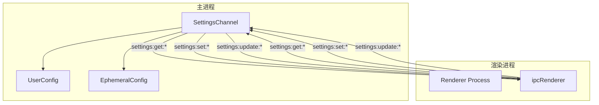

**图表来源**  
- [settingsChannel.main.ts](file://ts/main/settingsChannel.main.ts#L26-L153)
- [createIPCEvents.preload.ts](file://ts/util/createIPCEvents.preload.ts#L45-L471)

## 核心组件分析
配置同步机制的核心是SettingsChannel类，它继承自EventEmitter，负责管理主进程中的配置同步逻辑。该类在主进程中实例化，并通过ipcMain处理来自渲染进程的配置请求。

### SettingsChannel类分析
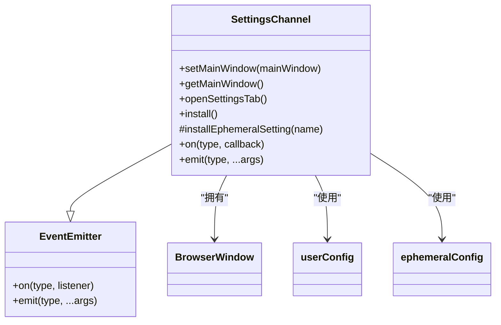

**图表来源**  
- [settingsChannel.main.ts](file://ts/main/settingsChannel.main.ts#L26-L153)

**本节来源**  
- [settingsChannel.main.ts](file://ts/main/settingsChannel.main.ts#L26-L153)
- [main.main.ts](file://app/main.main.ts#L2130-L2132)

### 配置存储组件
Signal-Desktop使用两种配置存储：userConfig用于持久化配置，ephemeralConfig用于临时配置。

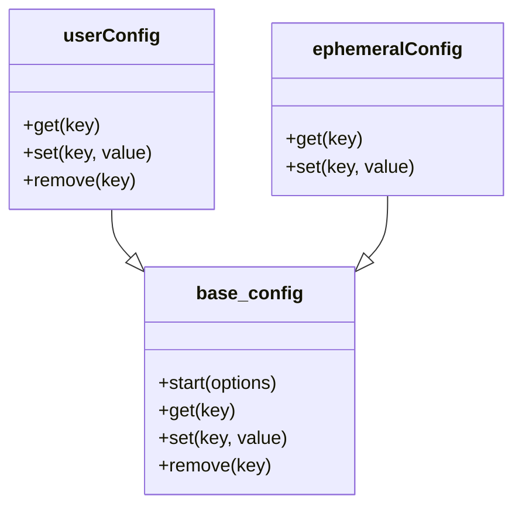

**图表来源**  
- [user_config.main.ts](file://app/user_config.main.ts#L42-L50)
- [ephemeral_config.main.ts](file://app/ephemeral_config.main.ts)

**本节来源**  
- [user_config.main.ts](file://app/user_config.main.ts#L1-L51)
- [ephemeral_config.main.ts](file://app/ephemeral_config.main.ts)

## IPC通信协议
配置同步机制使用Electron的IPC协议进行主进程与渲染进程之间的通信，定义了一套标准化的消息通道。

### IPC消息通道
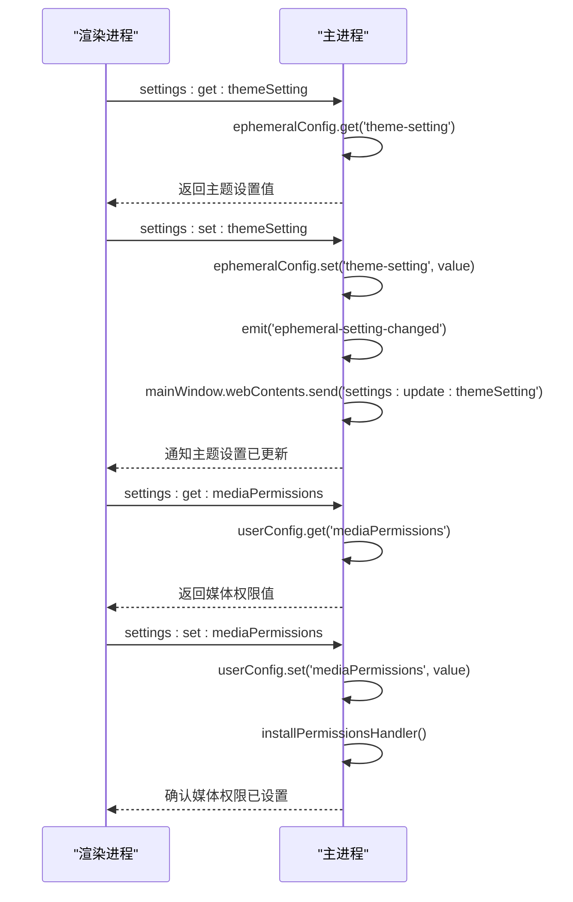

**图表来源**  
- [settingsChannel.main.ts](file://ts/main/settingsChannel.main.ts#L88-L116)
- [createIPCEvents.preload.ts](file://ts/util/createIPCEvents.preload.ts#L198-L238)

**本节来源**  
- [settingsChannel.main.ts](file://ts/main/settingsChannel.main.ts#L88-L116)
- [createIPCEvents.preload.ts](file://ts/util/createIPCEvents.preload.ts#L198-L238)

### 消息类型映射
配置同步机制使用了命名约定来映射配置项与IPC消息通道：

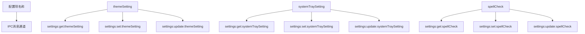

**图表来源**  
- [settingsChannel.main.ts](file://ts/main/settingsChannel.main.ts#L18-L24)
- [preload.preload.ts](file://ts/util/preload.preload.ts#L37-L44)

## 消息格式与序列化
配置同步机制使用Electron的结构化克隆算法进行消息序列化，同时实现了自定义的数据清理机制以确保数据兼容性。

### 消息序列化流程
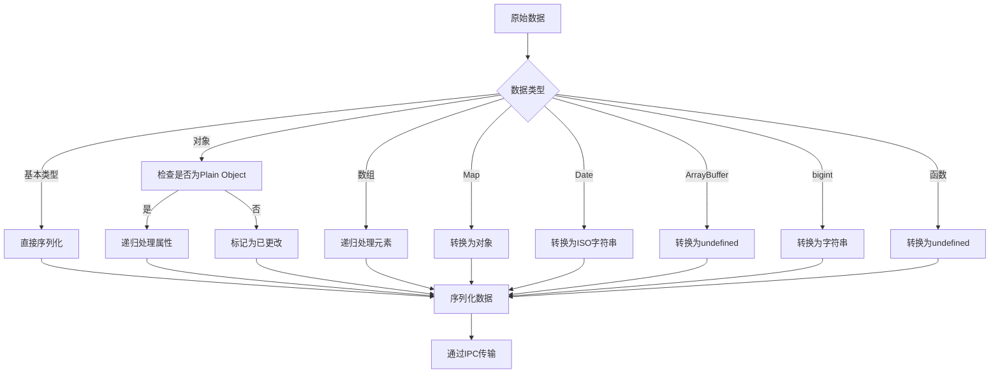

**图表来源**  
- [cleanDataForIpc.std.ts](file://ts/sql/cleanDataForIpc.std.ts#L23-L193)

**本节来源**  
- [cleanDataForIpc.std.ts](file://ts/sql/cleanDataForIpc.std.ts#L23-L193)
- [settingsChannel.main.ts](file://ts/main/settingsChannel.main.ts#L94-L95)

### 数据清理机制
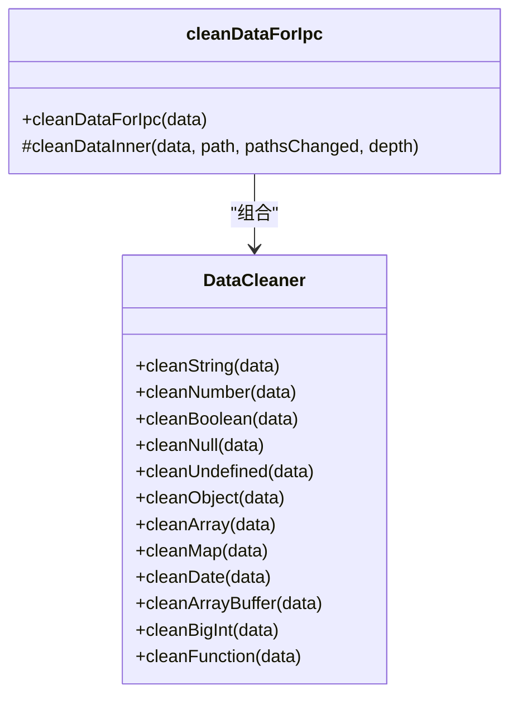

**图表来源**  
- [cleanDataForIpc.std.ts](file://ts/sql/cleanDataForIpc.std.ts#L23-L193)

## 配置变更监听与广播
配置同步机制实现了完整的发布-订阅模式，允许渲染进程监听配置变更并接收实时更新。

### 配置变更监听流程
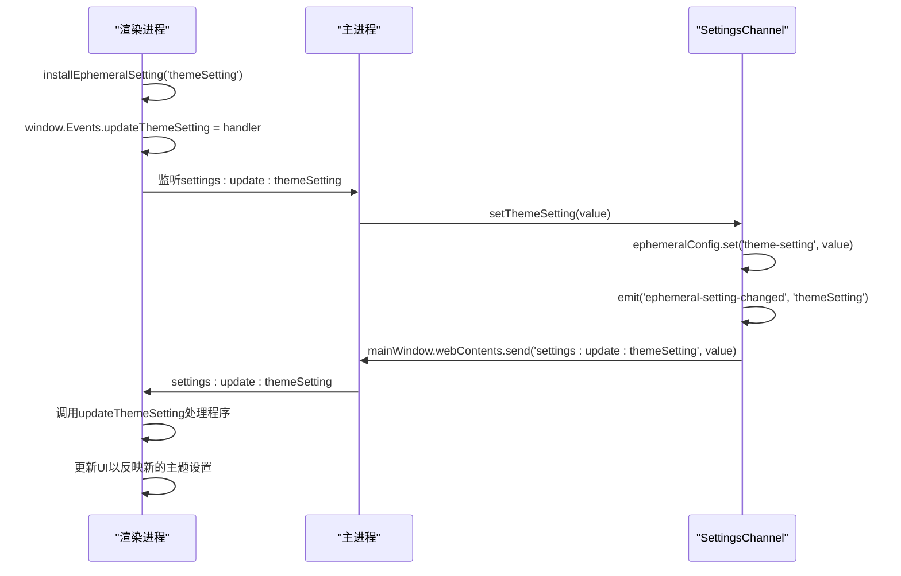

**图表来源**  
- [settingsChannel.main.ts](file://ts/main/settingsChannel.main.ts#L108-L115)
- [preload.preload.ts](file://ts/util/preload.preload.ts#L169-L176)

**本节来源**  
- [settingsChannel.main.ts](file://ts/main/settingsChannel.main.ts#L108-L115)
- [preload.preload.ts](file://ts/util/preload.preload.ts#L169-L176)

### 事件监听器注册
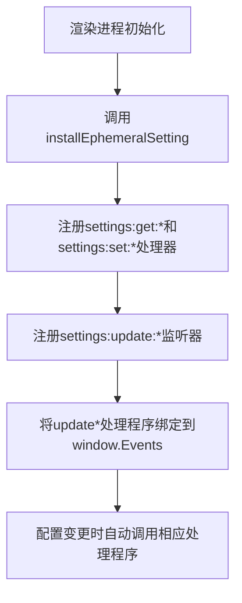

**图表来源**  
- [preload.preload.ts](file://ts/util/preload.preload.ts#L164-L176)

## 时序保证与一致性维护
配置同步机制通过事件驱动架构和状态管理确保了配置变更的时序保证和一致性。

### 时序保证机制
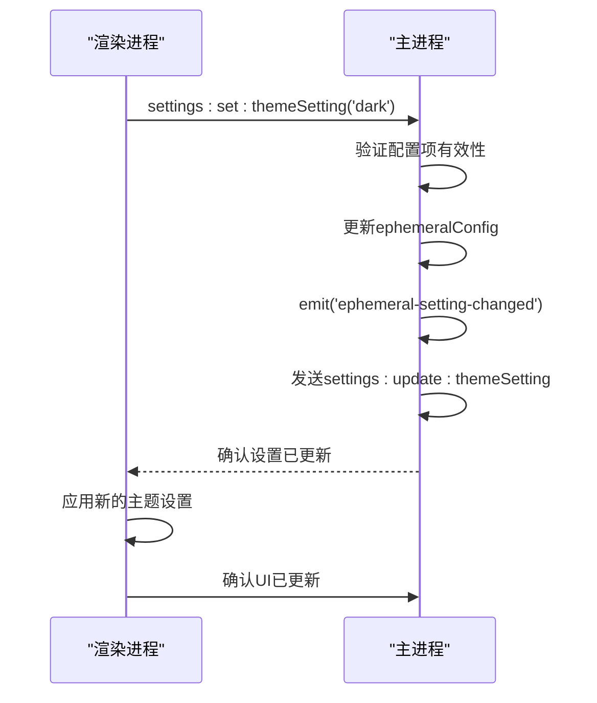

**图表来源**  
- [settingsChannel.main.ts](file://ts/main/settingsChannel.main.ts#L98-L115)
- [preload.preload.ts](file://ts/util/preload.preload.ts#L140-L157)

### 一致性维护策略
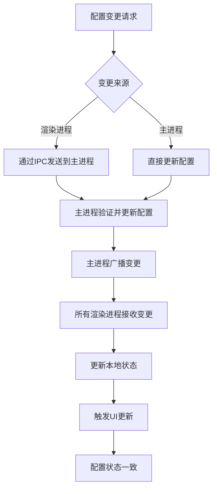

**图表来源**  
- [settingsChannel.main.ts](file://ts/main/settingsChannel.main.ts#L115)
- [waitForSettingsChange.preload.ts](file://ts/context/waitForSettingsChange.preload.ts)

**本节来源**  
- [settingsChannel.main.ts](file://ts/main/settingsChannel.main.ts#L115)
- [waitForSettingsChange.preload.ts](file://ts/context/waitForSettingsChange.preload.ts)

## 错误处理策略
配置同步机制实现了全面的错误处理策略，确保在异常情况下系统的稳定性和用户体验。

### 错误处理流程
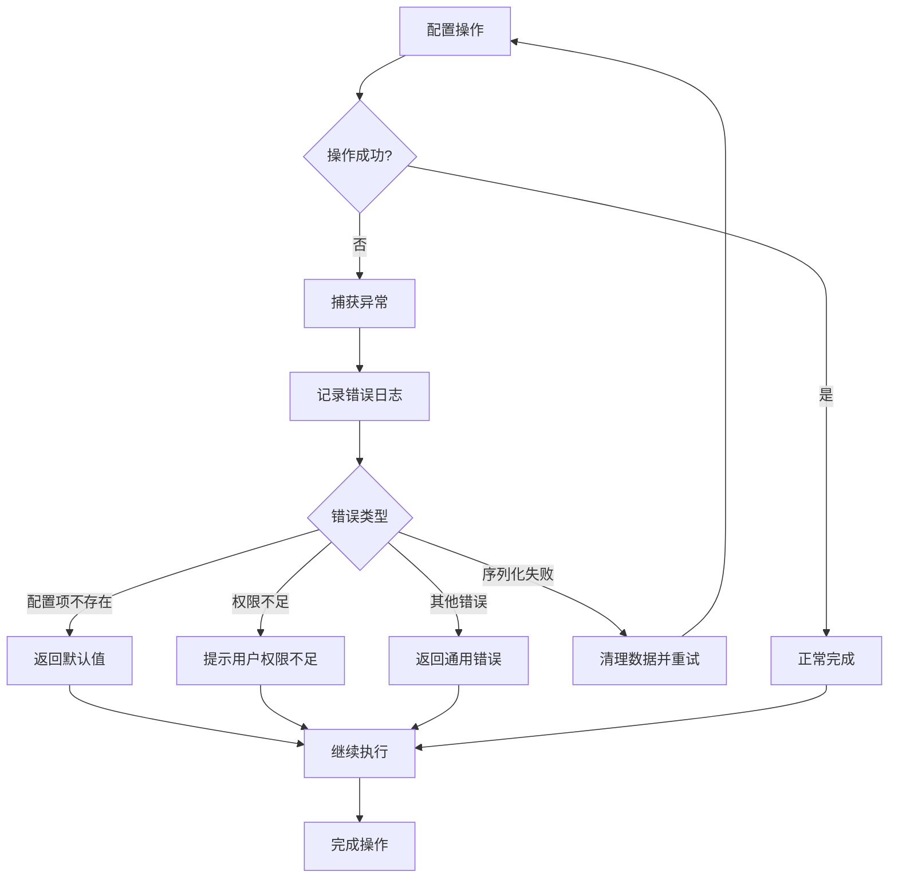

**图表来源**  
- [settingsChannel.main.ts](file://ts/main/settingsChannel.main.ts#L90-L93)
- [preload.preload.ts](file://ts/util/preload.preload.ts#L134-L135)
- [preload.preload.ts](file://ts/util/preload.preload.ts#L158-L159)

**本节来源**  
- [settingsChannel.main.ts](file://ts/main/settingsChannel.main.ts#L90-L93)
- [preload.preload.ts](file://ts/util/preload.preload.ts#L134-L135)

### 异常处理示例
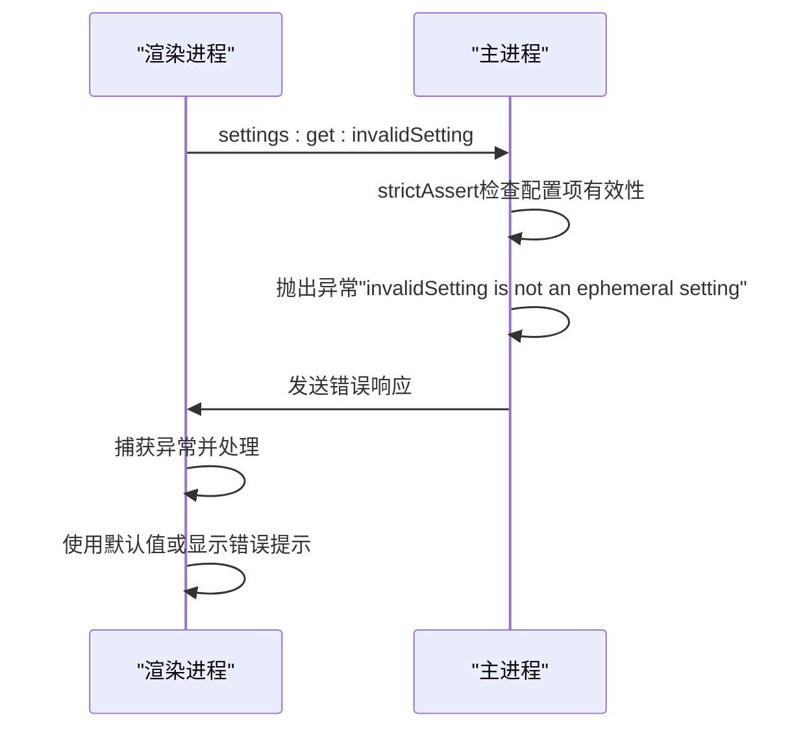

**图表来源**  
- [settingsChannel.main.ts](file://ts/main/settingsChannel.main.ts#L90-L93)

## 性能优化技巧
配置同步机制通过多种技术手段优化了性能，确保了配置同步的高效性和响应性。

### 批量更新优化
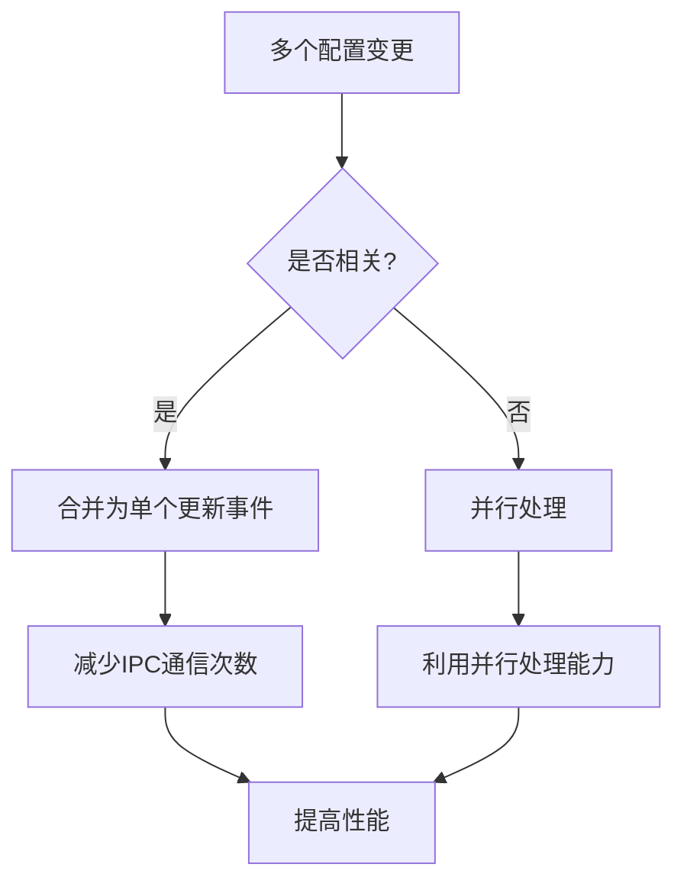

### 内存优化策略
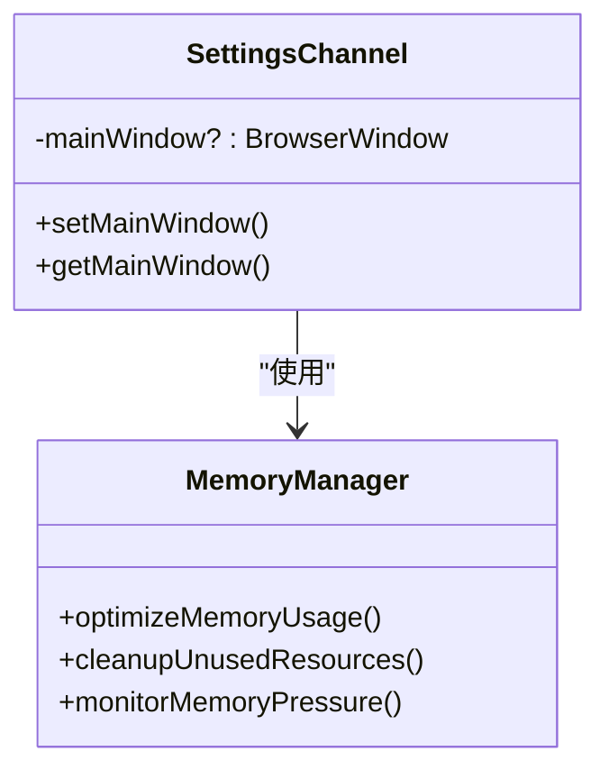

**图表来源**  
- [settingsChannel.main.ts](file://ts/main/settingsChannel.main.ts#L27-L35)

### 延迟加载优化
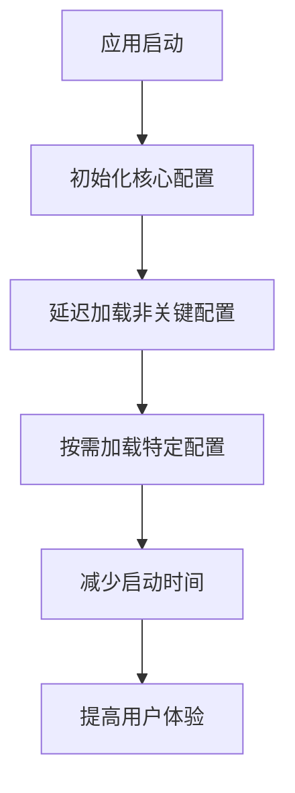

**本节来源**  
- [main.main.ts](file://app/main.main.ts#L2130-L2132)
- [settingsChannel.main.ts](file://ts/main/settingsChannel.main.ts#L46-L83)