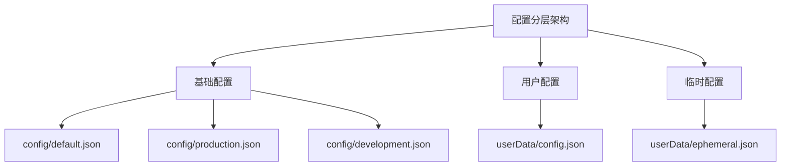
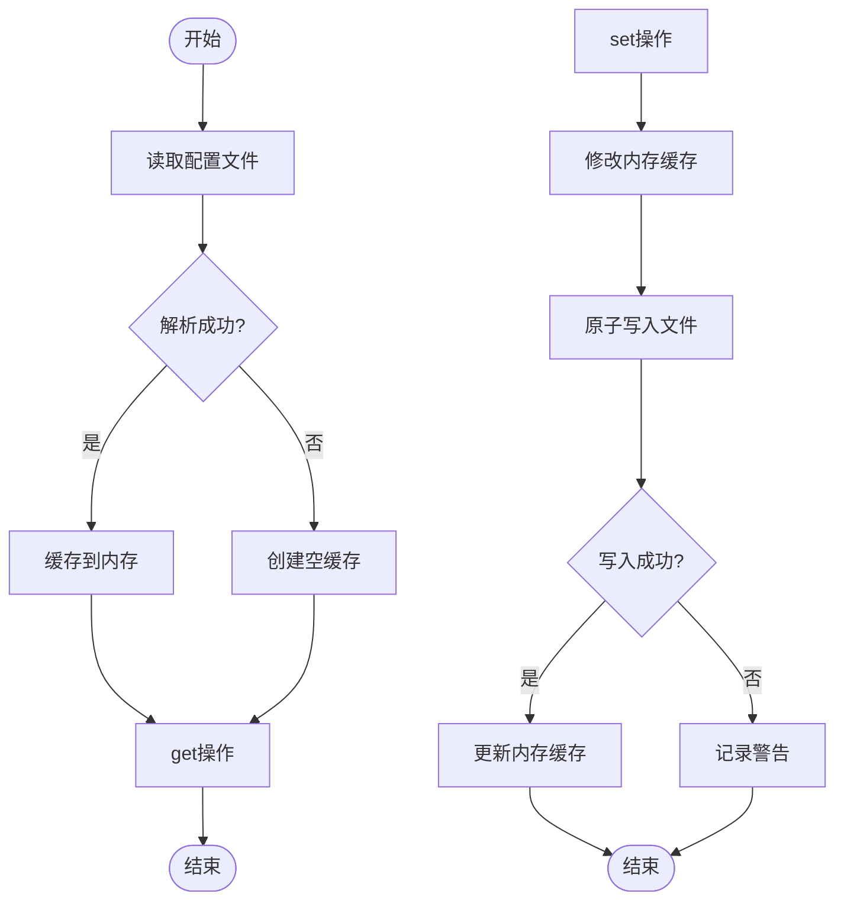
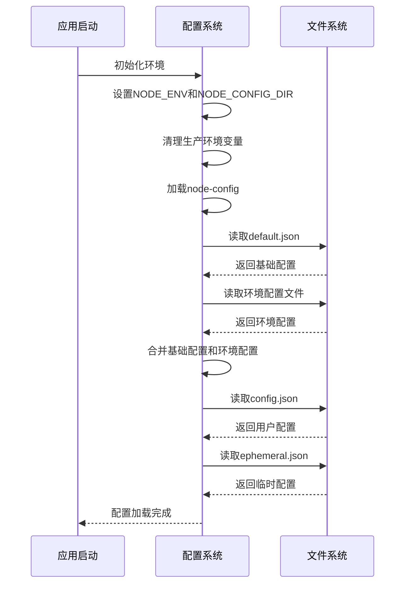
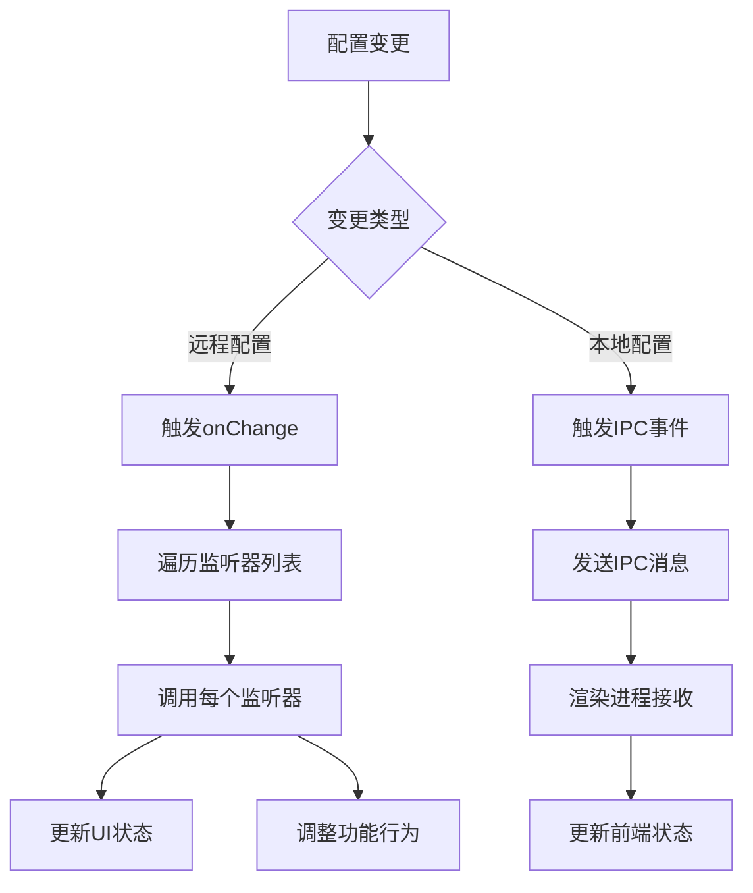
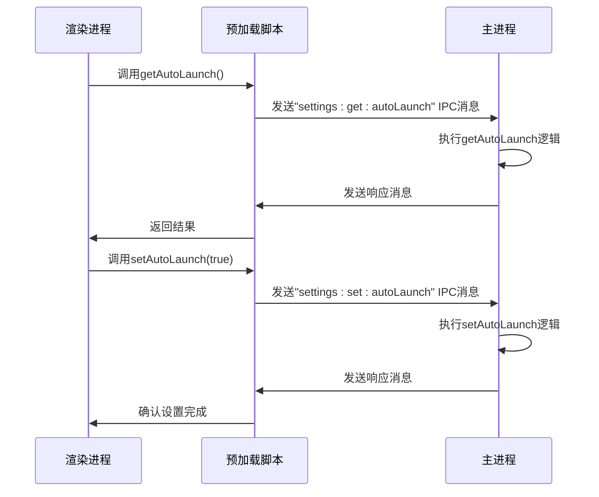
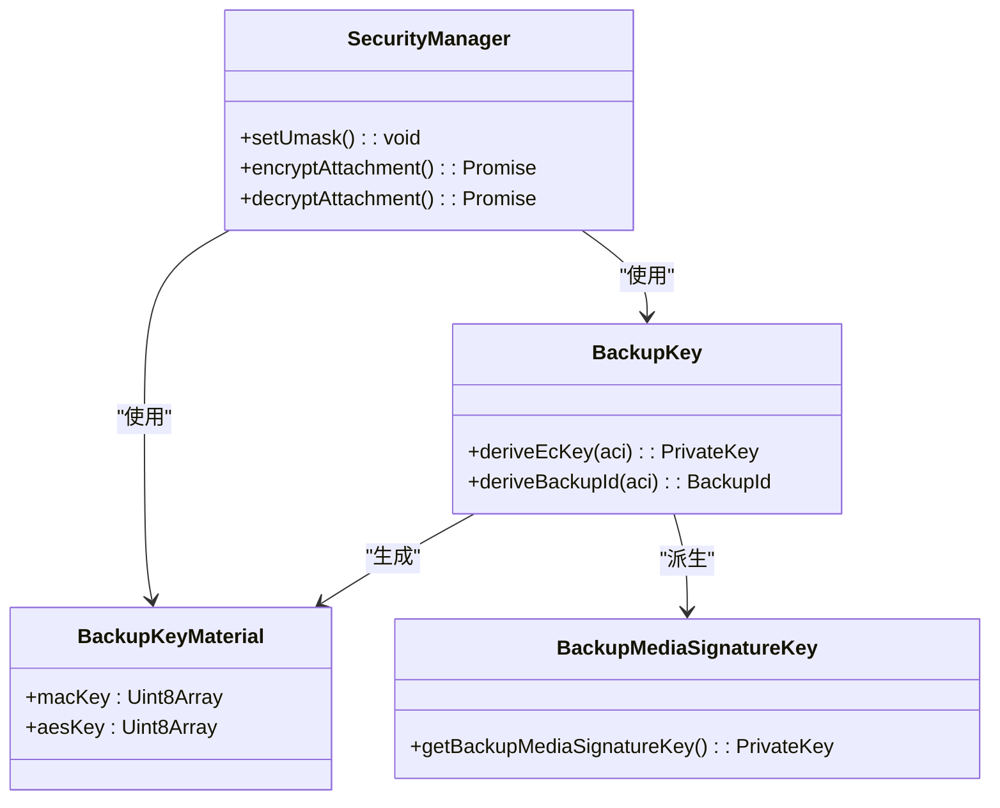
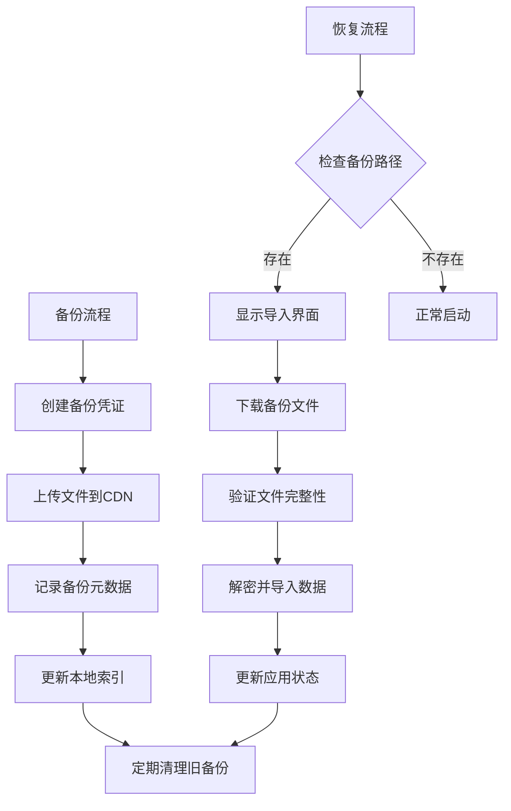
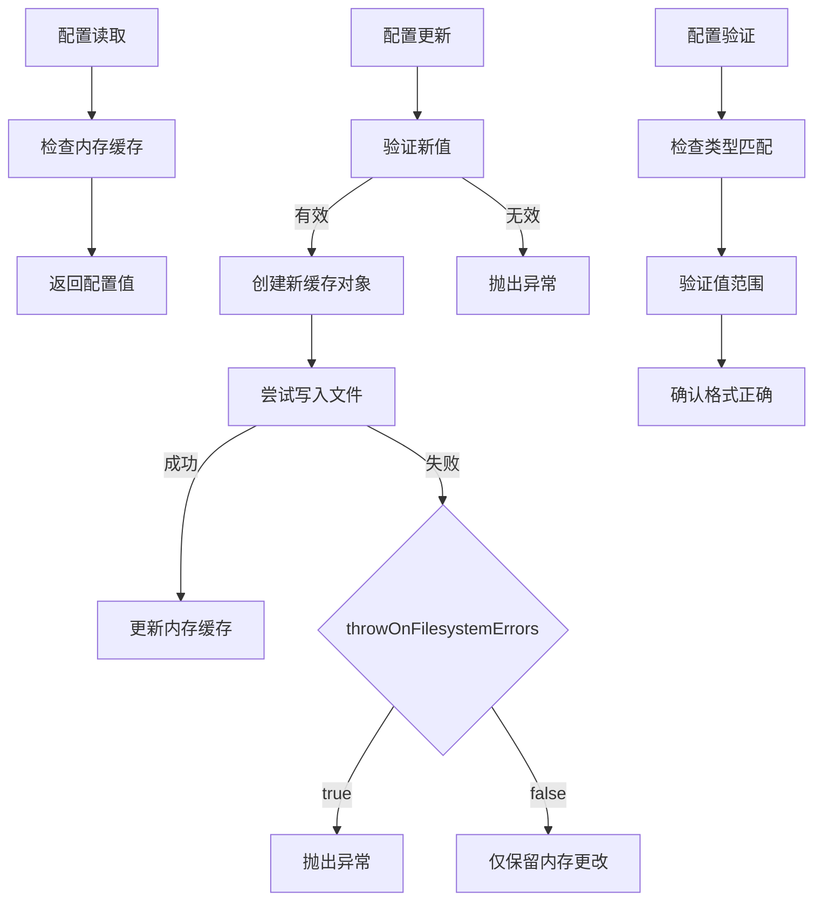
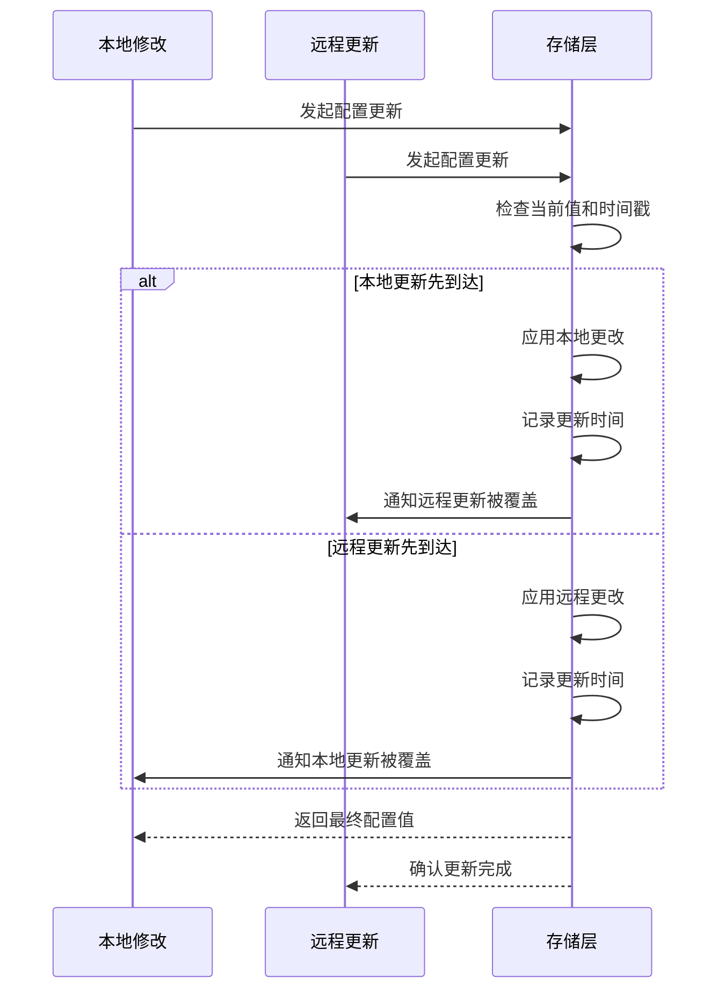

# 配置管理

<cite>
**本文档中引用的文件**  
- [config.main.ts](file://app/config.main.ts)
- [base_config.node.ts](file://app/base_config.node.ts)
- [user_config.main.ts](file://app/user_config.main.ts)
- [ephemeral_config.main.ts](file://app/ephemeral_config.main.ts)
- [startup_config.main.ts](file://app/startup_config.main.ts)
- [default.json](file://config/default.json)
- [production.json](file://config/production.json)
- [development.json](file://config/development.json)
- [RemoteConfig.dom.ts](file://ts/RemoteConfig.dom.ts)
- [preload.preload.ts](file://ts/util/preload.preload.ts)
</cite>

## 目录
1. [简介](#简介)
2. [配置分层管理机制](#配置分层管理机制)
3. [配置持久化策略](#配置持久化策略)
4. [配置加载与合并逻辑](#配置加载与合并逻辑)
5. [配置变更监听与广播](#配置变更监听与广播)
6. [跨进程配置同步](#跨进程配置同步)
7. [安全存储与加密策略](#安全存储与加密策略)
8. [备份与恢复流程](#备份与恢复流程)
9. [配置读取、更新与验证](#配置读取更新与验证)
10. [配置冲突解决策略](#配置冲突解决策略)

## 简介
Signal-Desktop的配置管理系统采用分层架构设计，实现了用户配置、临时配置和基础配置的分离管理。系统通过node-config库加载环境特定的配置文件，并结合本地持久化存储实现灵活的配置管理。配置系统支持运行时动态更新、跨进程同步和远程配置管理，确保了应用在不同环境下的稳定性和安全性。

## 配置分层管理机制
Signal-Desktop的配置系统采用三层架构：基础配置、用户配置和临时配置。基础配置通过node-config库从JSON文件加载，用户配置存储在用户数据目录的config.json文件中，临时配置存储在ephemeral.json文件中。这种分层设计实现了配置的职责分离，基础配置提供默认值和环境特定设置，用户配置保存用户个性化设置，临时配置用于存储会话级别的临时状态。

**图表来源**
- [config.main.ts](file://app/config.main.ts#L1-L77)
- [user_config.main.ts](file://app/user_config.main.ts#L1-L51)
- [ephemeral_config.main.ts](file://app/ephemeral_config.main.ts#L1-L22)

**章节来源**
- [config.main.ts](file://app/config.main.ts#L1-L77)
- [user_config.main.ts](file://app/user_config.main.ts#L1-L51)
- [ephemeral_config.main.ts](file://app/ephemeral_config.main.ts#L1-L22)

## 配置持久化策略
配置持久化通过base_config.node.ts模块实现，该模块提供了统一的配置存储接口。用户配置和临时配置都使用相同的持久化机制，但有不同的错误处理策略。用户配置在文件系统错误时会抛出异常，确保数据完整性；临时配置在写入失败时仅更新内存数据，保证应用的可用性。配置数据以JSON格式原子写入文件，避免写入过程中的数据损坏。

**图表来源**
- [base_config.node.ts](file://app/base_config.node.ts#L1-L127)
- [user_config.main.ts](file://app/user_config.main.ts#L41-L45)
- [ephemeral_config.main.ts](file://app/ephemeral_config.main.ts#L12-L16)

**章节来源**
- [base_config.node.ts](file://app/base_config.node.ts#L1-L127)

## 配置加载与合并逻辑
配置加载过程从环境变量初始化开始，根据应用打包状态设置NODE_ENV和NODE_CONFIG_DIR环境变量。在生产模式下，系统会清除可能影响配置的环境变量，确保配置的安全性。基础配置通过node-config库自动合并default.json与环境特定的配置文件（如production.json或development.json）。用户配置和临时配置在应用启动时从文件系统加载，如果文件不存在或损坏，则使用空对象作为默认值。

**图表来源**
- [config.main.ts](file://app/config.main.ts#L1-L77)
- [default.json](file://config/default.json#L1-L36)
- [production.json](file://config/production.json#L1-L24)

**章节来源**
- [config.main.ts](file://app/config.main.ts#L1-L77)

## 配置变更监听与广播
配置变更监听通过事件总线机制实现。当远程配置发生变化时，系统会通知所有注册的监听器。RemoteConfig.dom.ts模块管理配置变更的监听和通知，使用onChange函数注册监听器，当特定配置项的值发生变化时，所有相关监听器都会被调用。这种机制实现了配置变更的解耦，允许不同组件独立响应配置变化而无需直接依赖配置存储。

**图表来源**
- [RemoteConfig.dom.ts](file://ts/RemoteConfig.dom.ts#L69-L115)
- [preload.preload.ts](file://ts/util/preload.preload.ts#L129-L176)

**章节来源**
- [RemoteConfig.dom.ts](file://ts/RemoteConfig.dom.ts#L69-L115)

## 跨进程配置同步
跨进程配置同步通过Electron的IPC（进程间通信）机制实现。主进程和渲染进程之间通过预加载脚本中的ipcRenderer和ipcMain进行通信。installSetting函数在渲染进程中注册配置的getter和setter，当配置需要读取或更新时，通过IPC消息与主进程通信。这种设计遵循了Electron的安全最佳实践，将敏感的文件系统操作限制在主进程中，同时为渲染进程提供安全的配置访问接口。

**图表来源**
- [preload.preload.ts](file://ts/util/preload.preload.ts#L89-L192)
- [createIPCEvents.preload.ts](file://ts/util/createIPCEvents.preload.ts#L142-L182)

**章节来源**
- [preload.preload.ts](file://ts/util/preload.preload.ts#L89-L192)

## 安全存储与加密策略
配置的安全存储通过多层机制保障。首先，应用启动时设置umask为0o077，确保创建的文件只有所有者有读写权限。其次，敏感配置如用户凭证和加密密钥存储在受保护的用户数据目录中。对于备份数据，系统使用专门的备份密钥进行加密，通过deriveEcKey方法从主备份密钥派生媒体签名密钥，实现密钥的分层管理和安全性。配置文件以明文JSON格式存储，但仅包含非敏感信息，敏感数据通过独立的安全存储机制管理。

**图表来源**
- [startup_config.main.ts](file://app/startup_config.main.ts#L14-L16)
- [crypto.preload.ts](file://ts/services/backups/crypto.preload.ts#L36-L83)
- [AttachmentLocalBackupManager.preload.ts](file://ts/jobs/AttachmentLocalBackupManager.preload.ts#L74-L111)

**章节来源**
- [startup_config.main.ts](file://app/startup_config.main.ts#L14-L16)

## 备份与恢复流程
配置的备份与恢复主要针对用户数据和附件。备份流程通过BackupCredentialType枚举区分消息和媒体备份，使用不同的凭证和目录。备份API提供上传和下载功能，支持断点续传和进度通知。恢复流程在应用启动时检查是否存在备份导入路径，如果有则显示备份导入界面。系统使用CDN进行备份文件的存储和分发，通过签名凭证确保访问安全。备份文件采用加密存储，只有拥有正确密钥的设备才能解密和恢复数据。

**图表来源**
- [api.preload.ts](file://ts/services/backups/api.preload.ts#L85-L137)
- [backup.preload.ts](file://ts/services/backups/index.preload.ts#L692-L692)
- [background.preload.ts](file://ts/background.preload.ts#L1346-L1533)

**章节来源**
- [api.preload.ts](file://ts/services/backups/api.preload.ts#L85-L137)

## 配置读取、更新与验证
配置的读取和更新通过统一的接口进行。用户配置提供get、set和remove方法，支持通过路径访问嵌套配置项。配置验证在远程配置更新时进行，特别是对于版本号类型的配置项，系统会使用semver库验证其格式有效性。当配置值无效时，系统会记录错误日志并可能显示警告通知。配置更新采用原子操作，先修改内存缓存，然后尝试写入文件，如果写入失败则根据配置的错误处理策略决定是否回滚内存更改。

**图表来源**
- [base_config.node.ts](file://app/base_config.node.ts#L46-L91)
- [RemoteConfig.dom.ts](file://ts/RemoteConfig.dom.ts#L156-L199)
- [schemas.std.ts](file://ts/util/schemas.std.ts#L1-L180)

**章节来源**
- [base_config.node.ts](file://app/base_config.node.ts#L46-L91)

## 配置冲突解决策略
配置冲突主要发生在远程配置更新和本地配置修改同时发生的情况。系统采用"最后写入获胜"的策略，后发生的配置更改会覆盖之前的值。对于远程配置，系统会计算配置的哈希值，只有当服务器端配置发生变化时才会进行更新，减少不必要的配置变更通知。在跨进程同步中，主进程作为配置的权威来源，所有配置更改都必须通过主进程的验证和持久化，确保了配置状态的一致性。对于并发的配置写入操作，文件系统级别的原子写入操作防止了数据损坏。

**图表来源**
- [RemoteConfig.dom.ts](file://ts/RemoteConfig.dom.ts#L156-L199)
- [base_config.node.ts](file://app/base_config.node.ts#L75-L96)
- [preload.preload.ts](file://ts/util/preload.preload.ts#L129-L176)

**章节来源**
- [RemoteConfig.dom.ts](file://ts/RemoteConfig.dom.ts#L156-L199)