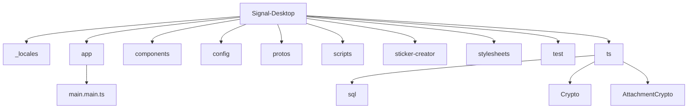
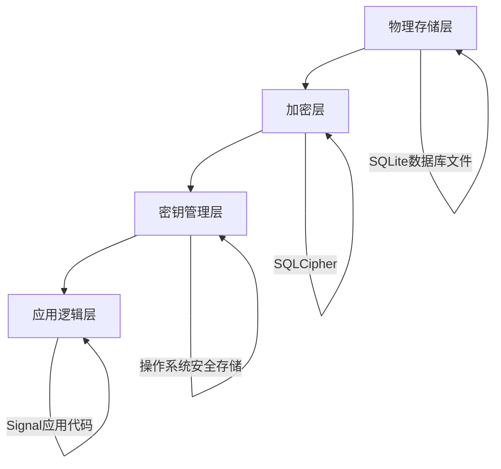
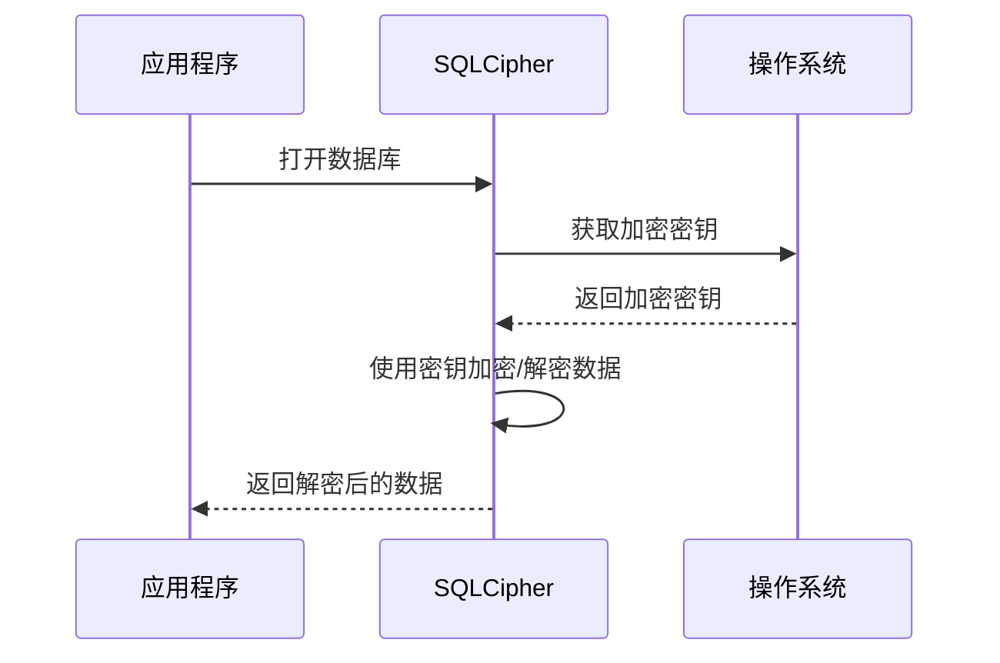
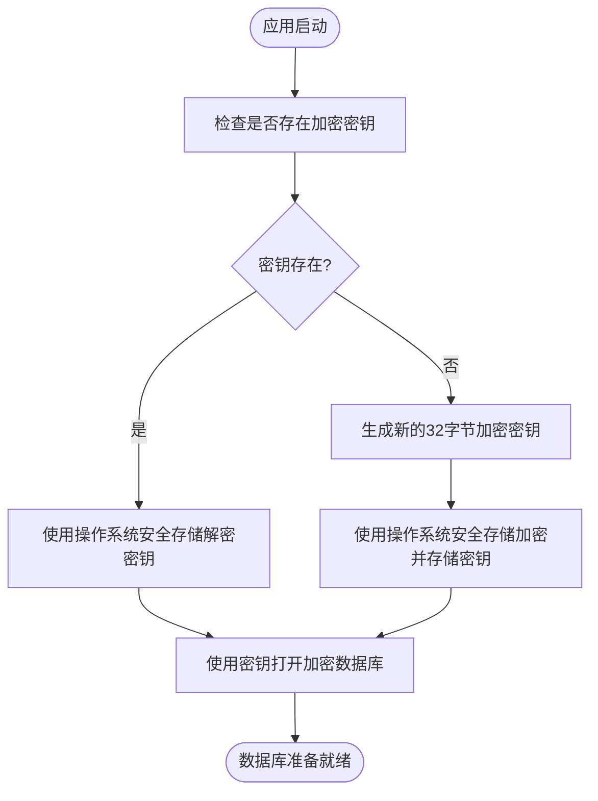
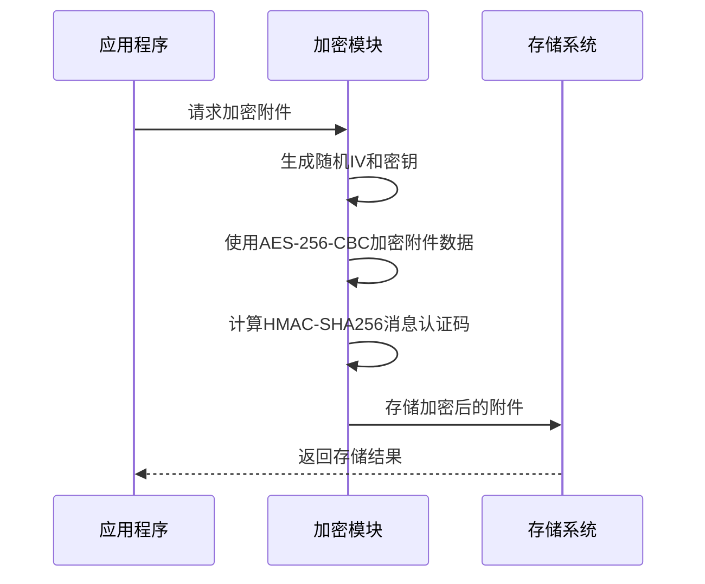
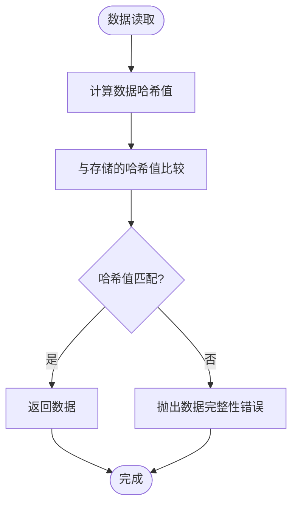
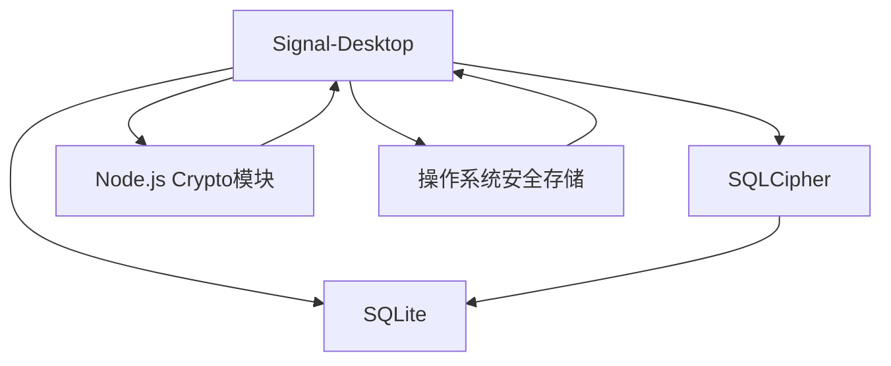
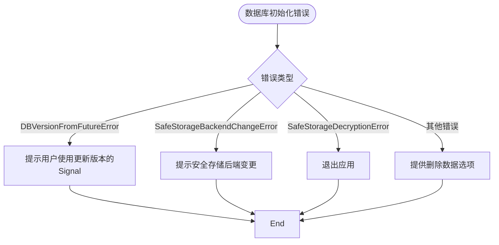

# 安全存储

<cite>
**本文档引用的文件**   
- [Server.node.ts](file://ts/sql/Server.node.ts)
- [main.main.ts](file://app/main.main.ts)
- [Crypto.node.ts](file://ts/Crypto.node.ts)
- [AttachmentCrypto.node.ts](file://ts/AttachmentCrypto.node.ts)
- [SafeStorageBackendChangeError.std.ts](file://ts/types/SafeStorageBackendChangeError.std.ts)
- [SafeStorageDecryptionError.std.ts](file://ts/types/SafeStorageDecryptionError.std.ts)
- [helpers.node.ts](file://ts/test-node/sql/helpers.node.ts)
</cite>

## 目录
1. [简介](#简介)
2. [项目结构](#项目结构)
3. [核心组件](#核心组件)
4. [架构概述](#架构概述)
5. [详细组件分析](#详细组件分析)
6. [依赖分析](#依赖分析)
7. [性能考虑](#性能考虑)
8. [故障排除指南](#故障排除指南)
9. [结论](#结论)
10. [附录](#附录)（如有必要）

## 简介
本文档全面描述了Signal-Desktop中基于SQLCipher的端到端加密存储机制。文档涵盖了数据库加密、密钥管理、安全传输、敏感数据保护策略、安全审计日志、访问控制机制、防篡改保护和数据完整性验证等方面。同时提供了安全漏洞防范和应急响应指南。

## 项目结构
Signal-Desktop项目采用模块化结构，主要包含以下几个目录：
- `_locales`：多语言资源文件
- `app`：主进程相关代码
- `components`：UI组件
- `config`：配置文件
- `protos`：协议缓冲区定义
- `scripts`：构建和打包脚本
- `sticker-creator`：贴纸创建器
- `stylesheets`：样式表
- `test`：测试代码
- `ts`：TypeScript源代码

核心安全存储相关的代码主要位于`ts/sql`和`app`目录下。

**图表来源**
- [Server.node.ts](file://ts/sql/Server.node.ts#L1-L800)
- [main.main.ts](file://app/main.main.ts#L1600-L1799)

**章节来源**
- [Server.node.ts](file://ts/sql/Server.node.ts#L1-L800)
- [main.main.ts](file://app/main.main.ts#L1600-L1799)

## 核心组件
Signal-Desktop的安全存储机制主要由以下几个核心组件构成：
- **SQLCipher数据库加密**：使用SQLCipher对SQLite数据库进行透明加密
- **密钥管理**：使用操作系统提供的安全存储机制管理数据库加密密钥
- **附件加密**：对消息附件进行独立加密存储
- **数据完整性验证**：通过哈希校验确保数据完整性

**章节来源**
- [Server.node.ts](file://ts/sql/Server.node.ts#L847-L945)
- [main.main.ts](file://app/main.main.ts#L1627-L1633)

## 架构概述
Signal-Desktop的安全存储架构采用分层设计，从下到上依次为：
1. **物理存储层**：SQLite数据库文件
2. **加密层**：SQLCipher提供的透明加密
3. **密钥管理层**：操作系统安全存储
4. **应用逻辑层**：Signal应用代码

**图表来源**
- [Server.node.ts](file://ts/sql/Server.node.ts#L847-L945)
- [main.main.ts](file://app/main.main.ts#L1627-L1633)

## 详细组件分析

### 数据库加密组件分析
Signal-Desktop使用SQLCipher对SQLite数据库进行加密，确保数据在磁盘上的安全性。

#### 数据库加密流程

**图表来源**
- [Server.node.ts](file://ts/sql/Server.node.ts#L847-L945)
- [main.main.ts](file://app/main.main.ts#L1627-L1633)

#### 密钥管理流程

**图表来源**
- [main.main.ts](file://app/main.main.ts#L1627-L1743)
- [SafeStorageBackendChangeError.std.ts](file://ts/types/SafeStorageBackendChangeError.std.ts#L1-L24)

**章节来源**
- [main.main.ts](file://app/main.main.ts#L1627-L1743)
- [SafeStorageBackendChangeError.std.ts](file://ts/types/SafeStorageBackendChangeError.std.ts#L1-L24)

### 附件加密组件分析
Signal-Desktop对消息附件进行独立加密，确保附件数据的安全性。

#### 附件加密流程

**图表来源**
- [Crypto.node.ts](file://ts/Crypto.node.ts#L474-L515)
- [AttachmentCrypto.node.ts](file://ts/AttachmentCrypto.node.ts#L1-L200)

#### 数据完整性验证

**图表来源**
- [Crypto.node.ts](file://ts/Crypto.node.ts#L427-L437)
- [AttachmentCrypto.node.ts](file://ts/AttachmentCrypto.node.ts#L676-L689)

**章节来源**
- [Crypto.node.ts](file://ts/Crypto.node.ts#L427-L437)
- [AttachmentCrypto.node.ts](file://ts/AttachmentCrypto.node.ts#L676-L689)

## 依赖分析
Signal-Desktop的安全存储机制依赖于多个外部组件和系统服务。

**图表来源**
- [Server.node.ts](file://ts/sql/Server.node.ts#L8-L9)
- [Crypto.node.ts](file://ts/Crypto.node.ts#L9-L11)
- [main.main.ts](file://app/main.main.ts#L1644-L1646)

**章节来源**
- [Server.node.ts](file://ts/sql/Server.node.ts#L8-L9)
- [Crypto.node.ts](file://ts/Crypto.node.ts#L9-L11)
- [main.main.ts](file://app/main.main.ts#L1644-L1646)

## 性能考虑
Signal-Desktop在安全性和性能之间进行了平衡考虑：

1. **数据库加密开销**：SQLCipher的加密解密操作会带来一定的性能开销，但通过WAL（Write-Ahead Logging）模式和预编译语句缓存来优化性能。
2. **密钥管理效率**：使用操作系统提供的安全存储机制，避免了在应用层实现复杂的密钥管理逻辑。
3. **附件加密策略**：对大附件采用流式加密，避免内存占用过高。

## 故障排除指南

### 数据库初始化错误处理
当数据库初始化出现错误时，Signal-Desktop会根据错误类型采取不同的处理策略：

**图表来源**
- [main.main.ts](file://app/main.main.ts#L1848-L1908)
- [SafeStorageDecryptionError.std.ts](file://ts/types/SafeStorageDecryptionError.std.ts#L1-L6)

**章节来源**
- [main.main.ts](file://app/main.main.ts#L1848-L1908)
- [SafeStorageDecryptionError.std.ts](file://ts/types/SafeStorageDecryptionError.std.ts#L1-L6)

### 常见问题及解决方案
1. **问题**：无法打开Signal，提示数据库错误
   **解决方案**：检查操作系统安全存储后端是否发生变化，尝试使用相同的桌面环境启动应用。

2. **问题**：数据完整性校验失败
   **解决方案**：可能是存储介质损坏，建议备份重要数据后重新安装应用。

3. **问题**：附件无法下载
   **解决方案**：检查网络连接，确认附件URL是否有效。

## 结论
Signal-Desktop通过基于SQLCipher的端到端加密存储机制，为用户提供了强大的数据安全保障。系统采用分层安全架构，从数据库加密、密钥管理到附件加密和数据完整性验证，形成了完整的安全防护体系。同时，系统还考虑了性能优化和错误处理，确保在保证安全性的同时提供良好的用户体验。

## 附录

### 安全漏洞防范指南
1. **定期更新**：及时更新Signal应用到最新版本，以获取最新的安全补丁。
2. **操作系统安全**：确保操作系统和安全存储服务的最新状态。
3. **备份策略**：定期备份重要数据，防止数据丢失。

### 应急响应指南
1. **发现安全漏洞**：立即停止使用受影响的版本，并报告给Signal安全团队。
2. **数据泄露**：如果怀疑数据已泄露，立即更改相关账户密码，并启用双重验证。
3. **系统感染**：如果设备被恶意软件感染，立即断开网络连接，进行系统扫描和清理。