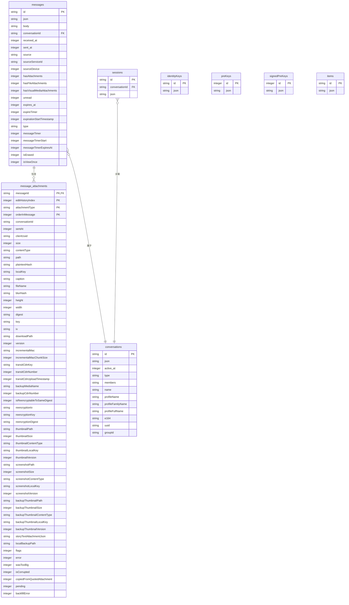
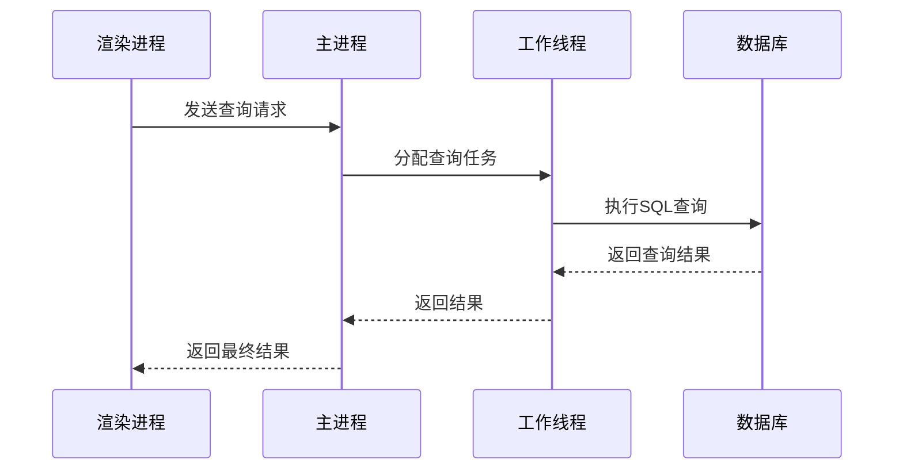

# 数据库架构

<cite>
**本文档引用的文件**   
- [Client.preload.ts](file://ts/sql/Client.preload.ts)
- [Server.node.ts](file://ts/sql/Server.node.ts)
- [main.main.ts](file://ts/sql/main.main.ts)
- [util.std.ts](file://ts/sql/util.std.ts)
- [Interface.std.ts](file://ts/sql/Interface.std.ts)
- [migrations/index.node.ts](file://ts/sql/migrations/index.node.ts)
- [hydration.std.ts](file://ts/sql/hydration.std.ts)
- [1360-attachments.std.ts](file://ts/sql/migrations/1360-attachments.std.ts)
- [1500-search-polls.std.ts](file://ts/sql/migrations/1500-search-polls.std.ts)
- [1270-normalize-messages.std.ts](file://ts/sql/migrations/1270-normalize-messages.std.ts)
</cite>

## 目录
1. [引言](#引言)
2. [数据模型与表结构](#数据模型与表结构)
3. [数据库迁移机制](#数据库迁移机制)
4. [数据库访问层设计](#数据库访问层设计)
5. [端到端加密数据存储与检索](#端到端加密数据存储与检索)
6. [性能监控与调优](#性能监控与调优)
7. [结论](#结论)

## 引言
Signal-Desktop使用基于SQLCipher的加密数据库来存储所有本地数据，包括消息、会话、联系人和媒体附件。该数据库架构设计注重安全性、性能和可维护性，通过严格的加密机制保护用户数据，同时提供高效的查询和同步功能。数据库采用客户端-服务器架构，通过Electron的IPC机制在主进程和渲染进程之间安全地传递数据。

**Section sources**
- [Server.node.ts](file://ts/sql/Server.node.ts#L1-L50)
- [Client.preload.ts](file://ts/sql/Client.preload.ts#L1-L50)

## 数据模型与表结构
Signal-Desktop的数据库包含多个核心表，每个表都有特定的用途和索引策略以优化查询性能。

### 核心表结构
数据库的主要表包括：
- **messages**: 存储所有消息记录，包含消息内容、时间戳、发送者信息等。
- **conversations**: 存储会话信息，包括联系人详情、群组成员等。
- **sessions**: 存储加密会话密钥，用于端到端加密通信。
- **identityKeys**: 存储联系人的身份密钥，用于验证通信对方的身份。
- **preKeys** 和 **signedPreKeys**: 存储预密钥，用于建立新的加密会话。
- **items**: 存储应用程序的各种配置项和状态信息。
- **message_attachments**: 存储消息附件的元数据，如文件路径、大小、加密信息等。

### 索引策略
为了优化查询性能，数据库为关键字段创建了索引：
- **messages** 表上的索引包括 `conversationId` 和 `received_at` 的组合索引，用于快速检索特定会话中的消息。
- **messages_fts** 虚拟表使用FTS5全文搜索，支持高效的消息内容搜索。
- **conversations** 表上的索引包括 `e164`、`uuid` 和 `groupId`，用于快速查找联系人和群组。
- **message_attachments** 表上的复合主键确保了附件的唯一性，并支持高效的附件查询。

**Diagram sources **
- [Server.node.ts](file://ts/sql/Server.node.ts#L149-L195)
- [1360-attachments.std.ts](file://ts/sql/migrations/1360-attachments.std.ts#L12-L73)

**Section sources**
- [Server.node.ts](file://ts/sql/Server.node.ts#L149-L195)
- [1360-attachments.std.ts](file://ts/sql/migrations/1360-attachments.std.ts#L1-L103)

## 数据库迁移机制
Signal-Desktop的数据库迁移机制确保了数据模式的平滑演进，同时保持数据的完整性和一致性。

### 版本控制
数据库使用 `user_version` 和 `schema_version` 两个版本号来管理模式演进。`user_version` 由应用程序控制，用于跟踪自定义的模式变更，而 `schema_version` 由SQLCipher内部管理。每次迁移都会递增 `user_version`，并执行相应的SQL脚本以更新数据库结构。

### 模式演进
迁移脚本按版本号顺序执行，每个脚本负责特定的模式变更。例如，版本1360的迁移脚本创建了 `message_attachments` 表，将附件元数据从消息的JSON字段中分离出来，提高了查询效率和数据完整性。迁移过程中，旧数据会被自动转换并迁移到新表结构中。

### 数据完整性保障
迁移过程中，数据库使用事务确保操作的原子性。如果迁移失败，事务会回滚，防止数据库处于不一致状态。此外，迁移脚本会检查现有数据的完整性，并在必要时进行修复。例如，版本20的迁移脚本会删除无效的群组及其相关消息，确保数据的一致性。

**Section sources**
- [migrations/index.node.ts](file://ts/sql/migrations/index.node.ts#L145-L800)
- [1270-normalize-messages.std.ts](file://ts/sql/migrations/1270-normalize-messages.std.ts#L1-L37)

## 数据库访问层设计
Signal-Desktop的数据库访问层设计为客户端-服务器架构，通过Electron的IPC机制在主进程和渲染进程之间安全地传递数据。

### 查询优化
数据库访问层提供了多种查询优化技术。例如，`batchMultiVarQuery` 函数可以批量处理多个查询，减少数据库交互次数。`sqlFragment` 和 `sql` 函数支持模板字面量，使SQL查询更易读和维护。此外，访问层还提供了查询计划分析功能，帮助开发者优化查询性能。

### 事务管理
数据库访问层支持显式事务管理，确保复杂操作的原子性。例如，保存多条消息时，会使用事务确保所有消息都成功保存或全部回滚。事务管理还支持嵌套事务，允许在复杂业务逻辑中灵活使用。

### 连接池机制
为了提高并发性能，数据库访问层使用连接池机制。主进程中的多个工作线程共享数据库连接，避免了频繁创建和销毁连接的开销。连接池还支持读写分离，读操作可以在多个连接上并行执行，而写操作则通过主连接串行化，确保数据一致性。

**Diagram sources **
- [main.main.ts](file://ts/sql/main.main.ts#L1-L536)
- [Client.preload.ts](file://ts/sql/Client.preload.ts#L1-L800)

**Section sources**
- [main.main.ts](file://ts/sql/main.main.ts#L1-L536)
- [Client.preload.ts](file://ts/sql/Client.preload.ts#L1-L800)

## 端到端加密数据存储与检索
Signal-Desktop的数据库设计充分考虑了端到端加密的需求，确保用户数据在存储和检索过程中的安全性。

### 加密存储
所有敏感数据在存储前都会进行加密。消息内容、附件和其他元数据使用用户的长期密钥进行加密，只有拥有相应私钥的设备才能解密。加密密钥本身也存储在数据库中，但受到额外的保护，如使用设备特定的密钥进行二次加密。

### 密钥管理策略
密钥管理是端到端加密的核心。Signal-Desktop使用双棘轮算法，结合长期身份密钥和短期会话密钥，确保前向安全和后向安全。每次会话都会生成新的会话密钥，即使某个会话密钥被泄露，也不会影响其他会话的安全性。密钥的生成、存储和更新都在安全的环境中进行，防止密钥泄露。

### 数据检索流程
数据检索时，客户端首先从数据库中读取加密的数据，然后使用相应的密钥进行解密。解密过程在内存中进行，解密后的数据不会写回磁盘，防止敏感信息泄露。为了提高性能，常用的解密密钥会缓存在内存中，但会在一段时间不活动后自动清除。

**Section sources**
- [Server.node.ts](file://ts/sql/Server.node.ts#L8-L13)
- [hydration.std.ts](file://ts/sql/hydration.std.ts#L1-L459)

## 性能监控与调优
Signal-Desktop提供了全面的性能监控和调优指南，帮助开发者优化数据库性能。

### 查询分析
数据库访问层内置了查询分析功能，可以记录和分析每个查询的执行时间。通过设置环境变量 `TIME_QUERIES`，可以启用详细的查询时间日志，帮助识别慢查询。此外，`explainQueryPlan` 函数可以生成查询计划，帮助开发者理解查询的执行过程。

### 缓存策略
为了提高查询性能，Signal-Desktop使用了多种缓存策略。例如，`updateConversationBatcher` 批处理器可以批量更新会话信息，减少数据库写操作的频率。此外，常用的查询结果会被缓存在内存中，避免重复查询数据库。

### 空间管理
数据库定期进行空间管理，删除过期和无用的数据。例如，已读消息和过期的附件会被定期清理，释放存储空间。此外，数据库还支持手动清理功能，用户可以随时删除不需要的数据。

**Section sources**
- [main.main.ts](file://ts/sql/main.main.ts#L120-L158)
- [util.std.ts](file://ts/sql/util.std.ts#L1-L448)

## 结论
Signal-Desktop的数据库架构设计充分考虑了安全性、性能和可维护性。通过基于SQLCipher的加密数据库，确保了用户数据的安全；通过客户端-服务器架构和连接池机制，提高了并发性能；通过详细的迁移机制和性能监控工具，保证了数据的一致性和系统的稳定性。这些设计使得Signal-Desktop能够为用户提供高效、安全的通信体验。