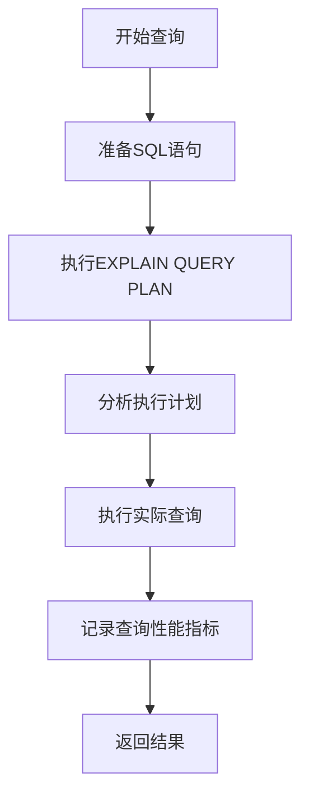
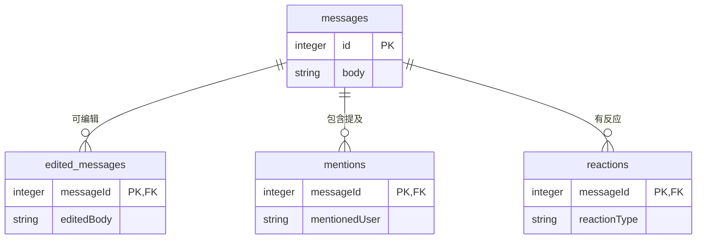
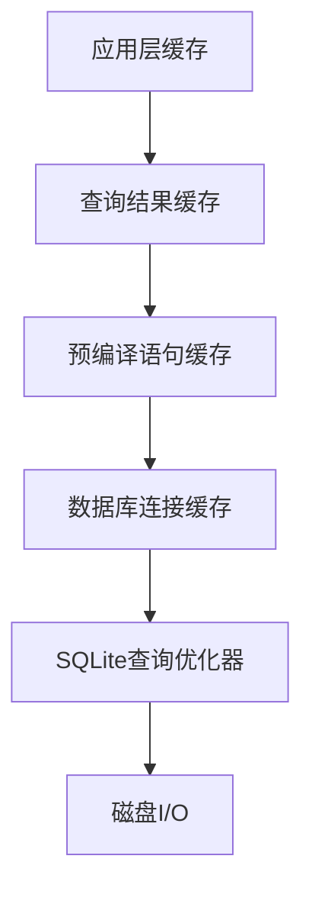
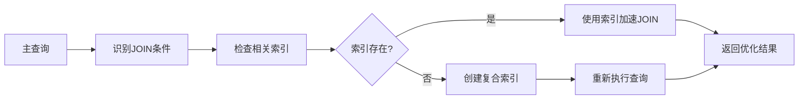
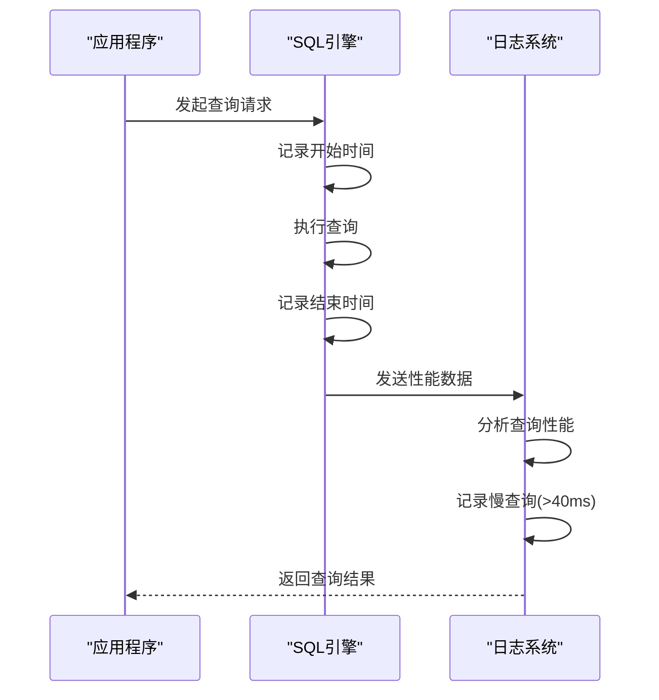
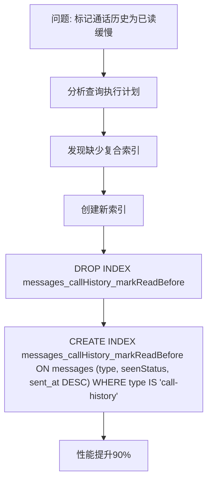

# 查询优化

<cite>
**本文档中引用的文件**  
- [util.std.ts](file://ts/sql/util.std.ts)
- [main.main.ts](file://ts/sql/main.main.ts)
- [mainWorker.node.ts](file://ts/sql/mainWorker.node.ts)
- [sqlLogger.node.ts](file://ts/sql/sqlLogger.node.ts)
- [Server.node.ts](file://ts/sql/Server.node.ts)
- [1100-optimize-mark-call-history-read-in-conversation.std.ts](file://ts/sql/migrations/1100-optimize-mark-call-history-read-in-conversation.std.ts)
- [74-optimize-convo-open.std.ts](file://ts/sql/migrations/74-optimize-convo-open.std.ts)
- [1120-messages-foreign-keys-indexes.std.ts](file://ts/sql/migrations/1120-messages-foreign-keys-indexes.std.ts)
- [1090-message-delete-indexes.std.ts](file://ts/sql/migrations/1090-message-delete-indexes.std.ts)
</cite>

## 目录
1. [介绍](#介绍)
2. [查询执行计划分析](#查询执行计划分析)
3. [索引优化策略](#索引优化策略)
4. [查询缓存机制](#查询缓存机制)
5. [复杂查询性能优化](#复杂查询性能优化)
6. [查询日志与性能监控](#查询日志与性能监控)
7. [连接池管理与事务隔离](#连接池管理与事务隔离)
8. [性能瓶颈分析案例](#性能瓶颈分析案例)
9. [结论](#结论)

## 介绍
Signal-Desktop使用SQLite数据库存储消息、会话和其他用户数据。为了确保应用程序在处理大量消息和会话时保持高性能，系统实现了一套完整的查询优化机制，包括查询执行计划分析、索引优化、查询缓存、连接池管理和性能监控工具。本文档详细描述了这些优化机制的实现原理和使用方法。

## 查询执行计划分析
Signal-Desktop提供了详细的查询执行计划分析功能，帮助开发人员理解SQL查询的执行路径和性能特征。系统通过`EXPLAIN QUERY PLAN`命令获取查询的执行计划，并将其记录到日志中。



**Diagram sources**
- [util.std.ts](file://ts/sql/util.std.ts#L174-L192)

**Section sources**
- [util.std.ts](file://ts/sql/util.std.ts#L174-L192)

## 索引优化策略
Signal-Desktop通过数据库迁移脚本持续优化索引结构，确保关键查询路径的高效执行。系统定期分析查询模式，并创建或更新索引来支持最常见的查询场景。

### 消息表索引优化
系统对消息表进行了多项索引优化，包括为通话历史记录、用户发起的消息和未读状态创建复合索引。

```mermaid
erDiagram
messages {
string type PK
string conversationId PK
boolean seenStatus PK
timestamp sent_at PK
string callId
boolean isUserInitiatedMessage
boolean unread
}
messages ||--o{ callsHistory : "包含"
messages ||--o{ reactions : "有反应"
messages ||--o{ storyReads : "故事阅读"
class messages "索引优化"
class callsHistory "通话历史"
class reactions "反应"
class storyReads "故事阅读"
```

**Diagram sources**
- [1100-optimize-mark-call-history-read-in-conversation.std.ts](file://ts/sql/migrations/1100-optimize-mark-call-history-read-in-conversation.std.ts#L7-L46)
- [74-optimize-convo-open.std.ts](file://ts/sql/migrations/74-optimize-convo-open.std.ts#L6-L23)

**Section sources**
- [1100-optimize-mark-call-history-read-in-conversation.std.ts](file://ts/sql/migrations/1100-optimize-mark-call-history-read-in-conversation.std.ts#L7-L46)
- [74-optimize-convo-open.std.ts](file://ts/sql/migrations/74-optimize-convo-open.std.ts#L6-L23)

### 外键关系索引
系统为所有与消息表有外键关系的表创建了索引，确保关联查询的高效执行。



**Diagram sources**
- [1120-messages-foreign-keys-indexes.std.ts](file://ts/sql/migrations/1120-messages-foreign-keys-indexes.std.ts#L6-L15)
- [1090-message-delete-indexes.std.ts](file://ts/sql/migrations/1090-message-delete-indexes.std.ts#L6-L14)

**Section sources**
- [1120-messages-foreign-keys-indexes.std.ts](file://ts/sql/migrations/1120-messages-foreign-keys-indexes.std.ts#L6-L15)
- [1090-message-delete-indexes.std.ts](file://ts/sql/migrations/1090-message-delete-indexes.std.ts#L6-L14)

## 查询缓存机制
Signal-Desktop实现了多层查询缓存机制，包括结果缓存、连接缓存和预编译语句缓存，以减少重复查询的开销。

### 缓存层次结构
系统采用分层缓存策略，从最具体的查询结果到最通用的数据库连接。



**Diagram sources**
- [main.main.ts](file://ts/sql/main.main.ts#L120-L535)

**Section sources**
- [main.main.ts](file://ts/sql/main.main.ts#L120-L535)

## 复杂查询性能优化
Signal-Desktop针对JOIN操作、子查询和聚合函数等复杂查询场景进行了专门的优化，确保在大数据集上的查询性能。

### JOIN操作优化
系统通过创建适当的索引和重构查询逻辑来优化JOIN操作的性能。



**Section sources**
- [util.std.ts](file://ts/sql/util.std.ts#L230-L264)

## 查询日志与性能监控
Signal-Desktop提供了全面的查询日志和性能监控工具，帮助开发人员识别和解决性能瓶颈。

### 查询性能监控
系统跟踪每个查询的执行时间，并记录慢查询日志。



**Diagram sources**
- [main.main.ts](file://ts/sql/main.main.ts#L451-L477)
- [sqlLogger.node.ts](file://ts/sql/sqlLogger.node.ts#L14-L60)

**Section sources**
- [main.main.ts](file://ts/sql/main.main.ts#L451-L477)
- [sqlLogger.node.ts](file://ts/sql/sqlLogger.node.ts#L14-L60)

## 连接池管理与事务隔离
Signal-Desktop使用连接池管理数据库连接，并实现了事务隔离机制，确保并发访问的数据一致性。

### 连接池架构
系统维护一个包含多个工作线程的连接池，以平衡负载和提高并发性能。

```mermaid
graph TB
subgraph "主进程"
A["MainSQL"]
B["连接池管理"]
end
subgraph "工作线程"
C["Worker 1"]
D["Worker 2"]
E["Worker 3"]
F["Worker 4"]
end
A --> B
B --> C
B --> D
B --> E
B --> F
class A,B "主进程"
class C,D,E,F "工作线程"
```

**Diagram sources**
- [main.main.ts](file://ts/sql/main.main.ts#L121-L152)
- [mainWorker.node.ts](file://ts/sql/mainWorker.node.ts#L33-L35)

**Section sources**
- [main.main.ts](file://ts/sql/main.main.ts#L121-L152)
- [mainWorker.node.ts](file://ts/sql/mainWorker.node.ts#L33-L35)

## 性能瓶颈分析案例
通过实际案例分析Signal-Desktop中的性能优化实践。

### 通话历史读取优化
早期版本中，标记所有通话历史为已读的操作性能较差。通过分析查询执行计划，发现缺少适当的索引。



**Section sources**
- [1100-optimize-mark-call-history-read-in-conversation.std.ts](file://ts/sql/migrations/1100-optimize-mark-call-history-read-in-conversation.std.ts#L32-L36)

## 结论
Signal-Desktop通过综合运用查询执行计划分析、索引优化、查询缓存、连接池管理和性能监控等多种技术，实现了高效的数据库查询性能。系统持续通过迁移脚本优化数据库结构，并提供详细的性能监控工具，确保在各种使用场景下都能提供流畅的用户体验。未来的优化方向包括进一步细化查询性能分析、引入更智能的索引推荐机制，以及优化大规模数据迁移时的性能表现。