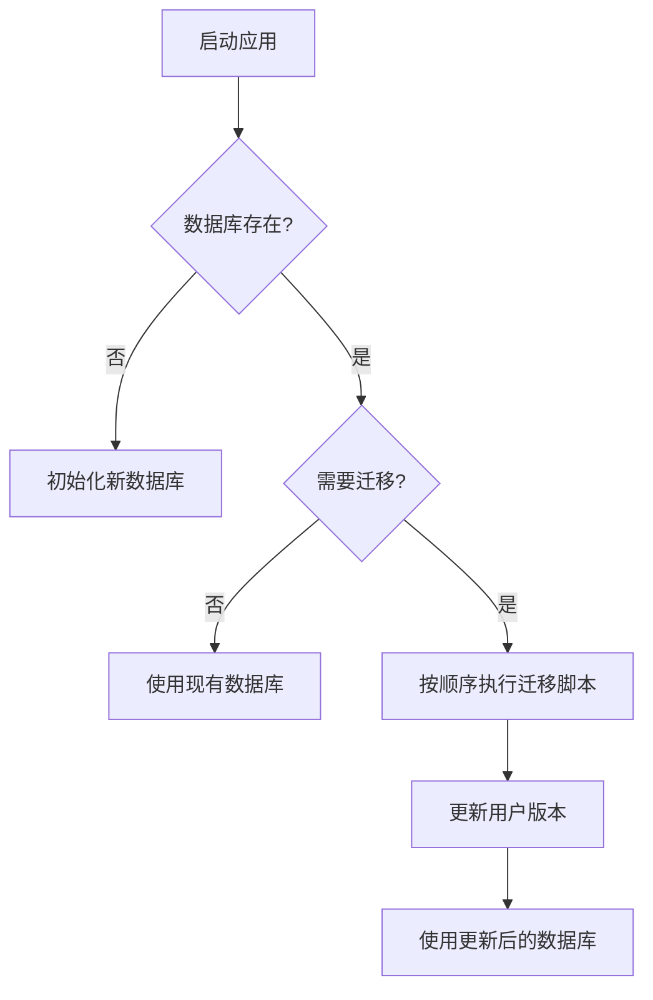
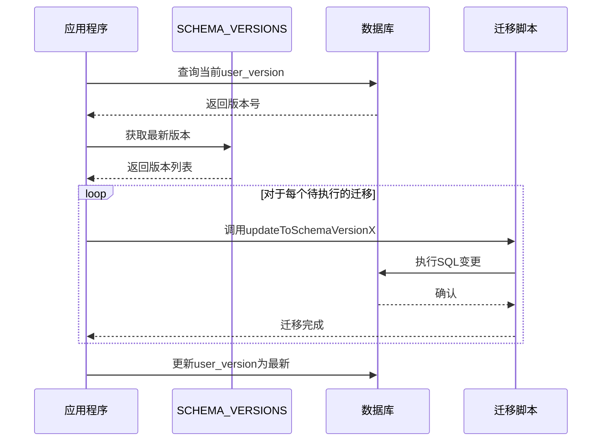
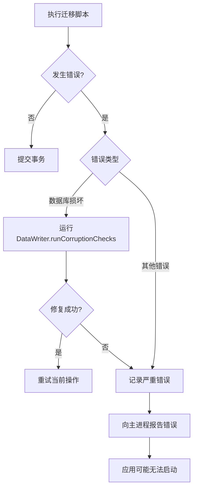
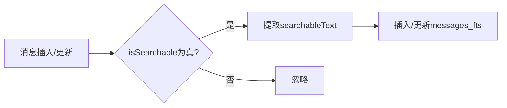

# 迁移策略

<cite>
**本文档引用的文件**
- [index.node.ts](file://ts/sql/migrations/index.node.ts)
- [main.main.ts](file://ts/sql/main.main.ts)
- [Interface.std.ts](file://ts/sql/Interface.std.ts)
- [Server.node.ts](file://ts/sql/Server.node.ts)
- [Client.preload.ts](file://ts/sql/Client.preload.ts)
- [util.std.ts](file://ts/sql/util.std.ts)
- [41-uuid-keys.std.ts](file://ts/sql/migrations/41-uuid-keys.std.ts)
- [1000-mark-unread-call-history-messages-as-unseen.std.ts](file://ts/sql/migrations/1000-mark-unread-call-history-messages-as-unseen.std.ts)
- [1500-search-polls.std.ts](file://ts/sql/migrations/1500-search-polls.std.ts)
</cite>

## 目录
1. [引言](#引言)
2. [迁移机制概述](#迁移机制概述)
3. [迁移脚本组织结构](#迁移脚本组织结构)
4. [执行顺序与依赖管理](#执行顺序与依赖管理)
5. [数据转换与模式演进](#数据转换与模式演进)
6. [向后兼容性处理](#向后兼容性处理)
7. [回滚机制与数据完整性检查](#回滚机制与数据完整性检查)
8. [迁移脚本编写规范](#迁移脚本编写规范)
9. [测试策略](#测试策略)
10. [实际迁移案例分析](#实际迁移案例分析)

## 引言
Signal-Desktop应用程序采用基于版本控制的数据库迁移策略，以确保数据模式的平滑演进和跨版本的数据一致性。该策略通过一系列有序执行的迁移脚本，实现数据库模式的逐步更新。本文档详细阐述了Signal-Desktop的迁移策略，包括迁移脚本的组织、执行机制、数据转换方法、向后兼容性处理、回滚机制以及测试策略。

## 迁移机制概述
Signal-Desktop的数据库迁移机制基于一个版本化的迁移系统，该系统通过维护一个预定义的迁移脚本序列来管理数据库模式的演进。每个迁移脚本对应一个特定的模式版本，并负责将数据库从当前版本升级到下一个版本。迁移过程由`updateSchema`函数驱动，该函数根据当前数据库的用户版本（user_version）与预定义的`SCHEMA_VERSIONS`数组进行比较，按顺序执行所有必要的迁移脚本，直到数据库达到最新的模式版本。

**Diagram sources**
- [index.node.ts](file://ts/sql/migrations/index.node.ts#L1448-L1599)

**Section sources**
- [index.node.ts](file://ts/sql/migrations/index.node.ts#L1-L1747)

## 迁移脚本组织结构
迁移脚本位于`ts/sql/migrations/`目录下，采用统一的命名约定`[版本号]-[描述].std.ts`。这种命名方式确保了脚本按版本号的数字顺序被正确加载和执行。每个迁移脚本都是一个独立的TypeScript模块，导出一个名为`updateToSchemaVersion[版本号]`的默认函数。该函数接收一个数据库连接对象和一个日志记录器作为参数，封装了从当前模式版本升级到目标版本所需的所有SQL操作和数据转换逻辑。

**Section sources**
- [index.node.ts](file://ts/sql/migrations/index.node.ts#L19-L160)

## 执行顺序与依赖管理
迁移脚本的执行顺序由`SCHEMA_VERSIONS`常量数组严格定义。该数组在`index.node.ts`文件中声明，包含了所有迁移版本的有序列表，每个元素包含`version`（版本号）和`update`（指向迁移函数的引用）两个属性。系统通过比较数据库的当前`user_version`与`SCHEMA_VERSIONS`中的版本号，确定需要执行哪些迁移脚本，并按数组顺序依次调用其`update`函数。这种设计确保了迁移的原子性和顺序性，避免了因执行顺序错误而导致的数据不一致。

**Diagram sources**
- [index.node.ts](file://ts/sql/migrations/index.node.ts#L1448-L1599)

**Section sources**
- [index.node.ts](file://ts/sql/migrations/index.node.ts#L1448-L1599)

## 数据转换与模式演进
数据转换是迁移过程中的核心环节，涉及模式变更（如添加、删除或修改表、列、索引）以及现有数据的重新组织。例如，`updateToSchemaVersion20`脚本将`conversations`表中的`id`从电话号码（e164）升级为UUID，这需要为每个会话生成新的UUID，并相应地更新所有引用该会话ID的表（如`messages`、`sessions`）。此过程通过创建临时映射、批量更新数据和重建外键关系来实现。另一个例子是`updateToSchemaVersion25`，它将`messages`表的主键从`id`更改为`rowid`，并添加一个`id`的唯一索引，以优化查询性能。

**Section sources**
- [index.node.ts](file://ts/sql/migrations/index.node.ts#L713-L938)
- [41-uuid-keys.std.ts](file://ts/sql/migrations/41-uuid-keys.std.ts#L27-L433)

## 向后兼容性处理
Signal-Desktop的迁移策略高度重视向后兼容性。在进行破坏性变更时，系统通常采用渐进式方法。例如，在`updateToSchemaVersion38`中，为了将`sourceDevice`列从`TEXT`类型安全地更改为`INTEGER`类型，脚本首先将原列重命名为`deprecatedSourceDevice`，然后添加一个新类型的`sourceDevice`列，最后将旧列的数据转换并复制到新列中，最后将旧列置为`NULL`。这种方法确保了在迁移过程中，即使发生中断，数据也不会丢失，并且可以安全地恢复。此外，许多迁移脚本（如`updateToSchemaVersion17`）在执行关键操作前会捕获异常并记录日志，而不是直接中断整个迁移流程。

**Section sources**
- [index.node.ts](file://ts/sql/migrations/index.node.ts#L1406-L1430)

## 回滚机制与数据完整性检查
Signal-Desktop的迁移系统本身不提供自动回滚功能。一旦迁移脚本成功执行并提交，其更改是不可逆的。这种设计基于“只向前”（forward-only）的迁移哲学，旨在简化系统复杂性并避免因回滚逻辑错误导致的更大风险。然而，系统通过其他机制来保障数据完整性。`mainWorker.node.ts`中的错误处理逻辑会捕获SQL错误，并根据错误类型（如数据库损坏）尝试运行`DataWriter.runCorruptionChecks(db)`进行修复。此外，应用在启动时会进行一系列完整性检查，如果检测到严重问题，会提示用户重新链接设备，这相当于一种手动的“重置”操作。

**Diagram sources**
- [mainWorker.node.ts](file://ts/sql/mainWorker.node.ts#L120-L139)

**Section sources**
- [mainWorker.node.ts](file://ts/sql/mainWorker.node.ts#L1-L156)
- [Server.node.ts](file://ts/sql/Server.node.ts#L784-L785)

## 迁移脚本编写规范
编写迁移脚本需遵循严格的规范：
1.  **幂等性**：脚本应设计为可安全重复执行，例如使用`CREATE TABLE IF NOT EXISTS`或`INSERT OR REPLACE`。
2.  **清晰的版本控制**：每个脚本必须有唯一的、递增的版本号。
3.  **详尽的日志记录**：使用传入的`logger`参数记录关键步骤和操作计数，便于调试。
4.  **事务性**：复杂的操作应包裹在`db.transaction()`中，确保原子性。
5.  **数据验证**：在进行关键数据转换前，应验证数据的完整性（如`strictAssert`）。
6.  **使用工具函数**：优先使用`util.std.ts`中提供的`sql`、`createOrUpdate`、`batchMultiVarQuery`等辅助函数，以保证代码风格一致性和安全性。

**Section sources**
- [util.std.ts](file://ts/sql/util.std.ts#L1-L448)
- [41-uuid-keys.std.ts](file://ts/sql/migrations/41-uuid-keys.std.ts#L27-L433)

## 测试策略
迁移脚本的测试主要通过单元测试和集成测试来完成。虽然具体的测试文件未在分析中列出，但可以从代码结构推断出测试策略：
1.  **单元测试**：针对`util.std.ts`中的通用函数（如`sql`, `batchMultiVarQuery`）进行测试，确保其行为正确。
2.  **集成测试**：模拟数据库的初始状态，执行特定的迁移脚本，然后验证数据库的最终状态（表结构、索引、数据内容）是否符合预期。例如，可以测试`updateToSchemaVersion1000`是否正确地将未读的通话历史消息的`readStatus`更新为`Read`，同时将`seenStatus`设置为`Unseen`。
3.  **端到端测试**：在完整的应用环境中，从旧版本数据库启动，验证应用能否成功完成所有迁移并正常运行。

**Section sources**
- [1000-mark-unread-call-history-messages-as-unseen.std.ts](file://ts/sql/migrations/1000-mark-unread-call-history-messages-as-unseen.std.ts#L15-L44)

## 实际迁移案例分析
### 案例一：引入全文搜索对投票的支持 (版本1500)
`updateToSchemaVersion1500`脚本展示了如何在不中断服务的情况下引入新功能。该脚本没有直接修改现有的全文搜索触发器，而是通过添加两个新的虚拟列`isSearchable`和`searchableText`来扩展`messages`表。`isSearchable`列使用生成列（GENERATED ALWAYS AS）来动态判断消息是否可搜索，`searchableText`列则根据消息类型（普通消息或投票）决定其内容（消息正文或投票问题）。最后，脚本更新了`messages_on_insert`和`messages_on_update`触发器，使其引用新的`searchableText`列。这种设计允许新旧逻辑共存，并通过虚拟列实现了业务逻辑的集中管理。

**Diagram sources**
- [1500-search-polls.std.ts](file://ts/sql/migrations/1500-search-polls.std.ts#L7-L51)

**Section sources**
- [1500-search-polls.std.ts](file://ts/sql/migrations/1500-search-polls.std.ts#L27-L51)

### 案例二：会话ID的UUID化 (版本41)
`updateToSchemaVersion41`是一个复杂的数据迁移案例。它将系统从基于电话号码的标识符全面升级到基于UUID的标识符。该脚本首先获取用户的UUID，然后遍历所有会话，为每个会话生成或获取其UUID。接着，它清理旧的会话和密钥数据，将`identityKey`和`registrationId`移动到以UUID为键的映射中，并为`preKeys`和`signedPreKeys`添加`ourUuid`前缀。最关键的步骤是更新`senderKeys`和`sessions`表，脚本需要根据旧的会话ID查找对应的UUID，并更新其ID和JSON字段，同时处理可能存在的重复键。整个过程通过`compareConvoRecency`函数来决定保留哪个键，确保了数据的一致性。

**Section sources**
- [41-uuid-keys.std.ts](file://ts/sql/migrations/41-uuid-keys.std.ts#L27-L433)